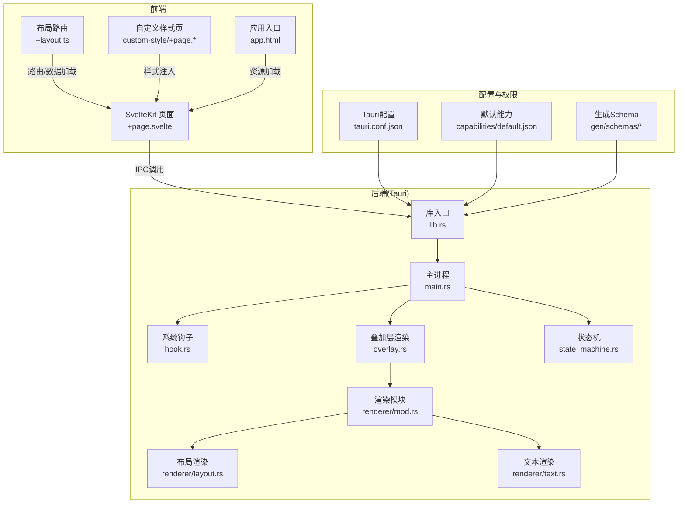
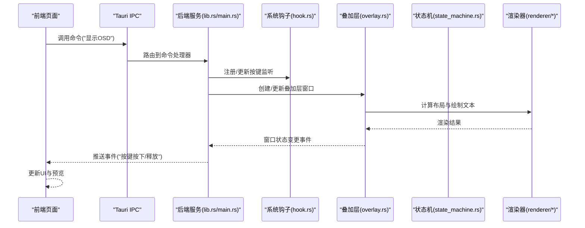
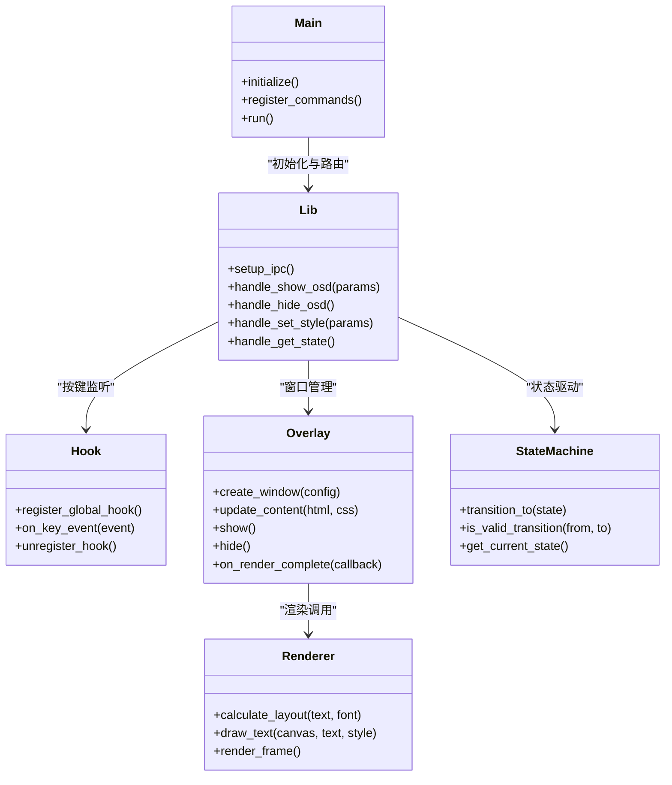
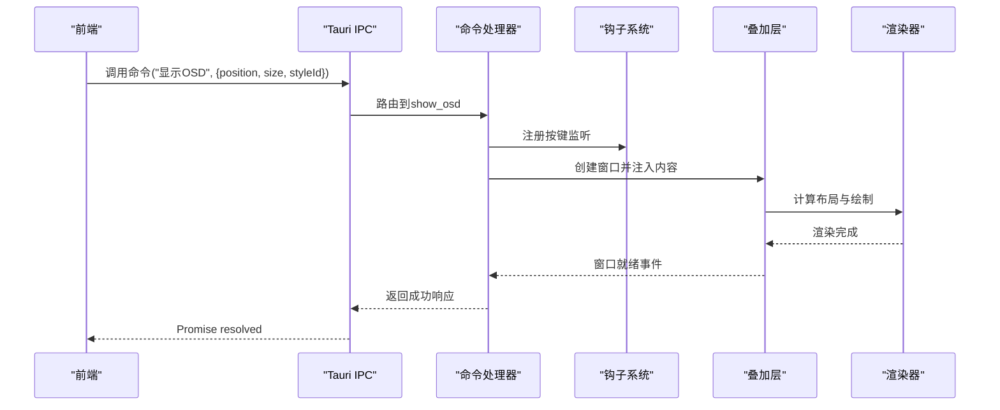
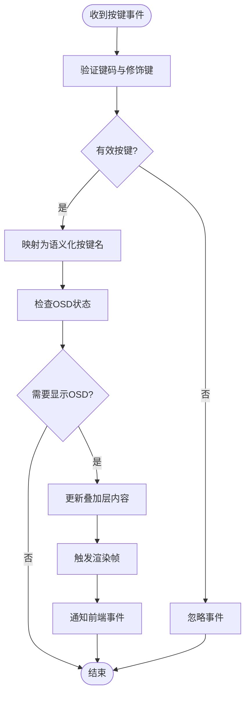
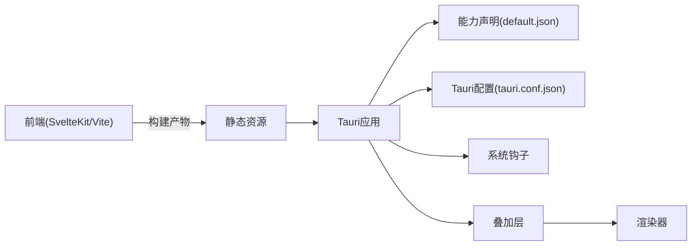

# API参考

<cite>
**本文引用的文件**   
- [按键OSD可视化工具-交互规格说明书.md](file://按键OSD可视化工具-交互规格说明书.md)
- [按键OSD可视化工具-交互原型.html](file://按键OSD可视化工具-交互原型.html)
- [osd-bubble/README.md](file://osd-bubble/README.md)
- [osd-bubble/package.json](file://osd-bubble/package.json)
- [osd-bubble/svelte.config.js](file://osd-bubble/svelte.config.js)
- [osd-bubble/vite.config.js](file://osd-bubble/vite.config.js)
- [osd-bubble/src/routes/+layout.ts](file://osd-bubble/src/routes/+layout.ts)
- [osd-bubble/src/routes/+page.svelte](file://osd-bubble/src/routes/+page.svelte)
- [osd-bubble/src/routes/custom-style/+page.svelte](file://osd-bubble/src/routes/custom-style/+page.svelte)
- [osd-bubble/src/routes/custom-style/+page.ts](file://osd-bubble/src/routes/custom-style/+page.ts)
- [osd-bubble/src/app.html](file://osd-bubble/src/app.html)
- [osd-bubble/static/custom-style.html](file://osd-bubble/static/custom-style.html)
- [osd-bubble/src-tauri/Cargo.toml](file://osd-bubble/src-tauri/Cargo.toml)
- [osd-bubble/src-tauri/build.rs](file://osd-bubble/src-tauri/build.rs)
- [osd-bubble/src-tauri/tauri.conf.json](file://osd-bubble/src-tauri/tauri.conf.json)
- [osd-bubble/src-tauri/capabilities/default.json](file://osd-bubble/src-tauri/capabilities/default.json)
- [osd-bubble/src-tauri/gen/schemas/capabilities.json](file://osd-bubble/src-tauri/gen/schemas/capabilities.json)
- [osd-bubble/src-tauri/gen/schemas/desktop-schema.json](file://osd-bubble/src-tauri/gen/schemas/desktop-schema.json)
- [osd-bubble/src-tauri/gen/schemas/windows-schema.json](file://osd-bubble/src-tauri/gen/schemas/windows-schema.json)
- [osd-bubble/src-tauri/src/main.rs](file://osd-bubble/src-tauri/src/main.rs)
- [osd-bubble/src-tauri/src/lib.rs](file://osd-bubble/src-tauri/src/lib.rs)
- [osd-bubble/src-tauri/src/hook.rs](file://osd-bubble/src-tauri/src/hook.rs)
- [osd-bubble/src-tauri/src/overlay.rs](file://osd-bubble/src-tauri/src/overlay.rs)
- [osd-bubble/src-tauri/src/state_machine.rs](file://osd-bubble/src-tauri/src/state_machine.rs)
- [osd-bubble/src-tauri/src/renderer/mod.rs](file://osd-bubble/src-tauri/src/renderer/mod.rs)
- [osd-bubble/src-tauri/src/renderer/layout.rs](file://osd-bubble/src-tauri/src/renderer/layout.rs)
- [osd-bubble/src-tauri/src/renderer/text.rs](file://osd-bubble/src-tauri/src/renderer/text.rs)
</cite>

## 目录
1. [简介](#简介)
2. [项目结构](#项目结构)
3. [核心组件](#核心组件)
4. [架构总览](#架构总览)
5. [详细组件分析](#详细组件分析)
6. [依赖分析](#依赖分析)
7. [性能考虑](#性能考虑)
8. [故障排除指南](#故障排除指南)
9. [结论](#结论)
10. [附录](#附录)

## 简介
本文件为“按键OSD可视化工具”的API参考文档，聚焦前端（SvelteKit）与后端（Tauri/Rust）之间的接口契约、IPC通信、事件处理、权限模型与安全策略，并提供请求/响应模式、错误码与处理策略说明。同时给出调试工具与排障建议，帮助开发者快速集成与扩展功能。

## 项目结构
该项目采用前后端分离的桌面应用架构：
- 前端：SvelteKit + Vite，提供UI与用户交互页面
- 后端：Tauri + Rust，负责系统钩子、窗口叠加层渲染、状态机管理与IPC命令暴露
- 配置：Tauri能力声明与窗口/桌面Schema由构建产物生成，运行时校验权限

图表来源
- [osd-bubble/src/routes/+page.svelte](file://osd-bubble/src/routes/+page.svelte)
- [osd-bubble/src/routes/+layout.ts](file://osd-bubble/src/routes/+layout.ts)
- [osd-bubble/src/routes/custom-style/+page.svelte](file://osd-bubble/src/routes/custom-style/+page.svelte)
- [osd-bubble/src/routes/custom-style/+page.ts](file://osd-bubble/src/routes/custom-style/+page.ts)
- [osd-bubble/src/app.html](file://osd-bubble/src/app.html)
- [osd-bubble/src-tauri/src/main.rs](file://osd-bubble/src-tauri/src/main.rs)
- [osd-bubble/src-tauri/src/lib.rs](file://osd-bubble/src-tauri/src/lib.rs)
- [osd-bubble/src-tauri/src/hook.rs](file://osd-bubble/src-tauri/src/hook.rs)
- [osd-bubble/src-tauri/src/overlay.rs](file://osd-bubble/src-tauri/src/overlay.rs)
- [osd-bubble/src-tauri/src/state_machine.rs](file://osd-bubble/src-tauri/src/state_machine.rs)
- [osd-bubble/src-tauri/src/renderer/mod.rs](file://osd-bubble/src-tauri/src/renderer/mod.rs)
- [osd-bubble/src-tauri/src/renderer/layout.rs](file://osd-bubble/src-tauri/src/renderer/layout.rs)
- [osd-bubble/src-tauri/src/renderer/text.rs](file://osd-bubble/src-tauri/src/renderer/text.rs)
- [osd-bubble/src-tauri/tauri.conf.json](file://osd-bubble/src-tauri/tauri.conf.json)
- [osd-bubble/src-tauri/capabilities/default.json](file://osd-bubble/src-tauri/capabilities/default.json)
- [osd-bubble/src-tauri/gen/schemas/capabilities.json](file://osd-bubble/src-tauri/gen/schemas/capabilities.json)
- [osd-bubble/src-tauri/gen/schemas/desktop-schema.json](file://osd-bubble/src-tauri/gen/schemas/desktop-schema.json)
- [osd-bubble/src-tauri/gen/schemas/windows-schema.json](file://osd-bubble/src-tauri/gen/schemas/windows-schema.json)

章节来源
- [osd-bubble/README.md](file://osd-bubble/README.md)
- [osd-bubble/package.json](file://osd-bubble/package.json)
- [osd-bubble/svelte.config.js](file://osd-bubble/svelte.config.js)
- [osd-bubble/vite.config.js](file://osd-bubble/vite.config.js)
- [osd-bubble/src-tauri/tauri.conf.json](file://osd-bubble/src-tauri/tauri.conf.json)

## 核心组件
- 前端路由与页面
  - 根页面：用于展示OSD预览与交互控制
  - 自定义样式页：支持动态注入样式到叠加层内容
  - 布局路由：统一的数据加载与上下文管理
- 后端服务
  - 主进程：初始化Tauri应用、注册命令与事件
  - 系统钩子：捕获按键输入并转换为OSD事件
  - 叠加层渲染：创建无边框置顶窗口，渲染HTML/CSS/JS内容
  - 状态机：管理OSD显示生命周期与动画状态
  - 渲染模块：布局计算与文本绘制

章节来源
- [osd-bubble/src/routes/+page.svelte](file://osd-bubble/src/routes/+page.svelte)
- [osd-bubble/src/routes/custom-style/+page.svelte](file://osd-bubble/src/routes/custom-style/+page.svelte)
- [osd-bubble/src/routes/custom-style/+page.ts](file://osd-bubble/src/routes/custom-style/+page.ts)
- [osd-bubble/src/routes/+layout.ts](file://osd-bubble/src/routes/+layout.ts)
- [osd-bubble/src-tauri/src/main.rs](file://osd-bubble/src-tauri/src/main.rs)
- [osd-bubble/src-tauri/src/lib.rs](file://osd-bubble/src-tauri/src/lib.rs)
- [osd-bubble/src-tauri/src/hook.rs](file://osd-bubble/src-tauri/src/hook.rs)
- [osd-bubble/src-tauri/src/overlay.rs](file://osd-bubble/src-tauri/src/overlay.rs)
- [osd-bubble/src-tauri/src/state_machine.rs](file://osd-bubble/src-tauri/src/state_machine.rs)
- [osd-bubble/src-tauri/src/renderer/mod.rs](file://osd-bubble/src-tauri/src/renderer/mod.rs)
- [osd-bubble/src-tauri/src/renderer/layout.rs](file://osd-bubble/src-tauri/src/renderer/layout.rs)
- [osd-bubble/src-tauri/src/renderer/text.rs](file://osd-bubble/src-tauri/src/renderer/text.rs)

## 架构总览
整体遵循“前端通过Tauri IPC调用后端命令，后端驱动系统钩子与渲染引擎，再通过事件回传状态”的模式。

图表来源
- [osd-bubble/src/routes/+page.svelte](file://osd-bubble/src/routes/+page.svelte)
- [osd-bubble/src-tauri/src/lib.rs](file://osd-bubble/src-tauri/src/lib.rs)
- [osd-bubble/src-tauri/src/main.rs](file://osd-bubble/src-tauri/src/main.rs)
- [osd-bubble/src-tauri/src/hook.rs](file://osd-bubble/src-tauri/src/hook.rs)
- [osd-bubble/src-tauri/src/overlay.rs](file://osd-bubble/src-tauri/src/overlay.rs)
- [osd-bubble/src-tauri/src/state_machine.rs](file://osd-bubble/src-tauri/src/state_machine.rs)
- [osd-bubble/src-tauri/src/renderer/mod.rs](file://osd-bubble/src-tauri/src/renderer/mod.rs)
- [osd-bubble/src-tauri/src/renderer/layout.rs](file://osd-bubble/src-tauri/src/renderer/layout.rs)
- [osd-bubble/src-tauri/src/renderer/text.rs](file://osd-bubble/src-tauri/src/renderer/text.rs)

## 详细组件分析

### 前端API与IPC调用
- 命令调用
  - 显示/隐藏OSD：调用后端命令以控制叠加层可见性
  - 设置样式：向叠加层注入CSS或切换主题
  - 获取状态：查询当前OSD状态、按键映射等
- 事件订阅
  - 按键事件：接收来自后端的按键按下/释放事件
  - 渲染完成：叠加层渲染完成后回调，用于同步UI
- 请求/响应模式
  - 命令调用返回Promise，成功时返回结构化响应，失败时抛出异常或返回错误对象
- 错误处理
  - 网络/IPC层错误：超时、权限不足、命令不存在
  - 业务错误：参数非法、状态冲突、渲染失败

章节来源
- [osd-bubble/src/routes/+page.svelte](file://osd-bubble/src/routes/+page.svelte)
- [osd-bubble/src/routes/custom-style/+page.svelte](file://osd-bubble/src/routes/custom-style/+page.svelte)
- [osd-bubble/src/routes/custom-style/+page.ts](file://osd-bubble/src/routes/custom-style/+page.ts)
- [osd-bubble/src/routes/+layout.ts](file://osd-bubble/src/routes/+layout.ts)

### Tauri命令与事件
- 命令列表（示例）
  - show_osd：显示叠加层，参数包含位置、尺寸、样式ID
  - hide_osd：隐藏叠加层
  - set_style：注入或更新样式，参数包含样式内容与作用域
  - get_state：返回当前状态（可见性、按键映射、渲染进度）
- 事件列表（示例）
  - key_down/key_up：按键事件，包含键码、修饰键、时间戳
  - render_done：渲染完成事件，包含布局信息
- 权限模型
  - 能力声明：在capabilities中定义允许的命令与资源访问范围
  - 窗口权限：叠加层窗口需具备置顶、无边框、透明等能力
- 安全考虑
  - 最小权限原则：仅开放必要命令
  - 输入校验：对前端传入的参数进行严格校验
  - CSP与沙箱：限制脚本执行范围，避免XSS

章节来源
- [osd-bubble/src-tauri/tauri.conf.json](file://osd-bubble/src-tauri/tauri.conf.json)
- [osd-bubble/src-tauri/capabilities/default.json](file://osd-bubble/src-tauri/capabilities/default.json)
- [osd-bubble/src-tauri/gen/schemas/capabilities.json](file://osd-bubble/src-tauri/gen/schemas/capabilities.json)
- [osd-bubble/src-tauri/gen/schemas/desktop-schema.json](file://osd-bubble/src-tauri/gen/schemas/desktop-schema.json)
- [osd-bubble/src-tauri/gen/schemas/windows-schema.json](file://osd-bubble/src-tauri/gen/schemas/windows-schema.json)
- [osd-bubble/src-tauri/src/lib.rs](file://osd-bubble/src-tauri/src/lib.rs)
- [osd-bubble/src-tauri/src/main.rs](file://osd-bubble/src-tauri/src/main.rs)

### 系统钩子与按键处理
- 钩子注册
  - 全局键盘钩子：捕获所有按键事件，过滤无关键
  - 事件去抖与合并：避免高频重复触发
- 按键映射
  - 将物理键码映射为语义化按键名称
  - 支持组合键（如Ctrl+C）解析
- 错误处理
  - 钩子初始化失败：降级为本地日志记录
  - 事件丢失：重试机制与缓冲队列

章节来源
- [osd-bubble/src-tauri/src/hook.rs](file://osd-bubble/src-tauri/src/hook.rs)

### 叠加层渲染与状态机
- 叠加层窗口
  - 无边框、置顶、透明背景
  - HTML/CSS/JS内容注入，支持动态样式
- 状态机
  - 状态：空闲、显示中、隐藏中、动画中
  - 转换：基于按键事件与定时器驱动
- 渲染管线
  - 布局计算：根据文本长度与字体自适应
  - 文本绘制：支持多行、对齐、阴影效果

章节来源
- [osd-bubble/src-tauri/src/overlay.rs](file://osd-bubble/src-tauri/src/overlay.rs)
- [osd-bubble/src-tauri/src/state_machine.rs](file://osd-bubble/src-tauri/src/state_machine.rs)
- [osd-bubble/src-tauri/src/renderer/mod.rs](file://osd-bubble/src-tauri/src/renderer/mod.rs)
- [osd-bubble/src-tauri/src/renderer/layout.rs](file://osd-bubble/src-tauri/src/renderer/layout.rs)
- [osd-bubble/src-tauri/src/renderer/text.rs](file://osd-bubble/src-tauri/src/renderer/text.rs)

### 类图（后端组件关系）

图表来源
- [osd-bubble/src-tauri/src/main.rs](file://osd-bubble/src-tauri/src/main.rs)
- [osd-bubble/src-tauri/src/lib.rs](file://osd-bubble/src-tauri/src/lib.rs)
- [osd-bubble/src-tauri/src/hook.rs](file://osd-bubble/src-tauri/src/hook.rs)
- [osd-bubble/src-tauri/src/overlay.rs](file://osd-bubble/src-tauri/src/overlay.rs)
- [osd-bubble/src-tauri/src/state_machine.rs](file://osd-bubble/src-tauri/src/state_machine.rs)
- [osd-bubble/src-tauri/src/renderer/mod.rs](file://osd-bubble/src-tauri/src/renderer/mod.rs)

### 序列图（显示OSD流程）

图表来源
- [osd-bubble/src/routes/+page.svelte](file://osd-bubble/src/routes/+page.svelte)
- [osd-bubble/src-tauri/src/lib.rs](file://osd-bubble/src-tauri/src/lib.rs)
- [osd-bubble/src-tauri/src/hook.rs](file://osd-bubble/src-tauri/src/hook.rs)
- [osd-bubble/src-tauri/src/overlay.rs](file://osd-bubble/src-tauri/src/overlay.rs)
- [osd-bubble/src-tauri/src/renderer/mod.rs](file://osd-bubble/src-tauri/src/renderer/mod.rs)

### 流程图（按键事件处理）

图表来源
- [osd-bubble/src-tauri/src/hook.rs](file://osd-bubble/src-tauri/src/hook.rs)
- [osd-bubble/src-tauri/src/state_machine.rs](file://osd-bubble/src-tauri/src/state_machine.rs)
- [osd-bubble/src-tauri/src/overlay.rs](file://osd-bubble/src-tauri/src/overlay.rs)

## 依赖分析
- 前端依赖
  - SvelteKit：路由、组件、数据加载
  - Vite：构建与开发服务器
- 后端依赖
  - Tauri：IPC、窗口管理、能力系统
  - Rust生态：异步运行时、系统钩子库、渲染引擎
- 配置依赖
  - tauri.conf.json：应用元数据、窗口配置、插件启用
  - capabilities：权限白名单，限制命令与资源访问

图表来源
- [osd-bubble/package.json](file://osd-bubble/package.json)
- [osd-bubble/svelte.config.js](file://osd-bubble/svelte.config.js)
- [osd-bubble/vite.config.js](file://osd-bubble/vite.config.js)
- [osd-bubble/src-tauri/tauri.conf.json](file://osd-bubble/src-tauri/tauri.conf.json)
- [osd-bubble/src-tauri/capabilities/default.json](file://osd-bubble/src-tauri/capabilities/default.json)

章节来源
- [osd-bubble/package.json](file://osd-bubble/package.json)
- [osd-bubble/svelte.config.js](file://osd-bubble/svelte.config.js)
- [osd-bubble/vite.config.js](file://osd-bubble/vite.config.js)
- [osd-bubble/src-tauri/tauri.conf.json](file://osd-bubble/src-tauri/tauri.conf.json)
- [osd-bubble/src-tauri/capabilities/default.json](file://osd-bubble/src-tauri/capabilities/default.json)

## 性能考虑
- 渲染优化
  - 使用离屏渲染减少重绘
  - 文本缓存与字体预加载
- 事件处理
  - 按键事件去抖与节流
  - 批量更新叠加层内容
- 内存管理
  - 及时释放钩子与窗口资源
  - 避免大对象频繁创建

## 故障排除指南
- 常见问题
  - 命令未注册：检查Tauri命令绑定与能力声明
  - 权限不足：确认capabilities中已授权相关命令
  - 钩子失效：检查系统权限与防病毒软件拦截
  - 渲染空白：验证HTML/CSS注入与CSP策略
- 调试工具
  - Tauri DevTools：查看IPC日志与窗口DOM
  - 前端控制台：打印事件与状态变化
  - 日志级别：调整后端日志输出详细程度
- 错误码与处理
  - 通用错误：参数无效、状态冲突、资源不可用
  - 系统错误：钩子初始化失败、窗口创建失败
  - 渲染错误：布局计算异常、文本绘制失败

章节来源
- [osd-bubble/src-tauri/tauri.conf.json](file://osd-bubble/src-tauri/tauri.conf.json)
- [osd-bubble/src-tauri/capabilities/default.json](file://osd-bubble/src-tauri/capabilities/default.json)
- [osd-bubble/src-tauri/src/lib.rs](file://osd-bubble/src-tauri/src/lib.rs)
- [osd-bubble/src-tauri/src/hook.rs](file://osd-bubble/src-tauri/src/hook.rs)
- [osd-bubble/src-tauri/src/overlay.rs](file://osd-bubble/src-tauri/src/overlay.rs)

## 结论
本API参考文档全面覆盖了按键OSD可视化工具的前后端接口、IPC通信、权限模型与安全策略。通过清晰的架构图与流程图，开发者可快速理解系统行为并正确集成API。建议在生产环境中启用最小权限原则，并结合调试工具进行问题定位与性能优化。

## 附录
- 版本管理
  - API版本前缀：建议在命令名前缀中包含版本号（如v1_show_osd）
  - 向后兼容：保留旧版命令至少两个大版本，提供迁移指南
- 代码示例路径
  - 前端调用示例：[osd-bubble/src/routes/+page.svelte](file://osd-bubble/src/routes/+page.svelte)
  - 自定义样式注入：[osd-bubble/src/routes/custom-style/+page.ts](file://osd-bubble/src/routes/custom-style/+page.ts)
  - 后端命令实现：[osd-bubble/src-tauri/src/lib.rs](file://osd-bubble/src-tauri/src/lib.rs)
- 参考文档
  - 交互规格说明书：[按键OSD可视化工具-交互规格说明书.md](file://按键OSD可视化工具-交互规格说明书.md)
  - 交互原型：[按键OSD可视化工具-交互原型.html](file://按键OSD可视化工具-交互原型.html)