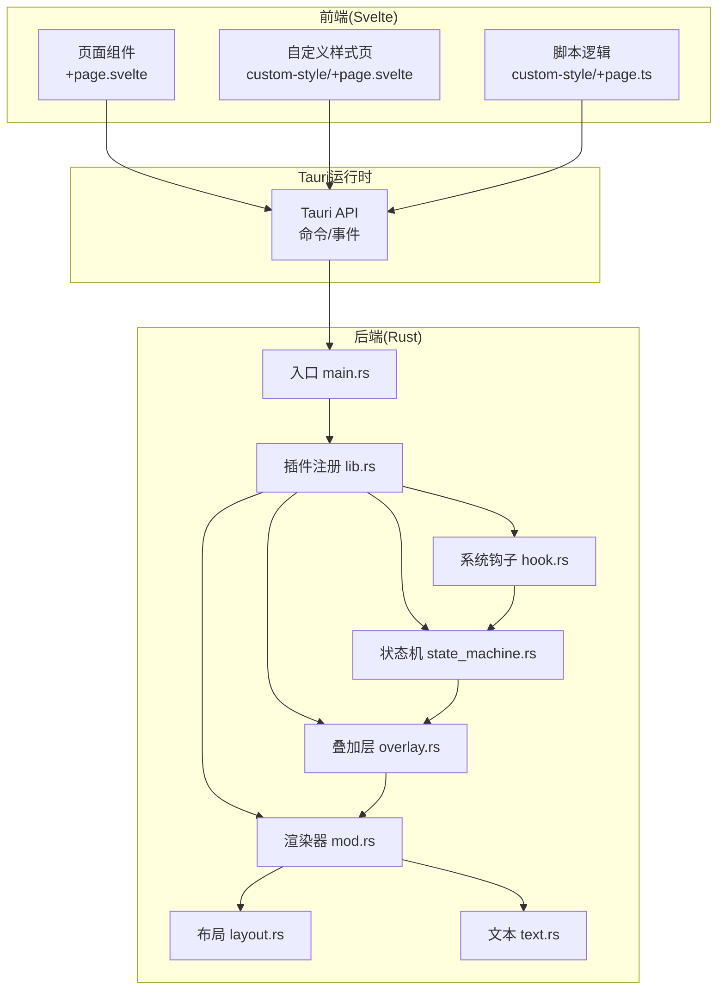
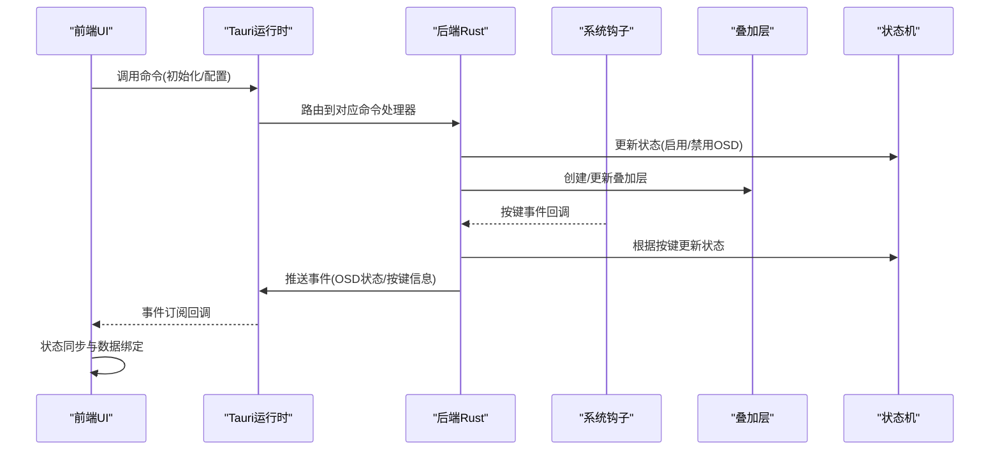
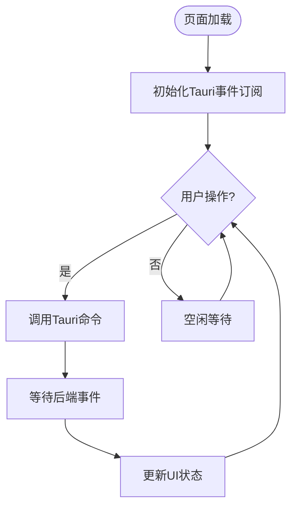
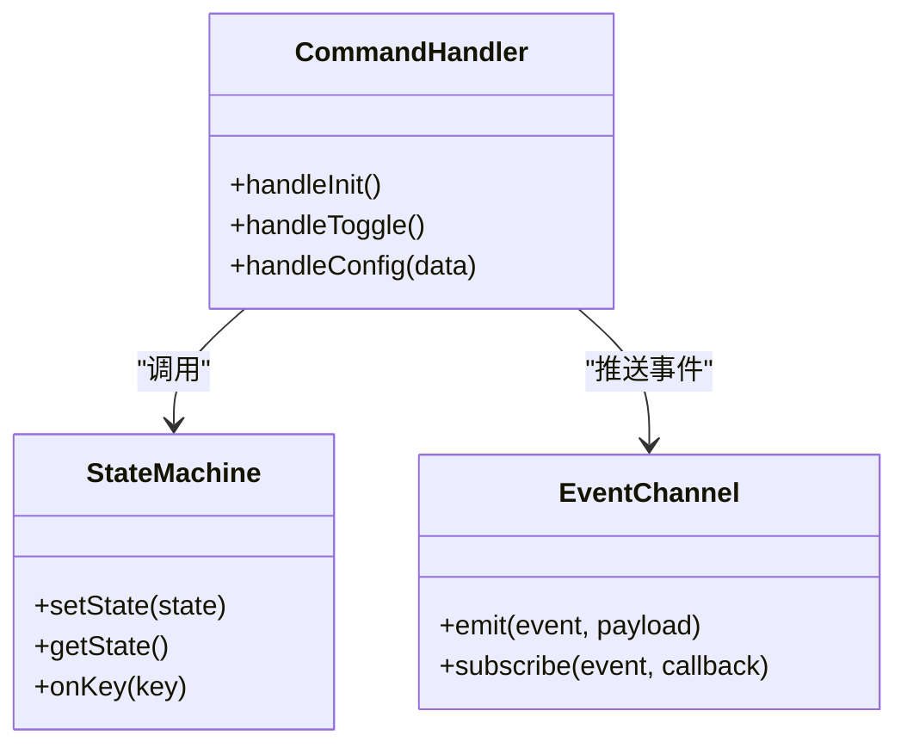
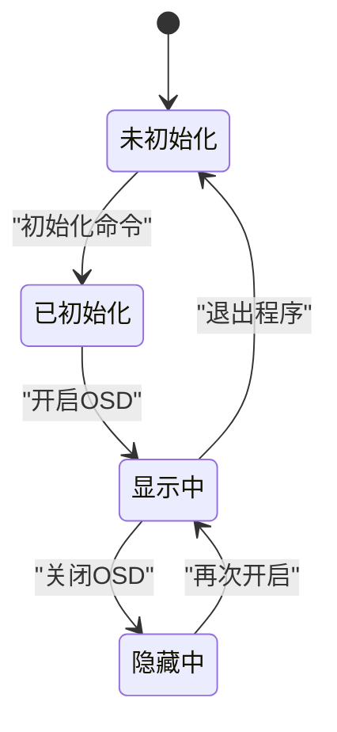
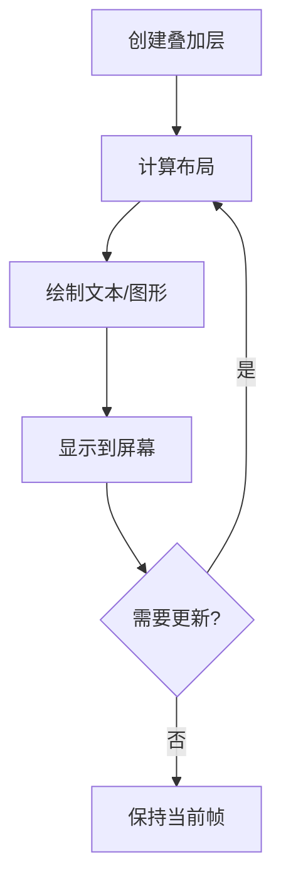
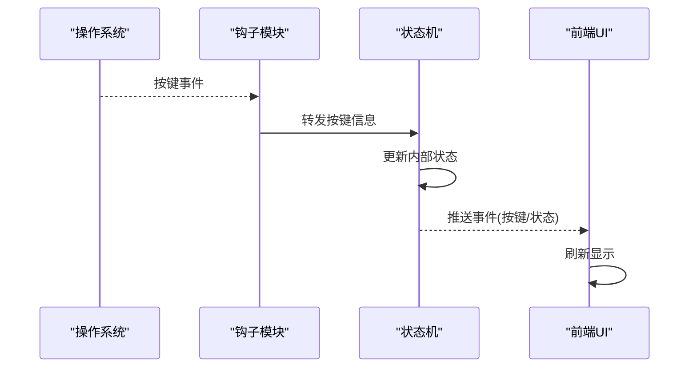
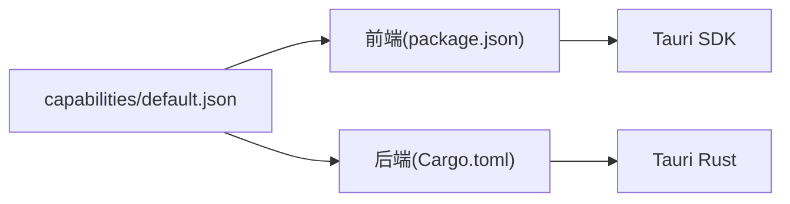

# IPC通信机制

<cite>
**本文引用的文件**   
- [osd-bubble/src-tauri/src/lib.rs](file://osd-bubble/src-tauri/src/lib.rs)
- [osd-bubble/src-tauri/src/main.rs](file://osd-bubble/src-tauri/src/main.rs)
- [osd-bubble/src-tauri/src/overlay.rs](file://osd-bubble/src-tauri/src/overlay.rs)
- [osd-bubble/src-tauri/src/state_machine.rs](file://osd-bubble/src-tauri/src/state_machine.rs)
- [osd-bubble/src-tauri/src/hook.rs](file://osd-bubble/src-tauri/src/hook.rs)
- [osd-bubble/src-tauri/src/renderer/mod.rs](file://osd-bubble/src-tauri/src/renderer/mod.rs)
- [osd-bubble/src-tauri/src/renderer/layout.rs](file://osd-bubble/src-tauri/src/renderer/layout.rs)
- [osd-bubble/src-tauri/src/renderer/text.rs](file://osd-bubble/src-tauri/src/renderer/text.rs)
- [osd-bubble/src-tauri/Cargo.toml](file://osd-bubble/src-tauri/Cargo.toml)
- [osd-bubble/src-tauri/tauri.conf.json](file://osd-bubble/src-tauri/tauri.conf.json)
- [osd-bubble/src-tauri/capabilities/default.json](file://osd-bubble/src-tauri/capabilities/default.json)
- [osd-bubble/src/routes/+page.svelte](file://osd-bubble/src/routes/+page.svelte)
- [osd-bubble/src/routes/custom-style/+page.svelte](file://osd-bubble/src/routes/custom-style/+page.svelte)
- [osd-bubble/src/routes/custom-style/+page.ts](file://osd-bubble/src/routes/custom-style/+page.ts)
- [osd-bubble/package.json](file://osd-bubble/package.json)
</cite>

## 目录
1. [简介](#简介)
2. [项目结构](#项目结构)
3. [核心组件](#核心组件)
4. [架构总览](#架构总览)
5. [详细组件分析](#详细组件分析)
6. [依赖关系分析](#依赖关系分析)
7. [性能考量](#性能考量)
8. [故障排查指南](#故障排查指南)
9. [结论](#结论)
10. [附录](#附录)

## 简介
本文件面向按键OSD可视化工具的IPC（进程间通信）机制，聚焦Tauri前后端数据交换协议、消息格式与事件传递方式，并详细说明状态管理模块与UI层之间的通信模式。文档涵盖事件监听、状态同步、数据绑定、错误处理策略、重连机制、性能优化建议以及安全与权限验证流程，帮助开发者快速建立可靠的IPC连接并稳定运行。

## 项目结构
本项目采用Tauri框架，前端为Svelte应用，后端为Rust实现。IPC通过Tauri命令与事件通道进行双向通信：
- 前端页面通过Tauri API调用后端命令或订阅事件，驱动OSD渲染与交互。
- 后端Rust模块负责系统钩子、窗口叠加层、渲染管线与状态机，并通过Tauri事件向前端推送状态更新。

**图表来源** 
- [osd-bubble/src-tauri/src/main.rs](file://osd-bubble/src-tauri/src/main.rs)
- [osd-bubble/src-tauri/src/lib.rs](file://osd-bubble/src-tauri/src/lib.rs)
- [osd-bubble/src-tauri/src/overlay.rs](file://osd-bubble/src-tauri/src/overlay.rs)
- [osd-bubble/src-tauri/src/state_machine.rs](file://osd-bubble/src-tauri/src/state_machine.rs)
- [osd-bubble/src-tauri/src/hook.rs](file://osd-bubble/src-tauri/src/hook.rs)
- [osd-bubble/src-tauri/src/renderer/mod.rs](file://osd-bubble/src-tauri/src/renderer/mod.rs)
- [osd-bubble/src-tauri/src/renderer/layout.rs](file://osd-bubble/src-tauri/src/renderer/layout.rs)
- [osd-bubble/src-tauri/src/renderer/text.rs](file://osd-bubble/src-tauri/src/renderer/text.rs)

**章节来源**
- [osd-bubble/src-tauri/src/main.rs](file://osd-bubble/src-tauri/src/main.rs)
- [osd-bubble/src-tauri/src/lib.rs](file://osd-bubble/src-tauri/src/lib.rs)
- [osd-bubble/src-tauri/Cargo.toml](file://osd-bubble/src-tauri/Cargo.toml)
- [osd-bubble/src-tauri/tauri.conf.json](file://osd-bubble/src-tauri/tauri.conf.json)
- [osd-bubble/package.json](file://osd-bubble/package.json)

## 核心组件
- 前端UI层：Svelte页面组件与脚本，负责用户交互与Tauri API调用。
- Tauri命令与事件：作为前后端通信契约，定义请求/响应与事件推送。
- 后端状态机：维护OSD显示状态、按键映射与生命周期。
- 叠加层与渲染器：创建透明窗口、绘制文本与布局。
- 系统钩子：捕获按键事件并触发状态变更。

**章节来源**
- [osd-bubble/src/routes/+page.svelte](file://osd-bubble/src/routes/+page.svelte)
- [osd-bubble/src/routes/custom-style/+page.svelte](file://osd-bubble/src/routes/custom-style/+page.svelte)
- [osd-bubble/src/routes/custom-style/+page.ts](file://osd-bubble/src/routes/custom-style/+page.ts)
- [osd-bubble/src-tauri/src/state_machine.rs](file://osd-bubble/src-tauri/src/state_machine.rs)
- [osd-bubble/src-tauri/src/overlay.rs](file://osd-bubble/src-tauri/src/overlay.rs)
- [osd-bubble/src-tauri/src/hook.rs](file://osd-bubble/src-tauri/src/hook.rs)
- [osd-bubble/src-tauri/src/renderer/mod.rs](file://osd-bubble/src-tauri/src/renderer/mod.rs)

## 架构总览
Tauri将前端Web视图与后端Rust进程解耦，通过命令与事件实现低延迟通信。UI层发起命令后，后端执行系统级操作（如创建叠加层、注册钩子），并将状态变化以事件形式回推至前端，完成状态同步与数据绑定。

**图表来源** 
- [osd-bubble/src-tauri/src/lib.rs](file://osd-bubble/src-tauri/src/lib.rs)
- [osd-bubble/src-tauri/src/state_machine.rs](file://osd-bubble/src-tauri/src/state_machine.rs)
- [osd-bubble/src-tauri/src/overlay.rs](file://osd-bubble/src-tauri/src/overlay.rs)
- [osd-bubble/src-tauri/src/hook.rs](file://osd-bubble/src-tauri/src/hook.rs)

## 详细组件分析

### 前端UI与Tauri API集成
- 页面组件通过Tauri提供的命令接口调用后端能力，例如初始化OSD、切换显示模式、设置样式等。
- 使用事件订阅接收后端推送的状态变更，实现UI自动刷新与数据绑定。
- 自定义样式页面可动态加载CSS并实时预览效果。

**图表来源** 
- [osd-bubble/src/routes/+page.svelte](file://osd-bubble/src/routes/+page.svelte)
- [osd-bubble/src/routes/custom-style/+page.svelte](file://osd-bubble/src/routes/custom-style/+page.svelte)
- [osd-bubble/src/routes/custom-style/+page.ts](file://osd-bubble/src/routes/custom-style/+page.ts)

**章节来源**
- [osd-bubble/src/routes/+page.svelte](file://osd-bubble/src/routes/+page.svelte)
- [osd-bubble/src/routes/custom-style/+page.svelte](file://osd-bubble/src/routes/custom-style/+page.svelte)
- [osd-bubble/src/routes/custom-style/+page.ts](file://osd-bubble/src/routes/custom-style/+page.ts)

### 后端命令与事件通道
- 命令处理器接收来自前端的请求，校验参数并执行业务逻辑。
- 事件通道用于向后端状态机与渲染器派发指令，同时将结果以事件形式返回前端。
- 命令与事件命名需遵循统一约定，便于前后端协作与维护。

**图表来源** 
- [osd-bubble/src-tauri/src/lib.rs](file://osd-bubble/src-tauri/src/lib.rs)
- [osd-bubble/src-tauri/src/state_machine.rs](file://osd-bubble/src-tauri/src/state_machine.rs)

**章节来源**
- [osd-bubble/src-tauri/src/lib.rs](file://osd-bubble/src-tauri/src/lib.rs)
- [osd-bubble/src-tauri/src/state_machine.rs](file://osd-bubble/src-tauri/src/state_machine.rs)

### 状态管理与UI同步
- 状态机维护OSD的生命周期与显示内容，按键事件触发状态转换。
- UI层通过事件订阅获取最新状态，实现数据绑定与界面刷新。
- 支持批量更新与防抖策略，避免频繁重绘导致的性能问题。

**图表来源** 
- [osd-bubble/src-tauri/src/state_machine.rs](file://osd-bubble/src-tauri/src/state_machine.rs)

**章节来源**
- [osd-bubble/src-tauri/src/state_machine.rs](file://osd-bubble/src-tauri/src/state_machine.rs)

### 叠加层与渲染管线
- 叠加层创建透明窗口并置顶，确保OSD始终可见且不影响其他应用。
- 渲染器负责布局计算与文本绘制，支持动态样式与主题切换。
- 渲染过程异步执行，避免阻塞主线程。

**图表来源** 
- [osd-bubble/src-tauri/src/overlay.rs](file://osd-bubble/src-tauri/src/overlay.rs)
- [osd-bubble/src-tauri/src/renderer/mod.rs](file://osd-bubble/src-tauri/src/renderer/mod.rs)
- [osd-bubble/src-tauri/src/renderer/layout.rs](file://osd-bubble/src-tauri/src/renderer/layout.rs)
- [osd-bubble/src-tauri/src/renderer/text.rs](file://osd-bubble/src-tauri/src/renderer/text.rs)

**章节来源**
- [osd-bubble/src-tauri/src/overlay.rs](file://osd-bubble/src-tauri/src/overlay.rs)
- [osd-bubble/src-tauri/src/renderer/mod.rs](file://osd-bubble/src-tauri/src/renderer/mod.rs)
- [osd-bubble/src-tauri/src/renderer/layout.rs](file://osd-bubble/src-tauri/src/renderer/layout.rs)
- [osd-bubble/src-tauri/src/renderer/text.rs](file://osd-bubble/src-tauri/src/renderer/text.rs)

### 系统钩子与事件捕获
- 钩子模块注册全局键盘事件监听，捕获按键按下与释放。
- 事件经处理后转发至状态机，触发相应的OSD状态变更。
- 支持过滤特定应用或窗口，避免干扰用户正常使用。

**图表来源** 
- [osd-bubble/src-tauri/src/hook.rs](file://osd-bubble/src-tauri/src/hook.rs)
- [osd-bubble/src-tauri/src/state_machine.rs](file://osd-bubble/src-tauri/src/state_machine.rs)

**章节来源**
- [osd-bubble/src-tauri/src/hook.rs](file://osd-bubble/src-tauri/src/hook.rs)
- [osd-bubble/src-tauri/src/state_machine.rs](file://osd-bubble/src-tauri/src/state_machine.rs)

## 依赖关系分析
- 前端依赖Tauri SDK与Svelte框架，通过package.json管理依赖版本。
- 后端依赖Tauri Rust库及系统相关crate，通过Cargo.toml声明。
- 能力配置文件capabilities控制前端对后端命令与事件的访问权限。

**图表来源** 
- [osd-bubble/package.json](file://osd-bubble/package.json)
- [osd-bubble/src-tauri/Cargo.toml](file://osd-bubble/src-tauri/Cargo.toml)
- [osd-bubble/src-tauri/capabilities/default.json](file://osd-bubble/src-tauri/capabilities/default.json)

**章节来源**
- [osd-bubble/package.json](file://osd-bubble/package.json)
- [osd-bubble/src-tauri/Cargo.toml](file://osd-bubble/src-tauri/Cargo.toml)
- [osd-bubble/src-tauri/capabilities/default.json](file://osd-bubble/src-tauri/capabilities/default.json)

## 性能考量
- 事件去抖与节流：在高频按键场景下合并事件，减少状态更新频率。
- 渲染批处理：将多次UI更新合并为一次绘制，降低GPU压力。
- 异步I/O：所有系统调用与文件读写均异步执行，避免阻塞主线程。
- 内存管理：及时释放不再使用的资源，防止内存泄漏。

[本节为通用指导，不直接分析具体文件]

## 故障排查指南
- 连接失败：检查Tauri端口占用与防火墙设置，确认前后端进程正常启动。
- 事件丢失：确认事件订阅是否重复注册或未正确清理。
- 权限不足：检查capabilities配置是否允许所需命令与事件。
- 渲染异常：验证叠加层窗口属性与渲染器配置是否正确。

**章节来源**
- [osd-bubble/src-tauri/tauri.conf.json](file://osd-bubble/src-tauri/tauri.conf.json)
- [osd-bubble/src-tauri/capabilities/default.json](file://osd-bubble/src-tauri/capabilities/default.json)

## 结论
本IPC机制基于Tauri构建，实现了前后端高效、稳定的通信。通过命令与事件通道，UI层与状态机紧密协作，确保OSD显示与用户交互的实时性。合理的错误处理、重连策略与安全配置进一步提升了系统的可靠性与安全性。

[本节为总结性内容，不直接分析具体文件]

## 附录
- 最佳实践：统一命名规范、模块化设计、充分测试边界条件。
- 扩展建议：支持多语言、主题切换、快捷键自定义等功能。
- 参考示例：查看自定义样式页面的实现，了解动态样式加载与预览。

[本节为补充说明，不直接分析具体文件]