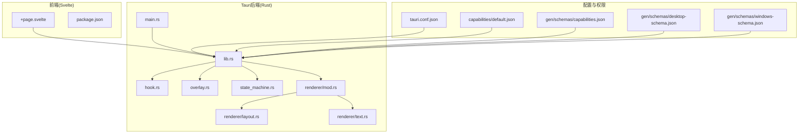
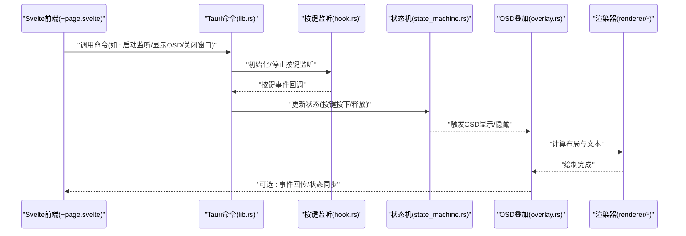
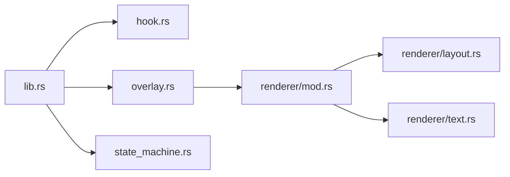

# Tauri命令接口

<cite>
**本文引用的文件**   
- [osd-bubble/src-tauri/Cargo.toml](file://osd-bubble/src-tauri/Cargo.toml)
- [osd-bubble/src-tauri/tauri.conf.json](file://osd-bubble/src-tauri/tauri.conf.json)
- [osd-bubble/src-tauri/capabilities/default.json](file://osd-bubble/src-tauri/capabilities/default.json)
- [osd-bubble/src-tauri/gen/schemas/capabilities.json](file://osd-bubble/src-tauri/gen/schemas/capabilities.json)
- [osd-bubble/src-tauri/gen/schemas/desktop-schema.json](file://osd-bubble/src-tauri/gen/schemas/desktop-schema.json)
- [osd-bubble/src-tauri/gen/schemas/windows-schema.json](file://osd-bubble/src-tauri/gen/schemas/windows-schema.json)
- [osd-bubble/src-tauri/src/lib.rs](file://osd-bubble/src-tauri/src/lib.rs)
- [osd-bubble/src-tauri/src/main.rs](file://osd-bubble/src-tauri/src/main.rs)
- [osd-bubble/src-tauri/src/hook.rs](file://osd-bubble/src-tauri/src/hook.rs)
- [osd-bubble/src-tauri/src/overlay.rs](file://osd-bubble/src-tauri/src/overlay.rs)
- [osd-bubble/src-tauri/src/state_machine.rs](file://osd-bubble/src-tauri/src/state_machine.rs)
- [osd-bubble/src-tauri/src/renderer/mod.rs](file://osd-bubble/src-tauri/src/renderer/mod.rs)
- [osd-bubble/src-tauri/src/renderer/layout.rs](file://osd-bubble/src-tauri/src/renderer/layout.rs)
- [osd-bubble/src-tauri/src/renderer/text.rs](file://osd-bubble/src-tauri/src/renderer/text.rs)
- [osd-bubble/src/routes/+page.svelte](file://osd-bubble/src/routes/+page.svelte)
- [osd-bubble/package.json](file://osd-bubble/package.json)
</cite>

## 目录
1. [简介](#简介)
2. [项目结构](#项目结构)
3. [核心组件](#核心组件)
4. [架构总览](#架构总览)
5. [详细组件分析](#详细组件分析)
6. [依赖关系分析](#依赖关系分析)
7. [性能考虑](#性能考虑)
8. [故障排查指南](#故障排查指南)
9. [结论](#结论)
10. [附录](#附录)

## 简介
本文件为按键OSD可视化工具的Tauri命令接口文档，聚焦于通过Tauri暴露的后端命令、参数与返回值类型、错误处理策略、权限与能力声明配置，以及在前端Svelte中的调用示例。同时覆盖按键监听、OSD显示控制、窗口管理等核心命令的实现要点与调试方法。

## 项目结构
本项目采用Tauri + Svelte的前后端分离架构：
- 前端位于 osd-bubble/src，使用SvelteKit路由组织页面，其中根页面用于交互与调用Tauri命令。
- 后端位于 osd-bubble/src-tauri/src，包含Tauri应用入口、命令注册、全局状态机、按键钩子、OSD叠加层渲染等模块。
- 配置与权限位于 osd-bubble/src-tauri/tauri.conf.json 与 capabilities 目录，生成式schema位于 gen/schemas。

图表来源
- [osd-bubble/src/routes/+page.svelte](file://osd-bubble/src/routes/+page.svelte)
- [osd-bubble/src-tauri/src/main.rs](file://osd-bubble/src-tauri/src/main.rs)
- [osd-bubble/src-tauri/src/lib.rs](file://osd-bubble/src-tauri/src/lib.rs)
- [osd-bubble/src-tauri/src/hook.rs](file://osd-bubble/src-tauri/src/hook.rs)
- [osd-bubble/src-tauri/src/overlay.rs](file://osd-bubble/src-tauri/src/overlay.rs)
- [osd-bubble/src-tauri/src/state_machine.rs](file://osd-bubble/src-tauri/src/state_machine.rs)
- [osd-bubble/src-tauri/src/renderer/mod.rs](file://osd-bubble/src-tauri/src/renderer/mod.rs)
- [osd-bubble/src-tauri/src/renderer/layout.rs](file://osd-bubble/src-tauri/src/renderer/layout.rs)
- [osd-bubble/src-tauri/src/renderer/text.rs](file://osd-bubble/src-tauri/src/renderer/text.rs)
- [osd-bubble/src-tauri/tauri.conf.json](file://osd-bubble/src-tauri/tauri.conf.json)
- [osd-bubble/src-tauri/capabilities/default.json](file://osd-bubble/src-tauri/capabilities/default.json)
- [osd-bubble/src-tauri/gen/schemas/capabilities.json](file://osd-bubble/src-tauri/gen/schemas/capabilities.json)
- [osd-bubble/src-tauri/gen/schemas/desktop-schema.json](file://osd-bubble/src-tauri/gen/schemas/desktop-schema.json)
- [osd-bubble/src-tauri/gen/schemas/windows-schema.json](file://osd-bubble/src-tauri/gen/schemas/windows-schema.json)

章节来源
- [osd-bubble/src/routes/+page.svelte](file://osd-bubble/src/routes/+page.svelte)
- [osd-bubble/src-tauri/src/main.rs](file://osd-bubble/src-tauri/src/main.rs)
- [osd-bubble/src-tauri/src/lib.rs](file://osd-bubble/src-tauri/src/lib.rs)
- [osd-bubble/src-tauri/tauri.conf.json](file://osd-bubble/src-tauri/tauri.conf.json)
- [osd-bubble/src-tauri/capabilities/default.json](file://osd-bubble/src-tauri/capabilities/default.json)

## 核心组件
- Tauri命令注册与分发：在Rust侧集中注册命令，统一处理来自前端的调用请求，并返回结果或错误。
- 按键监听（Hook）：负责系统级或进程级按键事件捕获，将键值与修饰键组合后推送给上层逻辑。
- OSD叠加层（Overlay）：管理OSD窗口的创建、置顶、透明、尺寸与内容更新。
- 状态机（State Machine）：维护OSD显示生命周期与按键事件的状态转换，确保UI一致性与幂等性。
- 渲染器（Renderer）：基于布局与文本绘制，将按键信息转换为OSD可见内容。

章节来源
- [osd-bubble/src-tauri/src/lib.rs](file://osd-bubble/src-tauri/src/lib.rs)
- [osd-bubble/src-tauri/src/hook.rs](file://osd-bubble/src-tauri/src/hook.rs)
- [osd-bubble/src-tauri/src/overlay.rs](file://osd-bubble/src-tauri/src/overlay.rs)
- [osd-bubble/src-tauri/src/state_machine.rs](file://osd-bubble/src-tauri/src/state_machine.rs)
- [osd-bubble/src-tauri/src/renderer/mod.rs](file://osd-bubble/src-tauri/src/renderer/mod.rs)
- [osd-bubble/src-tauri/src/renderer/layout.rs](file://osd-bubble/src-tauri/src/renderer/layout.rs)
- [osd-bubble/src-tauri/src/renderer/text.rs](file://osd-bubble/src-tauri/src/renderer/text.rs)

## 架构总览
下图展示了从Svelte前端到Tauri命令、再到按键监听与OSD渲染的整体调用链路。

图表来源
- [osd-bubble/src/routes/+page.svelte](file://osd-bubble/src/routes/+page.svelte)
- [osd-bubble/src-tauri/src/lib.rs](file://osd-bubble/src-tauri/src/lib.rs)
- [osd-bubble/src-tauri/src/hook.rs](file://osd-bubble/src-tauri/src/hook.rs)
- [osd-bubble/src-tauri/src/state_machine.rs](file://osd-bubble/src-tauri/src/state_machine.rs)
- [osd-bubble/src-tauri/src/overlay.rs](file://osd-bubble/src-tauri/src/overlay.rs)
- [osd-bubble/src-tauri/src/renderer/mod.rs](file://osd-bubble/src-tauri/src/renderer/mod.rs)

## 详细组件分析

### 命令注册与分发（lib.rs）
- 职责：集中注册所有Tauri命令，定义命令名、参数结构与返回值；处理跨线程事件回调；封装错误类型以便前端统一处理。
- 关键点：
  - 命令命名空间与版本兼容性。
  - 异步命令与同步命令的选择原则。
  - 错误类型映射到前端可识别的错误码或消息。
- 建议：
  - 对每个命令提供清晰的参数校验与默认值。
  - 对可能阻塞的操作使用异步API，避免UI卡顿。

章节来源
- [osd-bubble/src-tauri/src/lib.rs](file://osd-bubble/src-tauri/src/lib.rs)

### 按键监听（hook.rs）
- 职责：捕获系统按键事件，过滤无效输入，合并修饰键（Ctrl/Alt/Shift/Meta），输出标准化键值。
- 关键点：
  - 事件源选择（全局钩子 vs 应用内监听）。
  - 防抖与去重策略，避免重复触发。
  - 平台差异处理（Windows/macOS/Linux）。
- 错误处理：
  - 权限不足时返回明确错误码。
  - 初始化失败时提供重试机制。

章节来源
- [osd-bubble/src-tauri/src/hook.rs](file://osd-bubble/src-tauri/src/hook.rs)

### OSD叠加层（overlay.rs）
- 职责：创建与管理OSD窗口，控制置顶、透明、尺寸、位置与刷新频率。
- 关键点：
  - 窗口样式与层级设置。
  - 内容更新策略（增量更新 vs 全量重绘）。
  - 多显示器适配与缩放因子处理。
- 错误处理：
  - 窗口创建失败的回退方案。
  - 资源释放与清理流程。

章节来源
- [osd-bubble/src-tauri/src/overlay.rs](file://osd-bubble/src-tauri/src/overlay.rs)

### 状态机（state_machine.rs）
- 职责：维护OSD显示生命周期与按键事件的状态转换，保证UI一致性。
- 关键点：
  - 状态定义（空闲、显示中、隐藏中、错误等）。
  - 事件驱动的状态迁移规则。
  - 并发安全与线程边界。
- 错误处理：
  - 非法状态迁移拦截。
  - 超时与异常恢复。

章节来源
- [osd-bubble/src-tauri/src/state_machine.rs](file://osd-bubble/src-tauri/src/state_machine.rs)

### 渲染器（renderer/*）
- 职责：根据布局与文本数据生成OSD可见内容。
- 关键点：
  - 布局算法（对齐、间距、换行）。
  - 文本测量与字体回退。
  - 性能优化（缓存、批处理）。
- 错误处理：
  - 字体加载失败的降级策略。
  - 超大文本的截断与省略。

章节来源
- [osd-bubble/src-tauri/src/renderer/mod.rs](file://osd-bubble/src-tauri/src/renderer/mod.rs)
- [osd-bubble/src-tauri/src/renderer/layout.rs](file://osd-bubble/src-tauri/src/renderer/layout.rs)
- [osd-bubble/src-tauri/src/renderer/text.rs](file://osd-bubble/src-tauri/src/renderer/text.rs)

### 前端调用示例（Svelte）
- 调用方式：通过Tauri JS客户端库调用已注册的命令，传递参数并处理返回值。
- 最佳实践：
  - 使用try/catch捕获错误，展示友好提示。
  - 对频繁调用的命令进行节流或防抖。
  - 保持命令调用与UI状态同步。
- 示例路径：
  - 根页面组件用于演示命令调用与反馈。

章节来源
- [osd-bubble/src/routes/+page.svelte](file://osd-bubble/src/routes/+page.svelte)

## 依赖关系分析
- 外部依赖：Tauri框架、操作系统API（按键钩子、窗口管理）、渲染库。
- 内部依赖：命令层依赖状态机与渲染器；状态机依赖按键监听回调；渲染器依赖布局与文本模块。
- 潜在风险：
  - 循环依赖需避免。
  - 平台特定实现需抽象隔离。

图表来源
- [osd-bubble/src-tauri/src/lib.rs](file://osd-bubble/src-tauri/src/lib.rs)
- [osd-bubble/src-tauri/src/hook.rs](file://osd-bubble/src-tauri/src/hook.rs)
- [osd-bubble/src-tauri/src/overlay.rs](file://osd-bubble/src-tauri/src/overlay.rs)
- [osd-bubble/src-tauri/src/state_machine.rs](file://osd-bubble/src-tauri/src/state_machine.rs)
- [osd-bubble/src-tauri/src/renderer/mod.rs](file://osd-bubble/src-tauri/src/renderer/mod.rs)
- [osd-bubble/src-tauri/src/renderer/layout.rs](file://osd-bubble/src-tauri/src/renderer/layout.rs)
- [osd-bubble/src-tauri/src/renderer/text.rs](file://osd-bubble/src-tauri/src/renderer/text.rs)

章节来源
- [osd-bubble/src-tauri/Cargo.toml](file://osd-bubble/src-tauri/Cargo.toml)
- [osd-bubble/src-tauri/src/lib.rs](file://osd-bubble/src-tauri/src/lib.rs)

## 性能考虑
- 按键事件高频触发，建议在Rust侧做去重与批量处理，减少前端渲染压力。
- OSD窗口更新采用增量绘制，避免全量重绘。
- 字体与纹理资源缓存，降低重复加载开销。
- 使用异步命令避免阻塞主线程，提升响应性。

[本节为通用指导，不直接分析具体文件]

## 故障排查指南
- 常见问题：
  - 按键监听无响应：检查权限与钩子初始化日志。
  - OSD不显示：确认窗口创建成功与层级设置。
  - 命令调用失败：查看错误码与参数校验结果。
- 调试方法：
  - 启用Tauri日志，定位命令执行路径。
  - 在状态机关键节点打印状态变更。
  - 使用浏览器开发者工具观察前端调用与响应。
- 解决方案：
  - 权限不足时调整capabilities配置。
  - 资源加载失败时增加重试与降级逻辑。
  - 多线程竞争导致的数据不一致，引入锁或消息队列。

章节来源
- [osd-bubble/src-tauri/src/state_machine.rs](file://osd-bubble/src-tauri/src/state_machine.rs)
- [osd-bubble/src-tauri/src/hook.rs](file://osd-bubble/src-tauri/src/hook.rs)
- [osd-bubble/src-tauri/src/overlay.rs](file://osd-bubble/src-tauri/src/overlay.rs)

## 结论
本文档系统化梳理了按键OSD可视化工具的Tauri命令接口，涵盖命令注册、按键监听、OSD显示控制、窗口管理与渲染器等核心模块。通过明确的权限配置、错误处理策略与调试方法，帮助开发者快速集成与排障。建议在实际使用中结合日志与状态监控，持续优化性能与用户体验。

[本节为总结性内容，不直接分析具体文件]

## 附录

### 权限与能力声明配置
- tauri.conf.json：定义应用元数据、窗口配置、命令白名单与安全策略。
- capabilities/default.json：声明前端可访问的命令与资源权限。
- gen/schemas：由Tauri生成的schema文件，用于类型校验与IDE提示。

章节来源
- [osd-bubble/src-tauri/tauri.conf.json](file://osd-bubble/src-tauri/tauri.conf.json)
- [osd-bubble/src-tauri/capabilities/default.json](file://osd-bubble/src-tauri/capabilities/default.json)
- [osd-bubble/src-tauri/gen/schemas/capabilities.json](file://osd-bubble/src-tauri/gen/schemas/capabilities.json)
- [osd-bubble/src-tauri/gen/schemas/desktop-schema.json](file://osd-bubble/src-tauri/gen/schemas/desktop-schema.json)
- [osd-bubble/src-tauri/gen/schemas/windows-schema.json](file://osd-bubble/src-tauri/gen/schemas/windows-schema.json)

### 前端调用示例（Svelte）
- 在Svelte组件中导入Tauri客户端，调用已注册命令。
- 处理异步返回值与错误分支。
- 示例参考根页面组件。

章节来源
- [osd-bubble/src/routes/+page.svelte](file://osd-bubble/src/routes/+page.svelte)
- [osd-bubble/package.json](file://osd-bubble/package.json)