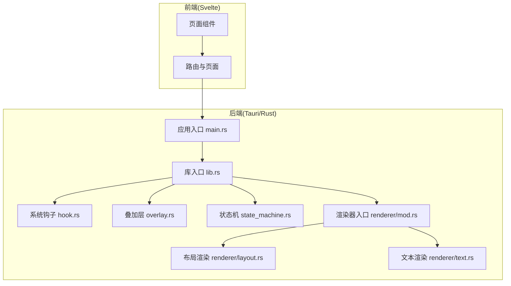
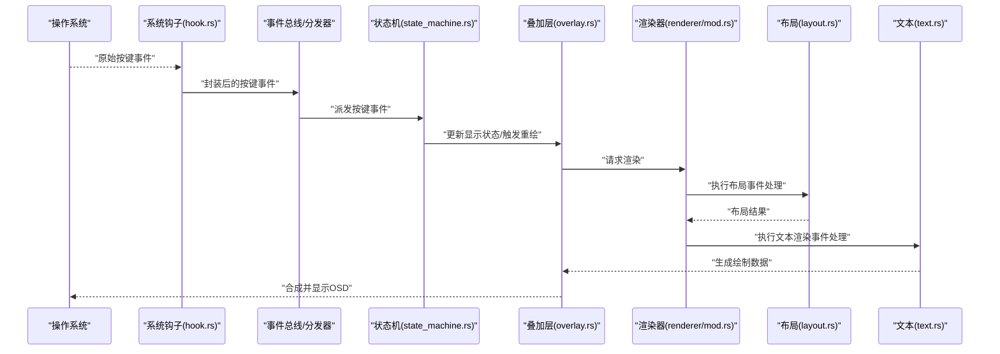
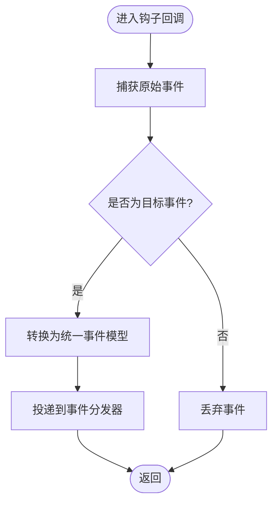
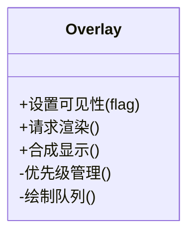
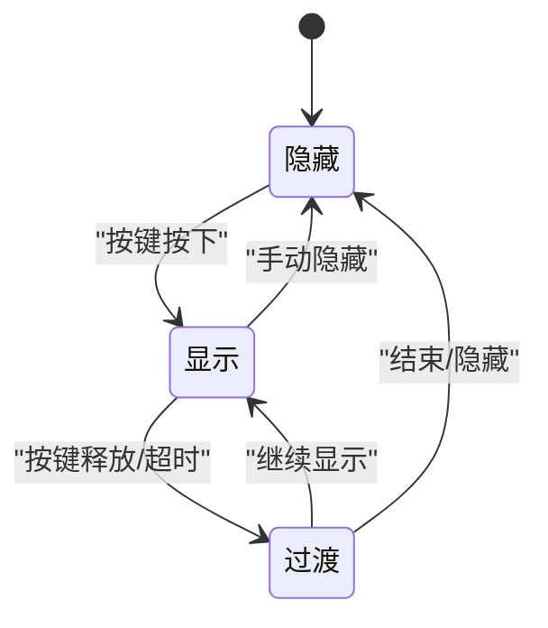
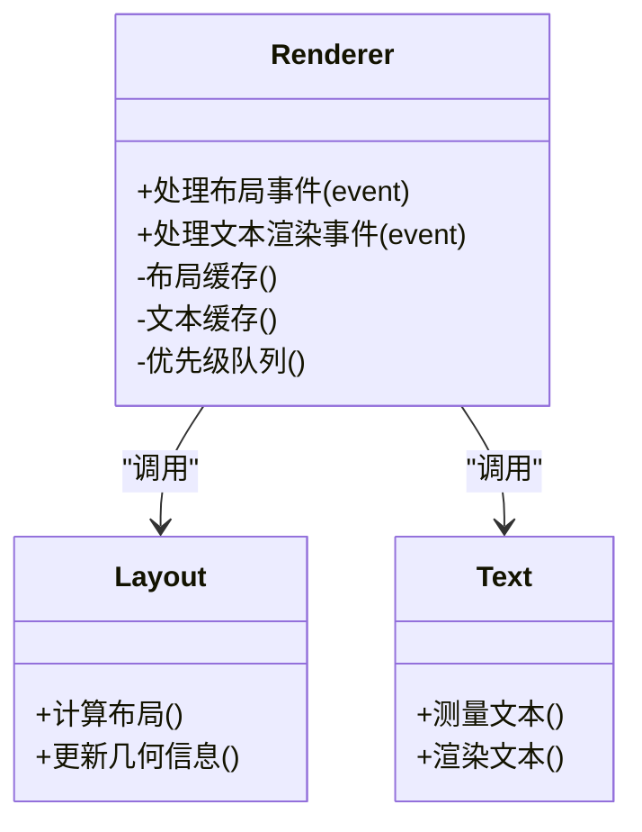
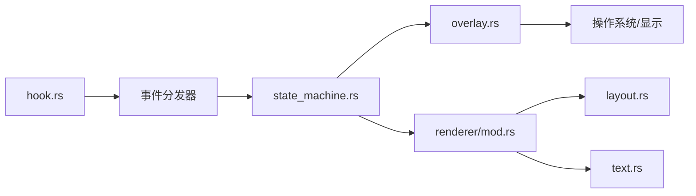

# 事件处理系统

<cite>
**本文档引用的文件**   
- [src-tauri/src/renderer/layout.rs](file://osd-bubble/src-tauri/src/renderer/layout.rs)
- [src-tauri/src/renderer/text.rs](file://osd-bubble/src-tauri/src/renderer/text.rs)
- [src-tauri/src/renderer/mod.rs](file://osd-bubble/src-tauri/src/renderer/mod.rs)
- [src-tauri/src/overlay.rs](file://osd-bubble/src-tauri/src/overlay.rs)
- [src-tauri/src/state_machine.rs](file://osd-bubble/src-tauri/src/state_machine.rs)
- [src-tauri/src/hook.rs](file://osd-bubble/src-tauri/src/hook.rs)
- [src-tauri/src/lib.rs](file://osd-bubble/src-tauri/src/lib.rs)
- [src-tauri/src/main.rs](file://osd-bubble/src-tauri/src/main.rs)
</cite>

## 目录
1. [简介](#简介)
2. [项目结构](#项目结构)
3. [核心组件](#核心组件)
4. [架构总览](#架构总览)
5. [详细组件分析](#详细组件分析)
6. [依赖关系分析](#依赖关系分析)
7. [性能考量](#性能考量)
8. [故障排查指南](#故障排查指南)
9. [结论](#结论)
10. [附录](#附录)

## 简介
本文件为按键OSD可视化工具的事件处理系统提供系统化、可操作的技术文档。重点覆盖：
- 按键事件的捕获、处理与分发机制
- 渲染器中的布局事件与文本渲染事件处理流程
- 事件生命周期、优先级管理与冲突解决策略
- 事件监听器的注册与注销方法
- 自定义事件的扩展方式与最佳实践
- 性能监控与事件调试工具使用指南

## 项目结构
本项目采用 Tauri + Svelte 的前后端分离架构，Rust 侧负责系统级钩子、窗口叠加层与渲染管线，Svelte 侧负责 UI 页面与交互原型。事件处理的核心位于 Rust 的 renderer、overlay、state_machine、hook 等模块中。

**图示来源** 
- [src-tauri/src/main.rs](file://osd-bubble/src-tauri/src/main.rs)
- [src-tauri/src/lib.rs](file://osd-bubble/src-tauri/src/lib.rs)
- [src-tauri/src/hook.rs](file://osd-bubble/src-tauri/src/hook.rs)
- [src-tauri/src/overlay.rs](file://osd-bubble/src-tauri/src/overlay.rs)
- [src-tauri/src/state_machine.rs](file://osd-bubble/src-tauri/src/state_machine.rs)
- [src-tauri/src/renderer/mod.rs](file://osd-bubble/src-tauri/src/renderer/mod.rs)
- [src-tauri/src/renderer/layout.rs](file://osd-bubble/src-tauri/src/renderer/layout.rs)
- [src-tauri/src/renderer/text.rs](file://osd-bubble/src-tauri/src/renderer/text.rs)

**章节来源**
- [src-tauri/src/main.rs](file://osd-bubble/src-tauri/src/main.rs)
- [src-tauri/src/lib.rs](file://osd-bubble/src-tauri/src/lib.rs)

## 核心组件
- 系统钩子系统（hook）：捕获底层输入事件（如键盘、鼠标），将原始事件转换为统一格式并投递到事件总线或状态机。
- 叠加层（overlay）：管理 OSD 窗口的可见性、层级与绘制时机，接收渲染指令并触发重绘。
- 状态机（state_machine）：维护当前显示状态（如隐藏、显示、动画过渡），驱动事件流转与渲染调度。
- 渲染器（renderer）：包含布局与文本两个关键渲染阶段，分别处理布局事件与文本渲染事件。
- 应用入口（main/lib）：初始化各子系统、注册全局事件监听、启动主循环。

**章节来源**
- [src-tauri/src/hook.rs](file://osd-bubble/src-tauri/src/hook.rs)
- [src-tauri/src/overlay.rs](file://osd-bubble/src-tauri/src/overlay.rs)
- [src-tauri/src/state_machine.rs](file://osd-bubble/src-tauri/src/state_machine.rs)
- [src-tauri/src/renderer/mod.rs](file://osd-bubble/src-tauri/src/renderer/mod.rs)
- [src-tauri/src/renderer/layout.rs](file://osd-bubble/src-tauri/src/renderer/layout.rs)
- [src-tauri/src/renderer/text.rs](file://osd-bubble/src-tauri/src/renderer/text.rs)

## 架构总览
下图展示了从系统输入到最终渲染的关键路径，以及事件在各组件间的流转顺序。

**图示来源** 
- [src-tauri/src/hook.rs](file://osd-bubble/src-tauri/src/hook.rs)
- [src-tauri/src/state_machine.rs](file://osd-bubble/src-tauri/src/state_machine.rs)
- [src-tauri/src/overlay.rs](file://osd-bubble/src-tauri/src/overlay.rs)
- [src-tauri/src/renderer/mod.rs](file://osd-bubble/src/tauri/src/renderer/mod.rs)
- [src-tauri/src/renderer/layout.rs](file://osd-bubble/src-tauri/src/renderer/layout.rs)
- [src-tauri/src/renderer/text.rs](file://osd-bubble/src-tauri/src/renderer/text.rs)

## 详细组件分析

### 系统钩子系统（hook）
- 职责：拦截系统级输入事件，过滤与转换后投递给上层事件分发器。
- 关键点：
  - 事件捕获：注册全局钩子，避免被其他窗口拦截。
  - 事件过滤：忽略非目标进程或非目标键位，降低噪声。
  - 事件转换：将平台差异抽象为统一事件模型。
  - 错误处理：捕获钩子异常并降级为安全模式。

**图示来源** 
- [src-tauri/src/hook.rs](file://osd-bubble/src-tauri/src/hook.rs)

**章节来源**
- [src-tauri/src/hook.rs](file://osd-bubble/src-tauri/src/hook.rs)

### 叠加层（overlay）
- 职责：管理 OSD 窗口生命周期、层级与绘制时机；响应渲染完成信号进行合成显示。
- 关键点：
  - 可见性控制：根据状态机指令切换显示/隐藏。
  - 绘制调度：在合适的线程/帧周期内执行绘制，避免阻塞主循环。
  - 冲突解决：当多个渲染源竞争时，依据优先级选择最终输出。

**图示来源** 
- [src-tauri/src/overlay.rs](file://osd-bubble/src-tauri/src/overlay.rs)

**章节来源**
- [src-tauri/src/overlay.rs](file://osd-bubble/src-tauri/src/overlay.rs)

### 状态机（state_machine）
- 职责：维护当前显示状态（隐藏、显示、过渡动画），驱动事件流转与渲染调度。
- 关键点：
  - 状态定义：明确每个状态的进入/退出行为。
  - 事件映射：按键事件到状态变更的规则表。
  - 优先级与冲突：多事件并发时的仲裁策略（如最近优先、最高优先级优先）。

**图示来源** 
- [src-tauri/src/state_machine.rs](file://osd-bubble/src-tauri/src/state_machine.rs)

**章节来源**
- [src-tauri/src/state_machine.rs](file://osd-bubble/src-tauri/src/state_machine.rs)

### 渲染器（renderer）
- 职责：协调布局与文本两个渲染阶段，处理布局事件与文本渲染事件，生成最终绘制数据。
- 关键点：
  - 布局事件：计算元素位置、尺寸、对齐与裁剪区域。
  - 文本渲染事件：字体加载、测量、换行与抗锯齿渲染。
  - 事件生命周期：创建、验证、执行、清理四个阶段。
  - 优先级管理：高优先级布局先于低优先级文本渲染。
  - 冲突解决：同层冲突按优先级与时间戳仲裁。

**图示来源** 
- [src-tauri/src/renderer/mod.rs](file://osd-bubble/src-tauri/src/renderer/mod.rs)
- [src-tauri/src/renderer/layout.rs](file://osd-bubble/src-tauri/src/renderer/layout.rs)
- [src-tauri/src/renderer/text.rs](file://osd-bubble/src-tauri/src/renderer/text.rs)

**章节来源**
- [src-tauri/src/renderer/mod.rs](file://osd-bubble/src-tauri/src/renderer/mod.rs)
- [src-tauri/src/renderer/layout.rs](file://osd-bubble/src-tauri/src/renderer/layout.rs)
- [src-tauri/src/renderer/text.rs](file://osd-bubble/src-tauri/src/renderer/text.rs)

### 应用入口（main/lib）
- 职责：初始化各子系统、注册全局事件监听、启动主循环与渲染循环。
- 关键点：
  - 初始化顺序：确保钩子、状态机、渲染器、叠加层正确装配。
  - 事件总线：集中分发与订阅，支持动态注册/注销监听器。
  - 资源管理：及时释放钩子句柄与渲染资源。

**章节来源**
- [src-tauri/src/main.rs](file://osd-bubble/src-tauri/src/main.rs)
- [src-tauri/src/lib.rs](file://osd-bubble/src-tauri/src/lib.rs)

## 依赖关系分析
- 耦合关系：
  - hook 依赖系统 API，向事件分发器投递事件。
  - state_machine 依赖事件分发器，驱动 overlay 与 renderer。
  - renderer 依赖 layout 与 text，二者相互独立但共享渲染上下文。
  - overlay 依赖 renderer 的输出，负责最终合成与显示。
- 潜在循环依赖：通过事件总线与接口解耦，避免直接循环引用。
- 外部依赖：系统输入API、图形渲染库、Tauri IPC（如需与前端通信）。

**图示来源** 
- [src-tauri/src/hook.rs](file://osd-bubble/src-tauri/src/hook.rs)
- [src-tauri/src/state_machine.rs](file://osd-bubble/src-tauri/src/state_machine.rs)
- [src-tauri/src/overlay.rs](file://osd-bubble/src-tauri/src/overlay.rs)
- [src-tauri/src/renderer/mod.rs](file://osd-bubble/src-tauri/src/renderer/mod.rs)
- [src-tauri/src/renderer/layout.rs](file://osd-bubble/src-tauri/src/renderer/layout.rs)
- [src-tauri/src/renderer/text.rs](file://osd-bubble/src-tauri/src/renderer/text.rs)

**章节来源**
- [src-tauri/src/hook.rs](file://osd-bubble/src-tauri/src/hook.rs)
- [src-tauri/src/state_machine.rs](file://osd-bubble/src-tauri/src/state_machine.rs)
- [src-tauri/src/overlay.rs](file://osd-bubble/src-tauri/src/overlay.rs)
- [src-tauri/src/renderer/mod.rs](file://osd-bubble/src-tauri/src/renderer/mod.rs)

## 性能考量
- 事件节流与合并：对高频按键事件进行合并与限流，减少状态机与渲染压力。
- 渲染缓存：布局与文本结果缓存，避免重复计算。
- 异步绘制：将耗时任务放入后台线程，避免阻塞主循环。
- 资源复用：字体、纹理等资源复用，减少分配与GC压力。
- 监控指标：记录事件处理耗时、渲染帧率、内存占用，便于定位瓶颈。

[本节为通用指导，不直接分析具体文件]

## 故障排查指南
- 常见问题：
  - 事件丢失：检查钩子注册是否成功、过滤规则是否过严。
  - 渲染闪烁：确认绘制时序与重叠区域冲突解决策略。
  - 性能抖动：查看事件合并与缓存命中率。
- 调试建议：
  - 启用事件日志：记录事件类型、时间戳、处理耗时。
  - 可视化事件流：在开发模式下输出事件序列图。
  - 隔离测试：单独测试 hook、state_machine、renderer 模块。

**章节来源**
- [src-tauri/src/hook.rs](file://osd-bubble/src-tauri/src/hook.rs)
- [src-tauri/src/state_machine.rs](file://osd-bubble/src-tauri/src/state_machine.rs)
- [src-tauri/src/renderer/mod.rs](file://osd-bubble/src-tauri/src/renderer/mod.rs)

## 结论
本事件处理系统通过清晰的模块化设计与分层架构，实现了按键事件的高效捕获、处理与渲染。借助状态机与渲染器的事件生命周期管理，系统在复杂场景下仍能保持稳定的性能与一致性。建议在生产环境中启用性能监控与调试工具，持续优化事件处理与渲染效率。

[本节为总结性内容，不直接分析具体文件]

## 附录
- 事件监听器注册与注销：
  - 注册：在应用初始化时向事件总线注册监听器，指定事件类型与回调函数。
  - 注销：在组件销毁或功能关闭时主动注销，避免内存泄漏。
- 自定义事件扩展：
  - 定义新事件结构体，实现统一接口。
  - 在分发器中注册新事件类型，并在相关处理器中增加分支逻辑。
- 最佳实践：
  - 事件处理函数应保持幂等与快速返回。
  - 避免在事件回调中进行阻塞IO。
  - 使用优先级与时间戳解决冲突，保证可预测性。

[本节为概念性内容，不直接分析具体文件]