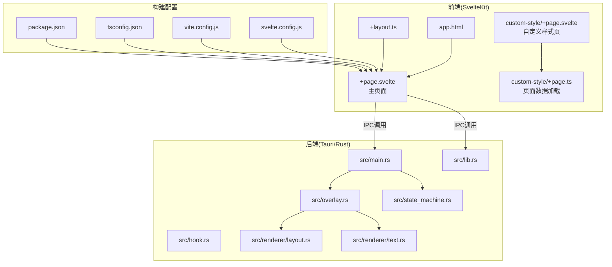
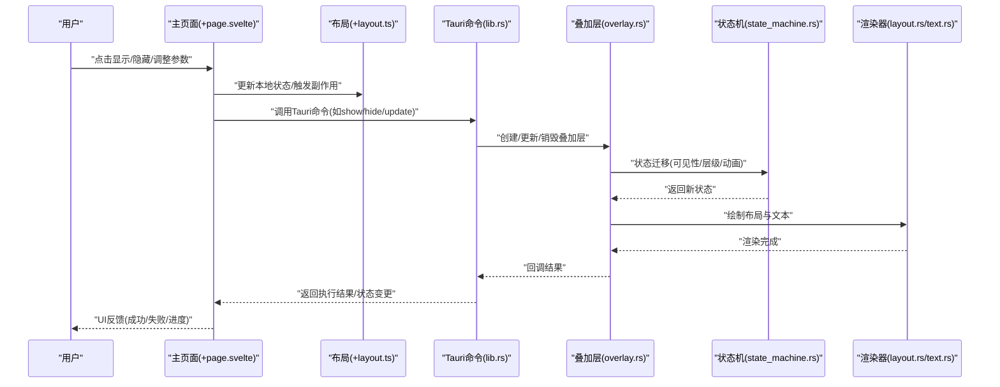
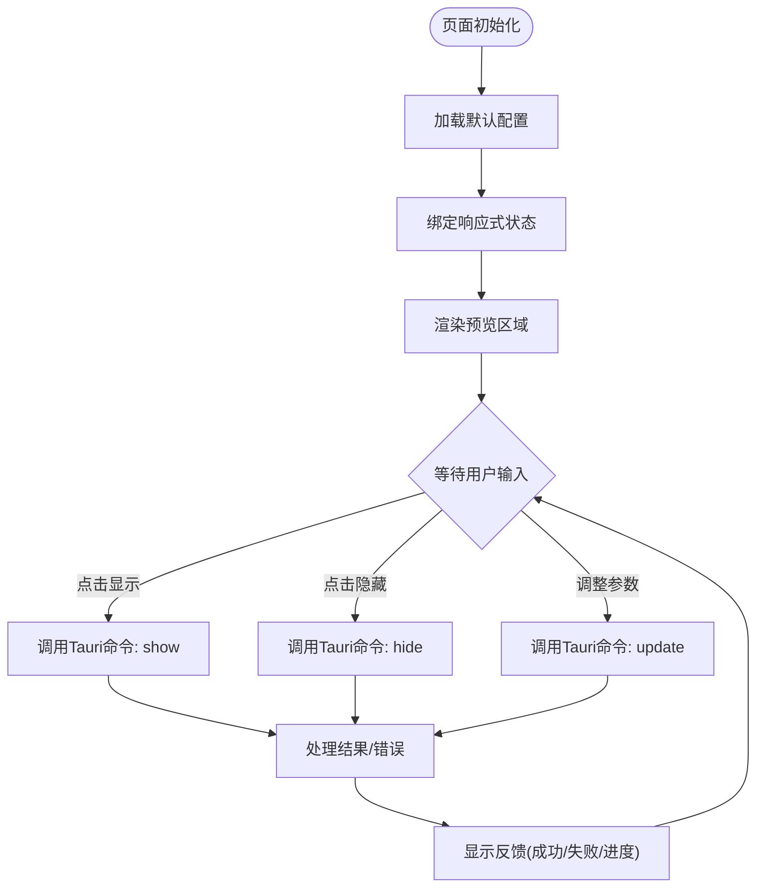
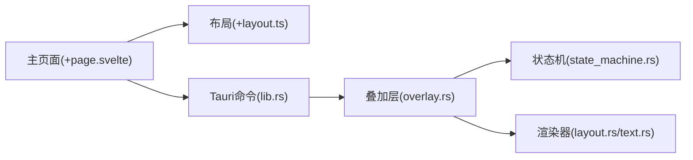

# 主页面组件

<cite>
**本文档引用的文件**   
- [osd-bubble/src/routes/+page.svelte](file://osd-bubble/src/routes/+page.svelte)
- [osd-bubble/src/routes/custom-style/+page.svelte](file://osd-bubble/src/routes/custom-style/+page.svelte)
- [osd-bubble/src/routes/custom-style/+page.ts](file://osd-bubble/src/routes/custom-style/+page.ts)
- [osd-bubble/src/routes/+layout.ts](file://osd-bubble/src/routes/+layout.ts)
- [osd-bubble/src/app.html](file://osd-bubble/src/app.html)
- [osd-bubble/package.json](file://osd-bubble/package.json)
- [osd-bubble/svelte.config.js](file://osd-bubble/svelte.config.js)
- [osd-bubble/vite.config.js](file://osd-bubble/vite.config.js)
- [osd-bubble/tsconfig.json](file://osd-bubble/tsconfig.json)
- [osd-bubble/README.md](file://osd-bubble/README.md)
- [按键OSD可视化工具-交互规格说明书.md](file://按键OSD可视化工具-交互规格说明书.md)
</cite>

## 目录
1. [简介](#简介)
2. [项目结构](#项目结构)
3. [核心组件](#核心组件)
4. [架构总览](#架构总览)
5. [详细组件分析](#详细组件分析)
6. [依赖关系分析](#依赖关系分析)
7. [性能考虑](#性能考虑)
8. [故障排查指南](#故障排查指南)
9. [结论](#结论)
10. [附录](#附录)

## 简介
本文件为“按键OSD可视化工具”的主页面组件提供系统化、可操作的技术文档。内容覆盖：
- 视觉布局与用户交互流程
- 状态管理与事件处理机制
- 与后端（Tauri）的通信方式
- 页面初始化流程、数据绑定模式与用户操作反馈
- 响应式设计与移动端适配策略
- 性能优化与错误处理实践

该文档面向前端开发者、产品与测试人员，力求以循序渐进的方式呈现从概览到代码级细节的全景视图。

## 项目结构
本项目采用 SvelteKit + Tauri 的混合架构：
- 前端使用 SvelteKit 构建 SPA，路由与页面由 +page.svelte 定义，布局与数据加载通过 +layout.ts 与 +page.ts 管理。
- 桌面端能力由 Rust/Tauri 提供，负责系统级功能（如 OSD 叠加层、文本渲染等），并通过 IPC 与前端通信。

图表来源
- [osd-bubble/src/app.html](file://osd-bubble/src/app.html)
- [osd-bubble/src/routes/+layout.ts](file://osd-bubble/src/routes/+layout.ts)
- [osd-bubble/src/routes/+page.svelte](file://osd-bubble/src/routes/+page.svelte)
- [osd-bubble/src/routes/custom-style/+page.svelte](file://osd-bubble/src/routes/custom-style/+page.svelte)
- [osd-bubble/src/routes/custom-style/+page.ts](file://osd-bubble/src/routes/custom-style/+page.ts)
- [osd-bubble/svelte.config.js](file://osd-bubble/svelte.config.js)
- [osd-bubble/vite.config.js](file://osd-bubble/vite.config.js)
- [osd-bubble/tsconfig.json](file://osd-bubble/tsconfig.json)
- [osd-bubble/package.json](file://osd-bubble/package.json)
- [osd-bubble/src-tauri/src/main.rs](file://osd-bubble/src-tauri/src/main.rs)
- [osd-bubble/src-tauri/src/lib.rs](file://osd-bubble/src-tauri/src/lib.rs)
- [osd-bubble/src-tauri/src/hook.rs](file://osd-bubble/src-tauri/src/hook.rs)
- [osd-bubble/src-tauri/src/overlay.rs](file://osd-bubble/src-tauri/src/overlay.rs)
- [osd-bubble/src-tauri/src/state_machine.rs](file://osd-bubble/src-tauri/src/state_machine.rs)
- [osd-bubble/src-tauri/src/renderer/layout.rs](file://osd-bubble/src-tauri/src/renderer/layout.rs)
- [osd-bubble/src-tauri/src/renderer/text.rs](file://osd-bubble/src-tauri/src/renderer/text.rs)

章节来源
- [osd-bubble/README.md](file://osd-bubble/README.md)
- [osd-bubble/package.json](file://osd-bubble/package.json)
- [osd-bubble/svelte.config.js](file://osd-bubble/svelte.config.js)
- [osd-bubble/vite.config.js](file://osd-bubble/vite.config.js)
- [osd-bubble/tsconfig.json](file://osd-bubble/tsconfig.json)

## 核心组件
- 主页面组件（+page.svelte）：承载按键 OSD 可视化展示的核心 UI，包括预览区、控制面板、状态指示与反馈提示。
- 自定义样式页（custom-style/+page.svelte）：用于主题与样式调试，支持动态样式注入与实时预览。
- 页面数据加载（custom-style/+page.ts）：封装页面所需的数据获取与状态初始化逻辑。
- 全局布局与数据流（+layout.ts）：提供跨页面的共享状态、生命周期钩子与错误边界。

章节来源
- [osd-bubble/src/routes/+page.svelte](file://osd-bubble/src/routes/+page.svelte)
- [osd-bubble/src/routes/custom-style/+page.svelte](file://osd-bubble/src/routes/custom-style/+page.svelte)
- [osd-bubble/src/routes/custom-style/+page.ts](file://osd-bubble/src/routes/custom-style/+page.ts)
- [osd-bubble/src/routes/+layout.ts](file://osd-bubble/src/routes/+layout.ts)

## 架构总览
前端通过 SvelteKit 组织页面与路由，利用 Svelte 的响应式数据绑定驱动 UI；后端通过 Tauri 暴露系统级能力（如 OSD 叠加层、文本渲染、键盘钩子）。前后端通过 IPC 进行通信，实现“前端控制 + 后端执行”的协作模式。

图表来源
- [osd-bubble/src/routes/+page.svelte](file://osd-bubble/src/routes/+page.svelte)
- [osd-bubble/src/routes/+layout.ts](file://osd-bubble/src/routes/+layout.ts)
- [osd-bubble/src-tauri/src/lib.rs](file://osd-bubble/src-tauri/src/lib.rs)
- [osd-bubble/src-tauri/src/overlay.rs](file://osd-bubble/src-tauri/src/overlay.rs)
- [osd-bubble/src-tauri/src/state_machine.rs](file://osd-bubble/src-tauri/src/state_machine.rs)
- [osd-bubble/src-tauri/src/renderer/layout.rs](file://osd-bubble/src-tauri/src/renderer/layout.rs)
- [osd-bubble/src-tauri/src/renderer/text.rs](file://osd-bubble/src-tauri/src/renderer/text.rs)

## 详细组件分析

### 主页面组件（+page.svelte）
职责与特性：
- 视觉布局：分区明确（顶部标题/工具栏、中部预览区、底部控制面板），遵循栅格或弹性布局，确保在不同屏幕尺寸下保持可读性与可用性。
- 用户交互：按钮点击、滑块调节、开关切换、输入框校验等，均通过 Svelte 的响应式变量驱动 UI 更新。
- 状态管理：本地状态集中管理（如可见性、位置、透明度、字体大小、颜色主题），必要时与后端状态同步。
- 事件处理：统一的事件监听与防抖/节流策略，避免频繁 IPC 调用导致性能问题。
- 与后端通信：通过 Tauri 命令调用 overlay 相关能力（显示/隐藏/更新样式/定位），并处理异步回调与错误。
- 初始化流程：页面挂载时加载默认配置、订阅必要事件、建立必要的资源引用。
- 数据绑定模式：单向数据流为主，双向绑定用于表单控件；复杂对象采用不可变更新策略。
- 用户反馈：成功提示、错误弹窗、加载骨架屏、禁用态与占位符。

图表来源
- [osd-bubble/src/routes/+page.svelte](file://osd-bubble/src/routes/+page.svelte)
- [osd-bubble/src-tauri/src/lib.rs](file://osd-bubble/src-tauri/src/lib.rs)
- [osd-bubble/src-tauri/src/overlay.rs](file://osd-bubble/src-tauri/src/overlay.rs)

章节来源
- [osd-bubble/src/routes/+page.svelte](file://osd-bubble/src/routes/+page.svelte)

### 自定义样式页（custom-style/+page.svelte）
职责与特性：
- 提供主题与样式调试界面，支持实时预览与热重载。
- 通过 +page.ts 加载样式配置，结合 Svelte 的样式作用域与 CSS 变量实现动态主题切换。
- 与主页面解耦，便于独立开发与测试。

章节来源
- [osd-bubble/src/routes/custom-style/+page.svelte](file://osd-bubble/src/routes/custom-style/+page.svelte)
- [osd-bubble/src/routes/custom-style/+page.ts](file://osd-bubble/src/routes/custom-style/+page.ts)

### 布局与数据流（+layout.ts）
职责与特性：
- 提供跨页面共享状态（如全局主题、语言、权限）。
- 在页面加载前执行必要的数据预取与错误边界设置。
- 统一管理路由守卫与生命周期钩子。

章节来源
- [osd-bubble/src/routes/+layout.ts](file://osd-bubble/src/routes/+layout.ts)

### 页面数据加载（custom-style/+page.ts）
职责与特性：
- 封装页面数据获取逻辑，支持缓存与重试。
- 将后端数据映射为前端状态，保证类型安全与一致性。

章节来源
- [osd-bubble/src/routes/custom-style/+page.ts](file://osd-bubble/src/routes/custom-style/+page.ts)

## 依赖关系分析
- 前端依赖：SvelteKit、Vite、TypeScript、Tailwind/CSS 变量（视具体配置而定）。
- 后端依赖：Tauri、Rust 生态（窗口/图形/输入事件）。
- 通信协议：Tauri IPC（命令/事件），建议定义清晰的请求/响应结构与错误码。

图表来源
- [osd-bubble/src/routes/+page.svelte](file://osd-bubble/src/routes/+page.svelte)
- [osd-bubble/src/routes/+layout.ts](file://osd-bubble/src/routes/+layout.ts)
- [osd-bubble/src-tauri/src/lib.rs](file://osd-bubble/src-tauri/src/lib.rs)
- [osd-bubble/src-tauri/src/overlay.rs](file://osd-bubble/src-tauri/src/overlay.rs)
- [osd-bubble/src-tauri/src/state_machine.rs](file://osd-bubble/src-tauri/src/state_machine.rs)
- [osd-bubble/src-tauri/src/renderer/layout.rs](file://osd-bubble/src-tauri/src/renderer/layout.rs)
- [osd-bubble/src-tauri/src/renderer/text.rs](file://osd-bubble/src-tauri/src/renderer/text.rs)

章节来源
- [osd-bubble/package.json](file://osd-bubble/package.json)
- [osd-bubble/svelte.config.js](file://osd-bubble/svelte.config.js)
- [osd-bubble/vite.config.js](file://osd-bubble/vite.config.js)
- [osd-bubble/tsconfig.json](file://osd-bubble/tsconfig.json)

## 性能考虑
- 减少不必要的重渲染：使用 Svelte 的 $state/$derived 与不可变更新，避免深层对象频繁复制。
- 防抖/节流：对高频事件（如拖拽、滑动、输入）进行节流，降低 IPC 调用频率。
- 懒加载与按需渲染：仅在需要时加载样式与资源，使用骨架屏提升感知性能。
- 后端批处理：合并多次更新请求，减少渲染抖动。
- 内存管理：及时释放不再使用的资源（如监听器、定时器、图像缓存）。
- 构建优化：启用 Tree-shaking、代码分割与压缩，减小包体积。

[本节为通用指导，不直接分析具体文件]

## 故障排查指南
常见问题与定位方法：
- 页面无法显示 OSD：检查 Tauri 命令是否注册、叠加层是否创建成功、权限是否开启。
- 样式异常：确认 CSS 变量与主题配置是否正确注入，查看浏览器控制台与 DevTools。
- 事件无响应：检查事件绑定与作用域，确认是否存在重复监听或未正确移除。
- 状态不同步：核对前端状态与后端状态的一致性，增加日志与断点验证。
- 性能卡顿：使用性能面板分析重渲染热点，优化数据流与渲染路径。

章节来源
- [osd-bubble/src/routes/+page.svelte](file://osd-bubble/src/routes/+page.svelte)
- [osd-bubble/src/routes/+layout.ts](file://osd-bubble/src/routes/+layout.ts)
- [按键OSD可视化工具-交互规格说明书.md](file://按键OSD可视化工具-交互规格说明书.md)

## 结论
主页面组件作为按键 OSD 可视化工具的核心入口，承担了 UI 展示、用户交互与后端通信的关键职责。通过 Svelte 的响应式数据绑定与 Tauri 的系统级能力，实现了高效、稳定的桌面端体验。建议在后续迭代中持续优化性能与错误处理，完善可观测性与可维护性。

[本节为总结性内容，不直接分析具体文件]

## 附录
- 开发环境搭建：参考 README 与 package.json 中的脚本说明。
- 构建与部署：使用 Vite 构建前端，Tauri 打包桌面应用。
- 设计规范：遵循交互规格说明书中的布局与行为约定。

章节来源
- [osd-bubble/README.md](file://osd-bubble/README.md)
- [按键OSD可视化工具-交互规格说明书.md](file://按键OSD可视化工具-交互规格说明书.md)