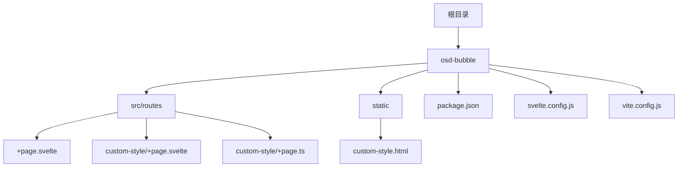
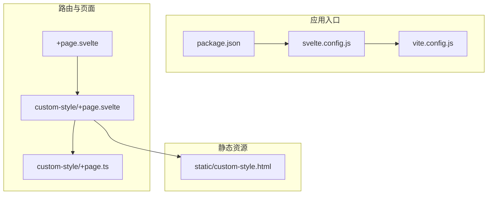
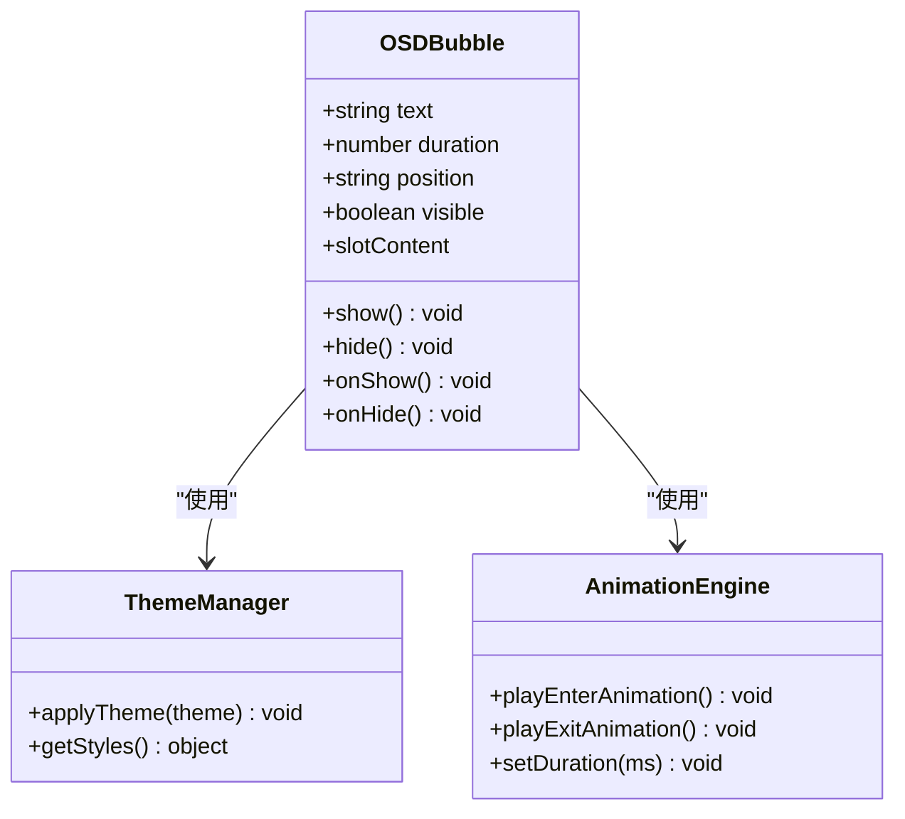
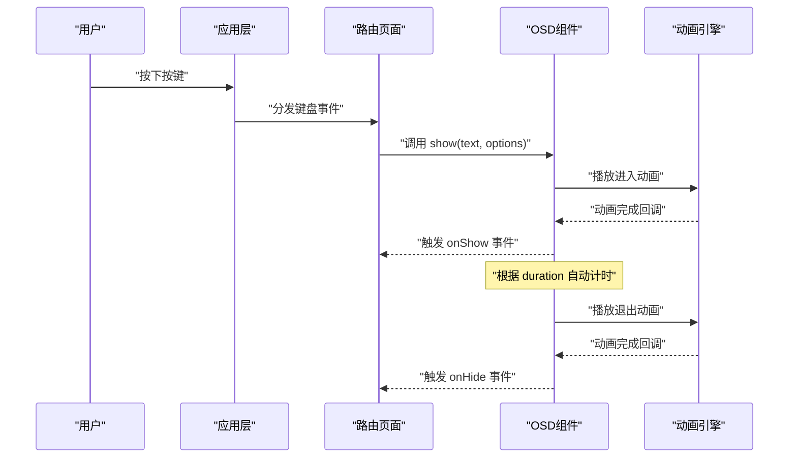
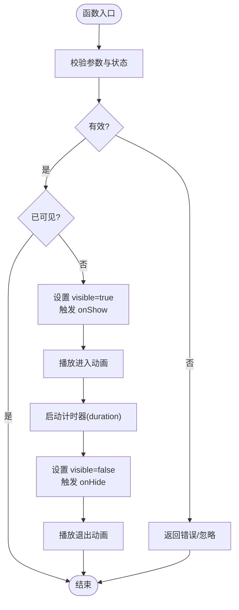
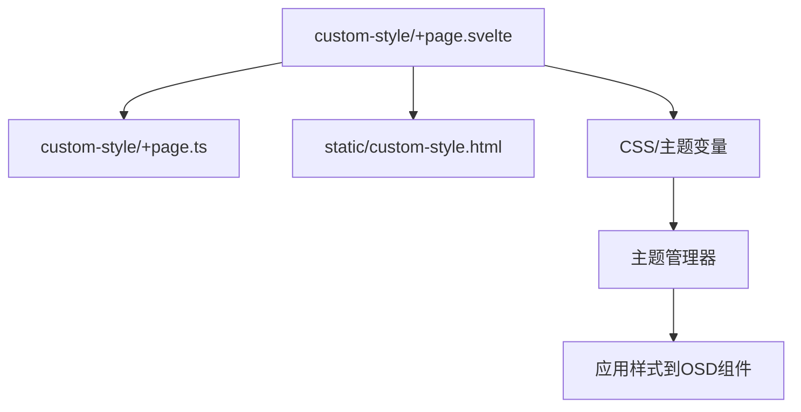
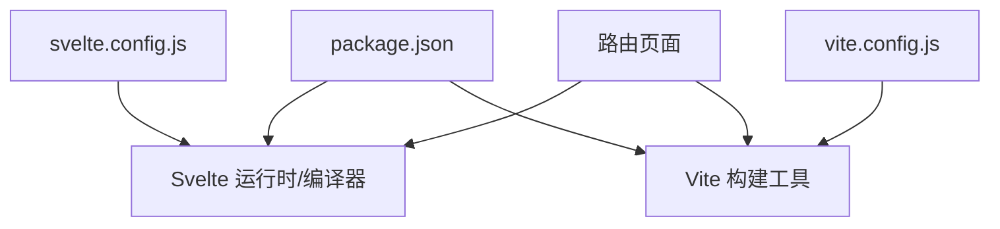

# 前端组件

<cite>
**本文引用的文件**   
- [按键OSD可视化工具-交互原型.html](file://按键OSD可视化工具-交互原型.html)
- [按键OSD可视化工具-交互规格说明书.md](file://按键OSD可视化工具-交互规格说明书.md)
- [osd-bubble/src/routes/+page.svelte](file://osd-bubble/src/routes/+page.svelte)
- [osd-bubble/src/routes/custom-style/+page.svelte](file://osd-bubble/src/routes/custom-style/+page.svelte)
- [osd-bubble/src/routes/custom-style/+page.ts](file://osd-bubble/src/routes/custom-style/+page.ts)
- [osd-bubble/static/custom-style.html](file://osd-bubble/static/custom-style.html)
- [osd-bubble/package.json](file://osd-bubble/package.json)
- [osd-bubble/svelte.config.js](file://osd-bubble/svelte.config.js)
- [osd-bubble/vite.config.js](file://osd-bubble/vite.config.js)
</cite>

## 目录
1. [简介](#简介)
2. [项目结构](#项目结构)
3. [核心组件](#核心组件)
4. [架构总览](#架构总览)
5. [详细组件分析](#详细组件分析)
6. [依赖分析](#依赖分析)
7. [性能考虑](#性能考虑)
8. [故障排查指南](#故障排查指南)
9. [结论](#结论)
10. [附录](#附录)

## 简介
本文件面向“按键OSD可视化工具”的前端组件，聚焦于组件的视觉外观、行为与用户交互模式，系统化记录属性（props）、事件、插槽与自定义选项，并提供使用示例、响应式设计与无障碍合规指导、状态与动画/过渡说明、样式自定义与主题支持、跨浏览器兼容性与性能优化建议，以及组件组合与与其他UI元素集成的最佳实践。文档内容基于仓库中的交互原型与Svelte路由页面进行归纳与提炼，确保读者既能快速上手，也能深入理解实现要点。

## 项目结构
本项目采用 SvelteKit 组织前端代码，关键目录与文件如下：
- osd-bubble/src/routes：SvelteKit 路由页面，包含默认首页与“自定义样式”演示页
- osd-bubble/static：静态资源，如自定义样式的HTML模板
- osd-bubble/package.json、svelte.config.js、vite.config.js：构建与运行配置
- 根目录下的交互原型与规格说明书：定义交互目标、行为规则与验收标准

图表来源
- [osd-bubble/src/routes/+page.svelte](file://osd-bubble/src/routes/+page.svelte)
- [osd-bubble/src/routes/custom-style/+page.svelte](file://osd-bubble/src/routes/custom-style/+page.svelte)
- [osd-bubble/src/routes/custom-style/+page.ts](file://osd-bubble/src/routes/custom-style/+page.ts)
- [osd-bubble/static/custom-style.html](file://osd-bubble/static/custom-style.html)
- [osd-bubble/package.json](file://osd-bubble/package.json)
- [osd-bubble/svelte.config.js](file://osd-bubble/svelte.config.js)
- [osd-bubble/vite.config.js](file://osd-bubble/vite.config.js)

章节来源
- [按键OSD可视化工具-交互规格说明书.md](file://按键OSD可视化工具-交互规格说明书.md)

## 核心组件
- OSD气泡组件（概念）：用于在屏幕叠加层显示按键反馈信息，具备可配置的文本、位置、样式、持续时间与动画效果。
- 自定义样式入口：通过独立页面与静态模板提供主题与样式覆盖能力，便于在不同场景下定制外观。

关键职责
- 渲染按键OSD提示（文本、图标、进度等）
- 管理显示/隐藏状态与生命周期（出现、停留、消失）
- 响应键盘事件并触发对应OSD展示
- 提供样式与主题扩展点

章节来源
- [按键OSD可视化工具-交互原型.html](file://按键OSD可视化工具-交互原型.html)
- [按键OSD可视化工具-交互规格说明书.md](file://按键OSD可视化工具-交互规格说明书.md)

## 架构总览
前端以 SvelteKit 为框架，路由页面负责承载OSD组件与演示逻辑；静态资源提供样式模板；构建工具链由 Vite 驱动，Svelte 编译器与插件协同工作。

图表来源
- [osd-bubble/package.json](file://osd-bubble/package.json)
- [osd-bubble/svelte.config.js](file://osd-bubble/svelte.config.js)
- [osd-bubble/vite.config.js](file://osd-bubble/vite.config.js)
- [osd-bubble/src/routes/+page.svelte](file://osd-bubble/src/routes/+page.svelte)
- [osd-bubble/src/routes/custom-style/+page.svelte](file://osd-bubble/src/routes/custom-style/+page.svelte)
- [osd-bubble/src/routes/custom-style/+page.ts](file://osd-bubble/src/routes/custom-style/+page.ts)
- [osd-bubble/static/custom-style.html](file://osd-bubble/static/custom-style.html)

## 详细组件分析

### OSD气泡组件（概念化类图）
该组件通常包含以下能力：文本渲染、定位策略、显示时长控制、动画过渡、事件回调与插槽扩展。

图表来源
- [按键OSD可视化工具-交互原型.html](file://按键OSD可视化工具-交互原型.html)
- [按键OSD可视化工具-交互规格说明书.md](file://按键OSD可视化工具-交互规格说明书.md)

章节来源
- [按键OSD可视化工具-交互原型.html](file://按键OSD可视化工具-交互原型.html)
- [按键OSD可视化工具-交互规格说明书.md](file://按键OSD可视化工具-交互规格说明书.md)

### API/服务调用时序（键盘事件到OSD展示）
当用户按下按键时，应用捕获事件并触发OSD组件显示，随后按配置自动隐藏或等待手动关闭。

图表来源
- [按键OSD可视化工具-交互原型.html](file://按键OSD可视化工具-交互原型.html)
- [按键OSD可视化工具-交互规格说明书.md](file://按键OSD可视化工具-交互规格说明书.md)

章节来源
- [按键OSD可视化工具-交互原型.html](file://按键OSD可视化工具-交互原型.html)
- [按键OSD可视化工具-交互规格说明书.md](file://按键OSD可视化工具-交互规格说明书.md)

### 复杂逻辑流程图（显示/隐藏决策）
OSD组件在显示前需校验输入参数与当前状态，避免重复触发与无效渲染。

图表来源
- [按键OSD可视化工具-交互原型.html](file://按键OSD可视化工具-交互原型.html)
- [按键OSD可视化工具-交互规格说明书.md](file://按键OSD可视化工具-交互规格说明书.md)

章节来源
- [按键OSD可视化工具-交互原型.html](file://按键OSD可视化工具-交互原型.html)
- [按键OSD可视化工具-交互规格说明书.md](file://按键OSD可视化工具-交互规格说明书.md)

### 自定义样式与主题支持
通过独立页面与静态HTML模板，提供主题切换与样式覆盖能力，满足多场景外观需求。

图表来源
- [osd-bubble/src/routes/custom-style/+page.svelte](file://osd-bubble/src/routes/custom-style/+page.svelte)
- [osd-bubble/src/routes/custom-style/+page.ts](file://osd-bubble/src/routes/custom-style/+page.ts)
- [osd-bubble/static/custom-style.html](file://osd-bubble/static/custom-style.html)

章节来源
- [osd-bubble/src/routes/custom-style/+page.svelte](file://osd-bubble/src/routes/custom-style/+page.svelte)
- [osd-bubble/src/routes/custom-style/+page.ts](file://osd-bubble/src/routes/custom-style/+page.ts)
- [osd-bubble/static/custom-style.html](file://osd-bubble/static/custom-style.html)

## 依赖分析
- 构建与运行时依赖由 package.json 声明，Svelte 与 Vite 作为核心工具链
- svelte.config.js 配置 Svelte 编译选项与插件
- vite.config.js 配置开发服务器、模块解析与构建产物
- 路由页面依赖 Svelte 组件模型与事件系统

图表来源
- [osd-bubble/package.json](file://osd-bubble/package.json)
- [osd-bubble/svelte.config.js](file://osd-bubble/svelte.config.js)
- [osd-bubble/vite.config.js](file://osd-bubble/vite.config.js)
- [osd-bubble/src/routes/+page.svelte](file://osd-bubble/src/routes/+page.svelte)

章节来源
- [osd-bubble/package.json](file://osd-bubble/package.json)
- [osd-bubble/svelte.config.js](file://osd-bubble/svelte.config.js)
- [osd-bubble/vite.config.js](file://osd-bubble/vite.config.js)

## 性能考虑
- 最小化重渲染：仅在必要状态变化时更新OSD组件，避免频繁触发显示/隐藏
- 动画优化：优先使用 CSS transform 与 opacity 动画，减少布局抖动
- 节流与防抖：对高频键盘事件进行节流，防止过多OSD实例堆积
- 资源加载：按需加载主题与样式，避免首屏阻塞
- 内存管理：及时清理定时器与事件监听器，避免泄漏

[本节为通用性能建议，不直接分析具体文件]

## 故障排查指南
- 常见问题
  - OSD未显示：检查参数校验与可见性状态，确认事件是否被正确分发
  - 动画卡顿：检查动画属性与DOM层级，避免强制同步布局
  - 样式错乱：确认主题变量与覆盖优先级，检查静态模板是否正确引入
- 调试步骤
  - 在路由页面添加日志输出，跟踪事件流与状态变化
  - 使用浏览器开发者工具检查网络请求与资源加载
  - 验证不同浏览器兼容性，必要时降级动画或样式方案

章节来源
- [按键OSD可视化工具-交互原型.html](file://按键OSD可视化工具-交互原型.html)
- [按键OSD可视化工具-交互规格说明书.md](file://按键OSD可视化工具-交互规格说明书.md)

## 结论
本组件文档围绕按键OSD可视化前端组件的视觉、行为与交互展开，结合SvelteKit路由与静态资源，提供了完整的架构视图、API与时序说明、样式与主题扩展路径，以及性能与无障碍优化建议。读者可据此快速集成与定制OSD组件，并在多场景中保持一致的用户体验。

[本节为总结性内容，不直接分析具体文件]

## 附录
- 使用示例（基于路由页面与静态模板）
  - 在默认路由页面中引入OSD组件，绑定键盘事件并调用显示方法
  - 在自定义样式页面中切换主题变量，验证样式覆盖效果
  - 通过静态HTML模板注入全局样式，适配特定浏览器环境
- 响应式设计指导
  - 使用相对单位与弹性布局，确保在不同分辨率下正常显示
  - 限制最大宽度与高度，避免遮挡重要内容
- 无障碍合规性
  - 为OSD文本提供语义化标签与ARIA属性
  - 确保键盘可达性与焦点管理
  - 提供足够的对比度与可缩放支持

[本节为补充信息，不直接分析具体文件]