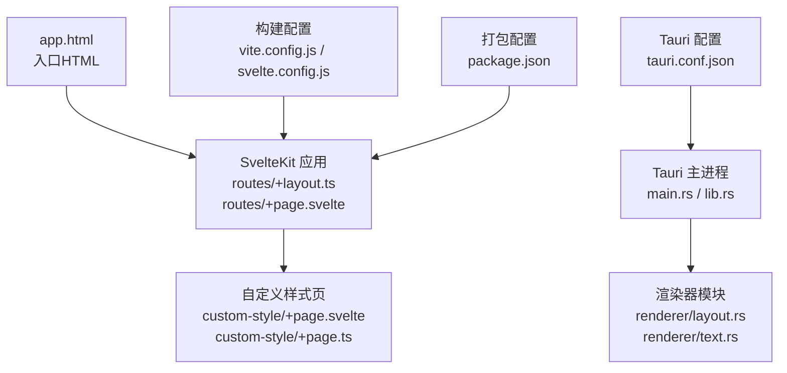
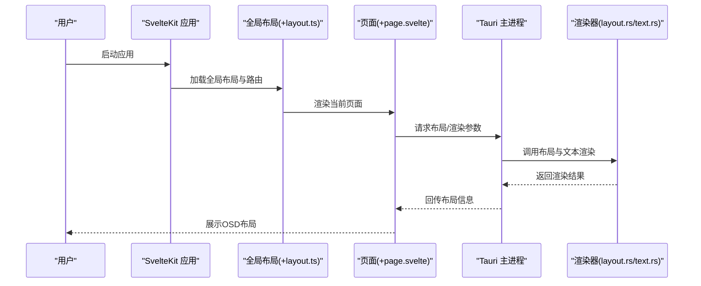
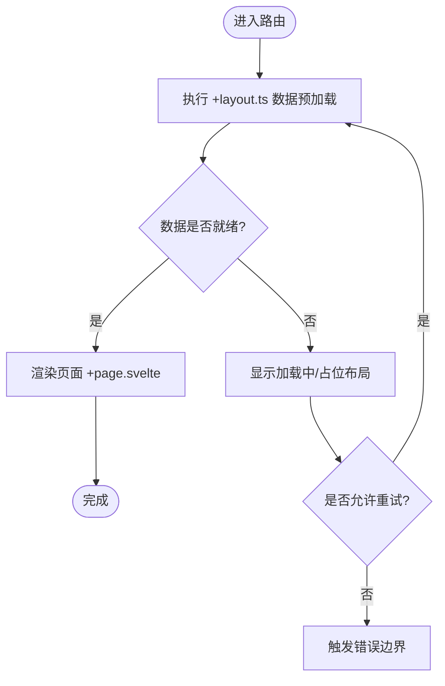
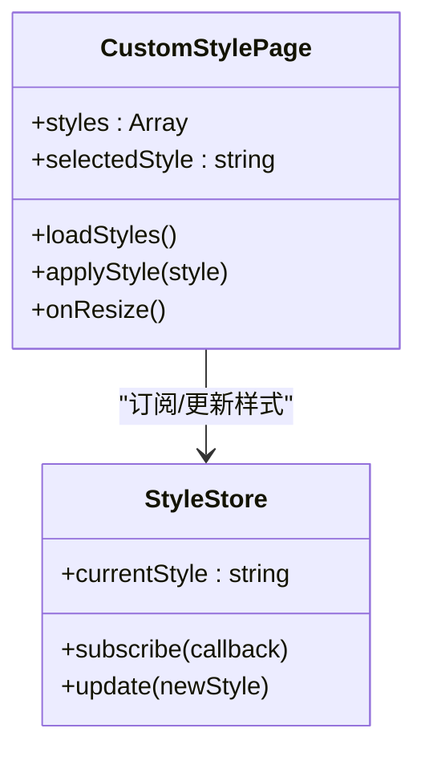
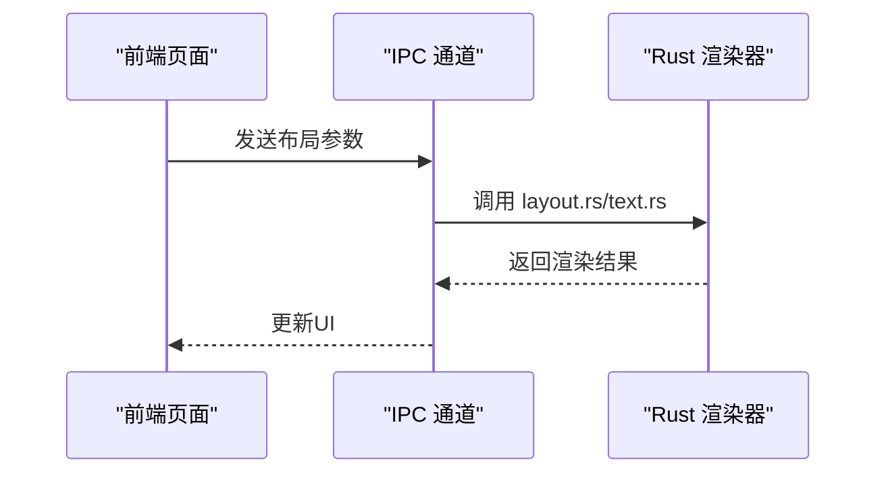
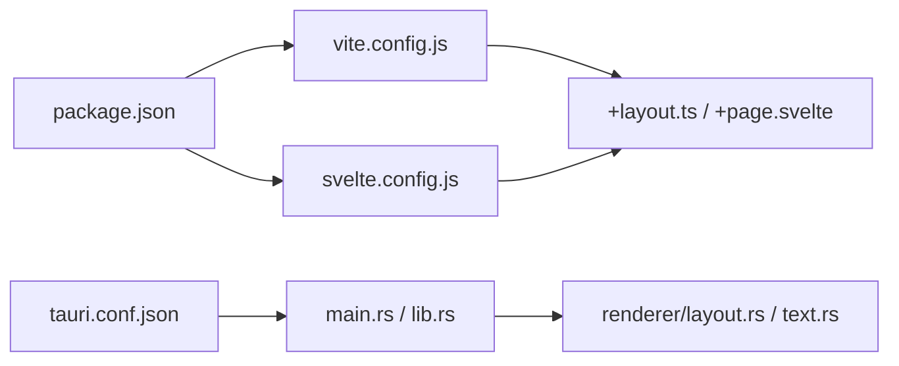

# 布局组件

<cite>
**本文引用的文件**   
- [osd-bubble/src/routes/+layout.ts](file://osd-bubble/src/routes/+layout.ts)
- [osd-bubble/src/routes/+page.svelte](file://osd-bubble/src/routes/+page.svelte)
- [osd-bubble/src/routes/custom-style/+page.svelte](file://osd-bubble/src/routes/custom-style/+page.svelte)
- [osd-bubble/src/routes/custom-style/+page.ts](file://osd-bubble/src/routes/custom-style/+page.ts)
- [osd-bubble/src/app.html](file://osd-bubble/src/app.html)
- [osd-bubble/svelte.config.js](file://osd-bubble/svelte.config.js)
- [osd-bubble/vite.config.js](file://osd-bubble/vite.config.js)
- [osd-bubble/package.json](file://osd-bubble/package.json)
- [osd-bubble/src-tauri/src/renderer/layout.rs](file://osd-bubble/src-tauri/src/renderer/layout.rs)
- [osd-bubble/src-tauri/src/renderer/mod.rs](file://osd-bubble/src-tauri/src/renderer/mod.rs)
- [osd-bubble/src-tauri/src/renderer/text.rs](file://osd-bubble/src-tauri/src/renderer/text.rs)
- [osd-bubble/src-tauri/src/main.rs](file://osd-bubble/src-tauri/src/main.rs)
- [osd-bubble/src-tauri/src/lib.rs](file://osd-bubble/src-tauri/src/lib.rs)
- [osd-bubble/src-tauri/tauri.conf.json](file://osd-bubble/src-tauri/tauri.conf.json)
</cite>

## 目录
1. [简介](#简介)
2. [项目结构](#项目结构)
3. [核心组件](#核心组件)
4. [架构总览](#架构总览)
5. [详细组件分析](#详细组件分析)
6. [依赖分析](#依赖分析)
7. [性能考虑](#性能考虑)
8. [故障排查指南](#故障排查指南)
9. [结论](#结论)
10. [附录](#附录)

## 简介
本文件面向按键OSD可视化工具的“布局组件”，聚焦于全局布局结构、路由配置与页面框架管理。文档覆盖以下主题：
- 全局布局结构与页面框架管理
- 路由配置与页面加载流程
- 布局状态共享、数据预加载与错误边界处理
- 响应式布局适配、导航菜单管理与页面过渡效果
- 布局缓存策略、懒加载实现与性能监控集成
- 多语言支持与无障碍访问（a11y）在布局层面的考虑

本说明以 SvelteKit + Tauri 技术栈为依据，结合前端路由与后端渲染层协作，给出可操作的实践建议与排障指引。

## 项目结构
本项目采用前后端分离的桌面应用形态：
- 前端：SvelteKit 提供路由、页面与布局能力；Vite 负责构建与开发体验。
- 后端：Tauri 提供原生窗口与渲染上下文，Rust 侧包含渲染器模块（含布局相关逻辑）。

图表来源
- [osd-bubble/src/app.html](file://osd-bubble/src/app.html)
- [osd-bubble/src/routes/+layout.ts](file://osd-bubble/src/routes/+layout.ts)
- [osd-bubble/src/routes/+page.svelte](file://osd-bubble/src/routes/+page.svelte)
- [osd-bubble/src/routes/custom-style/+page.svelte](file://osd-bubble/src/routes/custom-style/+page.svelte)
- [osd-bubble/src/routes/custom-style/+page.ts](file://osd-bubble/src/routes/custom-style/+page.ts)
- [osd-bubble/src-tauri/src/main.rs](file://osd-bubble/src-tauri/src/main.rs)
- [osd-bubble/src-tauri/src/lib.rs](file://osd-bubble/src-tauri/src/lib.rs)
- [osd-bubble/src-tauri/src/renderer/layout.rs](file://osd-bubble/src-tauri/src/renderer/layout.rs)
- [osd-bubble/src-tauri/src/renderer/text.rs](file://osd-bubble/src-tauri/src/renderer/text.rs)
- [osd-bubble/vite.config.js](file://osd-bubble/vite.config.js)
- [osd-bubble/svelte.config.js](file://osd-bubble/svelte.config.js)
- [osd-bubble/package.json](file://osd-bubble/package.json)
- [osd-bubble/src-tauri/tauri.conf.json](file://osd-bubble/src-tauri/tauri.conf.json)

章节来源
- [osd-bubble/src/app.html](file://osd-bubble/src/app.html)
- [osd-bubble/src/routes/+layout.ts](file://osd-bubble/src/routes/+layout.ts)
- [osd-bubble/src/routes/+page.svelte](file://osd-bubble/src/routes/+page.svelte)
- [osd-bubble/src/routes/custom-style/+page.svelte](file://osd-bubble/src/routes/custom-style/+page.svelte)
- [osd-bubble/src/routes/custom-style/+page.ts](file://osd-bubble/src/routes/custom-style/+page.ts)
- [osd-bubble/src-tauri/src/renderer/layout.rs](file://osd-bubble/src-tauri/src/renderer/layout.rs)
- [osd-bubble/src-tauri/src/renderer/mod.rs](file://osd-bubble/src-tauri/src/renderer/mod.rs)
- [osd-bubble/src-tauri/src/renderer/text.rs](file://osd-bubble/src-tauri/src/renderer/text.rs)
- [osd-bubble/src-tauri/src/main.rs](file://osd-bubble/src-tauri/src/main.rs)
- [osd-bubble/src-tauri/src/lib.rs](file://osd-bubble/src-tauri/src/lib.rs)
- [osd-bubble/src-tauri/tauri.conf.json](file://osd-bubble/src-tauri/tauri.conf.json)
- [osd-bubble/vite.config.js](file://osd-bubble/vite.config.js)
- [osd-bubble/svelte.config.js](file://osd-bubble/svelte.config.js)
- [osd-bubble/package.json](file://osd-bubble/package.json)

## 核心组件
- 全局布局与路由入口
  - 通过 SvelteKit 的路由约定，使用 +layout.ts 进行全局路由级预处理（如数据预取、权限校验、国际化初始化等），+page.svelte 作为默认页面。
  - 建议在 +layout.ts 中集中处理跨页面的公共状态（如主题、语言、窗口尺寸监听），并通过 store 或上下文向子页面注入。
- 自定义样式页面
  - custom-style 路由用于演示或承载特定样式的 OSD 预览，配合 +page.ts 进行页面级数据准备。
- Tauri 渲染器布局
  - Rust 侧 renderer/layout.rs 负责窗口与渲染上下文中的布局计算与绘制协调，text.rs 负责文本渲染细节。这些与前端页面通过 IPC 或事件通道协同。

章节来源
- [osd-bubble/src/routes/+layout.ts](file://osd-bubble/src/routes/+layout.ts)
- [osd-bubble/src/routes/+page.svelte](file://osd-bubble/src/routes/+page.svelte)
- [osd-bubble/src/routes/custom-style/+page.svelte](file://osd-bubble/src/routes/custom-style/+page.svelte)
- [osd-bubble/src/routes/custom-style/+page.ts](file://osd-bubble/src/routes/custom-style/+page.ts)
- [osd-bubble/src-tauri/src/renderer/layout.rs](file://osd-bubble/src-tauri/src/renderer/layout.rs)
- [osd-bubble/src-tauri/src/renderer/text.rs](file://osd-bubble/src-tauri/src/renderer/text.rs)

## 架构总览
整体架构由“前端 SvelteKit 路由与布局”和“后端 Tauri 渲染器”两部分组成，二者通过 IPC 或事件机制协作完成 OSD 的显示与交互。

图表来源
- [osd-bubble/src/routes/+layout.ts](file://osd-bubble/src/routes/+layout.ts)
- [osd-bubble/src/routes/+page.svelte](file://osd-bubble/src/routes/+page.svelte)
- [osd-bubble/src-tauri/src/main.rs](file://osd-bubble/src-tauri/src/main.rs)
- [osd-bubble/src-tauri/src/renderer/layout.rs](file://osd-bubble/src-tauri/src/renderer/layout.rs)
- [osd-bubble/src-tauri/src/renderer/text.rs](file://osd-bubble/src-tauri/src/renderer/text.rs)

## 详细组件分析

### 全局布局与路由管理
- 职责
  - 统一处理跨页面状态（主题、语言、窗口尺寸、键盘快捷键等）。
  - 集中进行数据预加载（如字体列表、预设布局、本地化资源）。
  - 定义错误边界与降级策略（如网络失败时的占位布局）。
- 实现要点
  - 在 +layout.ts 中使用 SvelteKit 的数据加载钩子进行预取，确保页面渲染前所需数据就绪。
  - 将布局状态暴露为可订阅的 store，供子页面与组件按需消费。
  - 对关键路径添加 try/catch 与重试机制，避免单点失败影响全局。

图表来源
- [osd-bubble/src/routes/+layout.ts](file://osd-bubble/src/routes/+layout.ts)
- [osd-bubble/src/routes/+page.svelte](file://osd-bubble/src/routes/+page.svelte)

章节来源
- [osd-bubble/src/routes/+layout.ts](file://osd-bubble/src/routes/+layout.ts)
- [osd-bubble/src/routes/+page.svelte](file://osd-bubble/src/routes/+page.svelte)

### 自定义样式页面（OSD 预览）
- 职责
  - 承载特定样式的 OSD 预览，支持动态切换样式与实时反馈。
  - 通过 +page.ts 进行页面级数据准备（如样式清单、字体映射）。
- 实现要点
  - 使用响应式变量驱动样式切换，避免不必要的重绘。
  - 对大资源（字体、图片）采用懒加载与缓存策略。
  - 提供键盘与鼠标快捷操作，提升调试效率。

图表来源
- [osd-bubble/src/routes/custom-style/+page.svelte](file://osd-bubble/src/routes/custom-style/+page.svelte)
- [osd-bubble/src/routes/custom-style/+page.ts](file://osd-bubble/src/routes/custom-style/+page.ts)

章节来源
- [osd-bubble/src/routes/custom-style/+page.svelte](file://osd-bubble/src/routes/custom-style/+page.svelte)
- [osd-bubble/src/routes/custom-style/+page.ts](file://osd-bubble/src/routes/custom-style/+page.ts)

### Tauri 渲染器布局
- 职责
  - 在原生窗口环境中计算并应用 OSD 布局，协调文本渲染与图层叠加。
  - 与前端通过 IPC 交换布局参数与渲染结果。
- 实现要点
  - layout.rs 负责布局计算与窗口适配（分辨率、缩放、多显示器）。
  - text.rs 负责字体选择、行高、对齐与阴影等文本表现。
  - 通过事件总线或消息队列解耦前后端调用，提高稳定性。

图表来源
- [osd-bubble/src-tauri/src/renderer/layout.rs](file://osd-bubble/src-tauri/src/renderer/layout.rs)
- [osd-bubble/src-tauri/src/renderer/text.rs](file://osd-bubble/src-tauri/src/renderer/text.rs)
- [osd-bubble/src-tauri/src/main.rs](file://osd-bubble/src-tauri/src/main.rs)
- [osd-bubble/src-tauri/src/lib.rs](file://osd-bubble/src-tauri/src/lib.rs)

章节来源
- [osd-bubble/src-tauri/src/renderer/layout.rs](file://osd-bubble/src-tauri/src/renderer/layout.rs)
- [osd-bubble/src-tauri/src/renderer/text.rs](file://osd-bubble/src-tauri/src/renderer/text.rs)
- [osd-bubble/src-tauri/src/main.rs](file://osd-bubble/src-tauri/src/main.rs)
- [osd-bubble/src-tauri/src/lib.rs](file://osd-bubble/src-tauri/src/lib.rs)

## 依赖分析
- 前端依赖
  - SvelteKit 路由与布局约定（+layout.ts、+page.svelte）。
  - Vite 构建系统与 Svelte 插件链。
  - 可选：状态管理库（如 Svelte stores）、国际化库（如 svelte-i18n）。
- 后端依赖
  - Tauri 主进程与渲染器模块。
  - Rust 生态中的图形/文本渲染库（具体取决于实现）。

图表来源
- [osd-bubble/package.json](file://osd-bubble/package.json)
- [osd-bubble/vite.config.js](file://osd-bubble/vite.config.js)
- [osd-bubble/svelte.config.js](file://osd-bubble/svelte.config.js)
- [osd-bubble/src/routes/+layout.ts](file://osd-bubble/src/routes/+layout.ts)
- [osd-bubble/src/routes/+page.svelte](file://osd-bubble/src/routes/+page.svelte)
- [osd-bubble/src-tauri/tauri.conf.json](file://osd-bubble/src-tauri/tauri.conf.json)
- [osd-bubble/src-tauri/src/main.rs](file://osd-bubble/src-tauri/src/main.rs)
- [osd-bubble/src-tauri/src/lib.rs](file://osd-bubble/src-tauri/src/lib.rs)
- [osd-bubble/src-tauri/src/renderer/layout.rs](file://osd-bubble/src-tauri/src/renderer/layout.rs)
- [osd-bubble/src-tauri/src/renderer/text.rs](file://osd-bubble/src-tauri/src/renderer/text.rs)

章节来源
- [osd-bubble/package.json](file://osd-bubble/package.json)
- [osd-bubble/vite.config.js](file://osd-bubble/vite.config.js)
- [osd-bubble/svelte.config.js](file://osd-bubble/svelte.config.js)
- [osd-bubble/src/routes/+layout.ts](file://osd-bubble/src/routes/+layout.ts)
- [osd-bubble/src/routes/+page.svelte](file://osd-bubble/src/routes/+page.svelte)
- [osd-bubble/src-tauri/tauri.conf.json](file://osd-bubble/src-tauri/tauri.conf.json)
- [osd-bubble/src-tauri/src/main.rs](file://osd-bubble/src-tauri/src/main.rs)
- [osd-bubble/src-tauri/src/lib.rs](file://osd-bubble/src-tauri/src/lib.rs)
- [osd-bubble/src-tauri/src/renderer/layout.rs](file://osd-bubble/src-tauri/src/renderer/layout.rs)
- [osd-bubble/src-tauri/src/renderer/text.rs](file://osd-bubble/src-tauri/src/renderer/text.rs)

## 性能考虑
- 布局缓存策略
  - 对静态资源（字体、图标、样式清单）进行版本化缓存，减少重复下载。
  - 对布局计算结果做短期缓存（内存），避免频繁重算。
- 懒加载实现
  - 页面级懒加载：仅在路由激活时加载必要代码与数据。
  - 资源级懒加载：图片、字体按需加载，首屏最小化。
- 性能监控集成
  - 前端：使用 Performance API 或第三方库采集关键指标（FCP、LCP、TTI）。
  - 后端：记录渲染耗时与内存占用，定期上报或导出日志。
- 渲染优化
  - 合并 DOM 更新，减少重排与重绘。
  - 使用虚拟滚动或分页加载大数据集。
  - 在 Tauri 渲染器中启用增量更新与批处理。

[本节为通用指导，不直接分析具体文件]

## 故障排查指南
- 常见问题定位
  - 路由加载失败：检查 +layout.ts 数据预加载逻辑与错误边界。
  - 样式未生效：确认 custom-style 路由的资源路径与缓存策略。
  - 渲染异常：查看 Tauri 渲染器日志，核对 IPC 参数格式。
- 诊断步骤
  - 打开开发者工具，观察网络请求与资源加载顺序。
  - 在 +layout.ts 中添加关键路径的日志输出，定位阻塞点。
  - 使用 Tauri 控制台查看 Rust 侧错误堆栈。
- 恢复策略
  - 自动重试与降级：网络失败时回退到默认布局。
  - 局部刷新：仅重新加载受影响区域，避免全量重建。

章节来源
- [osd-bubble/src/routes/+layout.ts](file://osd-bubble/src/routes/+layout.ts)
- [osd-bubble/src/routes/custom-style/+page.svelte](file://osd-bubble/src/routes/custom-style/+page.svelte)
- [osd-bubble/src-tauri/src/renderer/layout.rs](file://osd-bubble/src-tauri/src/renderer/layout.rs)
- [osd-bubble/src-tauri/src/renderer/text.rs](file://osd-bubble/src-tauri/src/renderer/text.rs)

## 结论
通过对 SvelteKit 路由与布局、Tauri 渲染器的协同分析，本文给出了按键OSD可视化工具布局组件的系统性说明。实践中应重点关注：
- 全局布局状态的集中管理与跨页面共享
- 数据预加载与错误边界的健壮性
- 响应式适配与性能优化（缓存、懒加载、监控）
- 多语言与无障碍在布局层面的落地

以上建议有助于提升用户体验与系统稳定性。

[本节为总结性内容，不直接分析具体文件]

## 附录
- 术语表
  - OSD：On-Screen Display，屏幕显示信息
  - IPC：Inter-Process Communication，进程间通信
  - a11y：Accessibility，无障碍访问
- 参考链接
  - SvelteKit 官方文档（路由与布局）
  - Tauri 官方文档（主进程与渲染器）
  - Web 性能测量最佳实践

[本节为补充信息，不直接分析具体文件]