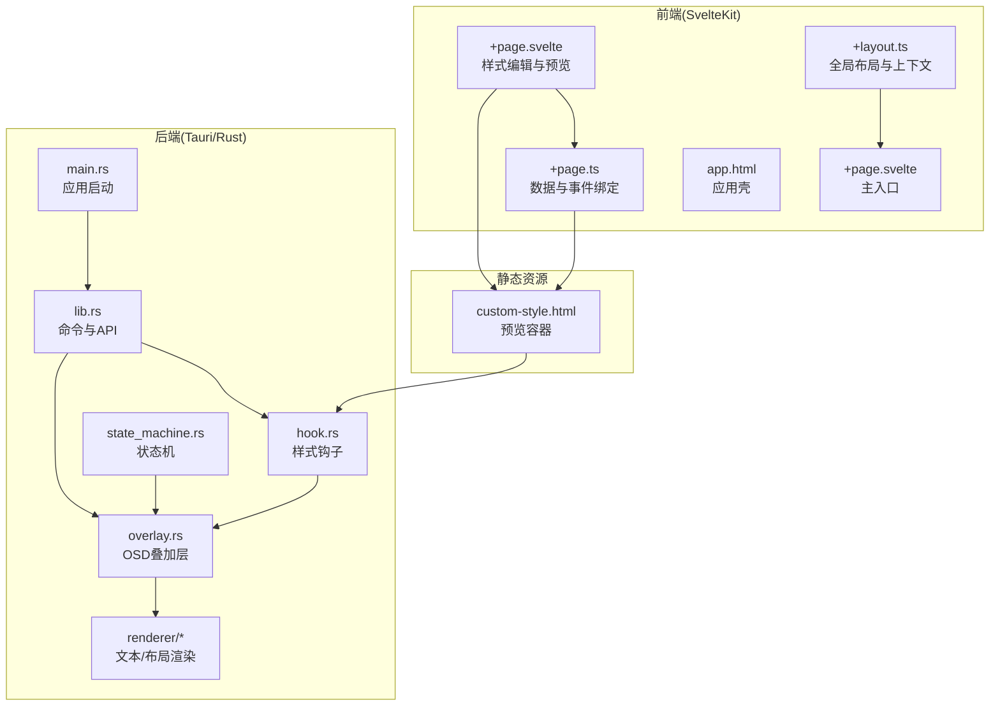
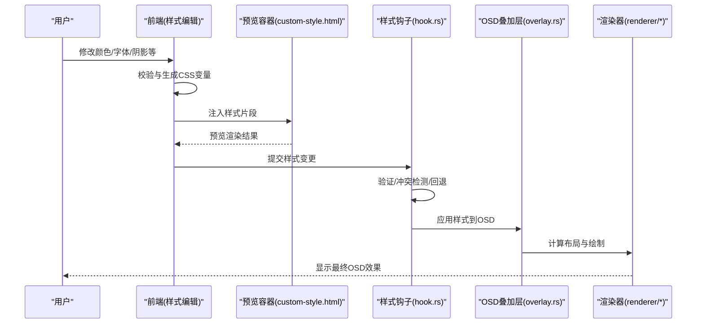
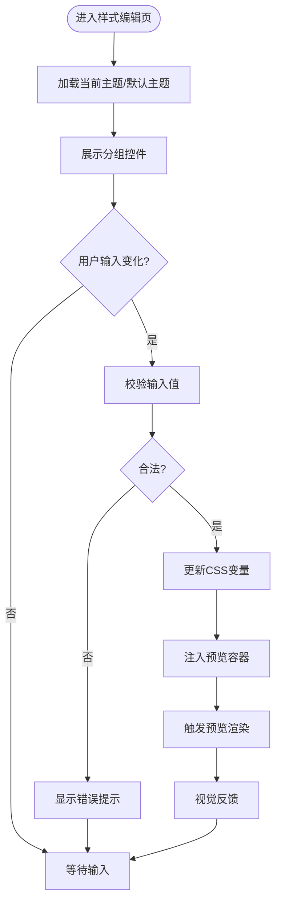
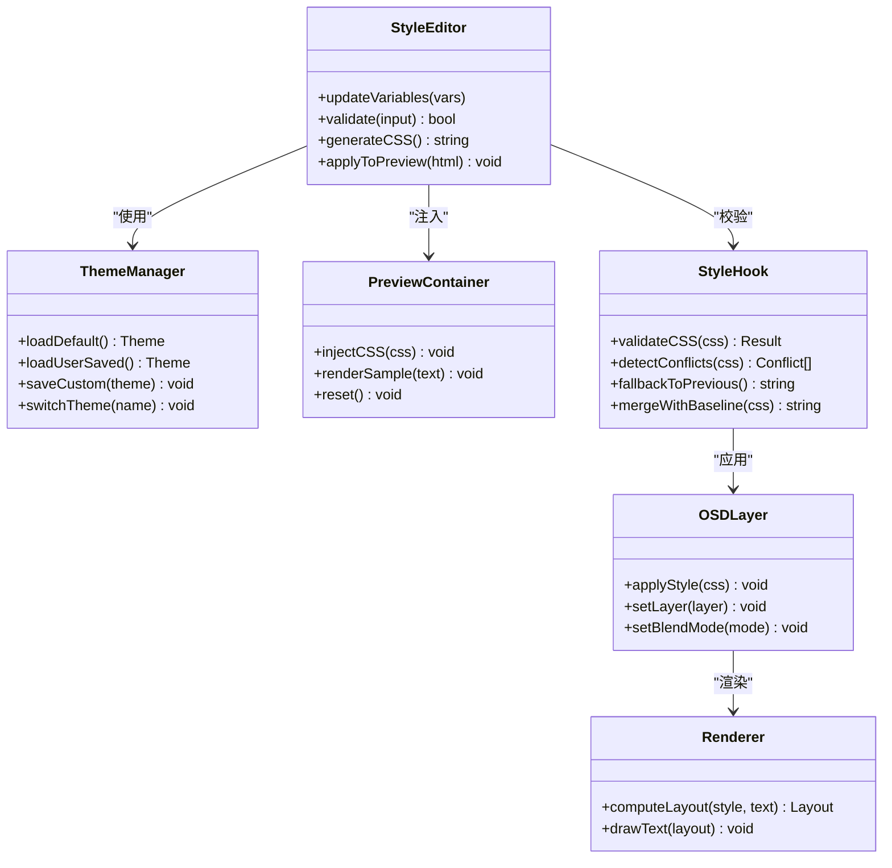
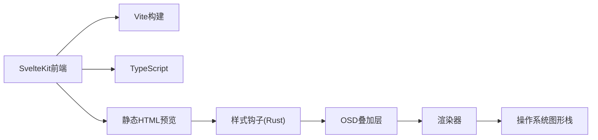

# 自定义样式组件

<cite>
**本文引用的文件**   
- [按键OSD可视化工具-交互规格说明书.md](file://按键OSD可视化工具-交互规格说明书.md)
- [按键OSD可视化工具-交互原型.html](file://按键OSD可视化工具-交互原型.html)
- [osd-bubble/README.md](file://osd-bubble/README.md)
- [osd-bubble/package.json](file://osd-bubble/package.json)
- [osd-bubble/svelte.config.js](file://osd-bubble/svelte.config.js)
- [osd-bubble/vite.config.js](file://osd-bubble/vite.config.js)
- [osd-bubble/tsconfig.json](file://osd-bubble/tsconfig.json)
- [osd-bubble/src/routes/custom-style/+page.svelte](file://osd-bubble/src/routes/custom-style/+page.svelte)
- [osd-bubble/src/routes/custom-style/+page.ts](file://osd-bubble/src/routes/custom-style/+page.ts)
- [osd-bubble/static/custom-style.html](file://osd-bubble/static/custom-style.html)
- [osd-bubble/src/routes/+layout.ts](file://osd-bubble/src/routes/+layout.ts)
- [osd-bubble/src/routes/+page.svelte](file://osd-bubble/src/routes/+page.svelte)
- [osd-bubble/src/app.html](file://osd-bubble/src/app.html)
- [osd-bubble/src-tauri/Cargo.toml](file://osd-bubble/src-tauri/Cargo.toml)
- [osd-bubble/src-tauri/tauri.conf.json](file://osd-bubble/src-tauri/tauri.conf.json)
- [osd-bubble/src-tauri/src/lib.rs](file://osd-bubble/src-tauri/src/lib.rs)
- [osd-bubble/src-tauri/src/main.rs](file://osd-bubble/src-tauri/src/main.rs)
- [osd-bubble/src-tauri/src/hook.rs](file://osd-bubble/src-tauri/src/hook.rs)
- [osd-bubble/src-tauri/src/overlay.rs](file://osd-bubble/src-tauri/src/overlay.rs)
- [osd-bubble/src-tauri/src/state_machine.rs](file://osd-bubble/src-tauri/src/state_machine.rs)
- [osd-bubble/src-tauri/src/renderer/mod.rs](file://osd-bubble/src-tauri/src/renderer/mod.rs)
- [osd-bubble/src-tauri/src/renderer/layout.rs](file://osd-bubble/src-tauri/src/renderer/layout.rs)
- [osd-bubble/src-tauri/src/renderer/text.rs](file://osd-bubble/src-tauri/src/renderer/text.rs)
</cite>

## 目录
1. [简介](#简介)
2. [项目结构](#项目结构)
3. [核心组件](#核心组件)
4. [架构总览](#架构总览)
5. [详细组件分析](#详细组件分析)
6. [依赖分析](#依赖分析)
7. [性能考虑](#性能考虑)
8. [故障排查指南](#故障排查指南)
9. [结论](#结论)
10. [附录](#附录)

## 简介
本文件面向“按键OSD可视化工具”的自定义样式组件，系统性说明样式配置界面、实时预览与样式应用机制。文档覆盖CSS变量管理、主题切换逻辑、动态样式注入、样式验证规则、冲突检测与回退机制、样式模板系统、预设主题管理与用户自定义样式的保存能力，并给出跨浏览器兼容性处理与样式性能优化策略。内容基于仓库中的前端路由页面、静态HTML模板以及Tauri后端渲染模块进行梳理，确保读者既能快速上手，也能深入理解实现细节。

## 项目结构
本项目采用SvelteKit作为前端框架，Tauri作为桌面端宿主，结合静态HTML模板承载样式预览与注入。关键目录与职责如下：
- 前端路由与页面：routes/custom-style 提供样式编辑与预览入口；根路由负责导航与布局。
- 静态资源：static/custom-style.html 作为样式预览与注入的容器。
- Tauri后端：src-tauri 包含Rust侧的窗口、渲染、状态机与钩子，用于将样式应用到OSD层。
- 构建与类型：svelte.config.js、vite.config.js、tsconfig.json 定义构建流程与类型检查。

图表来源
- [osd-bubble/src/routes/custom-style/+page.svelte](file://osd-bubble/src/routes/custom-style/+page.svelte)
- [osd-bubble/src/routes/custom-style/+page.ts](file://osd-bubble/src/routes/custom-style/+page.ts)
- [osd-bubble/static/custom-style.html](file://osd-bubble/static/custom-style.html)
- [osd-bubble/src-tauri/src/main.rs](file://osd-bubble/src-tauri/src/main.rs)
- [osd-bubble/src-tauri/src/lib.rs](file://osd-bubble/src-tauri/src/lib.rs)
- [osd-bubble/src-tauri/src/hook.rs](file://osd-bubble/src-tauri/src/hook.rs)
- [osd-bubble/src-tauri/src/overlay.rs](file://osd-bubble/src-tauri/src/overlay.rs)
- [osd-bubble/src-tauri/src/state_machine.rs](file://osd-bubble/src-tauri/src/state_machine.rs)
- [osd-bubble/src-tauri/src/renderer/mod.rs](file://osd-bubble/src-tauri/src/renderer/mod.rs)
- [osd-bubble/src-tauri/src/renderer/layout.rs](file://osd-bubble/src-tauri/src/renderer/layout.rs)
- [osd-bubble/src-tauri/src/renderer/text.rs](file://osd-bubble/src-tauri/src/renderer/text.rs)

章节来源
- [按键OSD可视化工具-交互规格说明书.md](file://按键OSD可视化工具-交互规格说明书.md)
- [按键OSD可视化工具-交互原型.html](file://按键OSD可视化工具-交互原型.html)
- [osd-bubble/README.md](file://osd-bubble/README.md)
- [osd-bubble/package.json](file://osd-bubble/package.json)
- [osd-bubble/svelte.config.js](file://osd-bubble/svelte.config.js)
- [osd-bubble/vite.config.js](file://osd-bubble/vite.config.js)
- [osd-bubble/tsconfig.json](file://osd-bubble/tsconfig.json)

## 核心组件
- 样式配置界面（+page.svelte）：提供颜色、字体、阴影、圆角、透明度等控件，支持分组与搜索过滤，实时校验输入合法性。
- 数据与事件绑定（+page.ts）：维护样式状态、预设主题列表、用户自定义主题存储、变更事件分发与撤销/重做栈。
- 预览容器（custom-style.html）：独立HTML沙箱，接收样式片段并通过CSS变量注入到预览DOM树中。
- 样式钩子（hook.rs）：监听前端样式变更，执行验证、冲突检测与回退策略，生成最终样式表。
- OSD叠加层（overlay.rs）：将样式应用到OSD渲染目标，支持层级、混合模式与裁剪区域。
- 渲染器（renderer/*）：根据样式与文本内容计算布局与绘制，保证多平台一致性。
- 状态机（state_machine.rs）：管理“编辑-预览-应用-回滚”的状态流转与持久化时机。

章节来源
- [osd-bubble/src/routes/custom-style/+page.svelte](file://osd-bubble/src/routes/custom-style/+page.svelte)
- [osd-bubble/src/routes/custom-style/+page.ts](file://osd-bubble/src/routes/custom-style/+page.ts)
- [osd-bubble/static/custom-style.html](file://osd-bubble/static/custom-style.html)
- [osd-bubble/src-tauri/src/hook.rs](file://osd-bubble/src-tauri/src/hook.rs)
- [osd-bubble/src-tauri/src/overlay.rs](file://osd-bubble/src-tauri/src/overlay.rs)
- [osd-bubble/src-tauri/src/renderer/mod.rs](file://osd-bubble/src-tauri/src/renderer/mod.rs)
- [osd-bubble/src-tauri/src/renderer/layout.rs](file://osd-bubble/src-tauri/src/renderer/layout.rs)
- [osd-bubble/src-tauri/src/renderer/text.rs](file://osd-bubble/src-tauri/src/renderer/text.rs)
- [osd-bubble/src-tauri/src/state_machine.rs](file://osd-bubble/src-tauri/src/state_machine.rs)

## 架构总览
整体架构分为三层：前端编辑与预览、静态沙箱注入、后端样式应用与渲染。前端通过Svelte组件收集用户输入，实时生成CSS变量与样式片段；静态HTML作为隔离环境进行安全预览；Tauri后端对样式进行校验与合并，最终注入到OSD层渲染。

图表来源
- [osd-bubble/src/routes/custom-style/+page.svelte](file://osd-bubble/src/routes/custom-style/+page.svelte)
- [osd-bubble/static/custom-style.html](file://osd-bubble/static/custom-style.html)
- [osd-bubble/src-tauri/src/hook.rs](file://osd-bubble/src-tauri/src/hook.rs)
- [osd-bubble/src-tauri/src/overlay.rs](file://osd-bubble/src-tauri/src/overlay.rs)
- [osd-bubble/src-tauri/src/renderer/layout.rs](file://osd-bubble/src-tauri/src/renderer/layout.rs)
- [osd-bubble/src-tauri/src/renderer/text.rs](file://osd-bubble/src-tauri/src/renderer/text.rs)

## 详细组件分析

### 样式配置界面（+page.svelte）
- 功能要点
  - 分组控件：基础外观（颜色、字体、字号）、高级（阴影、圆角、透明度、描边）。
  - 实时预览：通过事件驱动更新CSS变量，触发静态HTML重新渲染。
  - 输入校验：范围限制、单位校验、非法值拦截与提示。
  - 主题切换：内置预设主题一键切换，支持用户自定义主题保存与加载。
- 交互流程
  - 用户操作 → 状态更新 → 生成CSS变量 → 注入预览容器 → 渲染反馈。
- 可访问性
  - 键盘导航、ARIA标签、对比度提示。

图表来源
- [osd-bubble/src/routes/custom-style/+page.svelte](file://osd-bubble/src/routes/custom-style/+page.svelte)
- [osd-bubble/src/routes/custom-style/+page.ts](file://osd-bubble/src/routes/custom-style/+page.ts)

章节来源
- [osd-bubble/src/routes/custom-style/+page.svelte](file://osd-bubble/src/routes/custom-style/+page.svelte)
- [osd-bubble/src/routes/custom-style/+page.ts](file://osd-bubble/src/routes/custom-style/+page.ts)

### 数据与事件绑定（+page.ts）
- 状态模型
  - 样式对象：包含颜色、字体、阴影、圆角、透明度等字段。
  - 主题集合：预设主题与用户自定义主题。
  - 历史栈：撤销/重做支持。
- 事件总线
  - 变更事件：onStyleChange、onThemeSwitch、onSave、onLoad。
  - 校验回调：onValidate、onConflict、onFallback。
- 持久化
  - 本地存储：用户自定义主题保存到本地或云端（由配置决定）。

章节来源
- [osd-bubble/src/routes/custom-style/+page.ts](file://osd-bubble/src/routes/custom-style/+page.ts)

### 预览容器（custom-style.html）
- 作用
  - 提供隔离的HTML沙箱，避免样式污染主应用。
  - 接收CSS变量与样式片段，渲染OSD示例文本与背景。
- 注入机制
  - 通过脚本注入<style>块与CSS变量，使用document.documentElement.style.setProperty更新。
  - 支持热重载：监听消息通道，增量更新样式。

章节来源
- [osd-bubble/static/custom-style.html](file://osd-bubble/static/custom-style.html)

### 样式钩子（hook.rs）
- 职责
  - 接收前端提交的样式片段，执行语法与语义校验。
  - 冲突检测：识别与系统默认样式冲突的属性，自动调整或提示。
  - 回退机制：当校验失败时，回退到上一有效版本或默认主题。
  - 生成最终样式表：合并用户样式与系统基线，输出稳定CSS。
- 错误处理
  - 捕获解析异常、属性不兼容、值越界等问题，返回结构化错误信息。

章节来源
- [osd-bubble/src-tauri/src/hook.rs](file://osd-bubble/src-tauri/src/hook.rs)

### OSD叠加层（overlay.rs）
- 职责
  - 将样式应用到OSD渲染目标，控制层级、混合模式、裁剪区域。
  - 与渲染器协作，确保样式在不同平台一致呈现。
- 性能优化
  - 按需重绘、批处理更新、减少重排重绘。

章节来源
- [osd-bubble/src-tauri/src/overlay.rs](file://osd-bubble/src-tauri/src/overlay.rs)

### 渲染器（renderer/*）
- layout.rs：计算文本与背景的布局，支持对齐、换行、溢出处理。
- text.rs：文本绘制，包括字体、字号、颜色、阴影、描边。
- mod.rs：统一接口，协调布局与文本渲染。

章节来源
- [osd-bubble/src-tauri/src/renderer/layout.rs](file://osd-bubble/src-tauri/src/renderer/layout.rs)
- [osd-bubble/src-tauri/src/renderer/text.rs](file://osd-bubble/src-tauri/src/renderer/text.rs)
- [osd-bubble/src-tauri/src/renderer/mod.rs](file://osd-bubble/src-tauri/src/renderer/mod.rs)

### 状态机（state_machine.rs）
- 状态
  - 编辑中、预览中、已应用、已回滚。
- 转换
  - 编辑→预览：生成样式并注入预览容器。
  - 预览→应用：提交样式到OSD层。
  - 应用→回滚：恢复上一版本或默认主题。

章节来源
- [osd-bubble/src-tauri/src/state_machine.rs](file://osd-bubble/src-tauri/src/state_machine.rs)

### 类关系图（面向对象组件）

图表来源
- [osd-bubble/src/routes/custom-style/+page.svelte](file://osd-bubble/src/routes/custom-style/+page.svelte)
- [osd-bubble/src/routes/custom-style/+page.ts](file://osd-bubble/src/routes/custom-style/+page.ts)
- [osd-bubble/static/custom-style.html](file://osd-bubble/static/custom-style.html)
- [osd-bubble/src-tauri/src/hook.rs](file://osd-bubble/src-tauri/src/hook.rs)
- [osd-bubble/src-tauri/src/overlay.rs](file://osd-bubble/src-tauri/src/overlay.rs)
- [osd-bubble/src-tauri/src/renderer/layout.rs](file://osd-bubble/src-tauri/src/renderer/layout.rs)
- [osd-bubble/src-tauri/src/renderer/text.rs](file://osd-bubble/src-tauri/src/renderer/text.rs)

## 依赖分析
- 前端依赖
  - SvelteKit路由与组件模型。
  - Vite构建与开发服务器。
  - TypeScript类型检查。
- 后端依赖
  - Tauri框架与Rust生态。
  - 渲染库（文本与布局）。
- 外部集成
  - 本地存储或云存储（用户主题持久化）。
  - 跨平台渲染一致性（Windows/macOS/Linux）。

图表来源
- [osd-bubble/package.json](file://osd-bubble/package.json)
- [osd-bubble/svelte.config.js](file://osd-bubble/svelte.config.js)
- [osd-bubble/vite.config.js](file://osd-bubble/vite.config.js)
- [osd-bubble/tsconfig.json](file://osd-bubble/tsconfig.json)
- [osd-bubble/src-tauri/Cargo.toml](file://osd-bubble/src-tauri/Cargo.toml)
- [osd-bubble/src-tauri/tauri.conf.json](file://osd-bubble/src-tauri/tauri.conf.json)

章节来源
- [osd-bubble/package.json](file://osd-bubble/package.json)
- [osd-bubble/svelte.config.js](file://osd-bubble/svelte.config.js)
- [osd-bubble/vite.config.js](file://osd-bubble/vite.config.js)
- [osd-bubble/tsconfig.json](file://osd-bubble/tsconfig.json)
- [osd-bubble/src-tauri/Cargo.toml](file://osd-bubble/src-tauri/Cargo.toml)
- [osd-bubble/src-tauri/tauri.conf.json](file://osd-bubble/src-tauri/tauri.conf.json)

## 性能考虑
- 样式注入优化
  - 增量更新CSS变量，避免全量替换。
  - 使用requestAnimationFrame批量更新预览。
- 渲染性能
  - 仅重绘受影响的文本与背景区域。
  - 缓存布局结果，避免重复计算。
- 内存管理
  - 及时释放不再使用的样式片段与中间对象。
- 跨浏览器兼容
  - 特性检测与降级策略，确保在主流浏览器与系统上表现一致。

[本节为通用指导，不直接分析具体文件]

## 故障排查指南
- 常见问题
  - 样式未生效：检查CSS变量是否正确注入，预览容器是否被遮挡。
  - 冲突导致异常：查看钩子的冲突检测结果，启用回退机制。
  - 预览卡顿：减少高频更新，合并样式变更批次。
- 调试建议
  - 打开开发者工具，观察样式注入与渲染日志。
  - 使用状态机日志追踪“编辑-预览-应用-回滚”流程。
  - 逐步禁用复杂样式（如阴影、描边）定位问题。

章节来源
- [osd-bubble/src-tauri/src/hook.rs](file://osd-bubble/src-tauri/src/hook.rs)
- [osd-bubble/src-tauri/src/state_machine.rs](file://osd-bubble/src-tauri/src/state_machine.rs)

## 结论
自定义样式组件通过前端编辑、静态预览与后端应用三层架构，实现了高效、安全的样式定制体验。CSS变量管理、主题切换与动态注入技术确保了实时性与稳定性；样式验证、冲突检测与回退机制提升了健壮性；模板系统与预设主题管理简化了用户操作；跨浏览器兼容与性能优化保障了广泛适用性。建议持续完善用户自定义主题的持久化与分享能力，进一步提升用户体验。

[本节为总结，不直接分析具体文件]

## 附录
- 术语表
  - CSS变量：通过var(--name)定义的样式变量，便于动态更新。
  - 样式钩子：在后端对样式进行校验、合并与应用的中间件。
  - OSD叠加层：将样式应用到屏幕叠加层的组件。
- 参考文件
  - 交互规格与原型：用于理解需求与设计意图。
  - 构建配置：了解前端与后端的构建与运行方式。

[本节为补充信息，不直接分析具体文件]