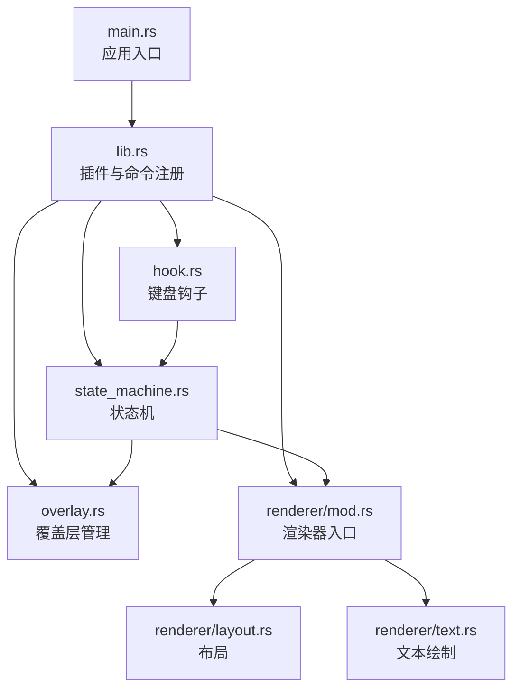
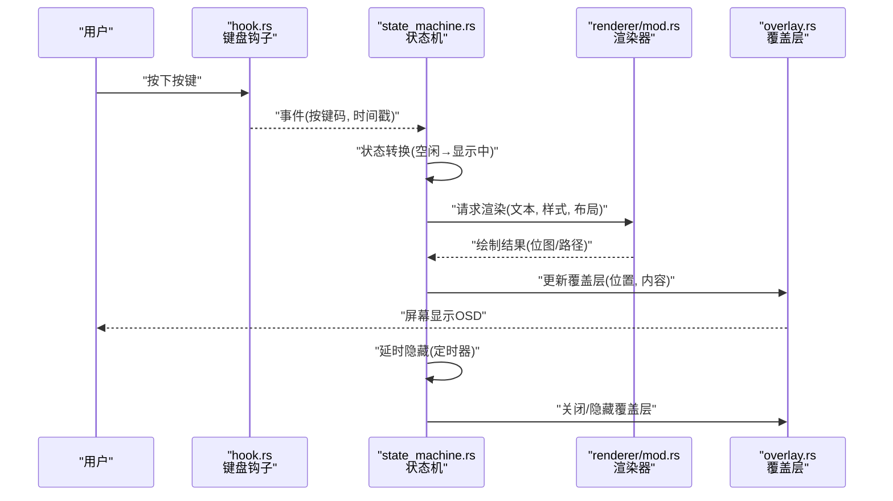
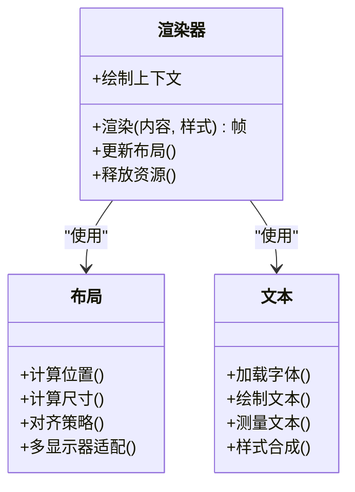
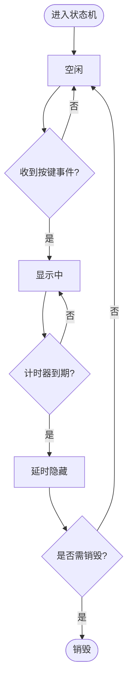
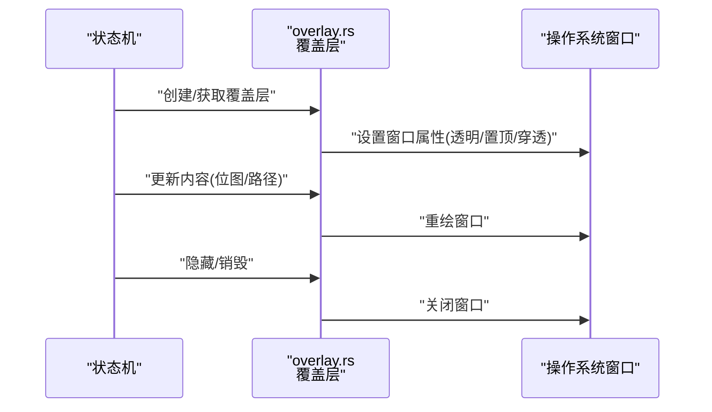
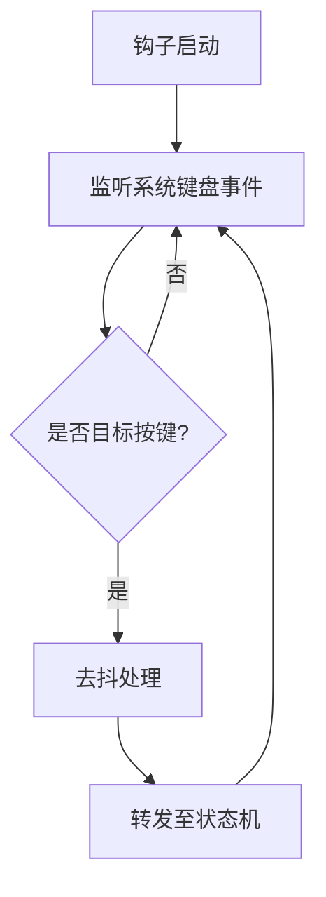
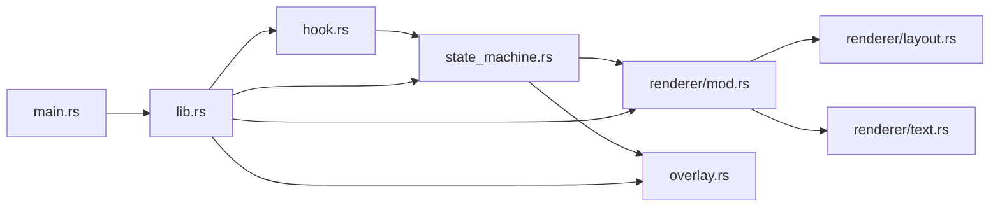

# 后端模块

<cite>
**本文引用的文件**   
- [lib.rs](file://osd-bubble/src-tauri/src/lib.rs)
- [main.rs](file://osd-bubble/src-tauri/src/main.rs)
- [hook.rs](file://osd-bubble/src-tauri/src/hook.rs)
- [overlay.rs](file://osd-bubble/src-tauri/src/overlay.rs)
- [state_machine.rs](file://osd-bubble/src-tauri/src/state_machine.rs)
- [renderer/mod.rs](file://osd-bubble/src-tauri/src/renderer/mod.rs)
- [renderer/layout.rs](file://osd-bubble/src-tauri/src/renderer/layout.rs)
- [renderer/text.rs](file://osd-bubble/src-tauri/src/renderer/text.rs)
- [Cargo.toml](file://osd-bubble/src-tauri/Cargo.toml)
- [tauri.conf.json](file://osd-bubble/src-tauri/tauri.conf.json)
</cite>

## 目录
1. [简介](#简介)
2. [项目结构](#项目结构)
3. [核心组件](#核心组件)
4. [架构总览](#架构总览)
5. [详细组件分析](#详细组件分析)
6. [依赖关系分析](#依赖关系分析)
7. [性能考量](#性能考量)
8. [故障排查指南](#故障排查指南)
9. [结论](#结论)
10. [附录](#附录)

## 简介
本文件面向按键OSD可视化工具的后端模块（Rust/Tauri），系统性阐述渲染器、状态机与覆盖层管理等核心功能的实现细节、调用关系、接口契约、领域模型与使用模式。文档兼顾初学者友好性与资深开发者的技术深度，提供架构图、时序图与流程图，并给出配置项、参数与返回值的说明，以及常见问题与解决方案。

## 项目结构
后端代码位于 osd-bubble/src-tauri/src 目录下，采用 Tauri 作为宿主框架，Rust 编写核心逻辑：
- main.rs：Tauri 应用入口，初始化插件与命令通道
- lib.rs：导出 Tauri 插件能力与命令注册
- hook.rs：系统级输入钩子（键盘事件）捕获与转发
- overlay.rs：窗口覆盖层管理（全屏透明窗口、置顶、穿透等）
- state_machine.rs：OSD 显示状态机（触发、显示、延时隐藏、清理）
- renderer/mod.rs：渲染器模块组织与对外接口
- renderer/layout.rs：布局计算（位置、尺寸、对齐）
- renderer/text.rs：文本绘制（字体、字号、颜色、描边、阴影）

图表来源 
- [main.rs](file://osd-bubble/src-tauri/src/main.rs)
- [lib.rs](file://osd-bubble/src-tauri/src/lib.rs)
- [hook.rs](file://osd-bubble/src-tauri/src/hook.rs)
- [overlay.rs](file://osd-bubble/src-tauri/src/overlay.rs)
- [state_machine.rs](file://osd-bubble/src-tauri/src/state_machine.rs)
- [renderer/mod.rs](file://osd-bubble/src-tauri/src/renderer/mod.rs)
- [renderer/layout.rs](file://osd-bubble/src-tauri/src/renderer/layout.rs)
- [renderer/text.rs](file://osd-bubble/src-tauri/src/renderer/text.rs)

章节来源
- [main.rs](file://osd-bubble/src-tauri/src/main.rs)
- [lib.rs](file://osd-bubble/src-tauri/src/lib.rs)
- [Cargo.toml](file://osd-bubble/src-tauri/Cargo.toml)
- [tauri.conf.json](file://osd-bubble/src-tauri/tauri.conf.json)

## 核心组件
- 渲染器模块（renderer）
  - 职责：将 OSD 内容（文本、样式、布局）转换为可绘制帧，输出到覆盖层
  - 关键能力：布局计算、文本绘制、样式合成、增量更新
- 状态机（state_machine）
  - 职责：管理 OSD 生命周期（空闲、触发、显示中、延时隐藏、销毁）
  - 关键能力：事件驱动的状态转换、定时器控制、资源清理
- 覆盖层（overlay）
  - 职责：创建并维护一个始终置顶、透明、可点击穿透的窗口
  - 关键能力：窗口属性设置、坐标定位、重绘调度、多显示器适配
- 输入钩子（hook）
  - 职责：捕获系统级键盘事件，过滤并转发给状态机
  - 关键能力：全局热键监听、事件去抖、跨平台兼容

章节来源
- [renderer/mod.rs](file://osd-bubble/src-tauri/src/renderer/mod.rs)
- [renderer/layout.rs](file://osd-bubble/src-tauri/src/renderer/layout.rs)
- [renderer/text.rs](file://osd-bubble/src-tauri/src/renderer/text.rs)
- [state_machine.rs](file://osd-bubble/src-tauri/src/state_machine.rs)
- [overlay.rs](file://osd-bbubble/src-tauri/src/overlay.rs)
- [hook.rs](file://osd-bubble/src-tauri/src/hook.rs)

## 架构总览
整体数据流遵循“输入钩子 → 状态机 → 渲染器 → 覆盖层”的单向管道，确保低耦合与高内聚。

图表来源 
- [hook.rs](file://osd-bubble/src-tauri/src/hook.rs)
- [state_machine.rs](file://osd-bubble/src-tauri/src/state_machine.rs)
- [renderer/mod.rs](file://osd-bubble/src-tauri/src/renderer/mod.rs)
- [overlay.rs](file://osd-bubble/src-tauri/src/overlay.rs)

## 详细组件分析

### 渲染器模块（renderer）
- 模块入口（mod.rs）
  - 定义渲染上下文、绘制管线与对外 API
  - 协调布局与文本绘制，生成最终帧
- 布局（layout.rs）
  - 计算 OSD 在屏幕上的位置、尺寸与对齐方式
  - 支持多显示器边界检测与自适应缩放
- 文本（text.rs）
  - 负责字体加载、字号设置、颜色与描边、阴影效果
  - 文本换行、截断与测量

图表来源 
- [renderer/mod.rs](file://osd-bubble/src-tauri/src/renderer/mod.rs)
- [renderer/layout.rs](file://osd-bubble/src-tauri/src/renderer/layout.rs)
- [renderer/text.rs](file://osd-bubble/src-tauri/src/renderer/text.rs)

章节来源
- [renderer/mod.rs](file://osd-bubble/src-tauri/src/renderer/mod.rs)
- [renderer/layout.rs](file://osd-bubble/src-tauri/src/renderer/layout.rs)
- [renderer/text.rs](file://osd-bubble/src-tauri/src/renderer/text.rs)

### 状态机（state_machine）
- 状态定义：空闲、触发、显示中、延时隐藏、销毁
- 事件驱动：按键事件、定时器到期、窗口消息
- 资源管理：在显示中分配渲染资源，在销毁阶段释放

图表来源 
- [state_machine.rs](file://osd-bubble/src-tauri/src/state_machine.rs)

章节来源
- [state_machine.rs](file://osd-bubble/src-tauri/src/state_machine.rs)

### 覆盖层（overlay）
- 窗口属性：透明背景、置顶、点击穿透、无边框
- 定位策略：基于屏幕分辨率与 DPI 适配
- 重绘机制：仅在内容变化时触发，减少 GPU 压力

图表来源 
- [overlay.rs](file://osd-bubble/src-tauri/src/overlay.rs)

章节来源
- [overlay.rs](file://osd-bubble/src-tauri/src/overlay.rs)

### 输入钩子（hook）
- 全局键盘事件监听，过滤无关按键
- 事件去抖与防误触
- 跨平台兼容性处理

图表来源 
- [hook.rs](file://osd-bubble/src-tauri/src/hook.rs)

章节来源
- [hook.rs](file://osd-bubble/src-tauri/src/hook.rs)

## 依赖关系分析
- 模块耦合
  - 渲染器依赖布局与文本模块，低耦合设计便于扩展新样式
  - 状态机依赖钩子与覆盖层，通过事件解耦
  - 覆盖层依赖操作系统窗口 API，封装平台差异
- 外部依赖
  - Tauri 框架用于命令注册与进程间通信
  - 系统级钩子库用于键盘事件捕获
  - 图形库用于文本与路径绘制

图表来源 
- [main.rs](file://osd-bubble/src-tauri/src/main.rs)
- [lib.rs](file://osd-bubble/src-tauri/src/lib.rs)
- [hook.rs](file://osd-bubble/src-tauri/src/hook.rs)
- [state_machine.rs](file://osd-bubble/src-tauri/src/state_machine.rs)
- [overlay.rs](file://osd-bubble/src-tauri/src/overlay.rs)
- [renderer/mod.rs](file://osd-bubble/src-tauri/src/renderer/mod.rs)
- [renderer/layout.rs](file://osd-bubble/src-tauri/src/renderer/layout.rs)
- [renderer/text.rs](file://osd-bubble/src-tauri/src/renderer/text.rs)

章节来源
- [Cargo.toml](file://osd-bubble/src-tauri/Cargo.toml)
- [tauri.conf.json](file://osd-bubble/src-tauri/tauri.conf.json)

## 性能考量
- 渲染优化
  - 增量更新：仅重绘变化区域
  - 文本缓存：常用字符与样式预渲染
  - 布局缓存：避免重复计算
- 内存管理
  - 及时释放位图与字体资源
  - 避免长时间持有大对象引用
- 事件处理
  - 钩子去抖降低无效触发
  - 状态机批量处理事件，减少状态抖动

[本节为通用指导，不直接分析具体文件]

## 故障排查指南
- 常见问题
  - OSD 不显示：检查覆盖层窗口是否成功创建与置顶
  - 文本模糊：确认 DPI 设置与字体缩放比例
  - 按键无响应：验证钩子权限与事件过滤逻辑
  - 内存泄漏：检查状态销毁时资源释放
- 调试建议
  - 启用日志记录关键状态转换与渲染事件
  - 使用系统工具监控窗口与 GPU 使用情况
  - 单元测试覆盖状态机与渲染器核心路径

章节来源
- [state_machine.rs](file://osd-bubble/src-tauri/src/state_machine.rs)
- [overlay.rs](file://osd-bubble/src-tauri/src/overlay.rs)
- [hook.rs](file://osd-bubble/src-tauri/src/hook.rs)
- [renderer/mod.rs](file://osd-bubble/src-tauri/src/renderer/mod.rs)

## 结论
本后端模块通过清晰的模块划分与事件驱动架构，实现了高效的按键 OSD 可视化功能。渲染器、状态机与覆盖层的解耦设计确保了可扩展性与可维护性。遵循本文档的配置与最佳实践，开发者可快速集成与定制 OSD 行为。

[本节为总结，不直接分析具体文件]

## 附录
- 配置选项
  - 显示时长：控制 OSD 停留时间
  - 位置策略：顶部居中、底部居中或自定义坐标
  - 样式配置：字体、字号、颜色、描边、阴影
  - 钩子过滤：允许/禁止特定按键组合
- 接口契约
  - 渲染器：输入内容、样式；输出帧数据
  - 状态机：输入事件；输出状态与动作
  - 覆盖层：输入绘制指令；输出窗口更新
- 使用模式
  - 初始化：注册命令、启动钩子、创建覆盖层
  - 运行：监听事件、状态转换、渲染更新
  - 退出：清理资源、关闭窗口、注销钩子

[本节为补充信息，不直接分析具体文件]