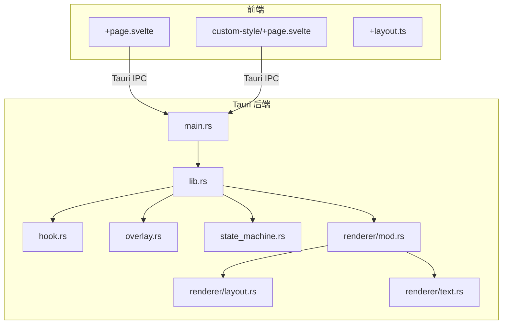
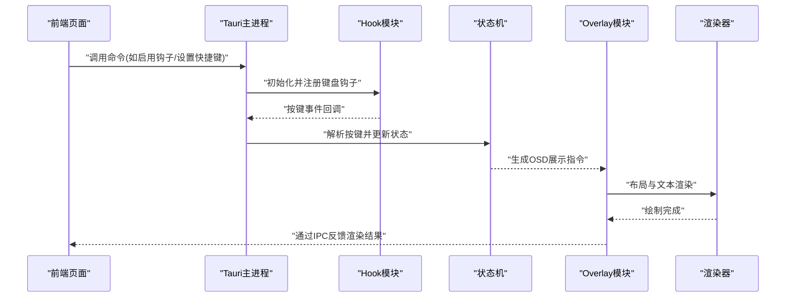
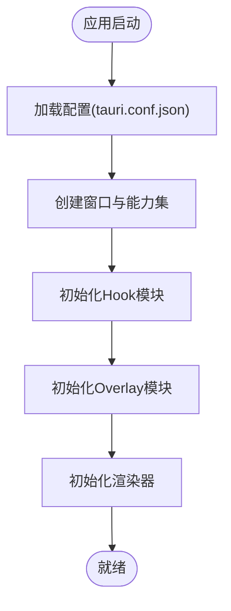
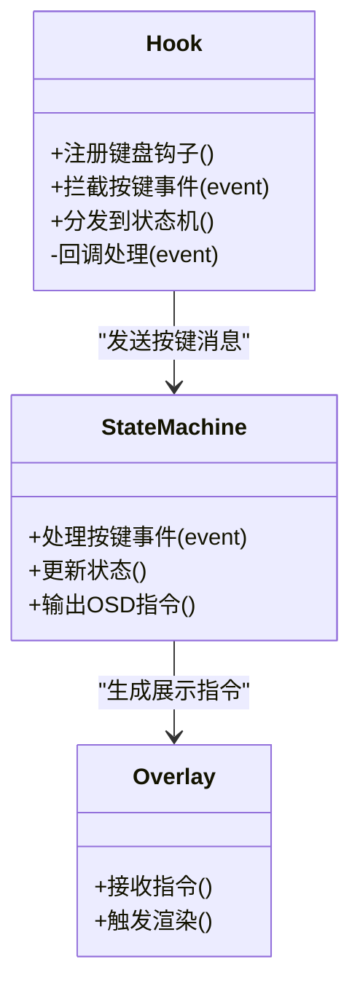
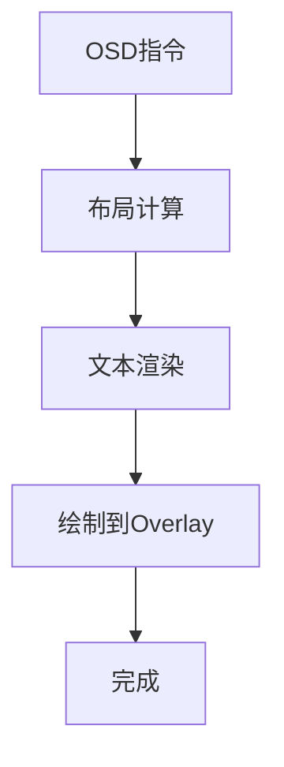
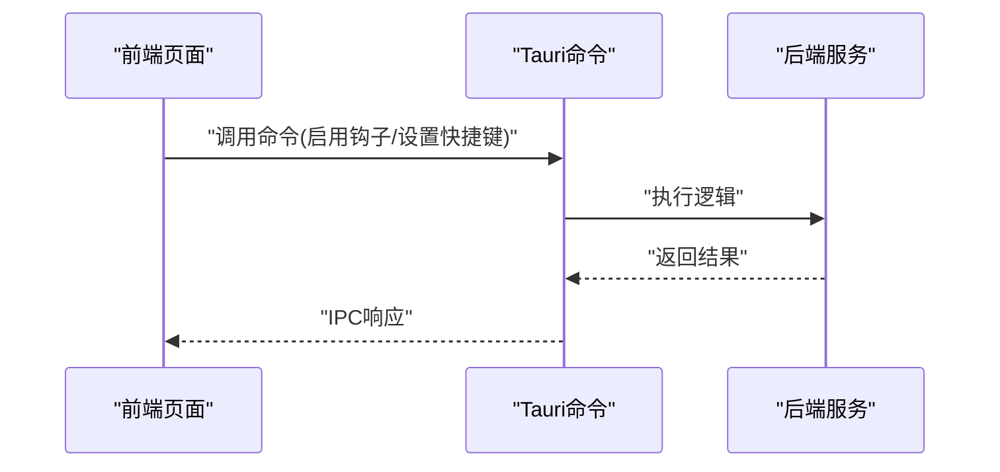
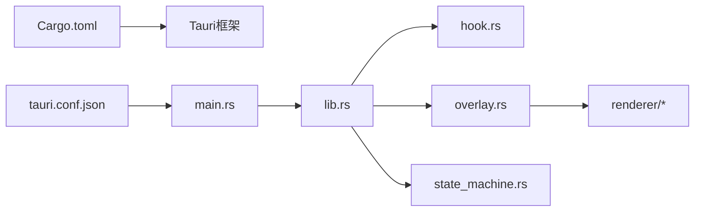

# 核心模块

<cite>
**本文引用的文件**   
- [按键OSD可视化工具-交互规格说明书.md](file://按键OSD可视化工具-交互规格说明书.md)
- [按键OSD可视化工具-交互原型.html](file://按键OSD可视化工具-交互原型.html)
- [osd-bubble/src-tauri/Cargo.toml](file://osd-bubble/src-tauri/Cargo.toml)
- [osd-bubble/src-tauri/tauri.conf.json](file://osd-bubble/src-tauri/tauri.conf.json)
- [osd-bubble/src-tauri/build.rs](file://osd-bubble/src-tauri/build.rs)
- [osd-bubble/src-tauri/src/main.rs](file://osd-bubble/src-tauri/src/main.rs)
- [osd-bubble/src-tauri/src/lib.rs](file://osd-bubble/src-tauri/src/lib.rs)
- [osd-bubble/src-tauri/src/hook.rs](file://osd-bubble/src-tauri/src/hook.rs)
- [osd-bubble/src-tauri/src/overlay.rs](file://osd-bubble/src-tauri/src/overlay.rs)
- [osd-bubble/src-tauri/src/state_machine.rs](file://osd-bubble/src-tauri/src/state_machine.rs)
- [osd-bubble/src-tauri/src/renderer/mod.rs](file://osd-bubble/src-tauri/src/renderer/mod.rs)
- [osd-bubble/src-tauri/src/renderer/layout.rs](file://osd-bubble/src-tauri/src/renderer/layout.rs)
- [osd-bubble/src-tauri/src/renderer/text.rs](file://osd-bubble/src-tauri/src/renderer/text.rs)
- [osd-bubble/src/routes/+page.svelte](file://osd-bubble/src/routes/+page.svelte)
- [osd-bubble/src/routes/custom-style/+page.svelte](file://osd-bubble/src/routes/custom-style/+page.svelte)
- [osd-bubble/src/routes/custom-style/+page.ts](file://osd-bubble/src/routes/custom-style/+page.ts)
- [osd-bubble/src/routes/+layout.ts](file://osd-bubble/src/routes/+layout.ts)
</cite>

## 目录
1. [简介](#简介)
2. [项目结构](#项目结构)
3. [核心组件](#核心组件)
4. [架构总览](#架构总览)
5. [详细组件分析](#详细组件分析)
6. [依赖关系分析](#依赖关系分析)
7. [性能考虑](#性能考虑)
8. [故障排查指南](#故障排查指南)
9. [结论](#结论)
10. [附录](#附录)

## 简介
本文件面向“按键OSD可视化工具”的核心模块，聚焦以下目标：
- 应用程序启动流程、模块初始化与全局配置管理
- Hook模块的键盘事件监听机制与消息拦截原理
- Rust侧关键API、配置项与扩展机制
- 与Tauri框架的集成方式及进程间通信（IPC）
- 应用启动优化建议与常见初始化问题解决方案

该工具通过Rust后端实现系统级键盘钩子与OSD渲染，前端基于Svelte+Tauri构建UI与样式定制页面。整体采用前后端分离、命令驱动的事件处理模式，确保低延迟与高可扩展性。

## 项目结构
仓库包含前端工程与Tauri后端工程两部分：
- 前端：SvelteKit路由与页面，提供样式定制与交互入口
- 后端：Tauri应用，包含主进程、Hook模块、Overlay渲染、状态机与渲染器

图表来源
- [osd-bubble/src-tauri/src/main.rs](file://osd-bubble/src-tauri/src/main.rs)
- [osd-bubble/src-tauri/src/lib.rs](file://osd-bubble/src-tauri/src/lib.rs)
- [osd-bubble/src-tauri/src/hook.rs](file://osd-bubble/src-tauri/src/hook.rs)
- [osd-bubble/src-tauri/src/overlay.rs](file://osd-bubble/src-tauri/src/overlay.rs)
- [osd-bubble/src-tauri/src/state_machine.rs](file://osd-bubble/src-tauri/src/state_machine.rs)
- [osd-bubble/src-tauri/src/renderer/mod.rs](file://osd-bubble/src-tauri/src/renderer/mod.rs)
- [osd-bubble/src-tauri/src/renderer/layout.rs](file://osd-bubble/src-tauri/src/renderer/layout.rs)
- [osd-bubble/src-tauri/src/renderer/text.rs](file://osd-bubble/src-tauri/src/renderer/text.rs)
- [osd-bubble/src/routes/+page.svelte](file://osd-bubble/src/routes/+page.svelte)
- [osd-bubble/src/routes/custom-style/+page.svelte](file://osd-bubble/src/routes/custom-style/+page.svelte)
- [osd-bubble/src/routes/+layout.ts](file://osd-bubble/src/routes/+layout.ts)

章节来源
- [按键OSD可视化工具-交互规格说明书.md](file://按键OSD可视化工具-交互规格说明书.md)
- [按键OSD可视化工具-交互原型.html](file://按键OSD可视化工具-交互原型.html)
- [osd-bubble/src-tauri/Cargo.toml](file://osd-bubble/src-tauri/Cargo.toml)
- [osd-bubble/src-tauri/tauri.conf.json](file://osd-bubble/src-tauri/tauri.conf.json)

## 核心组件
- 主进程与Tauri初始化：负责窗口创建、能力权限加载、插件注册与生命周期管理
- Hook模块：系统级键盘事件监听与消息拦截，将按键事件转换为内部消息
- Overlay模块：无焦点覆盖层渲染，用于显示OSD内容
- 状态机：定义按键到OSD展示的状态转换规则
- 渲染器：布局与文本渲染，支持自定义样式与主题
- 前端页面：SvelteKit页面与Tauri IPC调用，触发后端行为并接收渲染结果

章节来源
- [osd-bubble/src-tauri/src/main.rs](file://osd-bubble/src-tauri/src/main.rs)
- [osd-bubble/src-tauri/src/lib.rs](file://osd-bubble/src-tauri/src/lib.rs)
- [osd-bubble/src-tauri/src/hook.rs](file://osd-bubble/src-tauri/src/hook.rs)
- [osd-bubble/src-tauri/src/overlay.rs](file://osd-bubble/src-tauri/src/overlay.rs)
- [osd-bubble/src-tauri/src/state_machine.rs](file://osd-bubble/src-tauri/src/state_machine.rs)
- [osd-bubble/src-tauri/src/renderer/mod.rs](file://osd-bubble/src-tauri/src/renderer/mod.rs)
- [osd-bubble/src-tauri/src/renderer/layout.rs](file://osd-bubble/src-tauri/src/renderer/layout.rs)
- [osd-bubble/src-tauri/src/renderer/text.rs](file://osd-bubble/src-tauri/src/renderer/text.rs)

## 架构总览
下图展示了从前端触发到后端Hook捕获、状态机处理、Overlay渲染的完整流程。

图表来源
- [osd-bubble/src-tauri/src/main.rs](file://osd-bubble/src-tauri/src/main.rs)
- [osd-bubble/src-tauri/src/hook.rs](file://osd-bubble/src-tauri/src/hook.rs)
- [osd-bubble/src-tauri/src/state_machine.rs](file://osd-bubble/src-tauri/src/state_machine.rs)
- [osd-bubble/src-tauri/src/overlay.rs](file://osd-bubble/src-tauri/src/overlay.rs)
- [osd-bubble/src-tauri/src/renderer/mod.rs](file://osd-bubble/src-tauri/src/renderer/mod.rs)

## 详细组件分析

### 启动流程与全局配置管理
- 启动入口：Tauri主进程加载配置、初始化窗口与能力集，注册命令与插件
- 配置管理：集中读取JSON配置，映射为全局配置对象，供各模块使用
- 模块初始化顺序：先Hook再Overlay，最后渲染器；状态机在Hook回调中按需更新

图表来源
- [osd-bubble/src-tauri/tauri.conf.json](file://osd-bubble/src-tauri/tauri.conf.json)
- [osd-bubble/src-tauri/src/main.rs](file://osd-bubble/src-tauri/src/main.rs)
- [osd-bubble/src-tauri/src/lib.rs](file://osd-bubble/src-tauri/src/lib.rs)

章节来源
- [osd-bubble/src-tauri/tauri.conf.json](file://osd-bubble/src-tauri/tauri.conf.json)
- [osd-bubble/src-tauri/src/main.rs](file://osd-bubble/src-tauri/src/main.rs)
- [osd-bubble/src-tauri/src/lib.rs](file://osd-bubble/src-tauri/src/lib.rs)

### Hook模块：键盘事件监听与消息拦截
- 事件监听：注册系统级键盘钩子，捕获按键按下/释放事件
- 消息拦截：过滤或转发特定组合键，避免被其他应用消费
- 事件分发：将原始事件转换为内部消息，交由状态机处理

图表来源
- [osd-bubble/src-tauri/src/hook.rs](file://osd-bubble/src-tauri/src/hook.rs)
- [osd-bubble/src-tauri/src/state_machine.rs](file://osd-bubble/src-tauri/src/state_machine.rs)
- [osd-bubble/src-tauri/src/overlay.rs](file://osd-bubble/src-tauri/src/overlay.rs)

章节来源
- [osd-bubble/src-tauri/src/hook.rs](file://osd-bubble/src-tauri/src/hook.rs)
- [osd-bubble/src-tauri/src/state_machine.rs](file://osd-bubble/src-tauri/src/state_machine.rs)

### Overlay与渲染器：布局与文本渲染
- Overlay：创建无焦点覆盖窗口，承载OSD内容
- 渲染器：根据布局与文本数据生成绘制指令，支持主题与样式
- 自定义样式：前端可通过样式页面动态调整渲染参数

图表来源
- [osd-bubble/src-tauri/src/overlay.rs](file://osd-bubble/src-tauri/src/overlay.rs)
- [osd-bubble/src-tauri/src/renderer/mod.rs](file://osd-bubble/src-tauri/src/renderer/mod.rs)
- [osd-bubble/src-tauri/src/renderer/layout.rs](file://osd-bubble/src-tauri/src/renderer/layout.rs)
- [osd-bubble/src-tauri/src/renderer/text.rs](file://osd-bubble/src-tauri/src/renderer/text.rs)

章节来源
- [osd-bubble/src-tauri/src/overlay.rs](file://osd-bubble/src-tauri/src/overlay.rs)
- [osd-bubble/src-tauri/src/renderer/mod.rs](file://osd-bubble/src-tauri/src/renderer/mod.rs)
- [osd-bubble/src-tauri/src/renderer/layout.rs](file://osd-bubble/src-tauri/src/renderer/layout.rs)
- [osd-bubble/src-tauri/src/renderer/text.rs](file://osd-bubble/src-tauri/src/renderer/text.rs)

### 前端与Tauri IPC集成
- 前端页面通过Tauri命令调用后端功能（如启用/禁用钩子、设置快捷键）
- 后端通过IPC返回渲染结果或状态变更通知
- 样式定制页面可动态修改渲染参数

图表来源
- [osd-bubble/src/routes/+page.svelte](file://osd-bubble/src/routes/+page.svelte)
- [osd-bubble/src/routes/custom-style/+page.svelte](file://osd-bubble/src/routes/custom-style/+page.svelte)
- [osd-bubble/src/routes/custom-style/+page.ts](file://osd-bubble/src/routes/custom-style/+page.ts)
- [osd-bubble/src/routes/+layout.ts](file://osd-bubble/src/routes/+layout.ts)

章节来源
- [osd-bubble/src/routes/+page.svelte](file://osd-bubble/src/routes/+page.svelte)
- [osd-bubble/src/routes/custom-style/+page.svelte](file://osd-bubble/src/routes/custom-style/+page.svelte)
- [osd-bubble/src/routes/custom-style/+page.ts](file://osd-bubble/src/routes/custom-style/+page.ts)
- [osd-bubble/src/routes/+layout.ts](file://osd-bubble/src/routes/+layout.ts)

## 依赖关系分析
- 外部依赖：Tauri框架、系统级Hook库、渲染库（如wry/iced等）
- 内部依赖：Hook→状态机→Overlay→渲染器，形成单向数据流
- 配置依赖：tauri.conf.json与Cargo.toml决定构建与运行时行为

图表来源
- [osd-bubble/src-tauri/Cargo.toml](file://osd-bubble/src-tauri/Cargo.toml)
- [osd-bubble/src-tauri/tauri.conf.json](file://osd-bubble/src-tauri/tauri.conf.json)
- [osd-bubble/src-tauri/src/main.rs](file://osd-bubble/src-tauri/src/main.rs)
- [osd-bubble/src-tauri/src/lib.rs](file://osd-bubble/src-tauri/src/lib.rs)
- [osd-bubble/src-tauri/src/hook.rs](file://osd-bubble/src-tauri/src/hook.rs)
- [osd-bubble/src-tauri/src/overlay.rs](file://osd-bubble/src-tauri/src/overlay.rs)
- [osd-bubble/src-tauri/src/state_machine.rs](file://osd-bubble/src-tauri/src/state_machine.rs)
- [osd-bubble/src-tauri/src/renderer/mod.rs](file://osd-bubble/src-tauri/src/renderer/mod.rs)

章节来源
- [osd-bubble/src-tauri/Cargo.toml](file://osd-bubble/src-tauri/Cargo.toml)
- [osd-bubble/src-tauri/tauri.conf.json](file://osd-bubble/src-tauri/tauri.conf.json)

## 性能考虑
- 钩子事件节流：在高频率按键场景下对事件进行合并或限流，降低CPU占用
- 渲染批处理：批量更新OSD内容，减少重绘次数
- 异步处理：将耗时操作放入后台任务，避免阻塞主线程
- 资源复用：缓存字体、纹理与布局结果，提升渲染效率

[本节为通用指导，不直接分析具体文件]

## 故障排查指南
- 启动失败：检查tauri.conf.json配置是否正确，确认能力集与窗口设置
- Hook未生效：验证系统权限与钩子注册是否成功，查看日志输出
- 渲染异常：检查Overlay窗口状态与渲染器初始化顺序
- IPC通信错误：确认前端命令与后端接口匹配，检查返回值类型

章节来源
- [按键OSD可视化工具-交互规格说明书.md](file://按键OSD可视化工具-交互规格说明书.md)
- [按键OSD可视化工具-交互原型.html](file://按键OSD可视化工具-交互原型.html)

## 结论
本核心模块通过清晰的职责划分与模块化设计，实现了高效的键盘事件监听与OSD可视化。结合Tauri框架的前后端协作，提供了良好的扩展性与可维护性。遵循本文档的优化建议与故障排查方法，可进一步提升应用稳定性与用户体验。

[本节为总结性内容，不直接分析具体文件]

## 附录
- 常用配置项说明：参考tauri.conf.json中的窗口、能力集与插件配置
- 扩展机制：通过新增命令与Hook处理器扩展快捷键与OSD行为
- 调试技巧：启用详细日志，观察Hook事件与状态机转换过程

章节来源
- [按键OSD可视化工具-交互规格说明书.md](file://按键OSD可视化工具-交互规格说明书.md)
- [按键OSD可视化工具-交互原型.html](file://按键OSD可视化工具-交互原型.html)