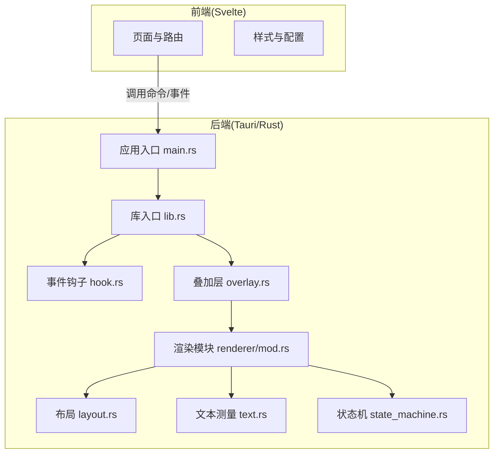
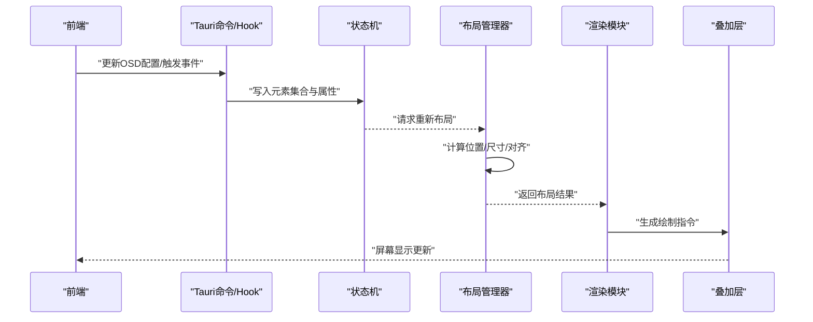
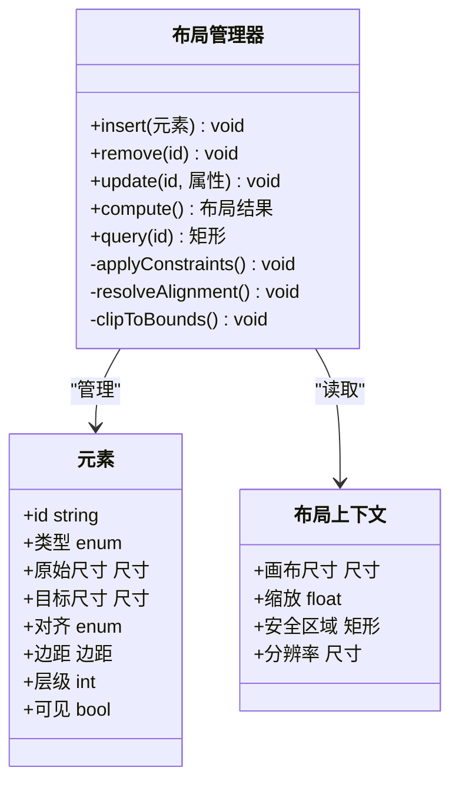
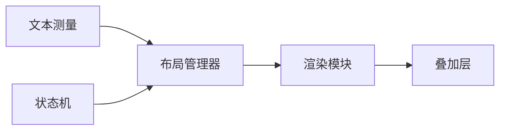

# 布局管理系统

<cite>
**本文引用的文件**   
- [layout.rs](file://osd-bubble/src-tauri/src/renderer/layout.rs)
- [mod.rs](file://osd-bubble/src-tauri/src/renderer/mod.rs)
- [text.rs](file://osd-bubble/src-tauri/src/renderer/text.rs)
- [overlay.rs](file://osd-bubble/src-tauri/src/overlay.rs)
- [lib.rs](file://osd-bubble/src-tauri/src/lib.rs)
- [main.rs](file://osd-bubble/src-tauri/src/main.rs)
- [state_machine.rs](file://osd-bubble/src-tauri/src/state_machine.rs)
- [hook.rs](file://osd-bubble/src-tauri/src/hook.rs)
- [Cargo.toml](file://osd-bubble/src-tauri/Cargo.toml)
</cite>

## 目录
1. [简介](#简介)
2. [项目结构](#项目结构)
3. [核心组件](#核心组件)
4. [架构总览](#架构总览)
5. [详细组件分析](#详细组件分析)
6. [依赖关系分析](#依赖关系分析)
7. [性能考量](#性能考量)
8. [故障排查指南](#故障排查指南)
9. [结论](#结论)
10. [附录](#附录)

## 简介
本文件为按键OSD可视化工具的布局管理系统提供系统化文档，聚焦于Rust侧渲染模块中的布局算法、元素定位策略与响应式布局机制。内容涵盖：
- OSD元素的布局属性定义与管理（位置坐标、尺寸大小、对齐方式等）
- 布局计算API（插入、删除、更新、重排）
- 与渲染管道的集成方式
- 动态布局与动画效果的实现思路
- 性能优化技巧与常见问题解决方案

## 项目结构
本项目采用Tauri + Svelte的前后端分离架构，Rust侧负责系统级能力与渲染管线，Svelte侧负责UI交互与配置界面。布局管理位于Rust渲染模块中，通过模块组织将布局、文本测量、叠加层绘制等职责解耦。

图表来源
- [main.rs](file://osd-bubble/src-tauri/src/main.rs)
- [lib.rs](file://osd-bubble/src-tauri/src/lib.rs)
- [hook.rs](file://osd-bubble/src-tauri/src/hook.rs)
- [overlay.rs](file://osd-bubble/src-tauri/src/overlay.rs)
- [mod.rs](file://osd-bubble/src-tauri/src/renderer/mod.rs)
- [layout.rs](file://osd-bubble/src-tauri/src/renderer/layout.rs)
- [text.rs](file://osd-bubble/src-tauri/src/renderer/text.rs)
- [state_machine.rs](file://osd-bubble/src-tauri/src/state_machine.rs)

章节来源
- [main.rs](file://osd-bubble/src-tauri/src/main.rs)
- [lib.rs](file://osd-bubble/src-tauri/src/lib.rs)
- [Cargo.toml](file://osd-bubble/src-tauri/Cargo.toml)

## 核心组件
- 布局管理器(layout.rs)
  - 维护OSD元素集合及其布局属性
  - 提供插入、删除、更新、查询接口
  - 执行布局计算与重排，支持对齐、间距、约束
- 文本测量(text.rs)
  - 基于字体与字号估算文本宽高
  - 为文本类OSD元素提供尺寸回退值
- 渲染模块(mod.rs)
  - 协调布局与绘制流程
  - 将布局结果转换为绘制指令
- 叠加层(overlay.rs)
  - 管理窗口叠加层生命周期
  - 接收布局后的绘制数据并呈现
- 状态机(state_machine.rs)
  - 管理OSD可见性、层级、动画状态
  - 驱动布局刷新时机

章节来源
- [layout.rs](file://osd-bubble/src-tauri/src/renderer/layout.rs)
- [text.rs](file://osd-bubble/src-tauri/src/renderer/text.rs)
- [mod.rs](file://osd-bubble/src-tauri/src/renderer/mod.rs)
- [overlay.rs](file://osd-bubble/src-tauri/src/overlay.rs)
- [state_machine.rs](file://osd-bubble/src-tauri/src/state_machine.rs)

## 架构总览
布局系统与渲染管道协作的关键路径如下：
- 前端触发配置或事件
- Rust侧通过Hook或命令接收变更
- 状态机更新OSD元素集合与可见性
- 布局管理器根据约束计算每个元素的位置与尺寸
- 渲染模块将布局结果转化为绘制指令
- 叠加层在屏幕上绘制最终画面

图表来源
- [hook.rs](file://osd-bubble/src-tauri/src/hook.rs)
- [state_machine.rs](file://osd-bubble/src-tauri/src/state_machine.rs)
- [layout.rs](file://osd-bubble/src-tauri/src/renderer/layout.rs)
- [mod.rs](file://osd-bubble/src-tauri/src/renderer/mod.rs)
- [overlay.rs](file://osd-bubble/src-tauri/src/overlay.rs)

## 详细组件分析

### 布局管理器(layout.rs)
- 职责
  - 维护OSD元素列表与其布局属性（坐标、尺寸、对齐、边距、层级）
  - 提供布局计算API：插入、删除、更新、批量重排
  - 处理约束冲突与边界裁剪
- 关键数据结构
  - 元素：标识符、类型（文本/图形）、原始尺寸、目标尺寸、对齐方式、边距、层级、可见性
  - 布局上下文：画布尺寸、缩放比例、安全区域、分辨率
- 布局算法要点
  - 先按层级分组，再按对齐规则计算相对位置
  - 对文本元素使用文本测量结果作为最小尺寸
  - 考虑边距与间距，避免重叠
  - 边界裁剪确保元素不超出屏幕范围
- API设计建议
  - insert(element): 插入新元素并触发一次布局
  - remove(id): 删除元素并触发重排
  - update(id, props): 部分更新属性后增量布局
  - compute(): 全量计算布局，返回元素最终矩形集合
  - query(id): 获取元素当前布局矩形

图表来源
- [layout.rs](file://osd-bubble/src-tauri/src/renderer/layout.rs)

章节来源
- [layout.rs](file://osd-bubble/src-tauri/src/renderer/layout.rs)

### 文本测量(text.rs)
- 职责
  - 根据字体、字号、加粗等样式估算文本宽高
  - 为文本类OSD元素提供尺寸回退值
- 关键点
  - 缓存常用度量结果以减少重复计算
  - 支持换行与多行文本的包围盒估算
  - 与布局管理器协作，保证文本元素的最小尺寸满足可读性

章节来源
- [text.rs](file://osd-bubble/src-tauri/src/renderer/text.rs)

### 渲染模块(mod.rs)
- 职责
  - 协调布局与绘制流程
  - 将布局结果转换为绘制指令（如矩形、文本、图像）
  - 处理透明度、混合模式、层级排序
- 关键点
  - 批量绘制减少状态切换开销
  - 按需重绘仅更新变化区域

章节来源
- [mod.rs](file://osd-bubble/src-tauri/src/renderer/mod.rs)

### 叠加层(overlay.rs)
- 职责
  - 管理叠加层窗口生命周期
  - 接收渲染模块的绘制指令并在屏幕上呈现
- 关键点
  - 与布局系统的刷新频率同步
  - 处理窗口移动、缩放、全屏切换时的适配

章节来源
- [overlay.rs](file://osd-bubble/src-tauri/src/overlay.rs)

### 状态机(state_machine.rs)
- 职责
  - 管理OSD元素的可见性、层级、动画状态
  - 驱动布局刷新时机（如元素出现/消失、属性变更）
- 关键点
  - 事件驱动的布局更新，避免不必要的重排
  - 与动画系统协作，平滑过渡布局变化

章节来源
- [state_machine.rs](file://osd-bubble/src-tauri/src/state_machine.rs)

## 依赖关系分析
布局系统与其他模块的依赖关系如下：
- 布局管理器依赖文本测量以获取文本尺寸
- 渲染模块依赖布局管理器提供的最终矩形集合
- 叠加层依赖渲染模块的输出进行绘制
- 状态机驱动布局更新，影响整体刷新频率

图表来源
- [text.rs](file://osd-bubble/src-tauri/src/renderer/text.rs)
- [layout.rs](file://osd-bubble/src-tauri/src/renderer/layout.rs)
- [mod.rs](file://osd-bubble/src-tauri/src/renderer/mod.rs)
- [overlay.rs](file://osd-bubble/src-tauri/src/overlay.rs)
- [state_machine.rs](file://osd-bubble/src-tauri/src/state_machine.rs)

章节来源
- [layout.rs](file://osd-bubble/src-tauri/src/renderer/layout.rs)
- [text.rs](file://osd/bubble/src-tauri/src/renderer/text.rs)
- [mod.rs](file://osd-bubble/src-tauri/src/renderer/mod.rs)
- [overlay.rs](file://osd-bubble/src-tauri/src/overlay.rs)
- [state_machine.rs](file://osd-bubble/src-tauri/src/state_machine.rs)

## 性能考量
- 增量布局：仅对变更元素进行重排，避免全量计算
- 度量缓存：缓存文本测量结果，减少重复计算
- 批量绘制：合并绘制指令，降低状态切换开销
- 防抖节流：高频更新时合并布局请求
- 分层渲染：静态背景与动态前景分离，减少重绘范围
- 内存管理：复用元素对象，避免频繁分配释放

[本节为通用性能指导，无需特定文件引用]

## 故障排查指南
- 元素重叠
  - 检查对齐规则与边距设置
  - 验证层级顺序是否正确
  - 确认文本测量是否准确
- 元素越界
  - 检查边界裁剪逻辑
  - 确认安全区域设置
  - 验证缩放比例与分辨率
- 布局抖动
  - 检查是否频繁触发全量重排
  - 确认增量更新是否正确
  - 验证文本测量缓存是否生效
- 渲染异常
  - 检查绘制指令格式
  - 确认透明度与混合模式
  - 验证叠加层生命周期

章节来源
- [layout.rs](file://osd-bubble/src-tauri/src/renderer/layout.rs)
- [text.rs](file://osd-bubble/src-tauri/src/renderer/text.rs)
- [mod.rs](file://osd-bubble/src-tauri/src/renderer/mod.rs)
- [overlay.rs](file://osd-bubble/src-tauri/src/overlay.rs)
- [state_machine.rs](file://osd-bubble/src-tauri/src/state_machine.rs)

## 结论
布局管理系统通过清晰的模块划分与API设计，实现了高效、可维护的OSD元素布局能力。结合文本测量、状态机与渲染管道，能够支持复杂的UI排列与动态效果。通过性能优化与故障排查策略，可进一步提升用户体验与系统稳定性。

[本节为总结性内容，无需特定文件引用]

## 附录
- 布局属性定义建议
  - 位置：x、y坐标或相对百分比
  - 尺寸：宽度、高度或自适应
  - 对齐：左/右/上/下/居中
  - 边距：内边距与外边距
  - 层级：z-index控制显示顺序
  - 可见性：显示/隐藏状态
- 常见布局场景
  - 水平/垂直排列
  - 网格布局
  - 流式布局
  - 锚点定位
- 动画集成
  - 位置插值
  - 透明度渐变
  - 缩放过渡

[本节为概念性内容，无需特定文件引用]