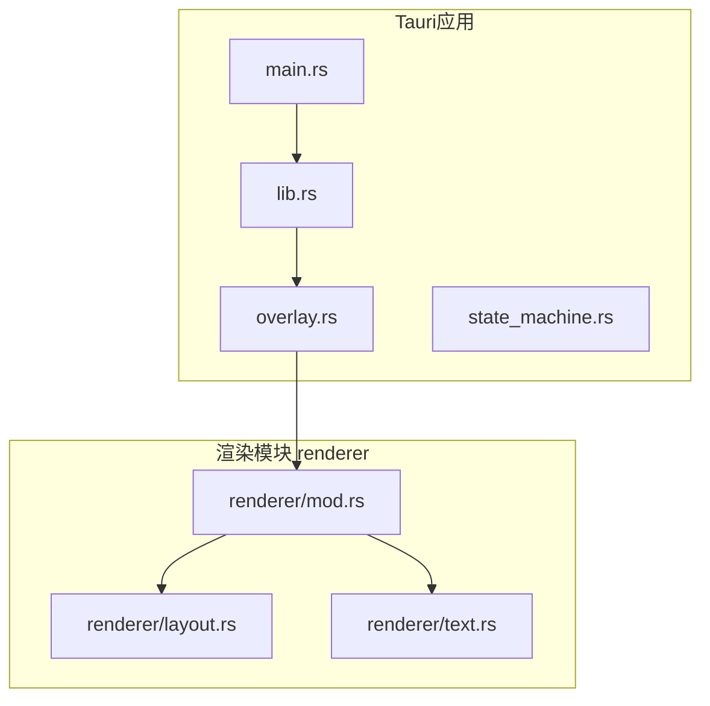
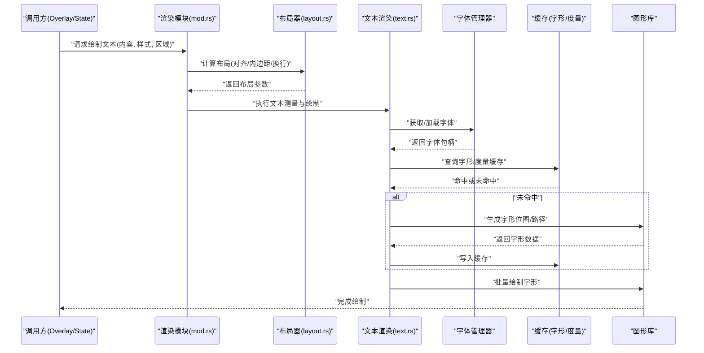
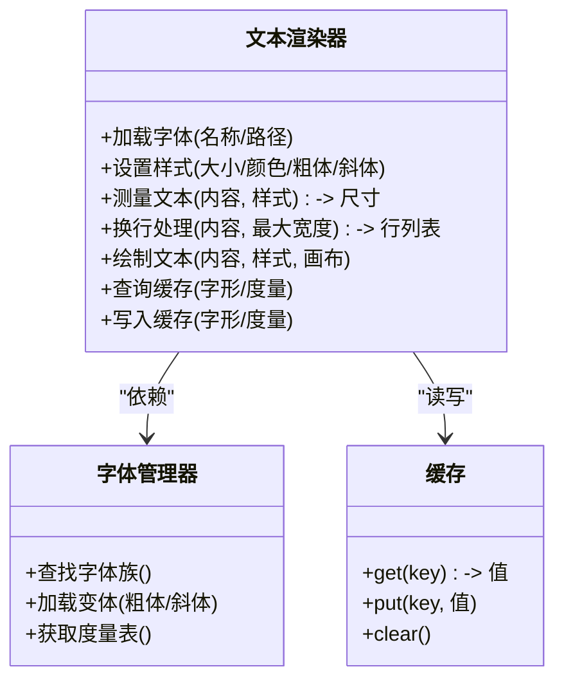
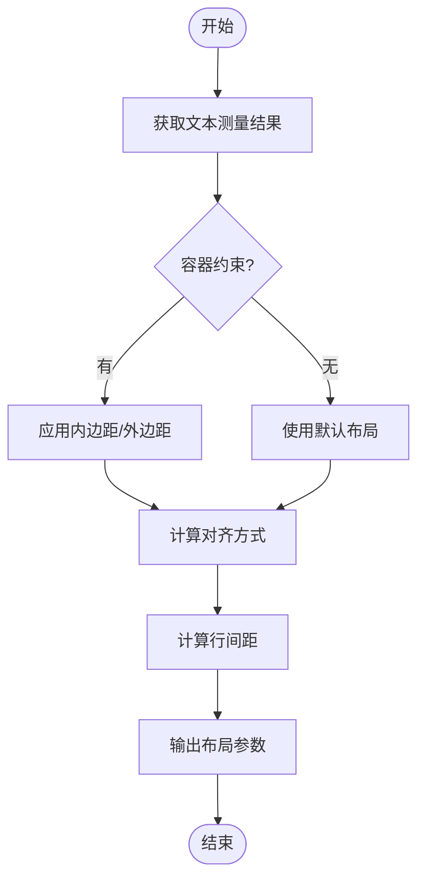
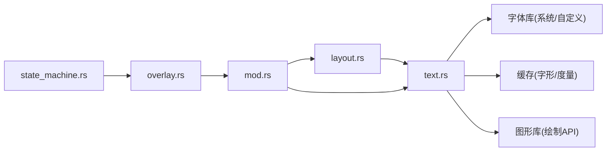

# 文本渲染引擎

<cite>
**本文档引用的文件**   
- [text.rs](file://osd-bubble/src-tauri/src/renderer/text.rs)
- [layout.rs](file://osd-bubble/src-tauri/src/renderer/layout.rs)
- [mod.rs](file://osd-bubble/src-tauri/src/renderer/mod.rs)
- [overlay.rs](file://osd-bubble/src-tauri/src/overlay.rs)
- [lib.rs](file://osd-bubble/src-tauri/src/lib.rs)
- [main.rs](file://osd-bubble/src-tauri/src/main.rs)
- [state_machine.rs](file://osd-bubble/src-tauri/src/state_machine.rs)
- [Cargo.toml](file://osd-bubble/src-tauri/Cargo.toml)
</cite>

## 目录
1. [简介](#简介)
2. [项目结构](#项目结构)
3. [核心组件](#核心组件)
4. [架构总览](#架构总览)
5. [详细组件分析](#详细组件分析)
6. [依赖关系分析](#依赖关系分析)
7. [性能考虑](#性能考虑)
8. [故障排查指南](#故障排查指南)
9. [结论](#结论)
10. [附录](#附录)

## 简介
本文件为按键OSD可视化工具的文本渲染引擎提供系统化文档，聚焦于 text.rs 中实现的文字显示功能、字体管理与样式控制机制。内容涵盖：
- 文本属性配置（字体类型、大小、颜色、粗体、斜体等）
- 文本渲染核心API（绘制、换行处理、文本测量、缓存机制）
- 与图形库的集成方式
- 多语言字符集与特殊符号支持
- 性能优化策略（字体缓存、批量渲染等）

## 项目结构
本项目采用 Tauri + Svelte 的前后端分离架构。Rust 侧负责系统级覆盖层与渲染，前端用于可视化配置与交互原型。文本渲染相关代码位于 src-tauri/src/renderer 模块下，其中 text.rs 为核心实现。

图表来源
- [main.rs:1-200](file://osd-bubble/src-tauri/src/main.rs#L1-L200)
- [lib.rs:1-200](file://osd-bubble/src-tauri/src/lib.rs#L1-L200)
- [overlay.rs:1-200](file://osd-bubble/src-tauri/src/overlay.rs#L1-L200)
- [mod.rs:1-200](file://osd-bubble/src-tauri/src/renderer/mod.rs#L1-L200)
- [text.rs:1-200](file://osd-bubble/src-tauri/src/renderer/text.rs#L1-L200)
- [layout.rs:1-200](file://osd-bubble/src-tauri/src/renderer/layout.rs#L1-L200)

章节来源
- [main.rs:1-200](file://osd-bubble/src-tauri/src/main.rs#L1-L200)
- [lib.rs:1-200](file://osd-bubble/src-tauri/src/lib.rs#L1-L200)
- [overlay.rs:1-200](file://osd-bubble/src-tauri/src/overlay.rs#L1-L200)
- [mod.rs:1-200](file://osd-bubble/src-tauri/src/renderer/mod.rs#L1-L200)
- [text.rs:1-200](file://osd-bubble/src-tauri/src/renderer/text.rs#L1-L200)
- [layout.rs:1-200](file://osd-bubble/src-tauri/src/renderer/layout.rs#1-L200)

## 核心组件
- 文本渲染器（text.rs）：负责字体的加载与管理、字形测量、文本布局（含换行）、绘制到目标表面，以及字形/度量缓存。
- 布局器（layout.rs）：根据文本尺寸与容器约束计算布局（位置、对齐、内边距），为渲染器提供最终绘制参数。
- 渲染模块入口（mod.rs）：统一暴露渲染接口，协调布局与文本渲染流程。
- 覆盖层（overlay.rs）：管理OSD覆盖窗口生命周期、图层合成与刷新策略。
- 状态机（state_machine.rs）：驱动UI状态变化，触发文本更新与重绘。

章节来源
- [text.rs:1-200](file://osd-bubble/src-tauri/src/renderer/text.rs#L1-L200)
- [layout.rs:1-200](file://osd-bubble/src-tauri/src/renderer/layout.rs#L1-L200)
- [mod.rs:1-200](file://osd-bubble/src-tauri/src/renderer/mod.rs#L1-L200)
- [overlay.rs:1-200](file://osd-bubble/src-tauri/src/overlay.rs#L1-L200)
- [state_machine.rs:1-200](file://osd-bubble/src-tauri/src/state_machine.rs#L1-L200)

## 架构总览
文本渲染引擎以“配置→布局→测量→缓存→绘制”为主线，与底层图形库通过抽象接口对接，确保跨平台一致性与高性能。

图表来源
- [mod.rs:1-200](file://osd-bubble/src-tauri/src/renderer/mod.rs#L1-L200)
- [layout.rs:1-200](file://osd-bubble/src-tauri/src/renderer/layout.rs#L1-L200)
- [text.rs:1-200](file://osd-bubble/src-tauri/src/renderer/text.rs#L1-L200)

## 详细组件分析

### 文本渲染器（text.rs）
- 字体管理
  - 支持按名称或路径加载字体，维护字体族与变体映射。
  - 提供字体大小缩放、粗细与倾斜参数的解析与应用。
- 文本测量
  - 基于字形宽度表与度量信息计算字符串宽度、高度与基线。
  - 支持按字符或按词边界进行换行估算。
- 文本布局与换行
  - 在给定最大宽度下进行自动换行，支持按字符、按词或按句子断点。
  - 输出每行文本的起始偏移、宽度与行数，供上层布局使用。
- 绘制流程
  - 将文本拆分为字形序列，结合样式（颜色、阴影、描边等）进行绘制。
  - 支持批量绘制以减少GPU调用次数。
- 缓存机制
  - 字形位图缓存：按字体+大小+样式键入缓存，避免重复栅格化。
  - 度量缓存：常用字符串宽度与行高缓存，加速测量。
- API概览（概念性说明）
  - 文本绘制：接收文本、样式、目标区域与画布上下文，完成绘制。
  - 文本测量：返回文本在指定样式下的宽高与行数。
  - 换行处理：输入文本与最大宽度，输出行列表及每行度量。
  - 缓存操作：查询/写入字形与度量缓存。

图表来源
- [text.rs:1-200](file://osd-bubble/src-tauri/src/renderer/text.rs#L1-L200)

章节来源
- [text.rs:1-200](file://osd-bubble/src-tauri/src/renderer/text.rs#L1-L200)

### 布局器（layout.rs）
- 负责根据文本测量结果与容器约束计算最终布局：
  - 对齐方式（左/中/右/两端）
  - 内边距与外边距
  - 行间距与段落间距
- 输出绘制所需的矩形区域与每行偏移，供文本渲染器逐行绘制。

图表来源
- [layout.rs:1-200](file://osd-bubble/src-tauri/src/renderer/layout.rs#L1-L200)

章节来源
- [layout.rs:1-200](file://osd-bubble/src-tauri/src/renderer/layout.rs#L1-L200)

### 渲染模块入口（mod.rs）
- 统一对外暴露渲染接口，协调布局与文本渲染流程。
- 管理渲染上下文与资源生命周期（如字体句柄、缓存实例）。
- 提供批量绘制入口，减少多次调用开销。

章节来源
- [mod.rs:1-200](file://osd-bubble/src-tauri/src/renderer/mod.rs#L1-L200)

### 覆盖层（overlay.rs）
- 管理OSD覆盖窗口创建、置顶、透明度与刷新策略。
- 与文本渲染器协作，将渲染结果合成到覆盖层。
- 处理窗口事件（如分辨率变化）并触发重绘。

章节来源
- [overlay.rs:1-200](file://osd-bubble/src-tauri/src/overlay.rs#L1-L200)

### 状态机（state_machine.rs）
- 驱动UI状态变化（如按键按下、文本更新、样式切换）。
- 当文本内容或样式变更时，通知渲染模块进行增量更新。

章节来源
- [state_machine.rs:1-200](file://osd-bubble/src-tauri/src/state_machine.rs#L1-L200)

## 依赖关系分析
文本渲染引擎依赖字体系统与图形库抽象，并通过缓存降低重复计算与绘制成本。

图表来源
- [text.rs:1-200](file://osd-bubble/src-tauri/src/renderer/text.rs#L1-L200)
- [layout.rs:1-200](file://osd-bubble/src-tauri/src/renderer/layout.rs#L1-L200)
- [mod.rs:1-200](file://osd-bubble/src-tauri/src/renderer/mod.rs#L1-L200)
- [overlay.rs:1-200](file://osd-bubble/src-tauri/src/overlay.rs#L1-L200)
- [state_machine.rs:1-200](file://osd-bubble/src-tauri/src/state_machine.rs#L1-L200)

章节来源
- [text.rs:1-200](file://osd-bubble/src-tauri/src/renderer/text.rs#L1-L200)
- [layout.rs:1-200](file://osd-bubble/src-tauri/src/renderer/layout.rs#L1-L200)
- [mod.rs:1-200](file://osd-bubble/src-tauri/src/renderer/mod.rs#L1-L200)
- [overlay.rs:1-200](file://osd-bubble/src-tauri/src/overlay.rs#L1-L200)
- [state_machine.rs:1-200](file://osd-bubble/src-tauri/src/state_machine.rs#L1-L200)

## 性能考虑
- 字体缓存
  - 按“字体族+大小+样式”作为键缓存字形位图，避免重复栅格化。
  - 对常用度量（字符串宽度、行高）建立缓存，减少测量开销。
- 批量渲染
  - 合并相邻文本绘制调用，减少GPU命令提交次数。
  - 使用顶点缓冲或纹理图集提升绘制效率。
- 增量更新
  - 仅重绘发生变化的文本区域，避免整屏刷新。
- 内存管理
  - 限制缓存容量，LRU淘汰策略防止内存膨胀。
  - 及时释放不再使用的字体句柄与中间缓冲区。

[本节为通用指导，不直接分析具体文件]

## 故障排查指南
- 字体加载失败
  - 检查字体路径与权限，确认字体格式受支持。
  - 验证字体族名称与变体匹配是否正确。
- 文本测量异常
  - 核对字体度量表是否完整，必要时回退到默认度量。
  - 检查换行断点逻辑是否符合目标语言规则。
- 绘制错位或截断
  - 校验布局参数（内边距、对齐、行间距）是否与预期一致。
  - 确认目标画布尺寸与坐标变换正确。
- 性能问题
  - 观察缓存命中率，调整缓存大小与淘汰策略。
  - 合并频繁的小文本绘制为批量绘制。

章节来源
- [text.rs:1-200](file://osd-bubble/src-tauri/src/renderer/text.rs#L1-L200)
- [layout.rs:1-200](file://osd-bubble/src-tauri/src/renderer/layout.rs#L1-L200)

## 结论
文本渲染引擎围绕“字体管理—文本测量—布局—缓存—绘制”的核心链路构建，通过合理的缓存与批量策略保障性能，同时提供灵活的样式配置与多语言支持能力。在实际使用中，建议优先关注字体加载与缓存命中率，并结合增量更新策略优化渲染性能。

[本节为总结性内容，不直接分析具体文件]

## 附录

### 文本属性配置参考
- 字体类型：支持系统字体与自定义字体文件；可通过名称或路径加载。
- 字体大小：以像素为单位，支持小数精度。
- 颜色：支持RGBA或十六进制表示。
- 粗体/斜体：通过字体变体开关启用。
- 其他样式：阴影、描边、透明度等（由渲染器扩展支持）。

章节来源
- [text.rs:1-200](file://osd-bubble/src-tauri/src/renderer/text.rs#L1-L200)

### 文本渲染核心API（概念性说明）
- 绘制文本：传入文本内容、样式与目标区域，完成绘制。
- 文本测量：返回文本在指定样式下的宽高与行数。
- 换行处理：输入文本与最大宽度，输出行列表与每行度量。
- 缓存操作：查询/写入字形与度量缓存。

章节来源
- [text.rs:1-200](file://osd-bubble/src-tauri/src/renderer/text.rs#L1-L200)

### 多语言与特殊符号支持
- 字符集：依赖底层字体包含所需Unicode区块；必要时引入多字体回退。
- 特殊符号：确保字体包含对应字形，或在缺失时回退到兼容字形。
- 换行规则：针对不同语言设置合适的断点策略（如CJK按字符、拉丁按词）。

章节来源
- [text.rs:1-200](file://osd-bubble/src-tauri/src/renderer/text.rs#L1-L200)

### Rust示例指引（不展示代码内容）
- 示例一：基础文本绘制（设置字体、大小、颜色，绘制单行文本）
  - 参考路径：[text.rs:1-200](file://osd-bubble/src-tauri/src/renderer/text.rs#L1-L200)
- 示例二：多行文本与自动换行（设置最大宽度，启用换行，逐行绘制）
  - 参考路径：[text.rs:1-200](file://osd-bubble/src-tauri/src/renderer/text.rs#L1-L200)
- 示例三：样式切换（粗体/斜体/颜色动态切换，触发增量重绘）
  - 参考路径：[state_machine.rs:1-200](file://osd-bubble/src-tauri/src/state_machine.rs#L1-L200)
- 示例四：批量渲染（合并多个文本绘制调用，减少GPU开销）
  - 参考路径：[mod.rs:1-200](file://osd-bubble/src-tauri/src/renderer/mod.rs#L1-L200)

章节来源
- [text.rs:1-200](file://osd-bubble/src-tauri/src/renderer/text.rs#L1-L200)
- [state_machine.rs:1-200](file://osd-bubble/src-tauri/src/state_machine.rs#L1-L200)
- [mod.rs:1-200](file://osd-bubble/src-tauri/src/renderer/mod.rs#L1-L200)