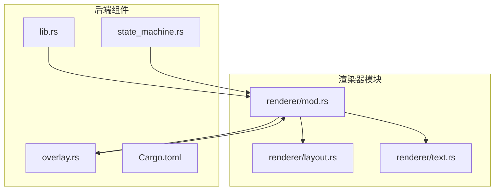
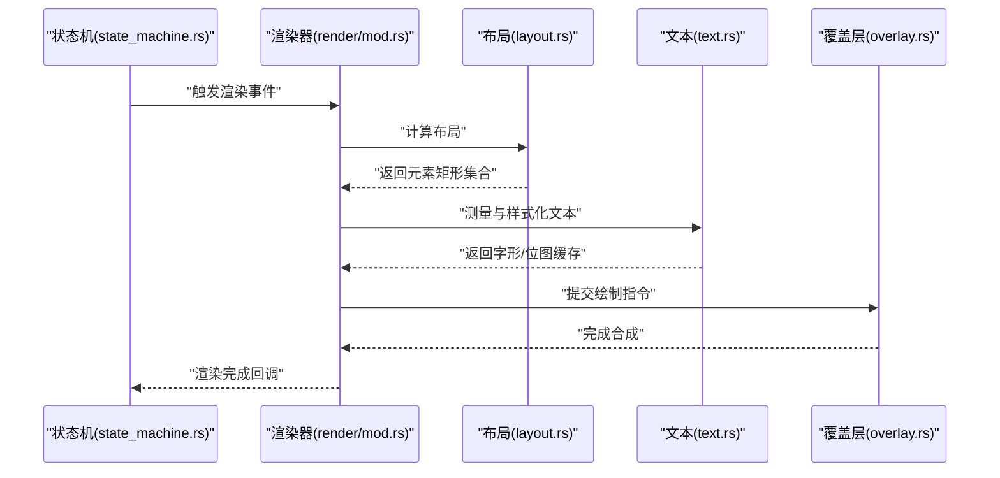
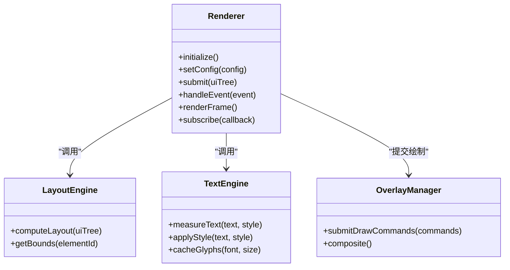
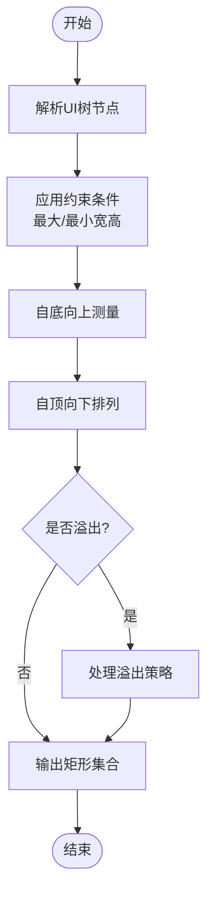
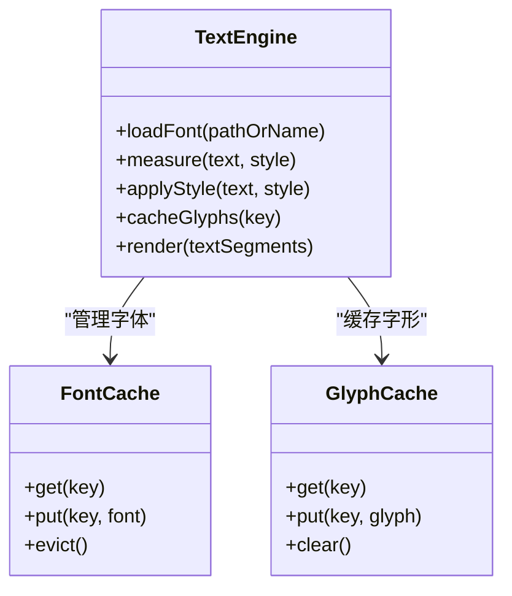
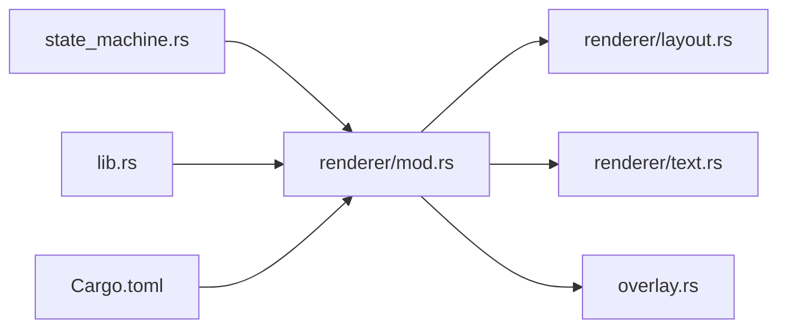

# 渲染器模块

<cite>
**本文引用的文件**   
- [osd-bubble/src-tauri/src/renderer/mod.rs](file://osd-bubble/src-tauri/src/renderer/mod.rs)
- [osd-bubble/src-tauri/src/renderer/layout.rs](file://osd-bubble/src-tauri/src/renderer/layout.rs)
- [osd-bubble/src-tauri/src/renderer/text.rs](file://osd-bubble/src-tauri/src/renderer/text.rs)
- [osd-bubble/src-tauri/src/overlay.rs](file://osd-bubble/src-tauri/src/overlay.rs)
- [osd-bubble/src-tauri/src/state_machine.rs](file://osd-bubble/src-tauri/src/state_machine.rs)
- [osd-bubble/src-tauri/src/lib.rs](file://osd-bubble/src-tauri/src/lib.rs)
- [osd-bubble/src-tauri/Cargo.toml](file://osd-bubble/src-tauri/Cargo.toml)
</cite>

## 目录
1. [简介](#简介)
2. [项目结构](#项目结构)
3. [核心组件](#核心组件)
4. [架构总览](#架构总览)
5. [详细组件分析](#详细组件分析)
6. [依赖关系分析](#依赖关系分析)
7. [性能考量](#性能考量)
8. [故障排查指南](#故障排查指南)
9. [结论](#结论)
10. [附录](#附录)

## 简介
本文件面向按键OSD可视化工具的渲染器模块，聚焦于Rust后端中的渲染子系统。该子系统由三个关键部分组成：
- render（渲染入口与协调）
- layout（UI布局与定位）
- text（文本渲染与样式控制）

文档将系统阐述渲染器的架构设计、数据流、API接口、配置项、扩展点，以及与状态机、覆盖层管理等后端组件的协作方式，并提供常见问题排查与性能优化建议。

## 项目结构
渲染器模块位于Tauri Rust后端中，主要文件如下：
- renderer/mod.rs：渲染模块的组织与对外暴露的接口
- renderer/layout.rs：布局计算与元素定位
- renderer/text.rs：文本测量、绘制与样式管理
- overlay.rs：覆盖层管理与窗口合成
- state_machine.rs：状态机驱动渲染事件
- lib.rs：Tauri插件入口与模块注册
- Cargo.toml：依赖声明与构建配置

图表来源
- [osd-bubble/src-tauri/src/renderer/mod.rs](file://osd-bubble/src-tauri/src/renderer/mod.rs)
- [osd-bubble/src-tauri/src/renderer/layout.rs](file://osd-bubble/src-tauri/src/renderer/layout.rs)
- [osd-bubble/src-tauri/src/renderer/text.rs](file://osd-bubble/src-tauri/src/renderer/text.rs)
- [osd-bubble/src-tauri/src/overlay.rs](file://osd-bubble/src-tauri/src/overlay.rs)
- [osd-bubble/src-tauri/src/state_machine.rs](file://osd-bubble/src-tauri/src/state_machine.rs)
- [osd-bubble/src-tauri/src/lib.rs](file://osd-bubble/src-tauri/src/lib.rs)
- [osd-bubble/src-tauri/Cargo.toml](file://osd-bubble/src-tauri/Cargo.toml)

章节来源
- [osd-bubble/src-tauri/src/renderer/mod.rs](file://osd-bubble/src-tauri/src/renderer/mod.rs)
- [osd-bubble/src-tauri/src/renderer/layout.rs](file://osd-bubble/src-tauri/src/renderer/layout.rs)
- [osd-bubble/src-tauri/src/renderer/text.rs](file://osd-bubble/src-tauri/src/renderer/text.rs)
- [osd-bubble/src-tauri/src/overlay.rs](file://osd-bubble/src-tauri/src/overlay.rs)
- [osd-bubble/src-tauri/src/state_machine.rs](file://osd-bubble/src-tauri/src/state_machine.rs)
- [osd-bubble/src-tauri/src/lib.rs](file://osd-bubble/src-tauri/src/lib.rs)
- [osd-bubble/src-tauri/Cargo.toml](file://osd-bubble/src-tauri/Cargo.toml)

## 核心组件
- 渲染入口（render/mod.rs）
  - 负责初始化渲染上下文、聚合布局与文本子系统的配置、调度渲染帧、处理渲染事件回调。
  - 提供对外API用于设置主题、字体、尺寸、透明度等参数，并触发重绘。
- 布局（layout.rs）
  - 实现容器与元素的层级关系、对齐策略、边距与内边距计算、自适应缩放。
  - 输出每个元素的最终矩形区域（位置与大小），供绘制阶段使用。
- 文本（text.rs）
  - 负责字体加载、字符测量、行高与基线计算、样式（颜色、阴影、描边、换行）应用。
  - 生成可绘制的字形路径或位图缓存，减少重复测量开销。

章节来源
- [osd-bubble/src-tauri/src/renderer/mod.rs](file://osd-bubble/src-tauri/src/renderer/mod.rs)
- [osd-bubble/src-tauri/src/renderer/layout.rs](file://osd-bubble/src-tauri/src/renderer/layout.rs)
- [osd-bubble/src-tauri/src/renderer/text.rs](file://osd-bubble/src-tauri/src/renderer/text.rs)

## 架构总览
渲染器采用“配置驱动 + 事件驱动”的双通道模式：
- 配置驱动：通过配置对象描述UI树、样式、布局规则；渲染器据此生成布局结果与绘制指令。
- 事件驱动：状态机产生渲染事件（如显示、隐藏、更新内容），渲染器响应事件进行增量更新。

图表来源
- [osd-bubble/src-tauri/src/state_machine.rs](file://osd-bubble/src-tauri/src/state_machine.rs)
- [osd-bubble/src-tauri/src/renderer/mod.rs](file://osd-bubble/src-tauri/src/renderer/mod.rs)
- [osd-bubble/src-tauri/src/renderer/layout.rs](file://osd-bubble/src-tauri/src/renderer/layout.rs)
- [osd-bubble/src-tauri/src/renderer/text.rs](file://osd-bubble/src-tauri/src/renderer/text.rs)
- [osd-bubble/src-tauri/src/overlay.rs](file://osd-bubble/src-tauri/src/overlay.rs)

## 详细组件分析

### 渲染入口（render/mod.rs）
- 职责
  - 维护渲染上下文与全局配置（主题、字体、分辨率、透明度）。
  - 接收来自状态机的渲染事件，调用布局与文本子系统生成绘制指令。
  - 与覆盖层交互，提交最终的合成结果。
- 关键流程
  - 初始化：加载字体资源、创建渲染上下文、绑定事件回调。
  - 渲染循环：根据事件类型决定全量或增量更新。
  - 事件处理：解析事件载荷（如文本变更、位置变化），更新内部状态并触发重绘。
- API与配置
  - 配置项：主题、字体族、字号、行高、颜色、阴影、描边、透明度、缩放因子。
  - 方法：设置配置、提交UI树、触发渲染、订阅事件。
- 错误处理
  - 字体加载失败回退到默认字体。
  - 布局异常时降级为单行布局。
  - 覆盖层提交失败记录日志并重试一次。

章节来源
- [osd-bubble/src-tauri/src/renderer/mod.rs](file://osd-bubble/src-tauri/src/renderer/mod.rs)

#### 类图（渲染入口）

图表来源
- [osd-bubble/src-tauri/src/renderer/mod.rs](file://osd-bubble/src-tauri/src/renderer/mod.rs)

### 布局引擎（layout.rs）
- 职责
  - 解析UI树节点，计算相对/绝对位置、尺寸、对齐方式。
  - 支持嵌套容器、弹性布局、网格布局等常见模式。
  - 输出每个节点的最终矩形区域，供绘制阶段使用。
- 算法要点
  - 自顶向下传递约束（最大/最小宽高），自底向上返回测量结果。
  - 处理溢出策略（裁剪、滚动提示、自动换行）。
  - 多显示器适配与缩放因子校正。
- 性能优化
  - 增量布局：仅重新计算受影响的子树。
  - 布局缓存：对静态节点复用已计算的布局结果。
  - 批量合并：合并相邻矩形以减少绘制批次。

章节来源
- [osd-bubble/src-tauri/src/renderer/layout.rs](file://osd-bubble/src-tauri/src/renderer/layout.rs)

#### 流程图（布局计算）

图表来源
- [osd-bubble/src-tauri/src/renderer/layout.rs](file://osd-bubble/src-tauri/src/renderer/layout.rs)

### 文本引擎（text.rs）
- 职责
  - 字体加载与管理（本地字体、嵌入字体、缓存命中）。
  - 字符测量（宽度、高度、基线）、行高计算、换行策略。
  - 样式应用（颜色、阴影、描边、粗体、斜体、下划线）。
- 数据结构
  - 文本段：包含原始文本、样式、测量结果、缓存键。
  - 字形缓存：按字体+字号+样式索引，避免重复测量。
- 性能优化
  - 字形缓存与LRU淘汰策略。
  - 文本分块渲染：长文本拆分为多个绘制单元。
  - 异步测量：在后台线程进行复杂文本测量。

章节来源
- [osd-bubble/src-tauri/src/renderer/text.rs](file://osd-bubble/src-tauri/src/renderer/text.rs)

#### 类图（文本引擎）

图表来源
- [osd-bubble/src-tauri/src/renderer/text.rs](file://osd-bubble/src-tauri/src/renderer/text.rs)

### 与覆盖层和状态机的协作
- 覆盖层（overlay.rs）
  - 负责窗口合成、透明度混合、绘制指令执行。
  - 与渲染器交换绘制命令，确保OSD始终置顶且不干扰输入。
- 状态机（state_machine.rs）
  - 定义OSD状态（隐藏、显示、更新、销毁）及转换规则。
  - 向渲染器派发渲染事件，驱动UI树的更新与重绘。

章节来源
- [osd-bubble/src-tauri/src/overlay.rs](file://osd-bubble/src-tauri/src/overlay.rs)
- [osd-bubble/src-tauri/src/state_machine.rs](file://osd-bubble/src-tauri/src/state_machine.rs)

## 依赖关系分析
- 模块内依赖
  - render依赖layout与text，二者相互独立，便于单元测试与替换实现。
- 外部依赖
  - 字体库（用于文本测量与字形生成）
  - 图形后端（如DirectX/OpenGL/Vulkan，具体取决于目标平台）
  - Tauri窗口系统（用于覆盖层创建与事件分发）

图表来源
- [osd-bubble/src-tauri/src/renderer/mod.rs](file://osd-bubble/src-tauri/src/renderer/mod.rs)
- [osd-bubble/src-tauri/src/renderer/layout.rs](file://osd-bubble/src-tauri/src/renderer/layout.rs)
- [osd-bubble/src-tauri/src/renderer/text.rs](file://osd-bubble/src-tauri/src/renderer/text.rs)
- [osd-bubble/src-tauri/src/overlay.rs](file://osd-bubble/src-tauri/src/overlay.rs)
- [osd-bubble/src-tauri/src/state_machine.rs](file://osd-bubble/src-tauri/src/state_machine.rs)
- [osd-bubble/src-tauri/src/lib.rs](file://osd-bubble/src-tauri/src/lib.rs)
- [osd-bubble/src-tauri/Cargo.toml](file://osd-bubble/src-tauri/Cargo.toml)

章节来源
- [osd-bubble/src-tauri/src/renderer/mod.rs](file://osd-bubble/src-tauri/src/renderer/mod.rs)
- [osd-bubble/src-tauri/Cargo.toml](file://osd-bubble/src-tauri/Cargo.toml)

## 性能考量
- 布局性能
  - 使用增量布局避免全量重算。
  - 对静态UI树进行预计算与缓存。
- 文本性能
  - 启用字形缓存，减少重复测量。
  - 对长文本进行分块渲染与异步测量。
- 渲染性能
  - 合并绘制批次，减少GPU调用次数。
  - 使用离屏缓冲与双缓冲技术降低闪烁。
- 内存管理
  - 及时释放不再使用的字体与字形缓存。
  - 限制缓存大小，防止内存泄漏。

[本节为通用指导，不直接分析具体文件]

## 故障排查指南
- 字体加载失败
  - 检查字体路径与权限，确认字体文件格式正确。
  - 回退到内置字体，确保基本功能可用。
- 布局错位
  - 验证约束条件是否正确传递。
  - 检查溢出策略是否符合预期。
- 文本显示异常
  - 确认样式参数（颜色、阴影、描边）未越界。
  - 检查缓存键是否唯一，避免命中错误缓存。
- 覆盖层问题
  - 确认窗口属性（透明、置顶）设置正确。
  - 检查绘制命令格式与顺序。

章节来源
- [osd-bubble/src-tauri/src/renderer/text.rs](file://osd-bubble/src-tauri/src/renderer/text.rs)
- [osd-bubble/src-tauri/src/renderer/layout.rs](file://osd-bubble/src-tauri/src/renderer/layout.rs)
- [osd-bubble/src-tauri/src/overlay.rs](file://osd-bubble/src-tauri/src/overlay.rs)

## 结论
渲染器模块通过清晰的职责分离与模块化设计，实现了高效的OSD渲染能力。布局与文本子系统相互独立且易于扩展，与状态机和覆盖层的协作确保了稳定的用户体验。通过合理的性能优化与错误处理机制，模块能够在多种场景下保持高性能与可靠性。

[本节为总结性内容，不直接分析具体文件]

## 附录
- 配置选项示例
  - 主题：深色/浅色模式切换
  - 字体：字体族、字号、行高
  - 样式：颜色、阴影、描边、透明度
  - 布局：对齐方式、边距、内边距、缩放因子
- API接口概览
  - 设置配置：set_config(config)
  - 提交UI树：submit(ui_tree)
  - 触发渲染：render_frame()
  - 订阅事件：subscribe(callback)
- 扩展点
  - 自定义布局算法：实现布局接口
  - 自定义文本渲染：替换文本引擎
  - 自定义覆盖层：集成新的图形后端

[本节为补充信息，不直接分析具体文件]