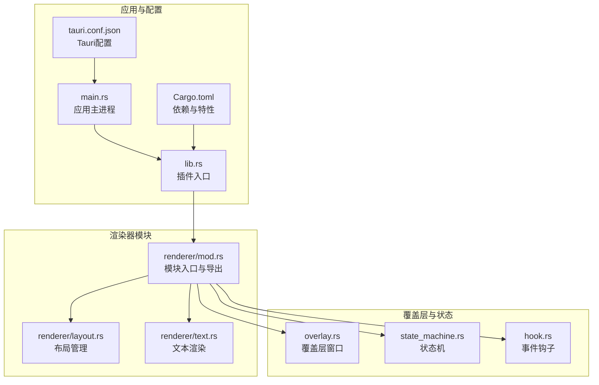
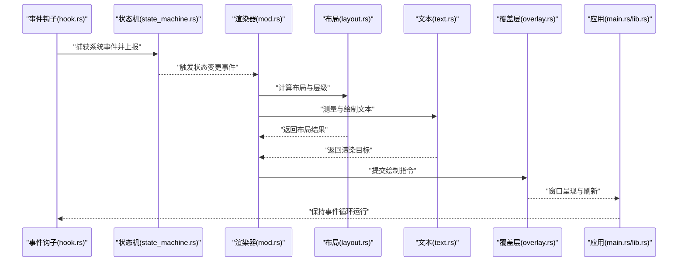
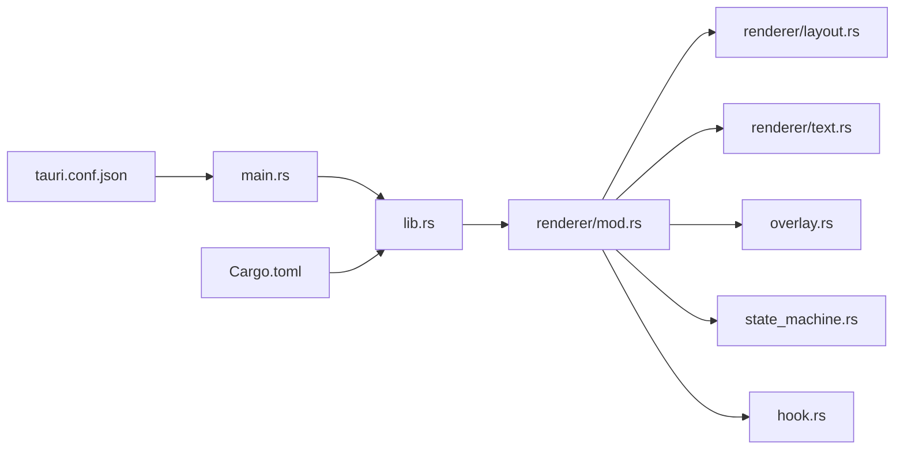

# 渲染器模块概览

<cite>
**本文引用的文件**   
- [mod.rs](file://osd-bubble/src-tauri/src/renderer/mod.rs)
- [layout.rs](file://osd-bubble/src-tauri/src/renderer/layout.rs)
- [text.rs](file://osd-bubble/src-tauri/src/renderer/text.rs)
- [lib.rs](file://osd-bubble/src-tauri/src/lib.rs)
- [main.rs](file://osd-bubble/src-tauri/src/main.rs)
- [overlay.rs](file://osd-bubble/src-tauri/src/overlay.rs)
- [state_machine.rs](file://osd-bubble/src-tauri/src/state_machine.rs)
- [hook.rs](file://osd-bubble/src-tauri/src/hook.rs)
- [Cargo.toml](file://osd-bubble/src-tauri/Cargo.toml)
- [tauri.conf.json](file://osd-bubble/src-tauri/tauri.conf.json)
</cite>

## 目录
1. [简介](#简介)
2. [项目结构](#项目结构)
3. [核心组件](#核心组件)
4. [架构总览](#架构总览)
5. [详细组件分析](#详细组件分析)
6. [依赖关系分析](#依赖关系分析)
7. [性能考量](#性能考量)
8. [故障排查指南](#故障排查指南)
9. [结论](#结论)
10. [附录：配置与使用示例](#附录配置与使用示例)

## 简介
本概览文档聚焦于按键OSD可视化工具的“渲染器模块”，旨在帮助开发者快速理解该模块的整体架构、职责边界、与其他组件的交互方式，以及在Tauri应用中的集成与生命周期管理。渲染器模块负责将OSD（On-Screen Display）内容以高性能、低侵入的方式绘制到屏幕覆盖层上，提供布局管理、文本渲染、样式控制等关键能力，并通过清晰的公共接口供上层业务调用。

## 项目结构
渲染器模块位于Rust后端（src-tauri）中，采用按功能划分的模块化组织方式：
- renderer/mod.rs：模块入口，统一导出公共API，定义初始化流程与对外暴露的能力。
- renderer/layout.rs：布局管理器，负责元素定位、尺寸计算与层级排序。
- renderer/text.rs：文本渲染器，负责字体加载、测量、绘制与缓存策略。
- overlay.rs：覆盖层窗口管理，处理透明无边框窗口、置顶、输入穿透等。
- state_machine.rs：状态机，驱动OSD显示/隐藏、切换等状态流转。
- hook.rs：事件钩子，桥接系统事件（如按键、鼠标）与渲染触发。
- lib.rs / main.rs：Tauri插件与应用入口，注册命令、启动服务与生命周期管理。
- Cargo.toml / tauri.conf.json：构建配置与Tauri运行时配置。

图表来源 
- [mod.rs](file://osd-bubble/src-tauri/src/renderer/mod.rs)
- [layout.rs](file://osd-bubble/src-tauri/src/renderer/layout.rs)
- [text.rs](file://osd-bubble/src-tauri/src/renderer/text.rs)
- [overlay.rs](file://osd-bubble/src-tauri/src/overlay.rs)
- [state_machine.rs](file://osd-bubble/src-tauri/src/state_machine.rs)
- [hook.rs](file://osd-bubble/src-tauri/src/hook.rs)
- [lib.rs](file://osd-bubble/src-tauri/src/lib.rs)
- [main.rs](file://osd-bubble/src-tauri/src/main.rs)
- [tauri.conf.json](file://osd-bubble/src-tauri/tauri.conf.json)
- [Cargo.toml](file://osd-bubble/src-tauri/Cargo.toml)

章节来源
- [mod.rs](file://osd-bubble/src-tauri/src/renderer/mod.rs)
- [layout.rs](file://osd-bubble/src-tauri/src/renderer/layout.rs)
- [text.rs](file://osd-bubble/src-tauri/src/renderer/text.rs)
- [overlay.rs](file://osd-bubble/src-tauri/src/overlay.rs)
- [state_machine.rs](file://osd-bubble/src-tauri/src/state_machine.rs)
- [hook.rs](file://osd-bubble/src-tauri/src/hook.rs)
- [lib.rs](file://osd-bubble/src-tauri/src/lib.rs)
- [main.rs](file://osd-bubble/src-tauri/src/main.rs)
- [tauri.conf.json](file://osd-bubble/src-tauri/tauri.conf.json)
- [Cargo.toml](file://osd-bubble/src-tauri/Cargo.toml)

## 核心组件
- 模块入口（mod.rs）
  - 职责：聚合渲染器相关能力，统一导出公共接口；定义初始化函数与资源准备流程；协调布局、文本、覆盖层与状态机。
  - 关键点：对外暴露的API需具备幂等性与可重入性；初始化顺序应保证覆盖层就绪后再进行渲染调度。
- 布局管理（layout.rs）
  - 职责：计算OSD元素的相对/绝对位置、尺寸、对齐与层级；支持动态更新与增量重排。
  - 关键点：布局算法应具备稳定时间复杂度；对频繁更新的元素采用脏标记与批量刷新。
- 文本渲染（text.rs）
  - 职责：字体加载与度量、字符到字形映射、抗锯齿绘制、缓存命中优化。
  - 关键点：热点文本路径缓存、位图缓存与内存上限控制；多语言与复杂脚本支持。
- 覆盖层（overlay.rs）
  - 职责：创建透明无边框窗口、设置置顶与输入穿透、处理多显示器与DPI缩放。
  - 关键点：跨平台差异处理；窗口可见性与焦点策略；与系统主题/高DPI适配。
- 状态机（state_machine.rs）
  - 职责：驱动OSD显示/隐藏、切换动画、错误恢复；维护当前帧与下一帧的状态。
  - 关键点：状态转换的可观测性；超时与重试机制；与UI线程/渲染线程的同步。
- 事件钩子（hook.rs）
  - 职责：监听系统事件（按键、鼠标、热键），触发渲染或状态变更。
  - 关键点：事件过滤与去抖；跨平台钩子实现；避免阻塞主循环。

章节来源
- [mod.rs](file://osd-bubble/src-tauri/src/renderer/mod.rs)
- [layout.rs](file://osd-bubble/src-tauri/src/renderer/layout.rs)
- [text.rs](file://osd-bubble/src-tauri/src/renderer/text.rs)
- [overlay.rs](file://osd-bubble/src-tauri/src/overlay.rs)
- [state_machine.rs](file://osd-bubble/src-tauri/src/state_machine.rs)
- [hook.rs](file://osd-bubble/src-tauri/src/hook.rs)

## 架构总览
渲染器模块在Tauri应用中作为后端能力被调用，前端通过Tauri命令或IPC与后端交互。整体数据流如下：
- 事件钩子捕获用户输入或系统事件，转换为内部事件。
- 状态机根据事件更新OSD状态（显示/隐藏/切换）。
- 渲染器根据当前状态生成待渲染内容（布局+文本）。
- 覆盖层窗口负责实际绘制与呈现。
- 应用入口负责生命周期管理与资源清理。

图表来源 
- [hook.rs](file://osd-bubble/src-tauri/src/hook.rs)
- [state_machine.rs](file://osd-bubble/src-tauri/src/state_machine.rs)
- [mod.rs](file://osd-bubble/src-tauri/src/renderer/mod.rs)
- [layout.rs](file://osd-bubble/src-tauri/src/renderer/layout.rs)
- [text.rs](file://osd-bubble/src-tauri/src/renderer/text.rs)
- [overlay.rs](file://osd-bubble/src-tauri/src/overlay.rs)
- [main.rs](file://osd-bubble/src-tauri/src/main.rs)
- [lib.rs](file://osd-bubble/src-tauri/src/lib.rs)

## 详细组件分析

### 模块入口（mod.rs）
- 作用
  - 统一导出渲染器的公共接口，包括初始化、渲染调度、配置更新与销毁。
  - 协调布局、文本、覆盖层与状态机的协作顺序，确保资源可用性与线程安全。
- 初始化流程
  - 加载必要资源（字体、样式、覆盖层句柄）。
  - 注册事件钩子与状态机回调。
  - 启动渲染循环或按需触发渲染。
- 公共接口
  - 初始化与配置：用于设置窗口参数、样式、行为选项。
  - 渲染API：提供内容提交、刷新、暂停/恢复等方法。
  - 生命周期：启动、停止、释放资源。

章节来源
- [mod.rs](file://osd-bubble/src-tauri/src/renderer/mod.rs)

### 布局管理（layout.rs）
- 职责
  - 计算元素位置、尺寸、对齐与层级；支持动态更新与增量重排。
  - 处理多显示器、DPI缩放与坐标系转换。
- 设计要点
  - 使用脏标记与批处理减少重排开销。
  - 提供稳定的布局算法，避免抖动与闪烁。
  - 支持嵌套布局与约束求解。

章节来源
- [layout.rs](file://osd-bubble/src-tauri/src/renderer/layout.rs)

### 文本渲染（text.rs）
- 职责
  - 字体加载与度量、字符到字形映射、抗锯齿绘制。
  - 热点文本路径缓存、位图缓存与内存上限控制。
- 设计要点
  - 针对高频文本进行缓存与复用。
  - 支持多语言与复杂脚本（如连字、双向文本）。
  - 提供字体回退与降级策略。

章节来源
- [text.rs](file://osd-bubble/src-tauri/src/renderer/text.rs)

### 覆盖层（overlay.rs）
- 职责
  - 创建透明无边框窗口、设置置顶与输入穿透。
  - 处理多显示器与DPI缩放，确保绘制区域正确。
- 设计要点
  - 跨平台窗口管理抽象。
  - 窗口可见性与焦点策略，避免抢占用户输入。
  - 与系统主题/高DPI适配，保证视觉一致性。

章节来源
- [overlay.rs](file://osd-bubble/src-tauri/src/overlay.rs)

### 状态机（state_machine.rs）
- 职责
  - 驱动OSD显示/隐藏、切换动画、错误恢复。
  - 维护当前帧与下一帧的状态，确保平滑过渡。
- 设计要点
  - 状态转换的可观测性与日志记录。
  - 超时与重试机制，提升鲁棒性。
  - 与UI线程/渲染线程的同步，避免竞态条件。

章节来源
- [state_machine.rs](file://osd-bubble/src-tauri/src/state_machine.rs)

### 事件钩子（hook.rs）
- 职责
  - 监听系统事件（按键、鼠标、热键），触发渲染或状态变更。
  - 事件过滤与去抖，降低无效渲染。
- 设计要点
  - 跨平台钩子实现与权限处理。
  - 非阻塞事件处理，避免影响主循环。
  - 事件优先级与冲突解决。

章节来源
- [hook.rs](file://osd-bubble/src-tauri/src/hook.rs)

## 依赖关系分析
渲染器模块依赖Tauri运行时与系统窗口能力，同时与状态机、事件钩子紧密耦合。依赖方向清晰，无循环依赖。

图表来源 
- [mod.rs](file://osd-bubble/src-tauri/src/renderer/mod.rs)
- [layout.rs](file://osd-bubble/src-tauri/src/renderer/layout.rs)
- [text.rs](file://osd-bubble/src-tauri/src/renderer/text.rs)
- [overlay.rs](file://osd-bubble/src-tauri/src/overlay.rs)
- [state_machine.rs](file://osd-bubble/src-tauri/src/state_machine.rs)
- [hook.rs](file://osd-bubble/src-tauri/src/hook.rs)
- [lib.rs](file://osd-bubble/src-tauri/src/lib.rs)
- [main.rs](file://osd-bubble/src-tauri/src/main.rs)
- [tauri.conf.json](file://osd-bubble/src-tauri/tauri.conf.json)
- [Cargo.toml](file://osd-bubble/src-tauri/Cargo.toml)

章节来源
- [mod.rs](file://osd-bubble/src-tauri/src/renderer/mod.rs)
- [layout.rs](file://osd-bubble/src-tauri/src/renderer/layout.rs)
- [text.rs](file://osd-bubble/src-tauri/src/renderer/text.rs)
- [overlay.rs](file://osd-bubble/src-tauri/src/overlay.rs)
- [state_machine.rs](file://osd-bubble/src-tauri/src/state_machine.rs)
- [hook.rs](file://osd-bubble/src-tauri/src/hook.rs)
- [lib.rs](file://osd-bubble/src-tauri/src/lib.rs)
- [main.rs](file://osd-bubble/src-tauri/src/main.rs)
- [tauri.conf.json](file://osd-bubble/src-tauri/tauri.conf.json)
- [Cargo.toml](file://osd-bubble/src-tauri/Cargo.toml)

## 性能考量
- 布局与渲染
  - 使用脏标记与批处理减少重排与重绘。
  - 对热点文本进行路径与位图缓存，限制缓存大小防止内存膨胀。
- 事件处理
  - 事件去抖与节流，避免频繁触发渲染。
  - 异步处理长耗时任务，保持主循环流畅。
- 窗口与绘制
  - 合理设置覆盖层可见区域，避免全屏重绘。
  - 利用硬件加速与双缓冲，降低卡顿。
- 资源管理
  - 延迟加载字体与样式，按需释放未使用资源。
  - 监控内存与GPU占用，及时回收。

[本节为通用指导，不直接分析具体文件]

## 故障排查指南
- 常见问题
  - 覆盖层不可见：检查窗口创建参数、置顶与输入穿透设置。
  - 文本模糊或错位：确认DPI缩放与坐标系转换逻辑。
  - 渲染卡顿：检查事件频率与缓存命中率，优化布局计算。
  - 状态异常：查看状态机日志，确认状态转换是否符合预期。
- 调试建议
  - 启用详细日志，记录事件、状态与渲染周期。
  - 使用性能分析工具定位瓶颈（CPU/GPU/内存）。
  - 逐步隔离问题模块，验证各组件独立功能。

章节来源
- [overlay.rs](file://osd-bubble/src-tauri/src/overlay.rs)
- [state_machine.rs](file://osd-bubble/src-tauri/src/state_machine.rs)
- [hook.rs](file://osd-bubble/src-tauri/src/hook.rs)
- [mod.rs](file://osd-bubble/src-tauri/src/renderer/mod.rs)

## 结论
渲染器模块以清晰的模块化设计与职责分离，提供了高效的OSD渲染能力。通过布局管理、文本渲染、覆盖层与状态机的协同工作，结合事件钩子的实时响应，实现了稳定、可扩展且易于集成的渲染解决方案。在Tauri应用中，该模块遵循良好的生命周期管理，便于开发与维护。

[本节为总结性内容，不直接分析具体文件]

## 附录：配置与使用示例
- 模块配置选项
  - 窗口参数：透明度、置顶、输入穿透、多显示器支持。
  - 样式选项：字体、字号、颜色、边距、对齐方式。
  - 行为选项：渲染模式（按需/持续）、缓存策略、事件去抖阈值。
- 使用示例（概念性）
  - 初始化渲染器并加载字体与样式。
  - 注册事件钩子，监听按键或热键。
  - 在状态机触发时提交布局与文本内容。
  - 通过覆盖层窗口呈现OSD，并在退出时释放资源。

[本节为概念性说明，不直接分析具体文件]