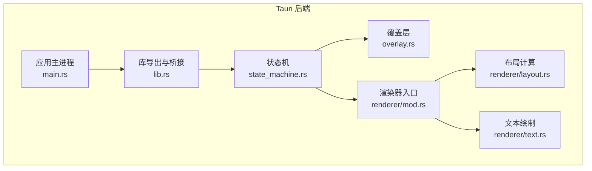
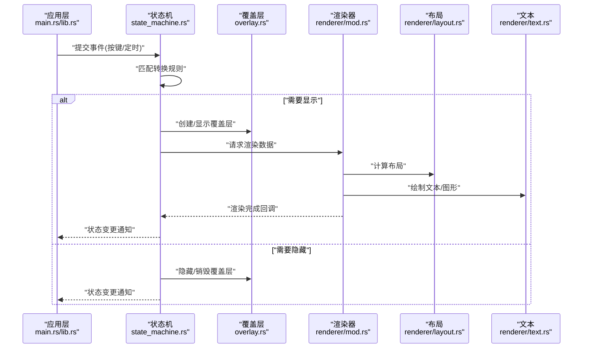
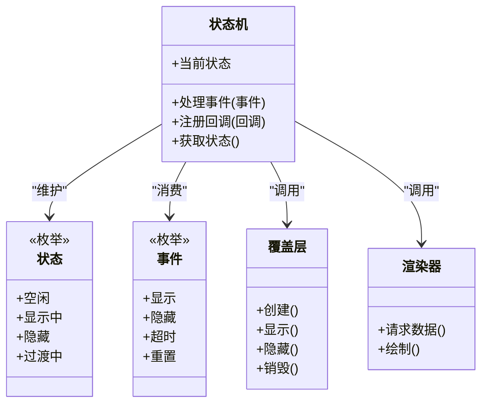
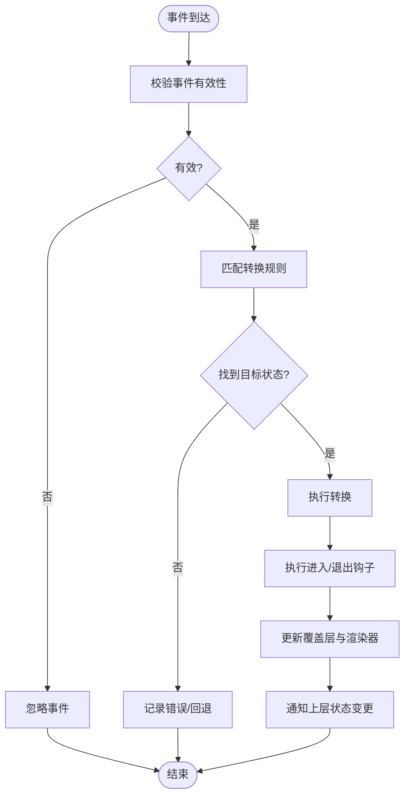
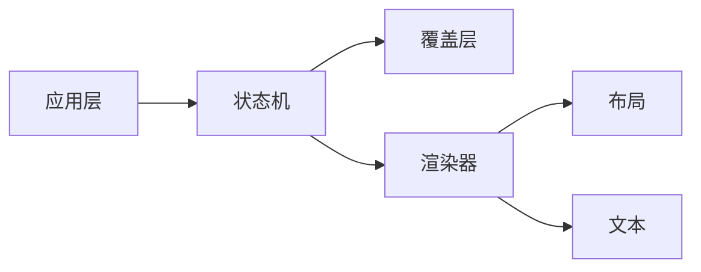

# 状态机模块

<cite>
**本文引用的文件**   
- [state_machine.rs](file://osd-bubble/src-tauri/src/state_machine.rs)
- [overlay.rs](file://osd-bubble/src-tauri/src/overlay.rs)
- [layout.rs](file://osd-bubble/src-tauri/src/renderer/layout.rs)
- [text.rs](file://osd-bubble/src-tauri/src/renderer/text.rs)
- [mod.rs](file://osd-bubble/src-tauri/src/renderer/mod.rs)
- [lib.rs](file://osd-bubble/src-tauri/src/lib.rs)
- [main.rs](file://osd-bubble/src-tauri/src/main.rs)
</cite>

## 目录
1. [简介](#简介)
2. [项目结构](#项目结构)
3. [核心组件](#核心组件)
4. [架构总览](#架构总览)
5. [详细组件分析](#详细组件分析)
6. [依赖关系分析](#依赖关系分析)
7. [性能考量](#性能考量)
8. [故障排查指南](#故障排查指南)
9. [结论](#结论)
10. [附录](#附录) 

## 简介
本文件为按键OSD可视化工具的状态机模块提供系统化文档。内容涵盖状态机的设计模式、状态转换逻辑与事件处理机制，详细说明各OSD状态（如空闲、显示中、隐藏等）的定义与转换条件，并给出Rust代码示例路径以展示如何定义新状态、处理状态转换事件与管理状态生命周期。同时记录状态机的API接口、事件类型与回调函数，解释与渲染器、覆盖层等其他模块的集成方式，并提供调试技巧与常见问题解决方案。

## 项目结构
状态机位于Tauri后端Rust工程中，主要文件包括：
- 状态机实现：state_machine.rs
- 覆盖层管理：overlay.rs
- 渲染器子模块：renderer/mod.rs、renderer/layout.rs、renderer/text.rs
- 应用入口与库导出：main.rs、lib.rs

图表来源
- [state_machine.rs](file://osd-bubble/src-tauri/src/state_machine.rs)
- [overlay.rs](file://osd-bubble/src-tauri/src/overlay.rs)
- [mod.rs](file://osd-bubble/src-tauri/src/renderer/mod.rs)
- [layout.rs](file://osd-bubble/src-tauri/src/renderer/layout.rs)
- [text.rs](file://osd-bubble/src-tauri/src/renderer/text.rs)
- [main.rs](file://osd-bubble/src-tauri/src/main.rs)
- [lib.rs](file://osd-bubble/src-tauri/src/lib.rs)

章节来源
- [state_machine.rs](file://osd-bubble/src-tauri/src/state_machine.rs)
- [overlay.rs](file://osd-bubble/src-tauri/src/overlay.rs)
- [mod.rs](file://osd-bubble/src-tauri/src/renderer/mod.rs)
- [layout.rs](file://osd-bubble/src-tauri/src/renderer/layout.rs)
- [text.rs](file://osd-bubble/src-tauri/src/renderer/text.rs)
- [main.rs](file://osd-bubble/src-tauri/src/main.rs)
- [lib.rs](file://osd-bubble/src-tauri/src/lib.rs)

## 核心组件
- 状态机（State Machine）
  - 职责：维护当前OSD状态、解析输入事件、驱动状态转换、触发渲染与覆盖层更新。
  - 关键能力：状态枚举、事件枚举、转换表或匹配逻辑、生命周期钩子（进入/退出）、异步任务协调。
- 覆盖层（Overlay）
  - 职责：创建/销毁窗口、设置层级与透明度、承载渲染内容。
  - 关键能力：窗口句柄管理、可见性控制、尺寸与位置同步。
- 渲染器（Renderer）
  - 职责：根据状态机提供的数据计算布局、绘制文本与图形。
  - 关键能力：布局计算、文本测量与绘制、帧更新调度。

章节来源
- [state_machine.rs](file://osd-bubble/src-tauri/src/state_machine.rs)
- [overlay.rs](file://osd-bubble/src-tauri/src/overlay.rs)
- [mod.rs](file://osd-bubble/src-tauri/src/renderer/mod.rs)
- [layout.rs](file://osd-bubble/src-tauri/src/renderer/layout.rs)
- [text.rs](file://osd-bubble/src-tauri/src/renderer/text.rs)

## 架构总览
状态机作为中枢，接收来自上层的事件（如按键、定时器），依据转换规则更新自身状态，并调用覆盖层与渲染器完成UI更新。渲染器内部通过布局与文本模块协作，确保在状态变化时高效重绘。

图表来源
- [state_machine.rs](file://osd-bubble/src-tauri/src/state_machine.rs)
- [overlay.rs](file://osd-bubble/src-tauri/src/overlay.rs)
- [mod.rs](file://osd-bubble/src-tauri/src/renderer/mod.rs)
- [layout.rs](file://osd-bubble/src-tauri/src/renderer/layout.rs)
- [text.rs](file://osd-bubble/src-tauri/src/renderer/text.rs)
- [main.rs](file://osd-bubble/src-tauri/src/main.rs)
- [lib.rs](file://osd-bubble/src-tauri/src/lib.rs)

## 详细组件分析

### 状态机设计与状态定义
- 设计模式
  - 使用枚举表示状态与事件，结合匹配/查表进行转换，保证可维护性与可扩展性。
  - 支持进入/退出钩子，便于执行资源准备与清理。
- 常见OSD状态
  - 空闲：无待显示的OSD内容，不占用渲染资源。
  - 显示中：已创建覆盖层并完成一次或多次渲染。
  - 隐藏：覆盖层存在但不可见，等待下一次显示。
  - 过渡中：用于动画或延迟切换的中间态。
- 转换条件
  - 从空闲到显示中：收到“显示”事件且具备有效内容。
  - 从显示中到隐藏：收到“隐藏”事件或超时。
  - 从隐藏到显示中：收到“显示”事件。
  - 任意状态到空闲：收到“重置”事件或系统级关闭。

章节来源
- [state_machine.rs](file://osd-bubble/src-tauri/src/state_machine.rs)

#### 类图（状态机相关类型）

图表来源
- [state_machine.rs](file://osd-bubble/src-tauri/src/state_machine.rs)
- [overlay.rs](file://osd-bubble/src-tauri/src/overlay.rs)
- [mod.rs](file://osd-bubble/src-tauri/src/renderer/mod.rs)

### 事件处理与转换流程
- 事件来源
  - 按键事件、定时器事件、外部命令（如配置变更）。
- 处理流程
  - 事件入队与去抖（避免重复触发）。
  - 基于当前状态与事件选择目标状态。
  - 执行进入/退出钩子，必要时启动/停止异步任务。
  - 通知渲染器与覆盖层进行UI更新。

图表来源
- [state_machine.rs](file://osd-bubble/src-tauri/src/state_machine.rs)

章节来源
- [state_machine.rs](file://osd-bubble/src-tauri/src/state_machine.rs)

### 与覆盖层的集成
- 覆盖层生命周期
  - 创建：首次显示时创建窗口与画布。
  - 显示/隐藏：根据状态切换可见性。
  - 销毁：空闲或退出时释放资源。
- 关键点
  - 避免重复创建/销毁导致的闪烁或崩溃。
  - 保持窗口层级正确，确保OSD始终在最前。

章节来源
- [overlay.rs](file://osd-bubble/src-tauri/src/overlay.rs)

### 与渲染器的集成
- 渲染管线
  - 状态机提供数据模型（文本、样式、位置）。
  - 渲染器计算布局并绘制文本/图形。
  - 渲染完成后回调状态机，以便推进状态或触发动画。
- 优化点
  - 增量更新：仅重绘变化的区域。
  - 批处理：合并多次绘制调用。

章节来源
- [mod.rs](file://osd-bubble/src-tauri/src/renderer/mod.rs)
- [layout.rs](file://osd-bubble/src-tauri/src/renderer/layout.rs)
- [text.rs](file://osd-bubble/src-tauri/src/renderer/text.rs)

### API接口、事件类型与回调
- 状态机API
  - 初始化：创建状态机实例，绑定覆盖层与渲染器。
  - 事件处理：提交事件并返回是否成功转换。
  - 状态查询：获取当前状态与历史栈（可选）。
  - 回调注册：订阅状态变更、渲染完成、错误事件。
- 事件类型
  - 显示、隐藏、超时、重置、配置变更。
- 回调函数
  - on_state_change：状态变更后触发。
  - on_render_done：渲染完成后触发。
  - on_error：错误发生时触发。

章节来源
- [state_machine.rs](file://osd-bubble/src-tauri/src/state_machine.rs)
- [lib.rs](file://osd-bubble/src-tauri/src/lib.rs)

### Rust代码示例路径
- 定义新状态
  - 参考：[state_machine.rs](file://osd-bubble/src-tauri/src/state_machine.rs)
- 处理状态转换事件
  - 参考：[state_machine.rs](file://osd-bubble/src-tauri/src/state_machine.rs)
- 管理状态生命周期（进入/退出钩子）
  - 参考：[state_machine.rs](file://osd-bubble/src-tauri/src/state_machine.rs)
- 与覆盖层交互（创建/显示/隐藏/销毁）
  - 参考：[overlay.rs](file://osd-bubble/src-tauri/src/overlay.rs)
- 与渲染器交互（请求数据/绘制/回调）
  - 参考：[mod.rs](file://osd-bubble/src-tauri/src/renderer/mod.rs)、[layout.rs](file://osd-bubble/src-tauri/src/renderer/layout.rs)、[text.rs](file://osd-bubble/src-tauri/src/renderer/text.rs)

## 依赖关系分析
- 耦合度
  - 状态机对覆盖层与渲染器存在直接依赖，建议通过接口抽象降低耦合。
- 循环依赖
  - 应避免状态机与渲染器之间的双向调用，采用回调或消息队列解耦。
- 外部依赖
  - Tauri窗口系统、绘图库、事件源（键盘/定时器）。

图表来源
- [state_machine.rs](file://osd-bubble/src-tauri/src/state_machine.rs)
- [overlay.rs](file://osd-bubble/src-tauri/src/overlay.rs)
- [mod.rs](file://osd-bubble/src-tauri/src/renderer/mod.rs)
- [layout.rs](file://osd-bubble/src-tauri/src/renderer/layout.rs)
- [text.rs](file://osd-bubble/src-tauri/src/renderer/text.rs)
- [main.rs](file://osd-bubble/src-tauri/src/main.rs)
- [lib.rs](file://osd-bubble/src-tauri/src/lib.rs)

章节来源
- [state_machine.rs](file://osd-bubble/src-tauri/src/state_machine.rs)
- [overlay.rs](file://osd-bubble/src-tauri/src/overlay.rs)
- [mod.rs](file://osd-bubble/src-tauri/src/renderer/mod.rs)
- [layout.rs](file://osd-bubble/src-tauri/src/renderer/layout.rs)
- [text.rs](file://osd-bubble/src-tauri/src/renderer/text.rs)
- [main.rs](file://osd-bubble/src-tauri/src/main.rs)
- [lib.rs](file://osd-bubble/src-tauri/src/lib.rs)

## 性能考量
- 事件去抖与节流：减少频繁状态切换带来的渲染压力。
- 增量渲染：仅在内容变化时重绘，避免全量刷新。
- 资源复用：复用覆盖层窗口与渲染上下文，避免频繁创建销毁。
- 异步任务：将耗时操作放入后台线程，避免阻塞UI。

## 故障排查指南
- 常见问题
  - 状态卡死：检查事件匹配逻辑与转换表完整性。
  - 闪烁问题：确认覆盖层创建/销毁时机与动画过渡。
  - 渲染错位：核对布局计算与坐标变换。
  - 内存泄漏：确保退出钩子释放资源。
- 调试技巧
  - 启用状态机日志：记录事件、状态转换与钩子执行。
  - 可视化状态栈：打印当前状态与历史栈。
  - 断点测试：针对边界事件（快速连续点击、超时）验证鲁棒性。

章节来源
- [state_machine.rs](file://osd-bubble/src-tauri/src/state_machine.rs)
- [overlay.rs](file://osd-bubble/src-tauri/src/overlay.rs)
- [mod.rs](file://osd-bubble/src-tauri/src/renderer/mod.rs)

## 结论
状态机模块通过清晰的状态定义与事件驱动转换，实现了OSD可视化的稳定与可扩展。与覆盖层和渲染器的良好集成确保了高效的UI更新。遵循本文档的设计与实践，可在保持低耦合的同时快速扩展新状态与功能。

## 附录
- 术语表
  - OSD：On-Screen Display，屏幕显示信息。
  - 覆盖层：悬浮于其他窗口之上的透明窗口。
  - 渲染器：负责绘制UI内容的子系统。
- 最佳实践
  - 使用枚举表达状态与事件，避免魔法字符串。
  - 将转换规则集中管理，便于审计与测试。
  - 为每个状态编写单元测试，覆盖边界条件。