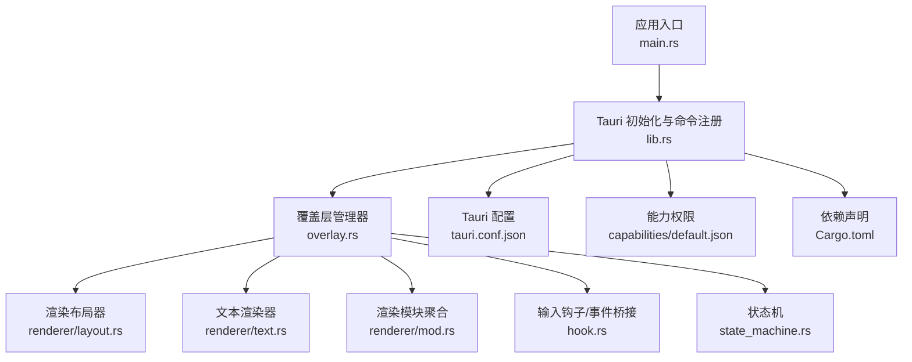
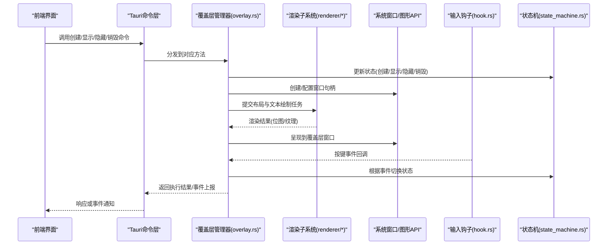
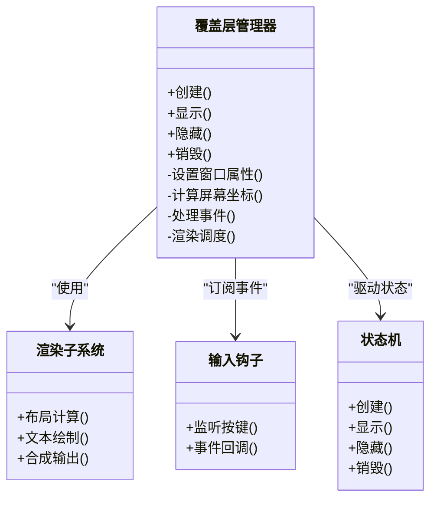
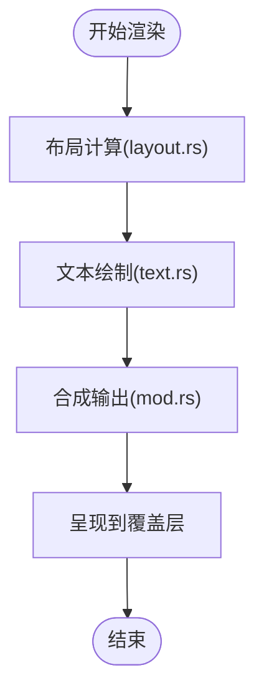
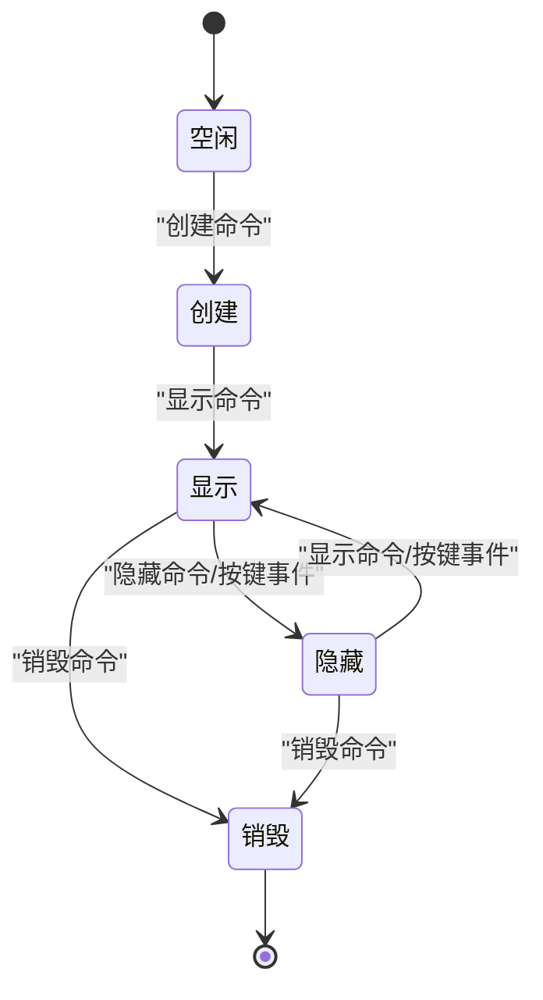
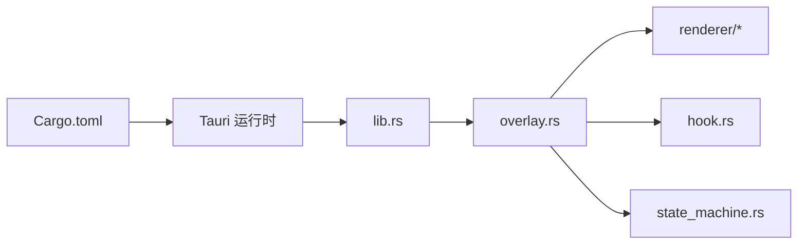

# 覆盖层管理

<cite>
**本文引用的文件**   
- [overlay.rs](file://osd-bubble/src-tauri/src/overlay.rs)
- [lib.rs](file://osd-bubble/src-tauri/src/lib.rs)
- [main.rs](file://osd-bubble/src-tauri/src/main.rs)
- [layout.rs](file://osd-bubble/src-tauri/src/renderer/layout.rs)
- [text.rs](file://osd-bubble/src-tauri/src/renderer/text.rs)
- [mod.rs](file://osd-bubble/src-tauri/src/renderer/mod.rs)
- [hook.rs](file://osd-bubble/src-tauri/src/hook.rs)
- [state_machine.rs](file://osd-bubble/src-tauri/src/state_machine.rs)
- [Cargo.toml](file://osd-bubble/src-tauri/Cargo.toml)
- [tauri.conf.json](file://osd-bubble/src-tauri/tauri.conf.json)
- [default.json](file://osd-bubble/src-tauri/capabilities/default.json)
</cite>

## 目录
1. [简介](#简介)
2. [项目结构](#项目结构)
3. [核心组件](#核心组件)
4. [架构总览](#架构总览)
5. [详细组件分析](#详细组件分析)
6. [依赖关系分析](#依赖关系分析)
7. [性能考虑](#性能考虑)
8. [故障排查指南](#故障排查指南)
9. [结论](#结论)
10. [附录](#附录)

## 简介
本文件面向按键OSD可视化工具的“覆盖层管理模块”，系统性阐述覆盖层的创建、显示、隐藏与销毁机制，窗口句柄管理、屏幕坐标计算与多显示器支持，以及跨平台兼容性与权限要求。文档同时给出基于仓库中Rust代码的结构化说明与调用流程，帮助开发者快速理解并扩展覆盖层能力。

## 项目结构
本项目采用Tauri + Svelte的前后端分离架构：前端负责UI与交互，后端通过Rust实现系统级覆盖层渲染与窗口管理。关键路径如下：
- Rust后端入口与命令注册：main.rs、lib.rs
- 覆盖层核心逻辑：overlay.rs
- 渲染子系统：renderer/layout.rs、renderer/text.rs、renderer/mod.rs
- 钩子与状态机：hook.rs、state_machine.rs
- Tauri配置与权限：tauri.conf.json、capabilities/default.json
- 依赖声明：Cargo.toml

图表来源
- [main.rs:1-200](file://osd-bubble/src-tauri/src/main.rs#L1-L200)
- [lib.rs:1-200](file://osd-bubble/src-tauri/src/lib.rs#L1-L200)
- [overlay.rs:1-200](file://osd-bubble/src-tauri/src/overlay.rs#L1-L200)
- [layout.rs:1-200](file://osd-bubble/src-tauri/src/renderer/layout.rs#L1-L200)
- [text.rs:1-200](file://osd-bubble/src-tauri/src/renderer/text.rs#L1-L200)
- [mod.rs:1-200](file://osd-bubble/src-tauri/src/renderer/mod.rs#L1-L200)
- [hook.rs:1-200](file://osd-bubble/src-tauri/src/hook.rs#L1-L200)
- [state_machine.rs:1-200](file://osd-bubble/src-tauri/src/state_machine.rs#L1-L200)
- [tauri.conf.json:1-200](file://osd-bubble/src-tauri/tauri.conf.json#L1-L200)
- [default.json:1-200](file://osd-bubble/src-tauri/capabilities/default.json#L1-L200)
- [Cargo.toml:1-200](file://osd-bubble/src-tauri/Cargo.toml#L1-L200)

章节来源
- [main.rs:1-200](file://osd-bubble/src-tauri/src/main.rs#L1-L200)
- [lib.rs:1-200](file://osd-bubble/src-tauri/src/lib.rs#L1-L200)
- [Cargo.toml:1-200](file://osd-bubble/src-tauri/Cargo.toml#L1-L200)
- [tauri.conf.json:1-200](file://osd-bubble/src-tauri/tauri.conf.json#L1-L200)
- [default.json:1-200](file://osd-bubble/src-tauri/capabilities/default.json#L1-L200)

## 核心组件
- 覆盖层管理器（overlay.rs）
  - 职责：覆盖层生命周期管理（创建、显示、隐藏、销毁）、窗口属性设置、屏幕坐标计算、多显示器适配、事件桥接。
  - 关键点：窗口句柄抽象、平台无关API封装、渲染管线对接。
- 渲染子系统（renderer/*）
  - 职责：布局计算、文本绘制、图层合成。
  - 关键点：高性能绘制路径、字体与度量、抗锯齿与透明度。
- 钩子与状态机（hook.rs、state_machine.rs）
  - 职责：系统输入捕获、按键事件转发、覆盖层状态转换。
  - 关键点：低延迟事件通道、状态一致性、错误恢复。
- Tauri集成（lib.rs、main.rs、tauri.conf.json、capabilities/default.json）
  - 职责：命令暴露、权限控制、进程启动与资源清理。
  - 关键点：安全边界、最小权限原则、跨平台差异处理。

章节来源
- [overlay.rs:1-200](file://osd-bubble/src-tauri/src/overlay.rs#L1-L200)
- [layout.rs:1-200](file://osd-bubble/src-tauri/src/renderer/layout.rs#L1-L200)
- [text.rs:1-200](file://osd-bubble/src-tauri/src/renderer/text.rs#L1-L200)
- [mod.rs:1-200](file://osd-bubble/src-tauri/src/renderer/mod.rs#L1-L200)
- [hook.rs:1-200](file://osd-bubble/src-tauri/src/hook.rs#L1-L200)
- [state_machine.rs:1-200](file://osd-bubble/src-tauri/src/state_machine.rs#L1-L200)
- [lib.rs:1-200](file://osd-bubble/src-tauri/src/lib.rs#L1-L200)
- [main.rs:1-200](file://osd-bubble/src-tauri/src/main.rs#L1-L200)
- [tauri.conf.json:1-200](file://osd-bubble/src-tauri/tauri.conf.json#L1-L200)
- [default.json:1-200](file://osd-bubble/src-tauri/capabilities/default.json#L1-L200)

## 架构总览
覆盖层管理模块以“命令驱动”的方式工作：前端通过Tauri命令触发后端操作，后端由overlay.rs协调渲染与窗口系统，hook.rs捕获用户输入，state_machine.rs维护状态流转。

图表来源
- [lib.rs:1-200](file://osd-bubble/src-tauri/src/lib.rs#L1-L200)
- [overlay.rs:1-200](file://osd-bubble/src-tauri/src/overlay.rs#L1-L200)
- [layout.rs:1-200](file://osd-bubble/src-tauri/src/renderer/layout.rs#L1-L200)
- [text.rs:1-200](file://osd-bubble/src-tauri/src/renderer/text.rs#L1-L200)
- [mod.rs:1-200](file://osd-bubble/src-tauri/src/renderer/mod.rs#L1-L200)
- [hook.rs:1-200](file://osd-bubble/src-tauri/src/hook.rs#L1-L200)
- [state_machine.rs:1-200](file://osd-bubble/src-tauri/src/state_machine.rs#L1-L200)

## 详细组件分析

### 覆盖层管理器（overlay.rs）
- 生命周期方法
  - 创建：分配窗口句柄、设置透明背景、置顶、无边框、穿透点击等属性；初始化渲染上下文。
  - 显示：绑定内容缓冲区、刷新帧、确保在多显示器环境下正确定位。
  - 隐藏：暂停渲染、保留句柄以便快速恢复。
  - 销毁：释放渲染资源、关闭窗口句柄、清理内存。
- 窗口句柄管理
  - 抽象平台差异，统一获取/设置窗口属性（层级、样式、可见性）。
  - 处理高DPI缩放与窗口尺寸同步。
- 屏幕坐标与多显示器
  - 枚举显示器、计算主屏与工作区矩形、按目标显示器映射坐标。
  - 处理混合DPI与虚拟桌面场景。
- 事件处理
  - 接收hook.rs传入的按键事件，触发状态机切换（如显示/隐藏）。
  - 提供可配置的过滤规则与节流策略。

图表来源
- [overlay.rs:1-200](file://osd-bubble/src-tauri/src/overlay.rs#L1-L200)
- [layout.rs:1-200](file://osd-bubble/src-tauri/src/renderer/layout.rs#L1-L200)
- [text.rs:1-200](file://osd-bubble/src-tauri/src/renderer/text.rs#L1-L200)
- [mod.rs:1-200](file://osd-bubble/src-tauri/src/renderer/mod.rs#L1-L200)
- [hook.rs:1-200](file://osd-bubble/src-tauri/src/hook.rs#L1-L200)
- [state_machine.rs:1-200](file://osd-bubble/src-tauri/src/state_machine.rs#L1-L200)

章节来源
- [overlay.rs:1-200](file://osd-bubble/src-tauri/src/overlay.rs#L1-L200)
- [state_machine.rs:1-200](file://osd-bubble/src-tauri/src/state_machine.rs#L1-L200)
- [hook.rs:1-200](file://osd-bubble/src-tauri/src/hook.rs#L1-L200)

### 渲染子系统（renderer/*）
- layout.rs：负责布局计算，包括对齐、边距、换行、容器嵌套等。
- text.rs：负责文本测量、字形渲染、颜色与透明度处理。
- mod.rs：聚合渲染管线，协调布局与文本绘制，输出最终帧。

图表来源
- [layout.rs:1-200](file://osd-bubble/src-tauri/src/renderer/layout.rs#L1-L200)
- [text.rs:1-200](file://osd-bubble/src-tauri/src/renderer/text.rs#L1-L200)
- [mod.rs:1-200](file://osd-bubble/src-tauri/src/renderer/mod.rs#L1-L200)

章节来源
- [layout.rs:1-200](file://osd-bubble/src-tauri/src/renderer/layout.rs#L1-L200)
- [text.rs:1-200](file://osd-bubble/src-tauri/src/renderer/text.rs#L1-L200)
- [mod.rs:1-200](file://osd-bubble/src-tauri/src/renderer/mod.rs#L1-L200)

### 钩子与状态机（hook.rs、state_machine.rs）
- hook.rs：全局键盘钩子，捕获按键事件并转发至覆盖层管理器。
- state_machine.rs：定义覆盖层状态（空闲、创建、显示、隐藏、销毁），保证状态转换合法且可恢复。

图表来源
- [hook.rs:1-200](file://osd-bubble/src-tauri/src/hook.rs#L1-L200)
- [state_machine.rs:1-200](file://osd-bubble/src-tauri/src/state_machine.rs#L1-L200)

章节来源
- [hook.rs:1-200](file://osd-bubble/src-tauri/src/hook.rs#L1-L200)
- [state_machine.rs:1-200](file://osd-bubble/src-tauri/src/state_machine.rs#L1-L200)

### Tauri集成与权限（lib.rs、main.rs、tauri.conf.json、capabilities/default.json）
- lib.rs/main.rs：注册命令、初始化Tauri应用、加载能力配置。
- tauri.conf.json：窗口、插件、构建与运行参数。
- capabilities/default.json：最小权限策略，限制覆盖层对系统资源的访问范围。

章节来源
- [lib.rs:1-200](file://osd-bubble/src-tauri/src/lib.rs#L1-L200)
- [main.rs:1-200](file://osd-bubble/src-tauri/src/main.rs#L1-L200)
- [tauri.conf.json:1-200](file://osd-bubble/src-tauri/tauri.conf.json#L1-L200)
- [default.json:1-200](file://osd-bubble/src-tauri/capabilities/default.json#L1-L200)

## 依赖关系分析
- 外部依赖：Tauri运行时、平台窗口/图形库（Windows/GDI+或DX、macOS/Quartz、Linux/X11/Wayland）。
- 内部依赖：overlay.rs依赖renderer/*进行绘制，依赖hook.rs获取输入，依赖state_machine.rs管理状态。
- 耦合度：overlay.rs作为中枢，保持高内聚；渲染与输入解耦，便于替换与测试。

图表来源
- [Cargo.toml:1-200](file://osd-bubble/src-tauri/Cargo.toml#L1-L200)
- [lib.rs:1-200](file://osd-bubble/src-tauri/src/lib.rs#L1-L200)
- [overlay.rs:1-200](file://osd-bubble/src-tauri/src/overlay.rs#L1-L200)
- [layout.rs:1-200](file://osd-bubble/src-tauri/src/renderer/layout.rs#L1-L200)
- [text.rs:1-200](file://osd-bubble/src-tauri/src/renderer/text.rs#L1-L200)
- [mod.rs:1-200](file://osd-bubble/src-tauri/src/renderer/mod.rs#L1-L200)
- [hook.rs:1-200](file://osd-bubble/src-tauri/src/hook.rs#L1-L200)
- [state_machine.rs:1-200](file://osd-bubble/src-tauri/src/state_machine.rs#L1-L200)

章节来源
- [Cargo.toml:1-200](file://osd-bubble/src-tauri/Cargo.toml#L1-L200)
- [lib.rs:1-200](file://osd-bubble/src-tauri/src/lib.rs#L1-L200)
- [overlay.rs:1-200](file://osd-bubble/src-tauri/src/overlay.rs#L1-L200)

## 性能考虑
- 渲染优化
  - 增量更新：仅重绘变化区域，避免全量刷新。
  - 批处理绘制：合并多次绘制调用，减少GPU/CPU开销。
  - 字体缓存：预计算字形与度量，降低重复计算。
- 事件处理
  - 事件节流与去抖：避免高频按键导致频繁状态切换。
  - 异步派发：将耗时操作放入后台线程，保持UI流畅。
- 内存与句柄
  - 及时释放：隐藏时暂停渲染，销毁时释放所有资源。
  - 句柄复用：在显示/隐藏之间复用窗口句柄，减少创建成本。

[本节为通用指导，不直接分析具体文件]

## 故障排查指南
- 覆盖层不显示
  - 检查窗口属性是否被系统策略拦截（如UAC、沙箱）。
  - 确认多显示器坐标计算是否正确，目标显示器是否存在。
  - 验证渲染管线是否正常输出帧。
- 按键无响应
  - 确认钩子已安装且未被其他程序占用。
  - 检查事件过滤规则是否误屏蔽。
- 闪烁或撕裂
  - 启用双缓冲/垂直同步。
  - 调整刷新频率与绘制时机。
- 权限不足
  - 查看capabilities/default.json是否授予必要权限。
  - 提升进程权限（管理员/辅助功能）并按需提示用户授权。

章节来源
- [hook.rs:1-200](file://osd-bubble/src-tauri/src/hook.rs#L1-L200)
- [overlay.rs:1-200](file://osd-bubble/src-tauri/src/overlay.rs#L1-L200)
- [default.json:1-200](file://osd-bubble/src-tauri/capabilities/default.json#L1-L200)

## 结论
覆盖层管理模块通过清晰的职责划分与稳定的状态机设计，实现了跨平台的按键OSD可视化能力。借助Tauri的安全边界与最小权限模型，结合高效的渲染与事件处理，能够在多显示器与高DPI环境下稳定工作。建议在生产环境中严格遵循权限配置与性能优化实践，确保用户体验与系统稳定性。

[本节为总结性内容，不直接分析具体文件]

## 附录

### 覆盖层API接口与配置参数
- 覆盖层生命周期API
  - 创建：初始化窗口句柄与渲染上下文，设置基础属性（无边框、透明、置顶）。
  - 显示：绑定内容缓冲区，刷新帧，确保坐标与显示器匹配。
  - 隐藏：暂停渲染，保留句柄以便快速恢复。
  - 销毁：释放渲染资源，关闭窗口句柄。
- 窗口属性配置
  - 层级：始终置顶或跟随特定窗口。
  - 样式：无边框、透明背景、穿透点击。
  - 尺寸与位置：固定尺寸或自适应内容，支持锚点与偏移。
- 屏幕坐标与多显示器
  - 枚举显示器与工作区矩形。
  - 按目标显示器映射坐标，处理混合DPI与虚拟桌面。
- 事件处理
  - 按键事件过滤与路由。
  - 自定义快捷键组合触发显示/隐藏。
- 权限与安全
  - 最小权限原则：仅申请必要的系统访问能力。
  - 用户授权：必要时提示用户授予辅助功能或管理员权限。

章节来源
- [overlay.rs:1-200](file://osd-bubble/src-tauri/src/overlay.rs#L1-L200)
- [tauri.conf.json:1-200](file://osd-bubble/src-tauri/tauri.conf.json#L1-L200)
- [default.json:1-200](file://osd-bubble/src-tauri/capabilities/default.json#L1-L200)

### 跨平台兼容性说明
- Windows
  - 使用GDI+/DirectX进行绘制，窗口属性通过Win32 API设置。
  - 注意UAC与沙箱限制，必要时请求管理员权限。
- macOS
  - 使用Quartz/CoreGraphics进行绘制，窗口属性通过Cocoa API设置。
  - 需要辅助功能权限以捕获全局按键事件。
- Linux
  - X11/Wayland差异较大，建议使用抽象层封装平台差异。
  - 某些发行版对全局钩子有额外限制。

[本节为通用说明，不直接分析具体文件]

### 常见覆盖层问题解决方案
- 覆盖层被其他窗口遮挡
  - 调整窗口层级，确保置顶或使用独占模式。
- 文字模糊或错位
  - 校准DPI缩放，重新计算布局与文本度量。
- 按键冲突
  - 修改默认快捷键，避免与系统或游戏冲突。
- 崩溃或卡顿
  - 检查资源泄漏与渲染瓶颈，启用日志定位问题。

[本节为通用指导，不直接分析具体文件]