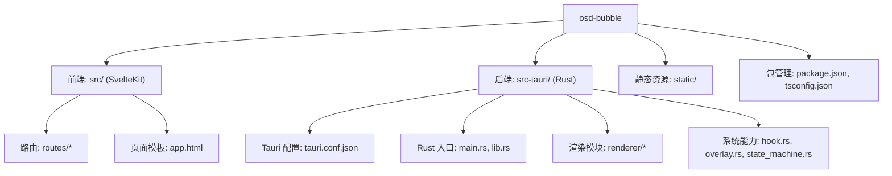
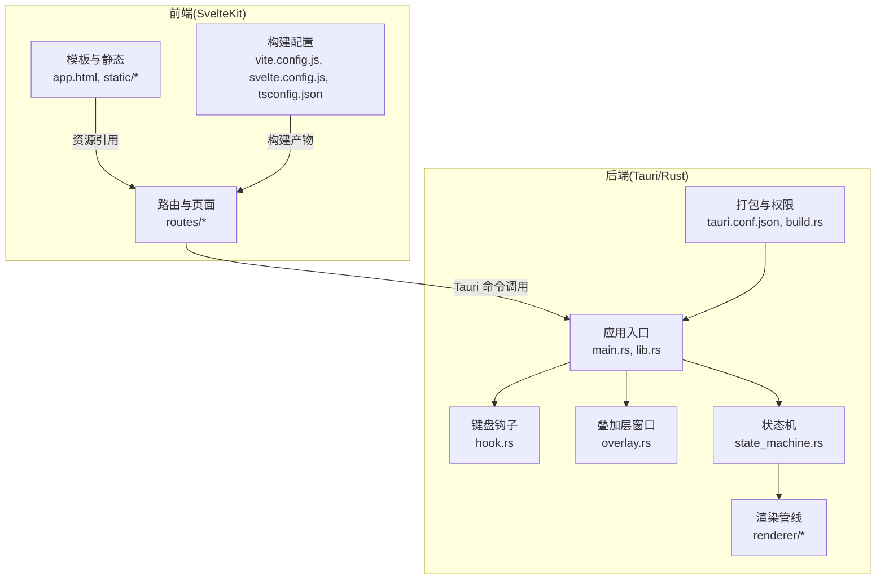
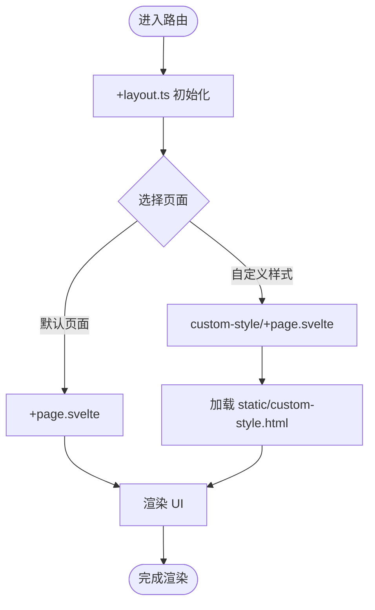
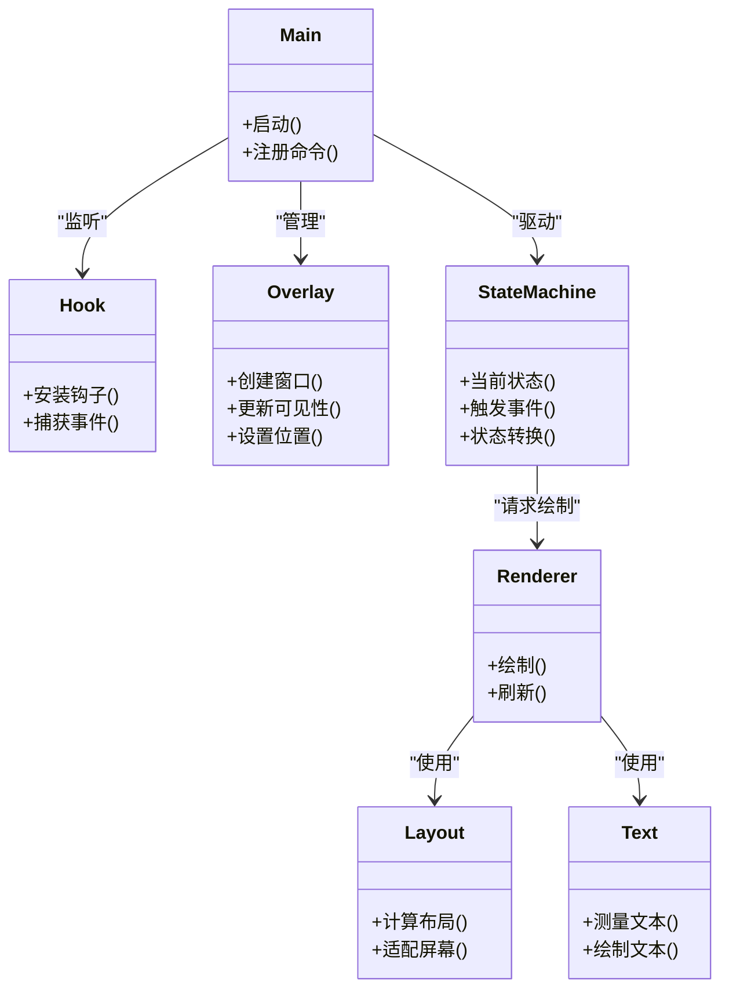
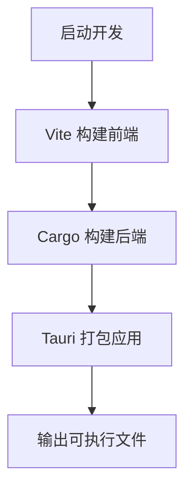
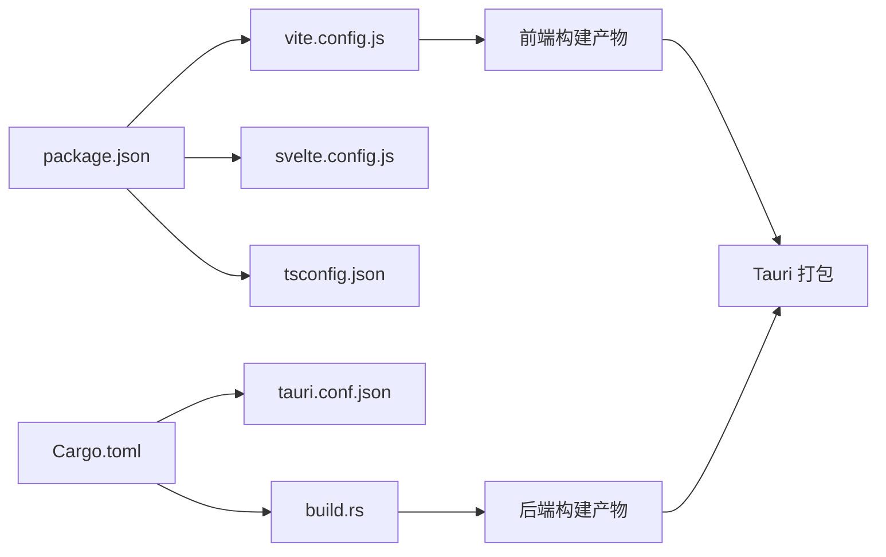

# 开发指南

<cite>
**本文档引用的文件**   
- [按键OSD可视化工具-交互规格说明书.md](file://按键OSD可视化工具-交互规格说明书.md)
- [按键OSD可视化工具-交互原型.html](file://按键OSD可视化工具-交互原型.html)
- [osd-bubble/package.json](file://osd-bubble/package.json)
- [osd-bubble/svelte.config.js](file://osd-bubble/svelte.config.js)
- [osd-bubble/vite.config.js](file://osd-bubble/vite.config.js)
- [osd-bubble/tsconfig.json](file://osd-bubble/tsconfig.json)
- [osd-bubble/src/app.html](file://osd-bubble/src/app.html)
- [osd-bubble/src/routes/+layout.ts](file://osd-bubble/src/routes/+layout.ts)
- [osd-bubble/src/routes/+page.svelte](file://osd-bubble/src/routes/+page.svelte)
- [osd-bubble/src/routes/custom-style/+page.svelte](file://osd-bubble/src/routes/custom-style/+page.svelte)
- [osd-bubble/src/routes/custom-style/+page.ts](file://osd-bubble/src/routes/custom-style/+page.ts)
- [osd-bubble/static/custom-style.html](file://osd-bubble/static/custom-style.html)
- [osd-bubble/src-tauri/Cargo.toml](file://osd-bubble/src-tauri/Cargo.toml)
- [osd-bubble/src-tauri/tauri.conf.json](file://osd-bubble/src-tauri/tauri.conf.json)
- [osd-bubble/src-tauri/build.rs](file://osd-bubble/src-tauri/build.rs)
- [osd-bubble/src-tauri/src/lib.rs](file://osd-bubble/src-tauri/src/lib.rs)
- [osd-bubble/src-tauri/src/main.rs](file://osd-bubble/src-tauri/src/main.rs)
- [osd-bubble/src-tauri/src/hook.rs](file://osd-bubble/src-tauri/src/hook.rs)
- [osd-bubble/src-tauri/src/overlay.rs](file://osd-bubble/src-tauri/src/overlay.rs)
- [osd-bubble/src-tauri/src/state_machine.rs](file://osd-bubble/src-tauri/src/state_machine.rs)
- [osd-bubble/src-tauri/src/renderer/mod.rs](file://osd-bubble/src-tauri/src/renderer/mod.rs)
- [osd-bubble/src-tauri/src/renderer/layout.rs](file://osd-bubble/src-tauri/src/renderer/layout.rs)
- [osd-bubble/src-tauri/src/renderer/text.rs](file://osd-bubble/src-tauri/src/renderer/text.rs)
</cite>

## 目录
1. [简介](#简介)
2. [项目结构](#项目结构)
3. [核心组件](#核心组件)
4. [架构总览](#架构总览)
5. [详细组件分析](#详细组件分析)
6. [依赖分析](#依赖分析)
7. [性能考虑](#性能考虑)
8. [故障排除指南](#故障排除指南)
9. [结论](#结论)
10. [附录](#附录)

## 简介
本指南面向按键OSD可视化工具的开发者，覆盖从环境搭建、构建发布到功能扩展与测试的全流程。项目采用 Tauri + SvelteKit 的前后端一体化方案：前端使用 SvelteKit/Vite 提供可视化界面与样式定制能力；后端使用 Rust/Tauri 负责系统级能力（如键盘钩子、窗口叠加层渲染、状态机驱动）。文档将帮助你快速上手并高效迭代。

## 项目结构
项目根目录包含两个关键部分：
- osd-bubble：Tauri 应用工程，内含前端（SvelteKit）与后端（Rust）源码及配置。
- 交互原型与规格说明：用于产品定义与交互规范参考。

图表来源
- [osd-bubble/package.json](file://osd-bubble/package.json)
- [osd-bubble/svelte.config.js](file://osd-bubble/svelte.config.js)
- [osd-bubble/vite.config.js](file://osd-bubble/vite.config.js)
- [osd-bubble/tsconfig.json](file://osd-bubble/tsconfig.json)
- [osd-bubble/src/app.html](file://osd-bubble/src/app.html)
- [osd-bubble/src/routes/+layout.ts](file://osd-bubble/src/routes/+layout.ts)
- [osd-bubble/src/routes/+page.svelte](file://osd-bubble/src/routes/+page.svelte)
- [osd-bubble/src/routes/custom-style/+page.svelte](file://osd-bubble/src/routes/custom-style/+page.svelte)
- [osd-bubble/src/routes/custom-style/+page.ts](file://osd-bubble/src/routes/custom-style/+page.ts)
- [osd-bubble/static/custom-style.html](file://osd-bubble/static/custom-style.html)
- [osd-bubble/src-tauri/Cargo.toml](file://osd-bubble/src-tauri/Cargo.toml)
- [osd-bubble/src-tauri/tauri.conf.json](file://osd-bubble/src-tauri/tauri.conf.json)
- [osd-bubble/src-tauri/build.rs](file://osd-bubble/src-tauri/build.rs)
- [osd-bubble/src-tauri/src/lib.rs](file://osd-bubble/src-tauri/src/lib.rs)
- [osd-bubble/src-tauri/src/main.rs](file://osd-bubble/src-tauri/src/main.rs)
- [osd-bubble/src-tauri/src/hook.rs](file://osd-bubble/src-tauri/src/hook.rs)
- [osd-bubble/src-tauri/src/overlay.rs](file://osd-bubble/src-tauri/src/overlay.rs)
- [osd-bubble/src-tauri/src/state_machine.rs](file://osd-bubble/src-tauri/src/state_machine.rs)
- [osd-bubble/src-tauri/src/renderer/mod.rs](file://osd-bubble/src-tauri/src/renderer/mod.rs)
- [osd-bubble/src-tauri/src/renderer/layout.rs](file://osd-bubble/src-tauri/src/renderer/layout.rs)
- [osd-bubble/src-tauri/src/renderer/text.rs](file://osd-bubble/src-tauri/src/renderer/text.rs)

章节来源
- [按键OSD可视化工具-交互规格说明书.md](file://按键OSD可视化工具-交互规格说明书.md)
- [按键OSD可视化工具-交互原型.html](file://按键OSD可视化工具-交互原型.html)
- [osd-bubble/package.json](file://osd-bubble/package.json)
- [osd-bubble/svelte.config.js](file://osd-bubble/svelte.config.js)
- [osd-bubble/vite.config.js](file://osd-bubble/vite.config.js)
- [osd-bubble/tsconfig.json](file://osd-bubble/tsconfig.json)
- [osd-bubble/src/app.html](file://osd-bubble/src/app.html)
- [osd-bubble/src/routes/+layout.ts](file://osd-bubble/src/routes/+layout.ts)
- [osd-bubble/src/routes/+page.svelte](file://osd-bubble/src/routes/+page.svelte)
- [osd-bubble/src/routes/custom-style/+page.svelte](file://osd-bubble/src/routes/custom-style/+page.svelte)
- [osd-bubble/src/routes/custom-style/+page.ts](file://osd-bubble/src/routes/custom-style/+page.ts)
- [osd-bubble/static/custom-style.html](file://osd-bubble/static/custom-style.html)
- [osd-bubble/src-tauri/Cargo.toml](file://osd-bubble/src-tauri/Cargo.toml)
- [osd-bubble/src-tauri/tauri.conf.json](file://osd-bubble/src-tauri/tauri.conf.json)
- [osd-bubble/src-tauri/build.rs](file://osd-bubble/src-tauri/build.rs)
- [osd-bubble/src-tauri/src/lib.rs](file://osd-bubble/src-tauri/src/lib.rs)
- [osd-bubble/src-tauri/src/main.rs](file://osd-bubble/src-tauri/src/main.rs)
- [osd-bubble/src-tauri/src/hook.rs](file://osd-bubble/src-tauri/src/hook.rs)
- [osd-bubble/src-tauri/src/overlay.rs](file://osd-bubble/src-tauri/src/overlay.rs)
- [osd-bubble/src-tauri/src/state_machine.rs](file://osd-bubble/src-tauri/src/state_machine.rs)
- [osd-bubble/src-tauri/src/renderer/mod.rs](file://osd-bubble/src-tauri/src/renderer/mod.rs)
- [osd-bubble/src-tauri/src/renderer/layout.rs](file://osd-bubble/src-tauri/src/renderer/layout.rs)
- [osd-bubble/src-tauri/src/renderer/text.rs](file://osd-bubble/src-tauri/src/renderer/text.rs)

## 核心组件
- 前端（SvelteKit）
  - 路由与页面：routes 目录组织页面与布局，+layout.ts 提供全局布局逻辑，+page.svelte 为默认页面，custom-style 子路由演示样式注入与自定义内容加载。
  - 构建与类型：vite.config.js 控制开发与构建行为；tsconfig.json 统一 TypeScript 编译选项；svelte.config.js 集成 Svelte 插件与适配。
  - 模板与静态资源：src/app.html 为 HTML 模板；static 目录存放可被直接访问的资源（如 custom-style.html）。
- 后端（Tauri/Rust）
  - 应用入口与命令：main.rs 启动 Tauri 应用；lib.rs 注册命令与插件；Cargo.toml 声明依赖与特性。
  - 系统能力：hook.rs 处理键盘事件捕获；overlay.rs 管理 OSD 叠加层窗口；state_machine.rs 驱动显示状态流转。
  - 渲染管线：renderer/mod.rs 聚合渲染模块；layout.rs 负责布局计算；text.rs 负责文本绘制与字体处理。
  - 打包与权限：build.rs 在构建期生成必要资源或执行脚本；tauri.conf.json 定义窗口、权限与资源路径。

章节来源
- [osd-bubble/src/routes/+layout.ts](file://osd-bubble/src/routes/+layout.ts)
- [osd-bubble/src/routes/+page.svelte](file://osd-bubble/src/routes/+page.svelte)
- [osd-bubble/src/routes/custom-style/+page.svelte](file://osd-bubble/src/routes/custom-style/+page.svelte)
- [osd-bubble/src/routes/custom-style/+page.ts](file://osd-bubble/src/routes/custom-style/+page.ts)
- [osd-bubble/src/app.html](file://osd-bubble/src/app.html)
- [osd-bubble/static/custom-style.html](file://osd-bubble/static/custom-style.html)
- [osd-bubble/vite.config.js](file://osd-bubble/vite.config.js)
- [osd-bubble/svelte.config.js](file://osd-bubble/svelte.config.js)
- [osd-bubble/tsconfig.json](file://osd-bubble/tsconfig.json)
- [osd-bubble/src-tauri/src/main.rs](file://osd-bubble/src-tauri/src/main.rs)
- [osd-bubble/src-tauri/src/lib.rs](file://osd-bubble/src-tauri/src/lib.rs)
- [osd-bubble/src-tauri/Cargo.toml](file://osd-bubble/src-tauri/Cargo.toml)
- [osd-bubble/src-tauri/src/hook.rs](file://osd-bubble/src-tauri/src/hook.rs)
- [osd-bubble/src-tauri/src/overlay.rs](file://osd-bubble/src-tauri/src/overlay.rs)
- [osd-bubble/src-tauri/src/state_machine.rs](file://osd-bubble/src-tauri/src/state_machine.rs)
- [osd-bubble/src-tauri/src/renderer/mod.rs](file://osd-bubble/src-tauri/src/renderer/mod.rs)
- [osd-bubble/src-tauri/src/renderer/layout.rs](file://osd-bubble/src-tauri/src/renderer/layout.rs)
- [osd-bubble/src-tauri/src/renderer/text.rs](file://osd-bubble/src-tauri/src/renderer/text.rs)
- [osd-bubble/src-tauri/build.rs](file://osd-bubble/src-tauri/build.rs)
- [osd-bubble/src-tauri/tauri.conf.json](file://osd-bubble/src-tauri/tauri.conf.json)

## 架构总览
整体架构由“前端 UI + 后端系统能力”组成，通过 Tauri 的命令通道进行通信。前端负责展示与用户交互，后端负责键盘钩子、窗口管理与渲染。

图表来源
- [osd-bubble/src/routes/+layout.ts](file://osd-bubble/src/routes/+layout.ts)
- [osd-bubble/src/routes/+page.svelte](file://osd-bubble/src/routes/+page.svelte)
- [osd-bubble/src/routes/custom-style/+page.svelte](file://osd-bubble/src/routes/custom-style/+page.svelte)
- [osd-bubble/src/routes/custom-style/+page.ts](file://osd-bubble/src/routes/custom-style/+page.ts)
- [osd-bubble/src/app.html](file://osd-bubble/src/app.html)
- [osd-bubble/static/custom-style.html](file://osd-bubble/static/custom-style.html)
- [osd-bubble/vite.config.js](file://osd-bubble/vite.config.js)
- [osd-bubble/svelte.config.js](file://osd-bubble/svelte.config.js)
- [osd-bubble/tsconfig.json](file://osd-bubble/tsconfig.json)
- [osd-bubble/src-tauri/src/main.rs](file://osd-bubble/src-tauri/src/main.rs)
- [osd-bubble/src-tauri/src/lib.rs](file://osd-bubble/src-tauri/src/lib.rs)
- [osd-bubble/src-tauri/src/hook.rs](file://osd-bubble/src-tauri/src/hook.rs)
- [osd-bubble/src-tauri/src/overlay.rs](file://osd-bubble/src-tauri/src/overlay.rs)
- [osd-bubble/src-tauri/src/state_machine.rs](file://osd-bubble/src-tauri/src/state_machine.rs)
- [osd-bubble/src-tauri/src/renderer/mod.rs](file://osd-bubble/src-tauri/src/renderer/mod.rs)
- [osd-bubble/src-tauri/src/renderer/layout.rs](file://osd-bubble/src-tauri/src/renderer/layout.rs)
- [osd-bubble/src-tauri/src/renderer/text.rs](file://osd-bubble/src-tauri/src/renderer/text.rs)
- [osd-bubble/src-tauri/tauri.conf.json](file://osd-bubble/src-tauri/tauri.conf.json)
- [osd-bubble/src-tauri/build.rs](file://osd-bubble/src-tauri/build.rs)

## 详细组件分析

### 前端路由与页面组件
- 路由组织
  - +layout.ts：定义全局布局与共享逻辑，适合放置跨页面的初始化、状态订阅与事件监听。
  - +page.svelte：默认页面入口，承载主界面与核心交互。
  - custom-style 子路由：演示如何动态加载外部样式与 HTML 片段，便于主题与皮肤切换。
- 构建与类型
  - vite.config.js：配置开发服务器、代理、插件链与构建优化。
  - svelte.config.js：启用 Svelte 插件、预处理器与调试选项。
  - tsconfig.json：统一 TS 编译目标、模块解析与严格检查。
- 模板与静态资源
  - src/app.html：应用基础 HTML 模板，可注入全局脚本与样式。
  - static/custom-style.html：示例外部样式页，供路由按需加载。

图表来源
- [osd-bubble/src/routes/+layout.ts](file://osd-bubble/src/routes/+layout.ts)
- [osd-bubble/src/routes/+page.svelte](file://osd-bubble/src/routes/+page.svelte)
- [osd-bubble/src/routes/custom-style/+page.svelte](file://osd-bubble/src/routes/custom-style/+page.svelte)
- [osd-bubble/src/routes/custom-style/+page.ts](file://osd-bubble/src/routes/custom-style/+page.ts)
- [osd-bubble/static/custom-style.html](file://osd-bubble/static/custom-style.html)

章节来源
- [osd-bubble/src/routes/+layout.ts](file://osd-bubble/src/routes/+layout.ts)
- [osd-bubble/src/routes/+page.svelte](file://osd-bubble/src/routes/+page.svelte)
- [osd-bubble/src/routes/custom-style/+page.svelte](file://osd-bubble/src/routes/custom-style/+page.svelte)
- [osd-bubble/src/routes/custom-style/+page.ts](file://osd-bubble/src/routes/custom-style/+page.ts)
- [osd-bubble/static/custom-style.html](file://osd-bubble/static/custom-style.html)

### 后端系统能力与渲染管线
- 应用入口与命令
  - main.rs：启动 Tauri 应用，挂载窗口与生命周期回调。
  - lib.rs：注册命令与插件，暴露给前端的 API。
- 系统能力
  - hook.rs：安装键盘钩子，捕获按键事件并转发至状态机。
  - overlay.rs：创建无边框置顶窗口作为 OSD 叠加层，管理可见性与位置。
  - state_machine.rs：维护显示状态（如隐藏、显示、超时关闭），响应事件驱动转换。
- 渲染管线
  - renderer/mod.rs：聚合渲染模块，提供统一的绘制接口。
  - layout.rs：根据屏幕尺寸与内容计算布局（对齐、边距、缩放）。
  - text.rs：文本测量、换行与绘制，支持字体与颜色配置。

图表来源
- [osd-bubble/src-tauri/src/main.rs](file://osd-bubble/src-tauri/src/main.rs)
- [osd-bubble/src-tauri/src/lib.rs](file://osd-bubble/src-tauri/src/lib.rs)
- [osd-bubble/src-tauri/src/hook.rs](file://osd-bubble/src-tauri/src/hook.rs)
- [osd-bubble/src-tauri/src/overlay.rs](file://osd-bubble/src-tauri/src/overlay.rs)
- [osd-bubble/src-tauri/src/state_machine.rs](file://osd-bubble/src-tauri/src/state_machine.rs)
- [osd-bubble/src-tauri/src/renderer/mod.rs](file://osd-bubble/src-tauri/src/renderer/mod.rs)
- [osd-bubble/src-tauri/src/renderer/layout.rs](file://osd-bubble/src-tauri/src/renderer/layout.rs)
- [osd-bubble/src-tauri/src/renderer/text.rs](file://osd-bubble/src-tauri/src/renderer/text.rs)

章节来源
- [osd-bubble/src-tauri/src/main.rs](file://osd-bubble/src-tauri/src/main.rs)
- [osd-bubble/src-tauri/src/lib.rs](file://osd-bubble/src-tauri/src/lib.rs)
- [osd-bubble/src-tauri/src/hook.rs](file://osd-bubble/src-tauri/src/hook.rs)
- [osd-bubble/src-tauri/src/overlay.rs](file://osd-bubble/src-tauri/src/overlay.rs)
- [osd-bubble/src-tauri/src/state_machine.rs](file://osd-bubble/src-tauri/src/state_machine.rs)
- [osd-bubble/src-tauri/src/renderer/mod.rs](file://osd-bubble/src-tauri/src/renderer/mod.rs)
- [osd-bubble/src-tauri/src/renderer/layout.rs](file://osd-bubble/src-tauri/src/renderer/layout.rs)
- [osd-bubble/src-tauri/src/renderer/text.rs](file://osd-bubble/src-tauri/src/renderer/text.rs)

### 构建与打包流程
- 前端构建
  - 使用 Vite 进行开发与构建，SvelteKit 路由与组件自动装配。
  - 通过 svelte.config.js 与 tsconfig.json 统一编译与插件行为。
- 后端构建
  - Cargo 管理 Rust 依赖与构建；build.rs 可在构建期生成资源或执行脚本。
  - tauri.conf.json 定义窗口属性、权限与资源路径，影响最终打包产物。
- 联合构建
  - 通常先构建前端资源，再由 Tauri 打包为桌面应用。

图表来源
- [osd-bubble/vite.config.js](file://osd-bubble/vite.config.js)
- [osd-bubble/svelte.config.js](file://osd-bubble/svelte.config.js)
- [osd-bubble/tsconfig.json](file://osd-bubble/tsconfig.json)
- [osd-bubble/src-tauri/Cargo.toml](file://osd-bubble/src-tauri/Cargo.toml)
- [osd-bubble/src-tauri/build.rs](file://osd-bubble/src-tauri/build.rs)
- [osd-bubble/src-tauri/tauri.conf.json](file://osd-bubble/src-tauri/tauri.conf.json)

章节来源
- [osd-bubble/vite.config.js](file://osd-bubble/vite.config.js)
- [osd-bubble/svelte.config.js](file://osd-bubble/svelte.config.js)
- [osd-bubble/tsconfig.json](file://osd-bubble/tsconfig.json)
- [osd-bubble/src-tauri/Cargo.toml](file://osd-bubble/src-tauri/Cargo.toml)
- [osd-bubble/src-tauri/build.rs](file://osd-bubble/src-tauri/build.rs)
- [osd-bubble/src-tauri/tauri.conf.json](file://osd-bubble/src-tauri/tauri.conf.json)

## 依赖分析
- 前端依赖
  - package.json 管理 Node 依赖与脚本命令（开发、构建、打包等）。
  - tsconfig.json 约束 TypeScript 编译选项与模块解析策略。
- 后端依赖
  - Cargo.toml 声明 Rust 依赖与特性开关（如平台相关能力）。
  - tauri.conf.json 定义窗口、权限与资源路径，影响运行时行为。
- 构建依赖
  - vite.config.js 与 svelte.config.js 决定前端构建流程与插件链。
  - build.rs 在构建期执行脚本，常用于资源生成或预处理。

图表来源
- [osd-bubble/package.json](file://osd-bubble/package.json)
- [osd-bubble/vite.config.js](file://osd-bubble/vite.config.js)
- [osd-bubble/svelte.config.js](file://osd-bubble/svelte.config.js)
- [osd-bubble/tsconfig.json](file://osd-bubble/tsconfig.json)
- [osd-bubble/src-tauri/Cargo.toml](file://osd-bubble/src-tauri/Cargo.toml)
- [osd-bubble/src-tauri/tauri.conf.json](file://osd-bubble/src-tauri/tauri.conf.json)
- [osd-bubble/src-tauri/build.rs](file://osd-bubble/src-tauri/build.rs)

章节来源
- [osd-bubble/package.json](file://osd-bubble/package.json)
- [osd-bubble/vite.config.js](file://osd-bubble/vite.config.js)
- [osd-bubble/svelte.config.js](file://osd-bubble/svelte.config.js)
- [osd-bubble/tsconfig.json](file://osd-bubble/tsconfig.json)
- [osd-bubble/src-tauri/Cargo.toml](file://osd-bubble/src-tauri/Cargo.toml)
- [osd-bubble/src-tauri/tauri.conf.json](file://osd-bubble/src-tauri/tauri.conf.json)
- [osd-bubble/src-tauri/build.rs](file://osd-bubble/src-tauri/build.rs)

## 性能考虑
- 前端优化
  - 使用 Vite 的按需加载与代码分割，减少首屏体积。
  - 避免在路由中重复初始化全局状态，利用 +layout.ts 集中管理。
  - 对大图片或复杂样式进行懒加载与压缩。
- 后端优化
  - 键盘钩子与事件处理需低延迟，避免阻塞主线程。
  - 渲染管线应批量化绘制，减少频繁刷新。
  - 状态机设计要简洁明确，避免过多中间态导致抖动。
- 构建优化
  - 开启生产模式构建，启用 Tree Shaking 与压缩。
  - 合理配置 tauri.conf.json 的窗口与资源，减少内存占用。

[本节为通用指导，不直接分析具体文件]

## 故障排除指南
- 常见问题
  - 前端构建失败：检查 vite.config.js 与 svelte.config.js 插件版本兼容性；确认 tsconfig.json 的模块解析路径。
  - 后端编译错误：核对 Cargo.toml 的依赖与特性开关；确保 build.rs 脚本可执行且路径正确。
  - 窗口无法显示：检查 tauri.conf.json 的窗口配置与权限；确认 overlay.rs 的窗口创建逻辑。
  - 键盘事件未捕获：验证 hook.rs 的钩子安装与事件分发；检查状态机是否响应事件。
- 调试技巧
  - 前端：使用浏览器开发者工具查看网络请求与组件状态；在路由中打印关键变量。
  - 后端：启用日志输出，定位事件流与渲染阶段；必要时添加断点调试。
- 回滚与隔离
  - 使用 Git 分支隔离实验性功能；提交前运行完整构建与测试。
  - 对破坏性变更进行增量验证，逐步合并。

章节来源
- [osd-bubble/vite.config.js](file://osd-bubble/vite.config.js)
- [osd-bubble/svelte.config.js](file://osd-bubble/svelte.config.js)
- [osd-bubble/tsconfig.json](file://osd-bubble/tsconfig.json)
- [osd-bubble/src-tauri/Cargo.toml](file://osd-bubble/src-tauri/Cargo.toml)
- [osd-bubble/src-tauri/build.rs](file://osd-bubble/src-tauri/build.rs)
- [osd-bubble/src-tauri/tauri.conf.json](file://osd-bubble/src-tauri/tauri.conf.json)
- [osd-bubble/src-tauri/src/hook.rs](file://osd-bubble/src-tauri/src/hook.rs)
- [osd-bubble/src-tauri/src/overlay.rs](file://osd-bubble/src-tauri/src/overlay.rs)
- [osd-bubble/src-tauri/src/state_machine.rs](file://osd-bubble/src-tauri/src/state_machine.rs)

## 结论
本指南提供了按键OSD可视化工具的开发全流程说明，涵盖项目结构、核心组件、架构设计与构建打包。遵循本文档的规范与实践，可显著提升开发效率与代码质量。建议在迭代过程中持续完善测试与文档，保持前后端协作顺畅。

[本节为总结性内容，不直接分析具体文件]

## 附录
- 开发工作流程建议
  - 需求与设计：参考交互原型与规格说明，明确功能边界与交互细节。
  - 实现与自测：按组件拆分任务，完成后进行本地构建与基本用例验证。
  - 代码审查与合并：提交 PR，进行同行评审与自动化检查。
  - 发布与回滚：制定版本号与变更日志，准备回滚预案。
- 代码规范与质量
  - 前端：统一 ESLint/Prettier 规则，强制类型检查与格式化。
  - 后端：启用 clippy 与 rustfmt，遵循 Rust 社区规范。
  - 文档：README 与模块注释保持同步更新。
- 常见问题的解决方案
  - 依赖冲突：锁定版本并使用 lock 文件；必要时分拆依赖或替换库。
  - 平台差异：针对 Windows/macOS/Linux 分别验证窗口与钩子行为。
  - 性能瓶颈：使用性能分析工具定位热点，优化渲染与事件处理。

[本节为通用指导，不直接分析具体文件]