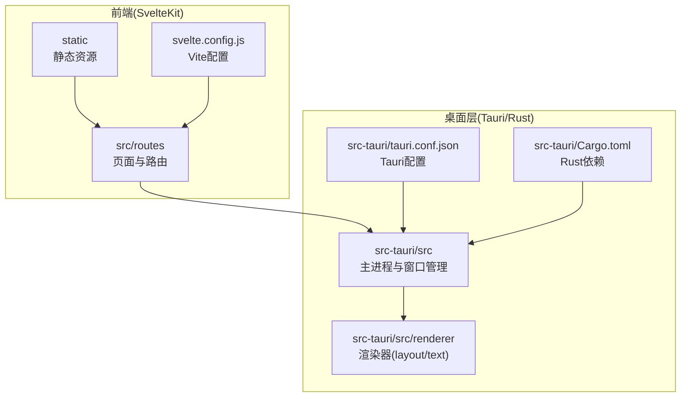
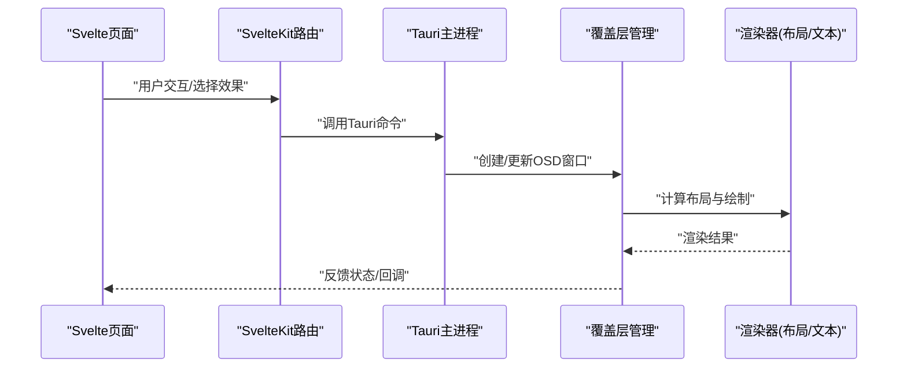
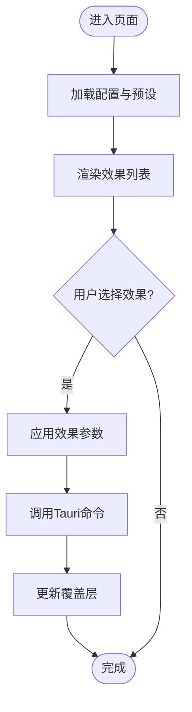
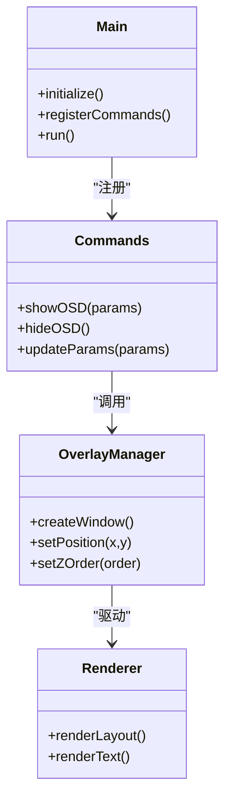
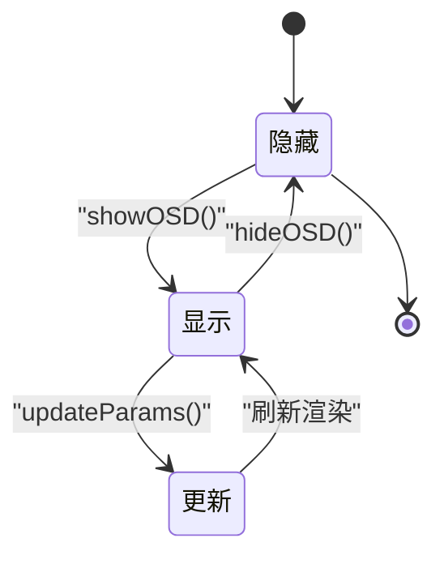
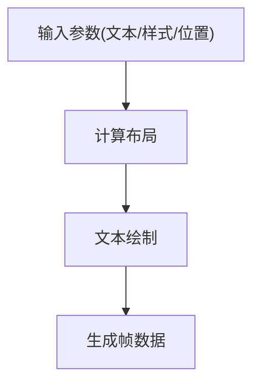
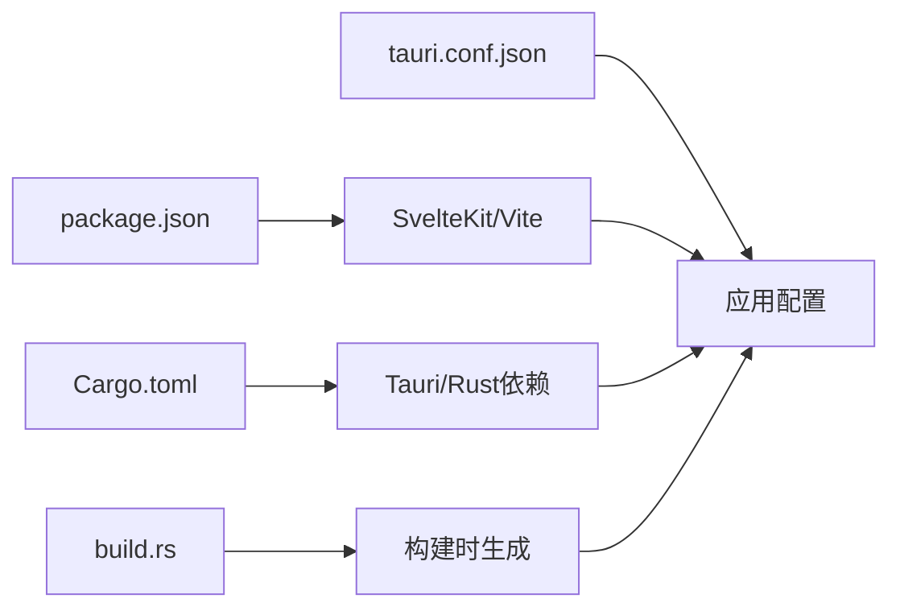

# 快速开始

<cite>
**本文引用的文件**   
- [README.md](file://osd-bubble/README.md)
- [package.json](file://osd-bubble/package.json)
- [svelte.config.js](file://osd-bubble/svelte.config.js)
- [vite.config.js](file://osd-bubble/vite.config.js)
- [Cargo.toml](file://osd-bubble/src-tauri/Cargo.toml)
- [tauri.conf.json](file://osd-bubble/src-tauri/tauri.conf.json)
- [build.rs](file://osd-bubble/src-tauri/build.rs)
- [main.rs](file://osd-bubble/src-tauri/src/main.rs)
- [lib.rs](file://osd-bubble/src-tauri/src/lib.rs)
- [overlay.rs](file://osd-bubble/src-tauri/src/overlay.rs)
- [state_machine.rs](file://osd-bubble/src-tauri/src/state_machine.rs)
- [hook.rs](file://osd-bubble/src-tauri/src/hook.rs)
- [layout.rs](file://osd-bubble/src-tauri/src/renderer/layout.rs)
- [text.rs](file://osd-bubble/src-tauri/src/renderer/text.rs)
- [+page.svelte](file://osd-bubble/src/routes/+page.svelte)
- [+layout.ts](file://osd-bubble/src/routes/+layout.ts)
- [custom-style/+page.svelte](file://osd-bubble/src/routes/custom-style/+page.svelte)
- [custom-style/+page.ts](file://osd-bubble/src/routes/custom-style/+page.ts)
- [static/custom-style.html](file://osd-bubble/static/custom-style.html)
</cite>

## 目录
1. [简介](#简介)
2. [项目结构](#项目结构)
3. [核心组件](#核心组件)
4. [架构总览](#架构总览)
5. [详细组件分析](#详细组件分析)
6. [依赖关系分析](#依赖关系分析)
7. [性能注意事项](#性能注意事项)
8. [故障排除指南](#故障排除指南)
9. [结论](#结论)
10. [附录](#附录)

## 简介
本快速开始指南面向初次接触按键OSD可视化工具的开发者与用户，帮助你从零搭建开发环境、安装依赖并运行项目。你将了解：
- 环境要求（Node.js、Rust工具链等）
- 完整克隆、安装与启动流程
- 基本配置项说明
- 创建第一个OSD效果的步骤
- 常见安装问题与排错方法

## 项目结构
本项目采用前端SvelteKit + Tauri（Rust）的混合架构：
- 前端位于 osd-bubble/src，使用 SvelteKit 构建页面与路由
- 桌面端能力由 Tauri 提供，Rust 代码位于 osd-bubble/src-tauri/src
- 静态资源与自定义样式位于 osd-bubble/static
- 构建与打包配置分别由 Vite 和 Tauri 管理

图表来源
- [package.json](file://osd-bubble/package.json)
- [svelte.config.js](file://osd-bubble/svelte.config.js)
- [vite.config.js](file://osd-bubble/vite.config.js)
- [Cargo.toml](file://osd-bubble/src-tauri/Cargo.toml)
- [tauri.conf.json](file://osd-bubble/src-tauri/tauri.conf.json)

章节来源
- [README.md](file://osd-bubble/README.md)
- [package.json](file://osd-bubble/package.json)
- [svelte.config.js](file://osd-bubble/svelte.config.js)
- [vite.config.js](file://osd-bubble/vite.config.js)
- [Cargo.toml](file://osd-bubble/src-tauri/Cargo.toml)
- [tauri.conf.json](file://osd-bubble/src-tauri/tauri.conf.json)

## 核心组件
- 前端应用入口与路由
  - 页面组件：用于展示OSD效果预览与交互
  - 布局脚本：负责全局初始化与状态注入
- Tauri 主进程与窗口
  - 主程序入口：初始化Tauri应用、注册命令与事件
  - 覆盖层管理：控制OSD窗口的显示、位置与层级
  - 状态机：管理OSD生命周期与切换逻辑
  - 钩子：桥接前端与Rust侧能力
- 渲染器
  - 布局：计算OSD元素布局与对齐
  - 文本：绘制文字与样式

章节来源
- [main.rs](file://osd-bubble/src-tauri/src/main.rs)
- [lib.rs](file://osd-bubble/src-tauri/src/lib.rs)
- [overlay.rs](file://osd-bubble/src-tauri/src/overlay.rs)
- [state_machine.rs](file://osd-bubble/src-tauri/src/state_machine.rs)
- [hook.rs](file://osd-bubble/src-tauri/src/hook.rs)
- [layout.rs](file://osd-bubble/src-tauri/src/renderer/layout.rs)
- [text.rs](file://osd-bubble/src-tauri/src/renderer/text.rs)
- [+page.svelte](file://osd-bubble/src/routes/+page.svelte)
- [+layout.ts](file://osd-bubble/src/routes/+layout.ts)

## 架构总览
下图展示了从前端到桌面层的调用链路：用户在Svelte页面触发操作，通过Tauri命令调用Rust侧能力，最终在覆盖层上渲染OSD效果。

图表来源
- [main.rs](file://osd-bubble/src-tauri/src/main.rs)
- [overlay.rs](file://osd-bubble/src-tauri/src/overlay.rs)
- [layout.rs](file://osd-bubble/src-tauri/src/renderer/layout.rs)
- [text.rs](file://osd-bubble/src-tauri/src/renderer/text.rs)
- [+page.svelte](file://osd-bubble/src/routes/+page.svelte)

## 详细组件分析

### 前端页面与路由
- 页面组件负责展示OSD效果列表与参数面板，用户可在此选择预设或自定义样式
- 布局脚本负责初始化全局状态、加载配置并与Tauri侧建立通信通道

图表来源
- [+page.svelte](file://osd-bubble/src/routes/+page.svelte)
- [+layout.ts](file://osd-bubble/src/routes/+layout.ts)

章节来源
- [+page.svelte](file://osd-bubble/src/routes/+page.svelte)
- [+layout.ts](file://osd-bubble/src/routes/+layout.ts)

### Tauri主进程与命令
- 主进程负责初始化Tauri应用、注册命令与事件监听
- 命令处理函数接收前端请求，调用覆盖层与渲染器进行OSD更新

图表来源
- [main.rs](file://osd-bubble/src-tauri/src/main.rs)
- [lib.rs](file://osd-bubble/src-tauri/src/lib.rs)
- [overlay.rs](file://osd-bubble/src-tauri/src/overlay.rs)
- [layout.rs](file://osd-bubble/src-tauri/src/renderer/layout.rs)
- [text.rs](file://osd-bubble/src-tauri/src/renderer/text.rs)

章节来源
- [main.rs](file://osd-bubble/src-tauri/src/main.rs)
- [lib.rs](file://osd-bubble/src-tauri/src/lib.rs)

### 覆盖层管理与状态机
- 覆盖层管理负责创建透明窗口、设置层级与位置，确保OSD始终置顶且不干扰输入
- 状态机管理OSD的生命周期（隐藏、显示、更新、销毁），保证状态一致性

图表来源
- [overlay.rs](file://osd-bubble/src-tauri/src/overlay.rs)
- [state_machine.rs](file://osd-bubble/src-tauri/src/state_machine.rs)

章节来源
- [overlay.rs](file://osd-bubble/src-tauri/src/overlay.rs)
- [state_machine.rs](file://osd-bubble/src-tauri/src/state_machine.rs)

### 渲染器（布局与文本）
- 布局模块计算OSD元素的尺寸、对齐与间距
- 文本模块负责字体、颜色、阴影与描边等样式的绘制

图表来源
- [layout.rs](file://osd-bubble/src-tauri/src/renderer/layout.rs)
- [text.rs](file://osd-bubble/src-tauri/src/renderer/text.rs)

章节来源
- [layout.rs](file://osd-bubble/src-tauri/src/renderer/layout.rs)
- [text.rs](file://osd-bubble/src-tauri/src/renderer/text.rs)

### 钩子与前后端桥接
- 钩子模块暴露给前端的API，封装对Rust侧能力的调用
- 统一错误处理与日志输出，便于调试

章节来源
- [hook.rs](file://osd-bubble/src-tauri/src/hook.rs)

### 自定义样式示例
- 提供静态HTML模板与页面组件，演示如何加载自定义样式并应用到OSD

章节来源
- [custom-style/+page.svelte](file://osd-bubble/src/routes/custom-style/+page.svelte)
- [custom-style/+page.ts](file://osd-bubble/src/routes/custom-style/+page.ts)
- [static/custom-style.html](file://osd-bubble/static/custom-style.html)

## 依赖关系分析
- 前端依赖由 package.json 管理，包括SvelteKit、Vite及相关插件
- Rust依赖由 Cargo.toml 管理，包含Tauri框架与系统级库
- Tauri配置 tauri.conf.json 定义窗口行为、权限与资源路径
- 构建脚本 build.rs 用于在编译时生成必要资源或配置

图表来源
- [package.json](file://osd-bubble/package.json)
- [Cargo.toml](file://osd-bubble/src-tauri/Cargo.toml)
- [tauri.conf.json](file://osd-bubble/src-tauri/tauri.conf.json)
- [build.rs](file://osd-bubble/src-tauri/build.rs)

章节来源
- [package.json](file://osd-bubble/package.json)
- [Cargo.toml](file://osd-bubble/src-tauri/Cargo.toml)
- [tauri.conf.json](file://osd-bubble/src-tauri/tauri.conf.json)
- [build.rs](file://osd-bubble/src-tauri/build.rs)

## 性能注意事项
- 避免频繁重建OSD窗口，优先使用参数更新减少重绘开销
- 合理设置字体大小与阴影强度，降低GPU压力
- 使用静态资源缓存提升加载速度
- 在低端设备上限制同时显示的OSD数量

## 故障排除指南
- Node.js版本不匹配
  - 现象：npm/yarn报错或依赖解析失败
  - 解决：根据 package.json 指定版本安装对应Node.js
- Rust工具链缺失或版本不符
  - 现象：cargo编译失败或找不到目标平台
  - 解决：安装rustup与所需目标（如x86_64-pc-windows-msvc），并确保环境变量正确
- Tauri构建失败
  - 现象：tauri dev/build报权限或资源缺失
  - 解决：检查 tauri.conf.json 中资源路径与权限声明，确认已安装webview运行时
- 端口占用或开发服务器无法启动
  - 现象：本地服务启动失败
  - 解决：更换端口或关闭占用进程
- 覆盖层不显示或层级异常
  - 现象：OSD不可见或被其他窗口遮挡
  - 解决：调整z-order与透明度，确认窗口样式为无边框透明

章节来源
- [tauri.conf.json](file://osd-bubble/src-tauri/tauri.conf.json)
- [build.rs](file://osd-bubble/src-tauri/build.rs)
- [package.json](file://osd-bubble/package.json)

## 结论
通过以上步骤，你已成功搭建按键OSD可视化工具的开发环境并运行项目。你可以基于内置示例扩展更多OSD效果，结合自定义样式与参数面板实现个性化展示。建议逐步熟悉Tauri命令与渲染器接口，以优化性能与用户体验。

## 附录

### 环境要求
- Node.js：建议使用LTS版本，具体版本参考 package.json
- Rust工具链：rustup、cargo、目标平台（Windows需MSVC或GNU）
- WebView运行时：Tauri所需的系统WebView组件

### 安装与运行步骤
- 克隆仓库
  - git clone <仓库地址>
  - cd osd-bubble
- 安装前端依赖
  - npm install 或 yarn install
- 安装Rust依赖
  - cargo fetch（首次构建会自动下载）
- 启动开发模式
  - npm run dev（前端）
  - cargo tauri dev（Tauri应用）
- 构建发布包
  - cargo tauri build

### 基本配置选项
- 窗口行为：透明度、置顶、无边框、尺寸与位置
- 渲染参数：字体、字号、颜色、阴影、描边
- 生命周期：显示时长、淡入淡出动画、自动隐藏策略

### 创建第一个OSD效果示例
- 在前端页面选择“文本”效果，设置内容与样式
- 点击“应用”，通过Tauri命令更新覆盖层
- 观察OSD窗口是否按预期显示与定位
- 如需自定义样式，参考 custom-style 示例页面与静态HTML模板

章节来源
- [package.json](file://osd-bubble/package.json)
- [Cargo.toml](file://osd-bubble/src-tauri/Cargo.toml)
- [tauri.conf.json](file://osd-bubble/src-tauri/tauri.conf.json)
- [custom-style/+page.svelte](file://osd-bubble/src/routes/custom-style/+page.svelte)
- [custom-style/+page.ts](file://osd-bubble/src/routes/custom-style/+page.ts)
- [static/custom-style.html](file://osd-bubble/static/custom-style.html)