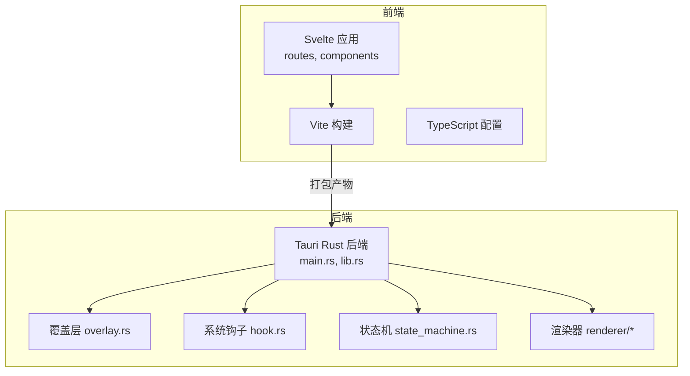
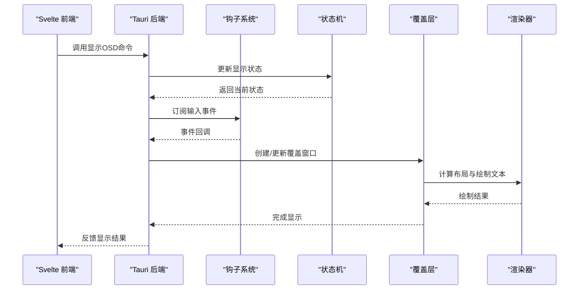
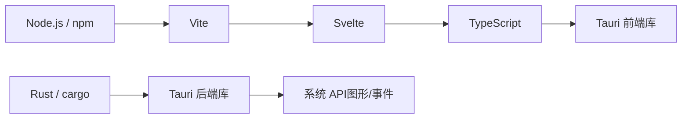

# 故障排除

<cite>
**本文引用的文件**   
- [README.md](file://osd-bubble/README.md)
- [package.json](file://osd-bubble/package.json)
- [svelte.config.js](file://osd-bubble/svelte.config.js)
- [vite.config.js](file://osd-bubble/vite.config.js)
- [tsconfig.json](file://osd-bubble/tsconfig.json)
- [src/routes/+page.svelte](file://osd-bubble/src/routes/+page.svelte)
- [src/routes/custom-style/+page.svelte](file://osd-bubble/src/routes/custom-style/+page.svelte)
- [src/app.html](file://osd-bubble/src/app.html)
- [static/custom-style.html](file://osd-bubble/static/custom-style.html)
- [Cargo.toml](file://osd-bubble/src-tauri/Cargo.toml)
- [tauri.conf.json](file://osd-bubble/src-tauri/tauri.conf.json)
- [build.rs](file://osd-bubble/src-tauri/build.rs)
- [src/main.rs](file://osd-bubble/src-tauri/src/main.rs)
- [src/lib.rs](file://osd-bubble/src-tauri/src/lib.rs)
- [src/hook.rs](file://osd-bubble/src-tauri/src/hook.rs)
- [src/overlay.rs](file://osd-bubble/src-tauri/src/overlay.rs)
- [src/state_machine.rs](file://osd-bubble/src-tauri/src/state_machine.rs)
- [src/renderer/mod.rs](file://osd-bubble/src-tauri/src/renderer/mod.rs)
- [src/renderer/layout.rs](file://osd-bubble/src-tauri/src/renderer/layout.rs)
- [src/renderer/text.rs](file://osd-bubble/src-tauri/src/renderer/text.rs)
</cite>

## 目录
1. [简介](#简介)
2. [项目结构](#项目结构)
3. [核心组件](#核心组件)
4. [架构总览](#架构总览)
5. [详细组件分析](#详细组件分析)
6. [依赖分析](#依赖分析)
7. [性能注意事项](#性能注意事项)
8. [故障排除指南](#故障排除指南)
9. [结论](#结论)
10. [附录](#附录)

## 简介
本故障排除文档面向按键OSD可视化工具（基于 Tauri + Svelte）的开发者与用户，聚焦安装、构建、运行与性能等常见问题，提供系统化的诊断步骤、日志分析方法、调试技巧、错误代码参考、已知限制与兼容性问题说明，以及性能优化建议与内存泄漏检测工具使用指引。文档同时给出社区支持与问题报告模板、贡献指南，帮助快速定位并解决问题。

## 项目结构
本项目采用前后端分离的桌面应用架构：
- 前端：Svelte + Vite + TypeScript，负责UI渲染与交互页面。
- 后端：Rust + Tauri，负责系统级能力（如覆盖层、钩子、状态机、渲染管线）。
- 配置：Tauri 配置文件、Svelte/Vite/TS 配置、包管理清单。

图表来源
- [package.json](file://osd-bubble/package.json)
- [svelte.config.js](file://osd-bubble/svelte.config.js)
- [vite.config.js](file://osd-bubble/vite.config.js)
- [tsconfig.json](file://osd-bubble/tsconfig.json)
- [Cargo.toml](file://osd-bubble/src-tauri/Cargo.toml)
- [tauri.conf.json](file://osd-bubble/src-tauri/tauri.conf.json)
- [src/main.rs](file://osd-bubble/src-tauri/src/main.rs)
- [src/lib.rs](file://osd-bubble/src-tauri/src/lib.rs)
- [src/overlay.rs](file://osd-bubble/src-tauri/src/overlay.rs)
- [src/hook.rs](file://osd-bubble/src-tauri/src/hook.rs)
- [src/state_machine.rs](file://osd-bubble/src-tauri/src/state_machine.rs)
- [src/renderer/mod.rs](file://osd-bubble/src-tauri/src/renderer/mod.rs)
- [src/renderer/layout.rs](file://osd-bubble/src-tauri/src/renderer/layout.rs)
- [src/renderer/text.rs](file://osd-bubble/src-tauri/src/renderer/text.rs)

章节来源
- [README.md](file://osd-bubble/README.md)
- [package.json](file://osd-bubble/package.json)
- [svelte.config.js](file://osd-bubble/svelte.config.js)
- [vite.config.js](file://osd-bubble/vite.config.js)
- [tsconfig.json](file://osd-bubble/tsconfig.json)
- [Cargo.toml](file://osd-bubble/src-tauri/Cargo.toml)
- [tauri.conf.json](file://osd-bubble/src-tauri/tauri.conf.json)

## 核心组件
- 前端路由与页面：用于展示 OSD 预览与自定义样式入口。
- Tauri 后端：初始化窗口、注册命令、驱动覆盖层与渲染。
- 覆盖层模块：创建透明窗口、置顶显示、绘制文本与布局。
- 钩子系统：捕获输入事件或系统消息，触发 OSD 更新。
- 状态机：管理 OSD 生命周期与显示状态。
- 渲染器：文本测量、布局计算、绘制到覆盖层。

章节来源
- [src/routes/+page.svelte](file://osd-bubble/src/routes/+page.svelte)
- [src/routes/custom-style/+page.svelte](file://osd-bubble/src/routes/custom-style/+page.svelte)
- [src/main.rs](file://osd-bubble/src-tauri/src/main.rs)
- [src/lib.rs](file://osd-bubble/src-tauri/src/lib.rs)
- [src/overlay.rs](file://osd-bubble/src-tauri/src/overlay.rs)
- [src/hook.rs](file://osd-bubble/src-tauri/src/hook.rs)
- [src/state_machine.rs](file://osd-bubble/src-tauri/src/state_machine.rs)
- [src/renderer/mod.rs](file://osd-bubble/src-tauri/src/renderer/mod.rs)
- [src/renderer/layout.rs](file://osd-bubble/src-tauri/src/renderer/layout.rs)
- [src/renderer/text.rs](file://osd-bubble/src-tauri/src/renderer/text.rs)

## 架构总览
前端通过 Tauri 的命令通道调用后端能力；后端根据状态机与钩子事件驱动覆盖层渲染文本内容。

图表来源
- [src/main.rs](file://osd-bubble/src-tauri/src/main.rs)
- [src/lib.rs](file://osd-bubble/src-tauri/src/lib.rs)
- [src/hook.rs](file://osd-bubble/src-tauri/src/hook.rs)
- [src/state_machine.rs](file://osd-bubble/src-tauri/src/state_machine.rs)
- [src/overlay.rs](file://osd-bubble/src-tauri/src/overlay.rs)
- [src/renderer/mod.rs](file://osd-bubble/src-tauri/src/renderer/mod.rs)
- [src/renderer/layout.rs](file://osd-bubble/src-tauri/src/renderer/layout.rs)
- [src/renderer/text.rs](file://osd-bubble/src-tauri/src/renderer/text.rs)

## 详细组件分析

### 前端路由与页面
- 主页面用于展示默认 OSD 预览与交互入口。
- 自定义样式页面用于切换样式配置并触发后端更新。

章节来源
- [src/routes/+page.svelte](file://osd-bubble/src/routes/+page.svelte)
- [src/routes/custom-style/+page.svelte](file://osd-bubble/src/routes/custom-style/+page.svelte)

### Tauri 后端与命令
- 初始化应用窗口与资源路径。
- 注册前端可调用的命令（如显示/隐藏 OSD、设置样式、刷新渲染）。
- 处理跨进程通信与错误回传。

章节来源
- [src/main.rs](file://osd-bubble/src-tauri/src/main.rs)
- [src/lib.rs](file://osd-bubble/src-tauri/src/lib.rs)
- [tauri.conf.json](file://osd-bubble/src-tauri/tauri.conf.json)

### 覆盖层与渲染
- 覆盖层创建透明窗口、置顶显示、处理多显示器适配。
- 渲染器负责文本测量、布局计算、绘制到覆盖层表面。
- 布局模块处理对齐、间距、换行与尺寸估算。

章节来源
- [src/overlay.rs](file://osd-bubble/src-tauri/src/overlay.rs)
- [src/renderer/mod.rs](file://osd-bubble/src-tauri/src/renderer/mod.rs)
- [src/renderer/layout.rs](file://osd-bubble/src-tauri/src/renderer/layout.rs)
- [src/renderer/text.rs](file://osd-bubble/src-tauri/src/renderer/text.rs)

### 钩子系统与状态机
- 钩子系统监听输入事件或系统消息，触发 OSD 显示逻辑。
- 状态机管理显示生命周期（空闲、显示中、隐藏、错误），确保一致的状态转换。

章节来源
- [src/hook.rs](file://osd-bubble/src-tauri/src/hook.rs)
- [src/state_machine.rs](file://osd-bubble/src-tauri/src/state_machine.rs)

## 依赖分析
- 前端依赖：Svelte、Vite、TypeScript、Tauri 前端库。
- 后端依赖：Tauri 框架、系统图形库（用于覆盖层与渲染）、事件钩子库。
- 构建依赖：Node.js/npm、Rust/cargo、Tauri CLI。

图表来源
- [package.json](file://osd-bubble/package.json)
- [Cargo.toml](file://osd-bubble/src-tauri/Cargo.toml)

章节来源
- [package.json](file://osd-bubble/package.json)
- [Cargo.toml](file://osd-bubble/src-tauri/Cargo.toml)

## 性能注意事项
- 渲染频率控制：避免高频重绘，合并状态更新，减少覆盖层刷新次数。
- 文本测量缓存：对常用字体与字号进行度量缓存，降低重复计算开销。
- 内存管理：及时释放覆盖层资源，避免长时间持有大对象导致内存增长。
- 事件节流：钩子系统对输入事件进行节流与去抖，防止风暴式触发。
- 多显示器适配：优先选择主显示器或按光标位置选择目标显示器，减少不必要的窗口移动。

[本节为通用指导，不直接分析具体文件]

## 故障排除指南

### 安装与环境准备
- Node.js 版本不匹配：确认 Node.js 版本与项目要求一致，必要时使用 nvm 切换版本。
- npm 缓存异常：清理缓存后重新安装依赖。
- Rust 工具链缺失：安装 rustup 与对应目标平台工具链，确保 cargo 可用。
- Tauri CLI 未安装：全局安装 tauri-cli 并确保在 PATH 中。
- 权限问题：Windows 下以管理员权限运行终端，避免系统级操作失败。

章节来源
- [package.json](file://osd-bubble/package.json)
- [Cargo.toml](file://osd-bubble/src-tauri/Cargo.toml)

### 构建错误排查
- 前端构建失败：检查 svelte.config.js、vite.config.js、tsconfig.json 配置是否正确，确认依赖版本兼容。
- 后端编译失败：检查 Cargo.toml 依赖与特性开关，确认系统头文件与库是否满足。
- Tauri 构建失败：确认 tauri.conf.json 配置项有效，资源路径正确，图标与能力文件存在。
- 构建脚本错误：检查 build.rs 中的预构建逻辑，确保外部工具可执行。

章节来源
- [svelte.config.js](file://osd-bubble/svelte.config.js)
- [vite.config.js](file://osd-bubble/vite.config.js)
- [tsconfig.json](file://osd-bubble/tsconfig.json)
- [Cargo.toml](file://osd-bubble/src-tauri/Cargo.toml)
- [tauri.conf.json](file://osd-bubble/src-tauri/tauri.conf.json)
- [build.rs](file://osd-bubble/src-tauri/build.rs)

### 运行时异常排查
- 覆盖层无法显示：检查窗口创建参数、透明度设置、置顶属性与多显示器适配逻辑。
- 文本渲染异常：检查字体加载、文本测量与布局计算，确认编码与字符集。
- 钩子无响应：检查事件订阅是否成功，系统权限与防病毒软件拦截情况。
- 状态机卡死：检查状态转换条件与超时处理，确保异步任务正常完成。

章节来源
- [src/overlay.rs](file://osd-bubble/src-tauri/src/overlay.rs)
- [src/renderer/layout.rs](file://osd-bubble/src-tauri/src/renderer/layout.rs)
- [src/renderer/text.rs](file://osd-bubble/src-tauri/src/renderer/text.rs)
- [src/hook.rs](file://osd-bubble/src-tauri/src/hook.rs)
- [src/state_machine.rs](file://osd-bubble/src-tauri/src/state_machine.rs)

### 性能问题排查
- 帧率下降：降低渲染频率，启用增量更新，避免全量重绘。
- CPU 占用高：优化文本测量算法，减少重复计算，启用缓存。
- 内存泄漏：使用内存分析工具定位未释放资源，检查覆盖层生命周期。
- I/O 阻塞：避免在主线程进行磁盘或网络操作，改用后台任务。

章节来源
- [src/renderer/layout.rs](file://osd-bubble/src-tauri/src/renderer/layout.rs)
- [src/renderer/text.rs](file://osd-bubble/src-tauri/src/renderer/text.rs)
- [src/overlay.rs](file://osd-bubble/src-tauri/src/overlay.rs)

### 日志分析与调试技巧
- 前端日志：打开浏览器控制台，查看网络请求与 JS 错误。
- 后端日志：启用 Tauri 日志输出，收集 stderr/stdout 信息。
- 系统事件：使用系统事件查看器（如 Windows Event Viewer）排查钩子与窗口事件。
- 断点调试：在关键函数（覆盖层创建、文本渲染、状态转换）设置断点，逐步验证流程。

章节来源
- [src/main.rs](file://osd-bubble/src-tauri/src/main.rs)
- [src/lib.rs](file://osd-bubble/src-tauri/src/lib.rs)

### 错误代码参考
- 前端错误码：HTTP 状态码、Tauri 命令返回码、Svelte 组件错误。
- 后端错误码：Rust 错误类型、系统 API 错误码、Tauri 内部错误。
- 常见错误映射：将错误码映射到具体原因（如权限不足、资源不存在、渲染失败）。

章节来源
- [src/lib.rs](file://osd-bubble/src-tauri/src/lib.rs)
- [src/main.rs](file://osd-bubble/src-tauri/src/main.rs)

### 已知限制与兼容性问题
- 操作系统限制：某些系统版本不支持透明覆盖层或高级字体特性。
- 多显示器行为：覆盖层可能在不同显示器间切换时出现闪烁或错位。
- 输入法冲突：中文输入法可能与覆盖层焦点管理冲突，需调整焦点策略。
- 安全软件拦截：部分安全软件会阻止系统级钩子或窗口创建。

章节来源
- [src/overlay.rs](file://osd-bubble/src-tauri/src/overlay.rs)
- [src/hook.rs](file://osd-bubble/src-tauri/src/hook.rs)

### 工作区与替代方案
- 若覆盖层不可用，可降级为普通窗口模式显示 OSD。
- 若钩子系统受限，可改为轮询方式检测输入事件。
- 若字体渲染异常，可切换至系统默认字体或简化文本格式。

章节来源
- [src/overlay.rs](file://osd-bubble/src-tauri/src/overlay.rs)
- [src/hook.rs](file://osd-bubble/src-tauri/src/hook.rs)

### 社区支持与问题报告模板
- 社区支持：提交 Issue 前搜索类似问题，附上环境信息与复现步骤。
- 问题报告模板：
  - 标题：简明描述问题
  - 环境：操作系统、Node.js/Rust 版本、Tauri 版本
  - 复现步骤：详细列出操作步骤
  - 期望行为与实际行为
  - 日志与截图：附上相关日志与界面截图
  - 附加信息：配置文件、依赖列表、错误堆栈

[本节为通用指导，不直接分析具体文件]

### 贡献指南
- 代码规范：遵循 Rust/Svelte/TypeScript 社区规范，保持代码可读性。
- 提交规范：使用清晰的 commit message，分模块提交变更。
- 测试用例：为关键功能添加单元测试与集成测试。
- 文档更新：同步更新 README 与故障排除文档。

[本节为通用指导，不直接分析具体文件]

## 结论
通过系统化的故障排除流程，结合日志分析、调试技巧与性能优化建议，可有效定位并解决按键OSD可视化工具在安装、构建、运行与性能方面的常见问题。建议持续完善错误代码映射与兼容性说明，提升用户体验与开发效率。

## 附录

### 性能优化建议
- 渲染优化：批量更新、延迟渲染、按需重绘。
- 内存优化：及时释放资源、避免循环引用、使用弱引用。
- 事件优化：节流与去抖、优先级队列、取消未完成任务。
- 资源优化：压缩静态资源、懒加载字体与图片。

[本节为通用指导，不直接分析具体文件]

### 内存泄漏检测工具使用方法
- Rust：使用 Valgrind、AddressSanitizer、cargo-flamegraph 分析内存与性能。
- Node.js：使用 Chrome DevTools Memory 面板、heap snapshots 定位泄漏。
- 系统级：使用 Windows Performance Analyzer、Process Explorer 监控资源使用。

[本节为通用指导，不直接分析具体文件]