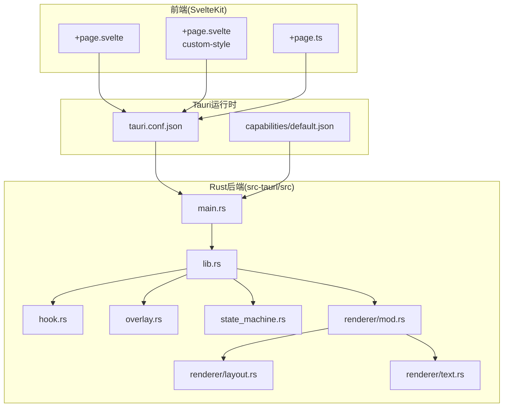
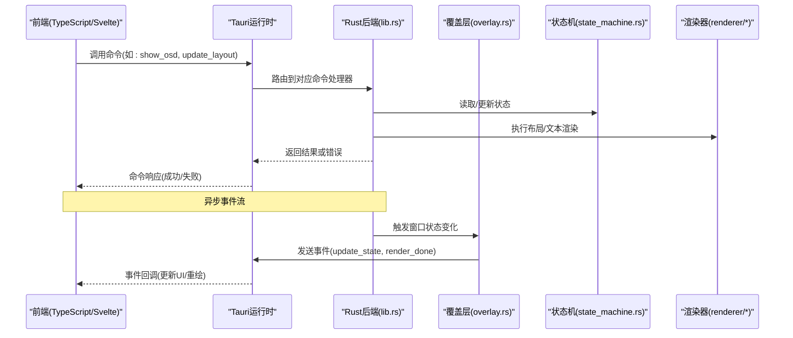
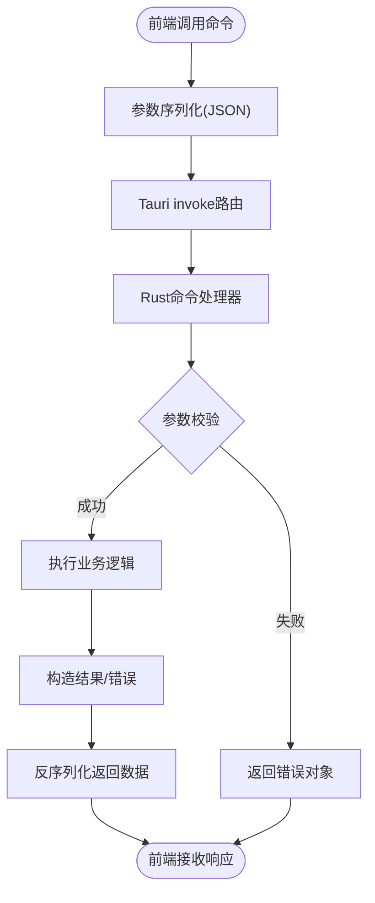
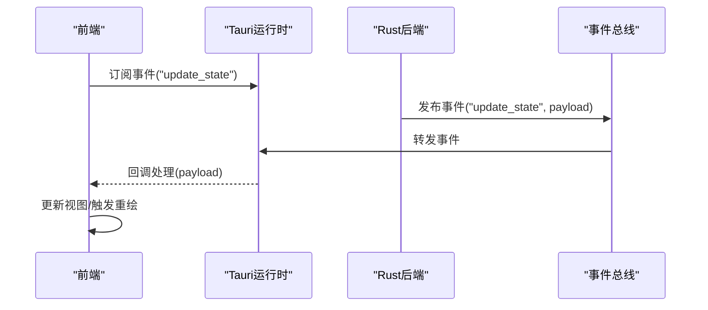
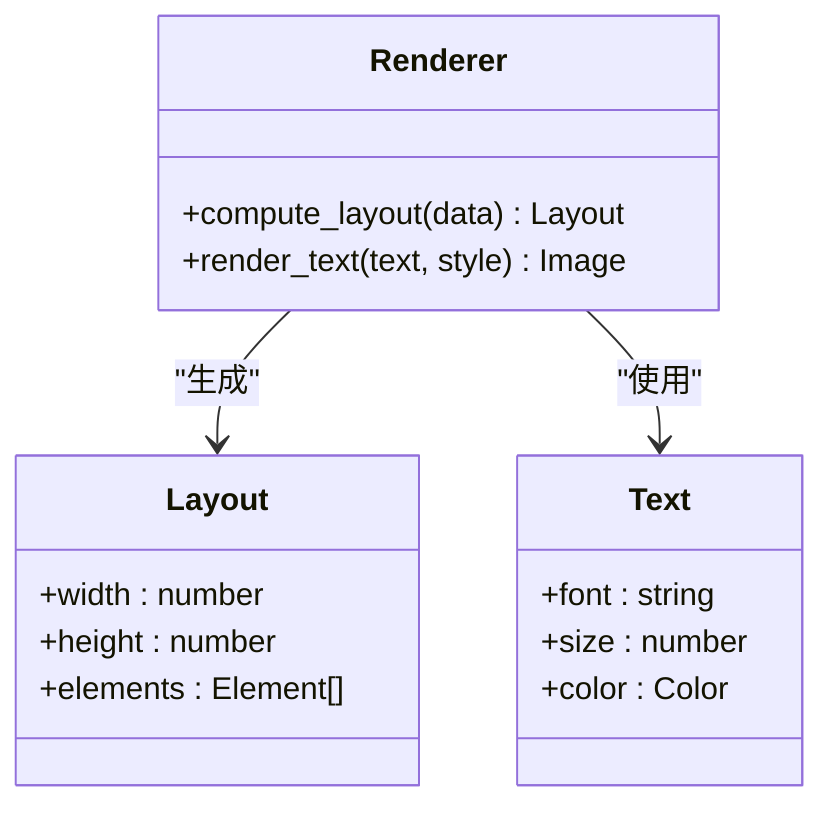
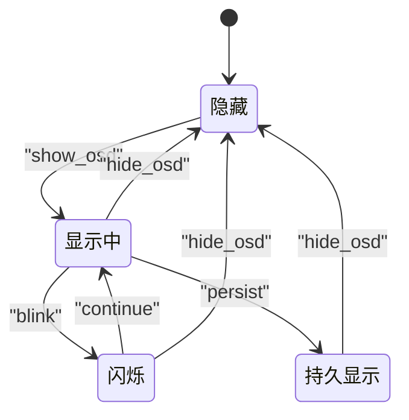
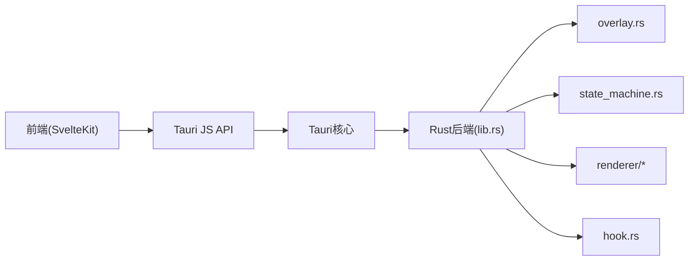

# 前后端通信

<cite>
**本文引用的文件**   
- [src-tauri/src/main.rs](file://osd-bubble/src-tauri/src/main.rs)
- [src-tauri/src/lib.rs](file://osd-bubble/src-tauri/src/lib.rs)
- [src-tauri/src/hook.rs](file://osd-bubble/src-tauri/src/hook.rs)
- [src-tauri/src/overlay.rs](file://osd-bubble/src-tauri/src/overlay.rs)
- [src-tauri/src/state_machine.rs](file://osd-bubble/src-tauri/src/state_machine.rs)
- [src-tauri/src/renderer/mod.rs](file://osd-bubble/src-tauri/src/renderer/mod.rs)
- [src-tauri/src/renderer/layout.rs](file://osd-bubble/src-tauri/src/renderer/layout.rs)
- [src-tauri/src/renderer/text.rs](file://osd-bubble/src-tauri/src/renderer/text.rs)
- [src-tauri/Cargo.toml](file://osd-bubble/src-tauri/Cargo.toml)
- [src-tauri/tauri.conf.json](file://osd-bubble/src-tauri/tauri.conf.json)
- [src-tauri/capabilities/default.json](file://osd-bubble/src-tauri/capabilities/default.json)
- [src/routes/+page.svelte](file://osd-bubble/src/routes/+page.svelte)
- [src/routes/custom-style/+page.svelte](file://osd-bubble/src/routes/custom-style/+page.svelte)
- [src/routes/custom-style/+page.ts](file://osd-bubble/src/routes/custom-style/+page.ts)
- [package.json](file://osd-bubble/package.json)
</cite>

## 目录
1. [简介](#简介)
2. [项目结构](#项目结构)
3. [核心组件](#核心组件)
4. [架构总览](#架构总览)
5. [详细组件分析](#详细组件分析)
6. [依赖关系分析](#依赖关系分析)
7. [性能考量](#性能考量)
8. [故障排查指南](#故障排查指南)
9. [结论](#结论)
10. [附录](#附录)

## 简介
本文件面向按键OSD可视化工具的前后端通信机制，聚焦于Tauri框架下的IPC模式：命令调用、事件监听与数据传输协议。文档从TypeScript前端如何调用Rust后端函数出发，系统阐述参数序列化/反序列化、错误传播、能力权限模型与安全边界、实时通信与状态同步策略，并给出批量操作与连接管理建议及优化手段。为便于理解，提供多类图示（架构图、序列图、流程图）与“代码片段路径”指引，帮助读者快速定位实现位置。

## 项目结构
本项目采用Tauri + SvelteKit的典型分层组织：
- Rust后端位于 src-tauri/src，包含应用入口、插件注册、渲染器模块、覆盖层与状态机。
- TypeScript前端位于 src/routes，使用SvelteKit路由与页面组件。
- Tauri配置与能力权限位于 src-tauri/tauri.conf.json 与 capabilities。
- 构建与依赖由 Cargo.toml 与 package.json 管理。

图表来源
- [src-tauri/src/main.rs](file://osd-bubble/src-tauri/src/main.rs)
- [src-tauri/src/lib.rs](file://osd-bubble/src-tauri/src/lib.rs)
- [src-tauri/tauri.conf.json](file://osd-bubble/src-tauri/tauri.conf.json)
- [src-tauri/capabilities/default.json](file://osd-bubble/src-tauri/capabilities/default.json)

章节来源
- [src-tauri/src/main.rs](file://osd-bubble/src-tauri/src/main.rs)
- [src-tauri/src/lib.rs](file://osd-bubble/src-tauri/src/lib.rs)
- [src-tauri/tauri.conf.json](file://osd-bubble/src-tauri/tauri.conf.json)
- [src-tauri/capabilities/default.json](file://osd-bubble/src-tauri/capabilities/default.json)

## 核心组件
- 命令通道（Command）：通过Tauri命令将前端请求映射到Rust函数，完成OSD渲染、布局计算、文本绘制等任务。
- 事件总线（Event）：Rust侧向窗口推送UI状态变更或渲染结果，前端订阅后更新视图。
- 渲染器模块：layout与text负责布局与文本绘制，供上层命令调用。
- 覆盖层（Overlay）：管理OSD窗口的可见性、层级与生命周期。
- 状态机（State Machine）：驱动OSD显示状态流转，保证状态一致性与幂等性。
- 钩子（Hook）：注入系统级输入或事件，触发OSD响应。

章节来源
- [src-tauri/src/overlay.rs](file://osd-bubble/src-tauri/src/overlay.rs)
- [src-tauri/src/state_machine.rs](file://osd-bubble/src-tauri/src/state_machine.rs)
- [src-tauri/src/renderer/mod.rs](file://osd-bubble/src-tauri/src/renderer/mod.rs)
- [src-tauri/src/renderer/layout.rs](file://osd-bubble/src-tauri/src/renderer/layout.rs)
- [src-tauri/src/renderer/text.rs](file://osd-bubble/src-tauri/src/renderer/text.rs)
- [src-tauri/src/hook.rs](file://osd-bubble/src-tauri/src/hook.rs)

## 架构总览
下图展示Tauri IPC在按键OSD中的端到端流程：前端发起命令，Rust侧处理并返回结果；同时Rust侧可主动推送事件至前端，实现双向通信。

图表来源
- [src-tauri/src/lib.rs](file://osd-bubble/src-tauri/src/lib.rs)
- [src-tauri/src/overlay.rs](file://osd-bubble/src-tauri/src/overlay.rs)
- [src-tauri/src/state_machine.rs](file://osd-bubble/src-tauri/src/state_machine.rs)
- [src-tauri/src/renderer/mod.rs](file://osd-bubble/src-tauri/src/renderer/mod.rs)

## 详细组件分析

### 命令定义与调用（Command）
- 命令注册：Rust侧通过Tauri API注册命令，将函数暴露给前端。
- 参数序列化：Tauri自动对JSON进行序列化/反序列化，支持基础类型、结构体与枚举。
- 错误传播：Rust侧返回Result类型，Tauri将其转换为前端可识别的错误对象。
- 前端调用：TypeScript通过@tauri-apps/api invoke调用命令，并处理Promise结果。

图表来源
- [src-tauri/src/lib.rs](file://osd-bubble/src-tauri/src/lib.rs)
- [src-tauri/src/main.rs](file://osd-bubble/src-tauri/src/main.rs)

章节来源
- [src-tauri/src/lib.rs](file://osd-bubble/src-tauri/src/lib.rs)
- [src-tauri/src/main.rs](file://osd-bubble/src-tauri/src/main.rs)

### 事件监听与实时通信（Event）
- 事件发布：Rust侧通过Tauri事件API向窗口广播状态变更或渲染完成信号。
- 事件订阅：前端使用@tauri-apps/api的listen/unlisten订阅事件，更新UI。
- 一致性保障：结合状态机确保事件顺序与幂等性，避免重复渲染。

图表来源
- [src-tauri/src/lib.rs](file://osd-bubble/src-tauri/src/lib.rs)
- [src-tauri/src/overlay.rs](file://osd-bubble/src-tauri/src/overlay.rs)

章节来源
- [src-tauri/src/overlay.rs](file://osd-bubble/src-tauri/src/overlay.rs)
- [src-tauri/src/state_machine.rs](file://osd-bubble/src-tauri/src/state_machine.rs)

### 渲染器模块（Layout与Text）
- Layout：计算OSD元素的位置、尺寸与对齐方式。
- Text：根据字体与样式生成文本位图或矢量路径。
- 命令集成：上层命令调用渲染器生成最终图像或布局数据，返回给前端用于合成显示。

图表来源
- [src-tauri/src/renderer/mod.rs](file://osd-bubble/src-tauri/src/renderer/mod.rs)
- [src-tauri/src/renderer/layout.rs](file://osd-bubble/src-tauri/src/renderer/layout.rs)
- [src-tauri/src/renderer/text.rs](file://osd-bubble/src-tauri/src/renderer/text.rs)

章节来源
- [src-tauri/src/renderer/mod.rs](file://osd-bubble/src-tauri/src/renderer/mod.rs)
- [src-tauri/src/renderer/layout.rs](file://osd-bubble/src-tauri/src/renderer/layout.rs)
- [src-tauri/src/renderer/text.rs](file://osd-bubble/src-tauri/src/renderer/text.rs)

### 覆盖层与状态机（Overlay与State Machine）
- Overlay：管理OSD窗口生命周期、可见性与层级。
- State Machine：定义显示状态（隐藏、显示中、闪烁、持久显示等），确保状态转换合法且可恢复。

图表来源
- [src-tauri/src/overlay.rs](file://osd-bubble/src-tauri/src/overlay.rs)
- [src-tauri/src/state_machine.rs](file://osd-bubble/src-tauri/src/state_machine.rs)

章节来源
- [src-tauri/src/overlay.rs](file://osd-bubble/src-tauri/src/overlay.rs)
- [src-tauri/src/state_machine.rs](file://osd-bubble/src-tauri/src/state_machine.rs)

### 钩子系统（Hook）
- 作用：捕获系统级输入（如键盘事件），触发OSD响应。
- 集成：通过Tauri插件或原生钩子注入，事件经Rust处理后转为命令或事件。

章节来源
- [src-tauri/src/hook.rs](file://osd-bubble/src-tauri/src/hook.rs)

### 前端调用示例（TypeScript）
- 命令调用：使用@tauri-apps/api.invoke调用Rust命令，传递结构化参数。
- 事件监听：使用listen订阅事件，处理payload更新UI。
- 错误处理：捕获invoke异常，区分网络、权限与业务错误。

章节来源
- [src/routes/+page.svelte](file://osd-bubble/src/routes/+page.svelte)
- [src/routes/custom-style/+page.svelte](file://osd-bubble/src/routes/custom-style/+page.svelte)
- [src/routes/custom-style/+page.ts](file://osd-bubble/src/routes/custom-style/+page.ts)

## 依赖关系分析
- 前端依赖Tauri运行时提供的JS API进行IPC。
- Rust后端依赖Tauri宏与事件系统，组合渲染器、覆盖层与状态机。
- 配置文件控制能力权限与窗口行为。

图表来源
- [src-tauri/src/lib.rs](file://osd-bubble/src-tauri/src/lib.rs)
- [src-tauri/src/main.rs](file://osd-bubble/src-tauri/src/main.rs)
- [src-tauri/tauri.conf.json](file://osd-bubble/src-tauri/tauri.conf.json)

章节来源
- [src-tauri/src/lib.rs](file://osd-bubble/src-tauri/src/lib.rs)
- [src-tauri/src/main.rs](file://osd-bubble/src-tauri/src/main.rs)
- [src-tauri/tauri.conf.json](file://osd-bubble/src-tauri/tauri.conf.json)

## 性能考量
- 批量操作：合并多次命令调用，减少IPC往返；在Rust侧批处理渲染任务。
- 事件节流：对高频事件进行去抖/节流，避免前端频繁重绘。
- 内存管理：避免大对象频繁序列化，优先使用共享内存或零拷贝策略（如适用）。
- 渲染优化：缓存布局与文本位图，按需更新差异区域。
- 连接管理：复用事件订阅，避免重复监听；在组件卸载时及时取消订阅。

[本节为通用指导，不直接分析具体文件]

## 故障排查指南
- 权限问题：检查capabilities/default.json是否允许所需API访问。
- 命令未注册：确认Rust侧已正确注册命令，且名称与前端调用一致。
- 序列化错误：核对前后端数据结构定义，确保字段类型匹配。
- 事件丢失：检查事件命名空间与订阅生命周期，确保未提前取消监听。
- 渲染异常：验证布局与文本参数合法性，查看状态机当前状态是否允许操作。

章节来源
- [src-tauri/capabilities/default.json](file://osd-bubble/src-tauri/capabilities/default.json)
- [src-tauri/src/lib.rs](file://osd-bubble/src-tauri/src/lib.rs)
- [src-tauri/src/state_machine.rs](file://osd-bubble/src-tauri/src/state_machine.rs)

## 结论
本工具基于Tauri实现了高效稳定的前后端通信：命令用于单向调用，事件用于实时同步；通过能力权限模型确保安全边界，状态机保证一致性。结合批量操作、事件节流与渲染缓存，可在复杂场景下保持良好性能。建议持续完善错误分类与日志记录，提升可观测性与可维护性。

[本节为总结，不直接分析具体文件]

## 附录
- 配置参考：查看tauri.conf.json了解窗口、插件与能力配置。
- 依赖管理：Cargo.toml与package.json分别管理Rust与前端依赖。
- 最佳实践：统一错误码、规范事件命名、明确数据契约。

章节来源
- [src-tauri/tauri.conf.json](file://osd-bubble/src-tauri/tauri.conf.json)
- [src-tauri/Cargo.toml](file://osd-bubble/src-tauri/Cargo.toml)
- [package.json](file://osd-bubble/package.json)