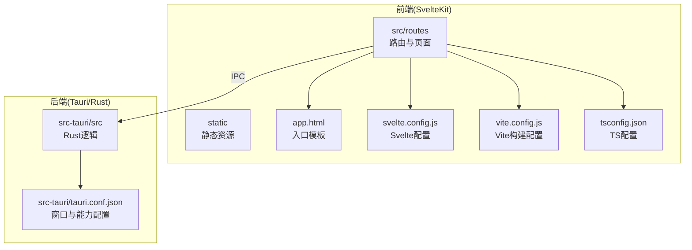
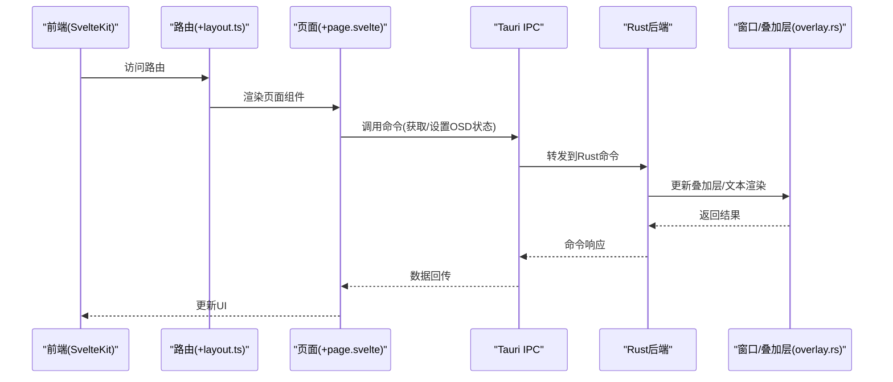
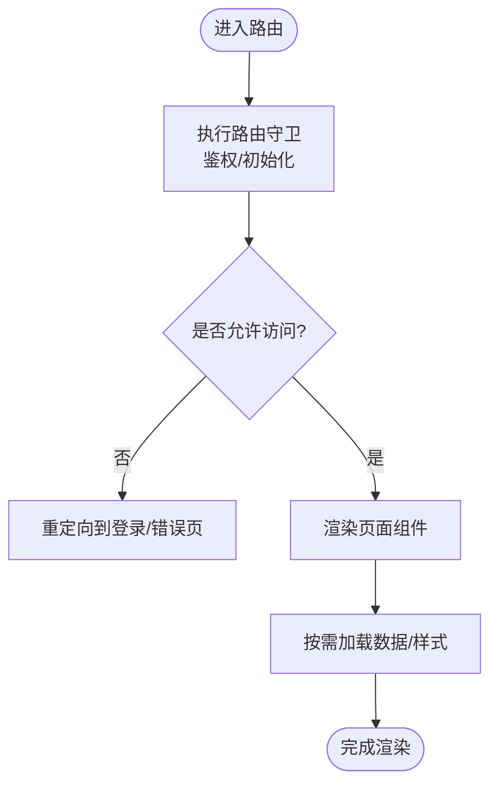
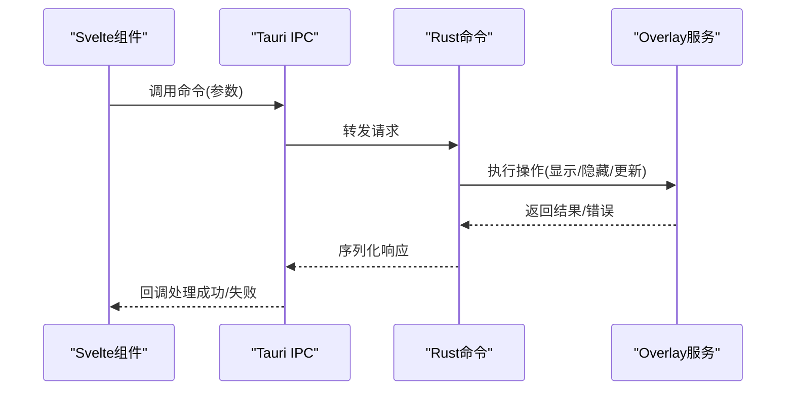
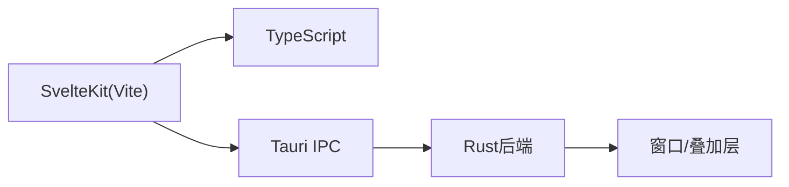

# 前端架构

<cite>
**本文引用的文件**   
- [package.json](file://osd-bubble/package.json)
- [svelte.config.js](file://osd-bubble/svelte.config.js)
- [vite.config.js](file://osd-bubble/vite.config.js)
- [tsconfig.json](file://osd-bubble/tsconfig.json)
- [app.html](file://osd-bubble/src/app.html)
- [+layout.ts](file://osd-bubble/src/routes/+layout.ts)
- [+page.svelte](file://osd-bubble/src/routes/+page.svelte)
- [+page.ts](file://osd-bubble/src/routes/custom-style/+page.ts)
- [+page.svelte](file://osd-bubble/src/routes/custom-style/+page.svelte)
- [tauri.conf.json](file://osd-bubble/src-tauri/tauri.conf.json)
- [main.rs](file://osd-bubble/src-tauri/src/main.rs)
- [lib.rs](file://osd-bubble/src-tauri/src/lib.rs)
- [overlay.rs](file://osd-bubble/src-tauri/src/overlay.rs)
- [state_machine.rs](file://osd-bubble/src-tauri/src/state_machine.rs)
- [hook.rs](file://osd-bubble/src-tauri/src/hook.rs)
- [mod.rs](file://osd-bubble/src-tauri/src/renderer/mod.rs)
- [layout.rs](file://osd-bubble/src-tauri/src/renderer/layout.rs)
- [text.rs](file://osd-bubble/src-tauri/src/renderer/text.rs)
</cite>

## 目录
1. [简介](#简介)
2. [项目结构](#项目结构)
3. [核心组件](#核心组件)
4. [架构总览](#架构总览)
5. [详细组件分析](#详细组件分析)
6. [依赖分析](#依赖分析)
7. [性能考虑](#性能考虑)
8. [故障排查指南](#故障排查指南)
9. [结论](#结论)
10. [附录](#附录)

## 简介
本文件面向按键OSD可视化工具的前端架构，聚焦于基于 Svelte + Vite 的现代化前端设计。文档涵盖路由结构、组件组织模式与状态管理策略；详细说明构建配置、开发环境与生产环境优化；解释页面布局系统、路由守卫与全局状态管理；记录前后端通信机制、API调用模式与错误处理策略；并给出响应式设计实现、性能优化技巧与最佳实践，辅以具体代码示例路径展示组件复用、事件处理与用户交互模式。

## 项目结构
本项目采用 Tauri + SvelteKit 的组合：
- 前端使用 SvelteKit（Svelte + Vite）进行应用开发与构建，位于 osd-bubble 目录。
- 后端使用 Rust + Tauri，位于 osd-bubble/src-tauri 目录，负责系统级能力（如窗口叠加层、渲染等）。

关键目录与职责：
- osd-bubble/src：SvelteKit 应用源码，包含路由、页面与布局。
- osd-bubble/static：静态资源（如自定义样式HTML片段）。
- osd-bubble/src-tauri：Tauri 后端工程，定义窗口、能力与Rust逻辑。
- 根配置文件：package.json、svelte.config.js、vite.config.js、tsconfig.json 控制构建与类型检查。

**图表来源** 
- [package.json](file://osd-bubble/package.json)
- [svelte.config.js](file://osd-bubble/svelte.config.js)
- [vite.config.js](file://osd-bubble/vite.config.js)
- [tsconfig.json](file://osd-bubble/tsconfig.json)
- [app.html](file://osd-bubble/src/app.html)
- [tauri.conf.json](file://osd-bubble/src-tauri/tauri.conf.json)
- [main.rs](file://osd-bubble/src-tauri/src/main.rs)

**章节来源**
- [package.json](file://osd-bubble/package.json)
- [svelte.config.js](file://osd-bubble/svelte.config.js)
- [vite.config.js](file://osd-bubble/vite.config.js)
- [tsconfig.json](file://osd-bubble/tsconfig.json)
- [app.html](file://osd-bubble/src/app.html)
- [tauri.conf.json](file://osd-bubble/src-tauri/tauri.conf.json)

## 核心组件
- 路由与页面
  - 根路由页面：用于承载主界面与基础布局。
  - 自定义样式路由：演示如何加载外部样式或注入自定义HTML片段。
- 布局与守卫
  - 布局文件：集中处理全局布局、导航与权限校验（路由守卫）。
- 构建与配置
  - Svelte/Vite 配置：模块解析、插件、代理、压缩与分包策略。
  - TypeScript 配置：严格模式、路径别名与编译目标。
- 前后端通信
  - Tauri IPC：前端通过命令调用Rust侧能力（窗口叠加层、文本渲染等）。

**章节来源**
- [+layout.ts](file://osd-bubble/src/routes/+layout.ts)
- [+page.svelte](file://osd-bubble/src/routes/+page.svelte)
- [+page.ts](file://osd-bubble/src/routes/custom-style/+page.ts)
- [+page.svelte](file://osd-bubble/src/routes/custom-style/+page.svelte)
- [svelte.config.js](file://osd-bubble/svelte.config.js)
- [vite.config.js](file://osd-bubble/vite.config.js)
- [tsconfig.json](file://osd-bubble/tsconfig.json)

## 架构总览
整体架构由“前端SvelteKit + 后端Tauri”组成：
- 前端负责UI渲染、路由与交互，通过Tauri IPC调用后端能力。
- 后端提供系统级功能（如Overlay窗口、文本绘制），并通过命令返回数据给前端。

**图表来源** 
- [+layout.ts](file://osd-bubble/src/routes/+layout.ts)
- [+page.svelte](file://osd-bubble/src/routes/+page.svelte)
- [main.rs](file://osd-bubble/src-tauri/src/main.rs)
- [overlay.rs](file://osd-bubble/src-tauri/src/overlay.rs)

## 详细组件分析

### 路由与布局系统
- 布局文件承担全局布局与路由守卫职责，可在进入页面之前执行鉴权、初始化或加载必要数据。
- 页面路由采用SvelteKit约定式路由，+page.svelte 表示页面，+page.ts 可导出服务端数据或客户端初始化逻辑。
- 自定义样式路由展示了如何在运行时注入外部样式或HTML片段，便于动态主题切换。

**图表来源** 
- [+layout.ts](file://osd-bubble/src/routes/+layout.ts)
- [+page.svelte](file://osd-bubble/src/routes/+page.svelte)
- [+page.ts](file://osd-bubble/src/routes/custom-style/+page.ts)
- [+page.svelte](file://osd-bubble/src/routes/custom-style/+page.svelte)

**章节来源**
- [+layout.ts](file://osd-bubble/src/routes/+layout.ts)
- [+page.svelte](file://osd-bubble/src/routes/+page.svelte)
- [+page.ts](file://osd-bubble/src/routes/custom-style/+page.ts)
- [+page.svelte](file://osd-bubble/src/routes/custom-style/+page.svelte)

### 构建与开发环境
- SvelteKit 通过 svelte.config.js 启用Svelte相关插件与编译器选项。
- Vite 通过 vite.config.js 配置开发服务器、热更新、代理与生产构建优化（如代码分割、压缩、Tree Shaking）。
- TypeScript 通过 tsconfig.json 开启严格模式、路径别名与目标平台设置，提升类型安全与开发体验。

建议优化点：
- 启用按需加载与懒加载，减少首屏体积。
- 使用环境变量区分开发与生产配置。
- 对静态资源进行缓存与CDN部署。

**章节来源**
- [svelte.config.js](file://osd-bubble/svelte.config.js)
- [vite.config.js](file://osd-bubble/vite.config.js)
- [tsconfig.json](file://osd-bubble/tsconfig.json)

### 前后端通信与错误处理
- 前端通过Tauri IPC调用Rust命令，实现跨进程通信。
- Rust侧在 main.rs 中注册命令，并在 overlay.rs 中处理窗口叠加层与文本渲染。
- 错误处理建议：
  - 前端对IPC调用进行try/catch封装，统一错误提示。
  - Rust侧返回明确的错误码与消息，便于前端分类处理。

**图表来源** 
- [main.rs](file://osd-bubble/src-tauri/src/main.rs)
- [overlay.rs](file://osd-bubble/src-tauri/src/overlay.rs)

**章节来源**
- [main.rs](file://osd-bubble/src-tauri/src/main.rs)
- [overlay.rs](file://osd-bubble/src-tauri/src/overlay.rs)

### 状态管理与全局状态
- 对于轻量级状态，可使用Svelte的响应式变量与stores。
- 复杂状态建议使用集中式store（如Svelte stores或第三方库），并结合路由守卫进行初始化与清理。
- 与后端同步的状态应通过IPC事件驱动更新，避免轮询。

**章节来源**
- [+layout.ts](file://osd-bubble/src/routes/+layout.ts)
- [+page.svelte](file://osd-bubble/src/routes/+page.svelte)

### 页面布局系统与响应式设计
- 布局文件统一处理头部、侧边栏与内容区，确保一致的视觉风格。
- 响应式设计通过CSS媒体查询与弹性布局实现，适配不同屏幕尺寸。
- 自定义样式路由支持动态主题切换，满足多场景需求。

**章节来源**
- [+page.svelte](file://osd-bubble/src/routes/+page.svelte)
- [+page.svelte](file://osd-bubble/src/routes/custom-style/+page.svelte)

### 组件复用与事件处理
- 组件复用：将通用UI拆分为独立组件，通过props传递数据与事件回调。
- 事件处理：使用Svelte的事件修饰符与双向绑定简化交互逻辑。
- 用户交互模式：表单验证、异步加载、错误提示与成功反馈需统一封装。

示例路径：
- 组件复用：参考页面中的子组件拆分与导入方式。
- 事件处理：参考按钮点击、输入框变化等事件绑定位置。

**章节来源**
- [+page.svelte](file://osd-bubble/src/routes/+page.svelte)
- [+page.svelte](file://osd-bubble/src/routes/custom-style/+page.svelte)

## 依赖分析
前端依赖关系如下：
- SvelteKit 作为框架核心，提供路由、SSR与构建工具链。
- Vite 作为构建器，提供开发服务器与优化打包。
- TypeScript 提供类型检查与开发体验增强。
- Tauri 作为桥接层，连接前端与Rust后端。

**图表来源** 
- [package.json](file://osd-bubble/package.json)
- [svelte.config.js](file://osd-bubble/svelte.config.js)
- [vite.config.js](file://osd-bubble/vite.config.js)
- [tsconfig.json](file://osd-bubble/tsconfig.json)
- [main.rs](file://osd-bubble/src-tauri/src/main.rs)

**章节来源**
- [package.json](file://osd-bubble/package.json)
- [svelte.config.js](file://osd-bubble/svelte.config.js)
- [vite.config.js](file://osd-bubble/vite.config.js)
- [tsconfig.json](file://osd-bubble/tsconfig.json)
- [main.rs](file://osd-bubble/src-tauri/src/main.rs)

## 性能考虑
- 首屏优化：启用代码分割、懒加载与预加载关键资源。
- 网络优化：使用HTTP缓存、CDN与压缩传输。
- 渲染优化：避免不必要的重渲染，使用Svelte的细粒度更新机制。
- 内存管理：及时释放监听器与定时器，防止内存泄漏。

[本节为通用指导，无需特定文件引用]

## 故障排查指南
常见问题与解决思路：
- 路由守卫失效：检查布局文件中守卫逻辑是否正确拦截未授权访问。
- IPC调用失败：确认Tauri命令已正确注册，且参数序列化无误。
- 样式冲突：检查静态资源加载顺序与优先级，必要时使用作用域样式。
- 构建失败：查看Vite与Svelte编译器日志，定位依赖或语法问题。

调试建议：
- 使用浏览器开发者工具监控网络与状态。
- 在Rust侧添加日志输出，定位后端错误。
- 逐步缩小问题范围，从路由到组件再到IPC调用。

**章节来源**
- [+layout.ts](file://osd-bubble/src/routes/+layout.ts)
- [main.rs](file://osd-bubble/src-tauri/src/main.rs)

## 结论
本架构以SvelteKit为核心，结合Vite的高效构建与Tauri的系统级能力，实现了高性能、可扩展的按键OSD可视化工具前端。通过合理的路由组织、组件复用与状态管理策略，以及严谨的错误处理与性能优化，确保了良好的用户体验与可维护性。后续可进一步引入更丰富的交互模式与可视化能力，提升工具的实用性与易用性。

[本节为总结性内容，无需特定文件引用]

## 附录
- 开发环境启动：参考package.json中的脚本命令。
- 构建产物：查看build目录下的生成文件。
- 自定义样式：通过static目录与路由动态注入。

[本节为补充信息，无需特定文件引用]