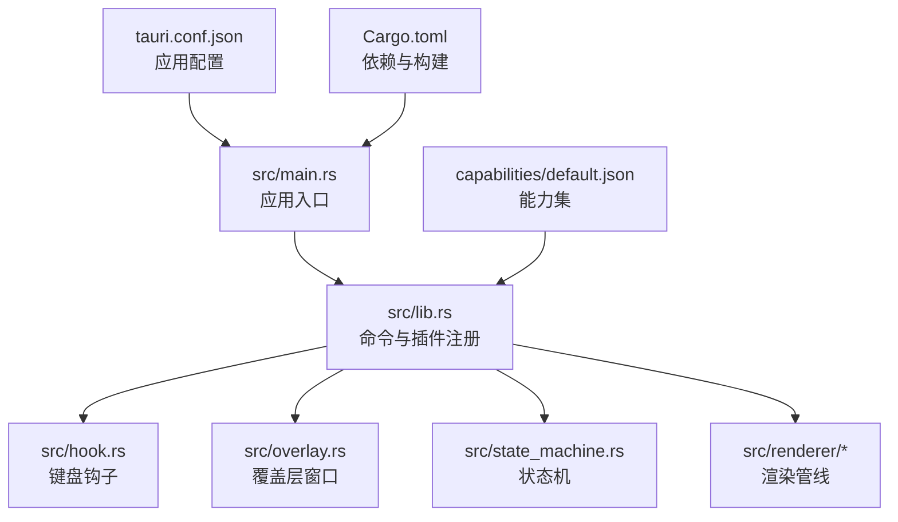
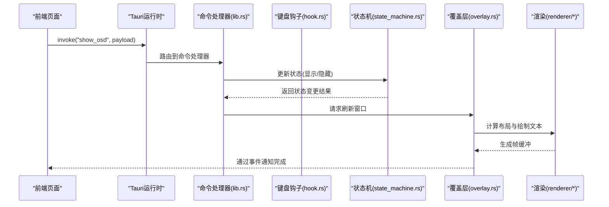
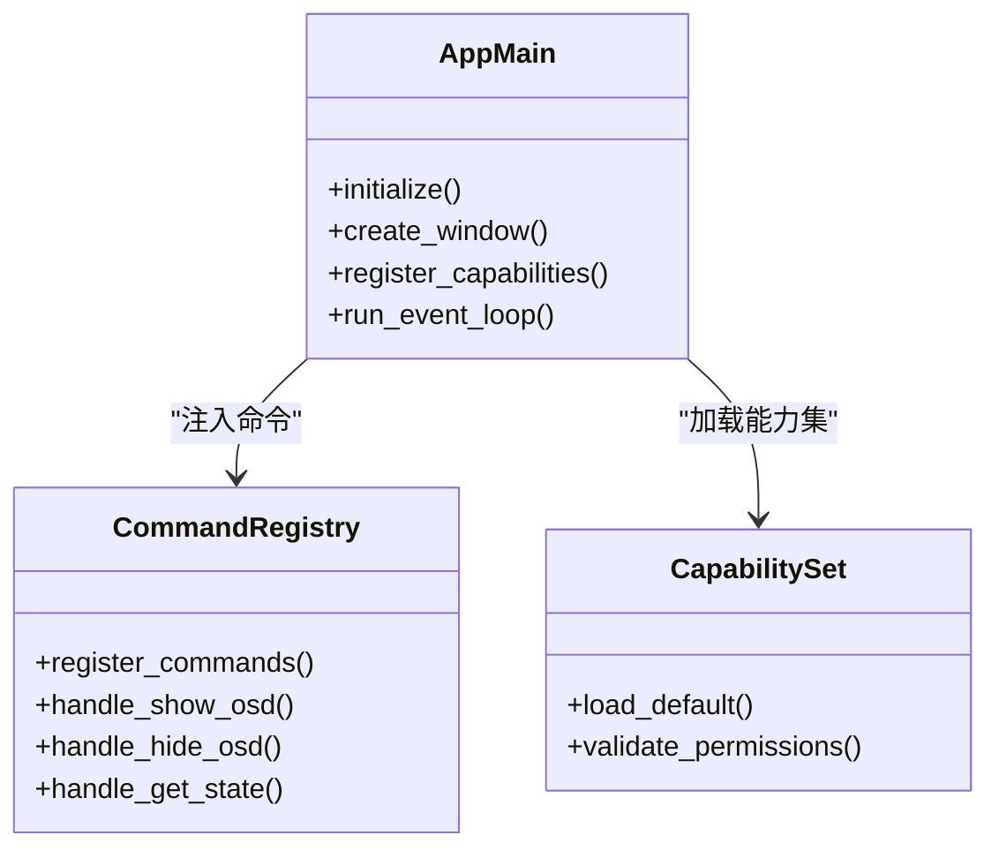
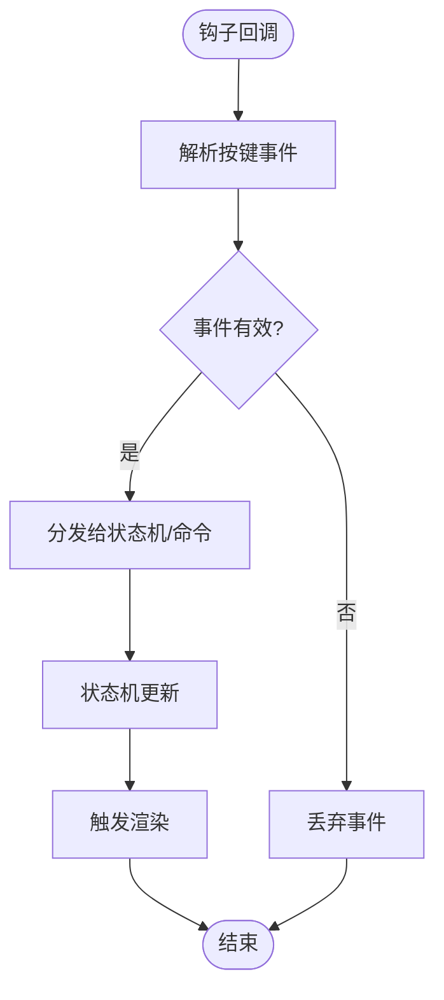
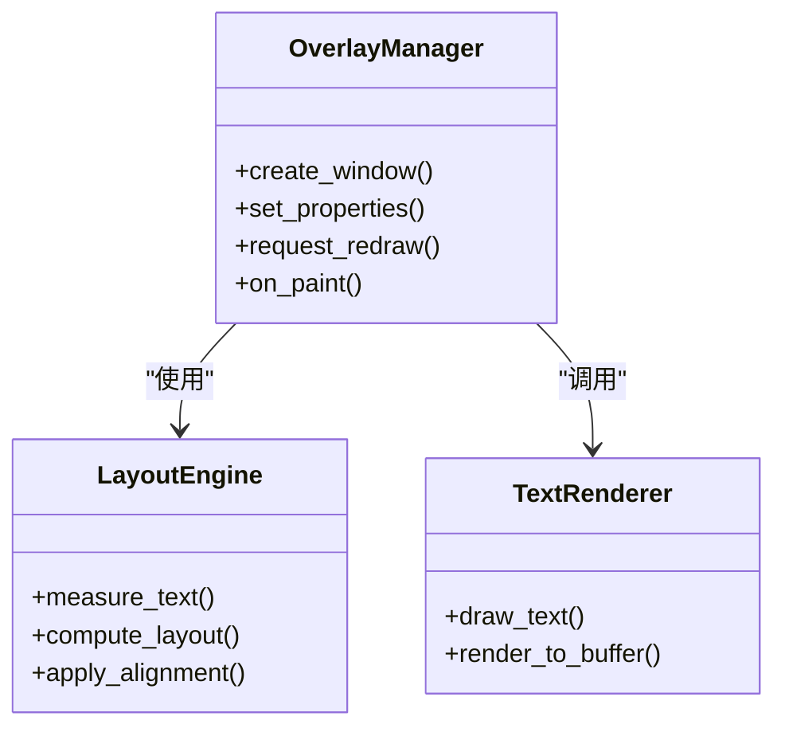
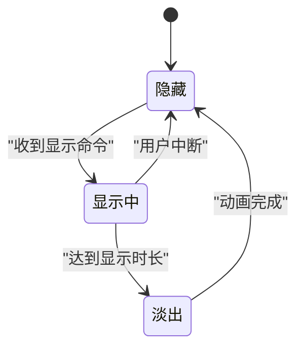
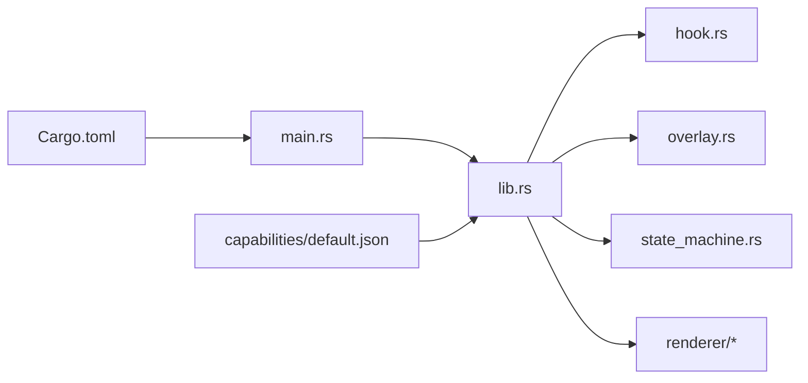

# 后端架构

<cite>
**本文引用的文件**   
- [main.rs](file://osd-bubble/src-tauri/src/main.rs)
- [lib.rs](file://osd-bubble/src-tauri/src/lib.rs)
- [hook.rs](file://osd-bubble/src-tauri/src/hook.rs)
- [overlay.rs](file://osd-bubble/src-tauri/src/overlay.rs)
- [state_machine.rs](file://osd-bubble/src-tauri/src/state_machine.rs)
- [renderer/mod.rs](file://osd-bubble/src-tauri/src/renderer/mod.rs)
- [renderer/layout.rs](file://osd-bubble/src-tauri/src/renderer/layout.rs)
- [renderer/text.rs](file://osd-bubble/src-tauri/src/renderer/text.rs)
- [Cargo.toml](file://osd-bubble/src-tauri/Cargo.toml)
- [tauri.conf.json](file://osd-bubble/src-tauri/tauri.conf.json)
- [capabilities/default.json](file://osd-bubble/src-tauri/capabilities/default.json)
</cite>

## 目录
1. [简介](#简介)
2. [项目结构](#项目结构)
3. [核心组件](#核心组件)
4. [架构总览](#架构总览)
5. [详细组件分析](#详细组件分析)
6. [依赖关系分析](#依赖关系分析)
7. [性能考量](#性能考量)
8. [故障排查指南](#故障排查指南)
9. [结论](#结论)
10. [附录](#附录)

## 简介
本文件面向按键OSD可视化工具的后端架构，聚焦Rust + Tauri的高性能桌面应用设计。内容涵盖主进程初始化、模块组织与生命周期管理；Tauri命令系统、IPC通信机制与安全权限控制；核心业务逻辑（输入钩子、渲染管线、状态机）、数据持久化策略与系统资源管理；错误处理模式、日志记录与调试支持；跨平台兼容性、打包配置与部署策略。文档同时提供命令注册、事件处理与异步操作的代码级示例路径，帮助读者快速定位实现细节。

## 项目结构
后端位于 osd-bubble/src-tauri 目录，采用典型的Tauri Rust工程布局：
- src/main.rs：Tauri应用入口，负责窗口创建、插件加载、命令注册与生命周期回调。
- src/lib.rs：Tauri库入口，集中注册命令、能力集与插件，暴露给前端调用。
- src/hook.rs：全局键盘输入捕获与事件分发（Windows钩子）。
- src/overlay.rs：OSD覆盖层窗口管理与绘制调度。
- src/state_machine.rs：OSD显示状态机，驱动渲染与显示时长控制。
- src/renderer/*：渲染子系统，包含布局计算与文本绘制。
- Cargo.toml：Rust依赖与构建配置。
- tauri.conf.json：Tauri应用元数据、窗口与权限配置。
- capabilities/default.json：能力集定义，约束前端可访问的Rust命令与API。

图表来源
- [main.rs](file://osd-bubble/src-tauri/src/main.rs)
- [lib.rs](file://osd-bubble/src-tauri/src/lib.rs)
- [tauri.conf.json](file://osd-bubble/src-tauri/tauri.conf.json)
- [capabilities/default.json](file://osd-bubble/src-tauri/capabilities/default.json)
- [Cargo.toml](file://osd-bubble/src-tauri/Cargo.toml)

章节来源
- [main.rs](file://osd-bubble/src-tauri/src/main.rs)
- [lib.rs](file://osd-bubble/src-tauri/src/lib.rs)
- [tauri.conf.json](file://osd-bubble/src-tauri/tauri.conf.json)
- [Cargo.toml](file://osd-bubble/src-tauri/Cargo.toml)

## 核心组件
- 应用入口与生命周期
  - main.rs：初始化Tauri运行时、创建主窗口、挂载能力集、注册命令与插件、启动消息循环。
  - lib.rs：集中式命令注册点，将Rust函数暴露为Tauri命令，供前端通过invoke调用。
- 输入捕获与事件分发
  - hook.rs：安装全局键盘钩子，过滤按键事件，转换为内部事件并投递到事件总线或状态机。
- 覆盖层与渲染
  - overlay.rs：管理OSD覆盖层窗口（无边框、置顶、透明），协调刷新与重绘。
  - renderer/*：layout.rs负责布局计算（位置、尺寸、对齐），text.rs负责文本测量与绘制。
- 状态机
  - state_machine.rs：维护OSD显示状态（隐藏、显示中、淡入/淡出、超时关闭等），响应输入事件与定时器事件。

章节来源
- [main.rs](file://osd-bubble/src-tauri/src/main.rs)
- [lib.rs](file://osd-bubble/src-tauri/src/lib.rs)
- [hook.rs](file://osd-bubble/src-tauri/src/hook.rs)
- [overlay.rs](file://osd-bubble/src-tauri/src/overlay.rs)
- [state_machine.rs](file://osd-bubble/src-tauri/src/state_machine.rs)
- [renderer/layout.rs](file://osd-bubble/src-tauri/src/renderer/layout.rs)
- [renderer/text.rs](file://osd-bubble/src-tauri/src/renderer/text.rs)

## 架构总览
整体架构遵循“前端UI + Tauri命令桥 + Rust后端”的分层模型：
- 前端通过Tauri invoke调用后端命令，触发输入捕获、状态切换与渲染更新。
- 后端以状态机为核心，结合钩子事件与定时器驱动OSD显示。
- 渲染子系统按需计算布局与绘制文本，覆盖层窗口保持轻量与高性能。
- 能力集限制前端可访问的命令范围，确保最小权限原则。

图表来源
- [lib.rs](file://osd-bubble/src-tauri/src/lib.rs)
- [hook.rs](file://osd-bubble/src-tauri/src/hook.rs)
- [state_machine.rs](file://osd-bubble/src-tauri/src/state_machine.rs)
- [overlay.rs](file://osd-bubble/src-tauri/src/overlay.rs)
- [renderer/layout.rs](file://osd-bubble/src-tauri/src/renderer/layout.rs)
- [renderer/text.rs](file://osd-bubble/src-tauri/src/renderer/text.rs)

## 详细组件分析

### 应用入口与命令注册
- main.rs负责Tauri应用初始化、窗口创建与能力集加载，并将lib.rs中的命令注册表注入运行时。
- lib.rs集中定义命令映射，将Rust函数暴露为前端可调用的命令，如显示/隐藏OSD、获取状态、设置样式等。
- 能力集default.json限定前端可访问的命令集合，避免越权操作。

图表来源
- [main.rs](file://osd-bubble/src-tauri/src/main.rs)
- [lib.rs](file://osd-bubble/src-tauri/src/lib.rs)
- [capabilities/default.json](file://osd-bubble/src-tauri/capabilities/default.json)

章节来源
- [main.rs](file://osd-bubble/src-tauri/src/main.rs)
- [lib.rs](file://osd-bubble/src-tauri/src/lib.rs)
- [capabilities/default.json](file://osd-bubble/src-tauri/capabilities/default.json)

### 键盘钩子与事件分发
- hook.rs安装全局键盘钩子，拦截按键事件，过滤无效输入，转换为内部事件对象。
- 事件分发器将按键事件投递至状态机或命令处理器，触发OSD显示逻辑。
- 错误处理包括钩子安装失败、事件解析异常与线程同步问题。

图表来源
- [hook.rs](file://osd-bubble/src-tauri/src/hook.rs)
- [state_machine.rs](file://osd-bubble/src-tauri/src/state_machine.rs)

章节来源
- [hook.rs](file://osd-bubble/src-tauri/src/hook.rs)
- [state_machine.rs](file://osd-bubble/src-tauri/src/state_machine.rs)

### 覆盖层与渲染管线
- overlay.rs管理OSD覆盖层窗口属性（无边框、置顶、透明、鼠标穿透），并协调刷新频率。
- renderer/layout.rs计算文本布局（位置、大小、对齐方式），renderer/text.rs进行文本测量与绘制。
- 渲染流程基于帧缓冲，减少重绘开销，提升性能。

图表来源
- [overlay.rs](file://osd-bubble/src-tauri/src/overlay.rs)
- [renderer/layout.rs](file://osd-bubble/src-tauri/src/renderer/layout.rs)
- [renderer/text.rs](file://osd-bubble/src-tauri/src/renderer/text.rs)

章节来源
- [overlay.rs](file://osd-bubble/src-tauri/src/overlay.rs)
- [renderer/layout.rs](file://osd-bubble/src-tauri/src/renderer/layout.rs)
- [renderer/text.rs](file://osd-bubble/src-tauri/src/renderer/text.rs)

### 状态机与生命周期
- state_machine.rs维护OSD显示状态，包括隐藏、显示中、淡入/淡出、超时关闭等。
- 状态转换由键盘事件、定时器与渲染完成信号驱动。
- 生命周期管理确保状态一致性与资源释放。

图表来源
- [state_machine.rs](file://osd-bubble/src-tauri/src/state_machine.rs)

章节来源
- [state_machine.rs](file://osd-bubble/src-tauri/src/state_machine.rs)

## 依赖关系分析
- 外部依赖通过Cargo.toml声明，包括Tauri框架、图形渲染库、钩子库等。
- 模块间耦合：lib.rs作为命令中心，依赖hook.rs、overlay.rs、state_machine.rs与renderer/*。
- 能力集default.json限制前端对命令的访问，确保安全边界。

图表来源
- [Cargo.toml](file://osd-bubble/src-tauri/Cargo.toml)
- [main.rs](file://osd-bubble/src-tauri/src/main.rs)
- [lib.rs](file://osd-bubble/src-tauri/src/lib.rs)
- [capabilities/default.json](file://osd-bubble/src-tauri/capabilities/default.json)

章节来源
- [Cargo.toml](file://osd-bubble/src-tauri/Cargo.toml)
- [lib.rs](file://osd-bubble/src-tauri/src/lib.rs)
- [capabilities/default.json](file://osd-bubble/src-tauri/capabilities/default.json)

## 性能考量
- 渲染优化：使用帧缓冲与增量重绘，避免全量刷新；文本测量缓存布局结果。
- 事件处理：钩子事件去抖与批量处理，降低CPU占用。
- 内存管理：状态机与渲染对象生命周期明确，及时释放资源。
- 并发模型：Tauri命令异步执行，避免阻塞UI线程；关键路径使用单线程渲染。

[本节为通用指导，不直接分析具体文件]

## 故障排查指南
- 命令未注册：检查lib.rs中的命令映射是否正确，确认能力集default.json是否允许该命令。
- 钩子失效：验证hook.rs中钩子安装是否成功，检查权限与系统兼容性。
- 渲染异常：确认overlay.rs窗口属性设置正确，renderer/*中布局与绘制逻辑无越界。
- 状态不一致：在state_machine.rs中添加状态转换日志，追踪事件来源。
- 日志与调试：启用Tauri日志级别，输出关键路径信息，便于定位问题。

章节来源
- [lib.rs](file://osd-bubble/src-tauri/src/lib.rs)
- [capabilities/default.json](file://osd-bubble/src-tauri/capabilities/default.json)
- [hook.rs](file://osd-bubble/src-tauri/src/hook.rs)
- [overlay.rs](file://osd-bubble/src-tauri/src/overlay.rs)
- [renderer/layout.rs](file://osd-bubble/src-tauri/src/renderer/layout.rs)
- [renderer/text.rs](file://osd-bubble/src-tauri/src/renderer/text.rs)
- [state_machine.rs](file://osd-bubble/src-tauri/src/state_machine.rs)

## 结论
本架构以Tauri为桥梁，结合Rust的高性能与类型安全，实现了按键OSD可视化的高效后端。通过清晰的模块划分、状态机驱动与渲染管线优化，确保了低延迟与高稳定性。能力集与命令注册机制保障了安全性与可扩展性。未来可进一步引入配置持久化、多语言字体支持与更丰富的视觉效果。

[本节为总结，不直接分析具体文件]

## 附录
- 命令注册示例路径：[lib.rs](file://osd-bubble/src-tauri/src/lib.rs)
- 事件处理示例路径：[hook.rs](file://osd-bubble/src-tauri/src/hook.rs)
- 异步操作示例路径：[state_machine.rs](file://osd-bubble/src-tauri/src/state_machine.rs)
- 打包配置参考：[tauri.conf.json](file://osd-bubble/src-tauri/tauri.conf.json)
- 依赖清单参考：[Cargo.toml](file://osd-bubble/src-tauri/Cargo.toml)