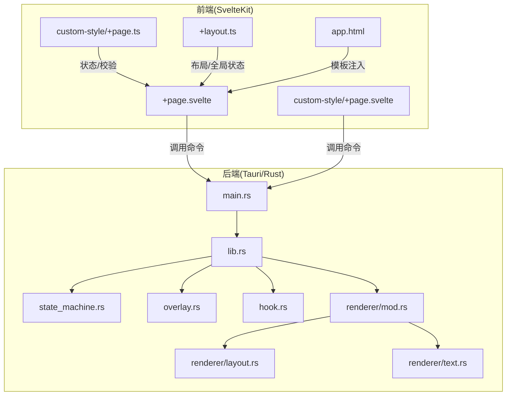
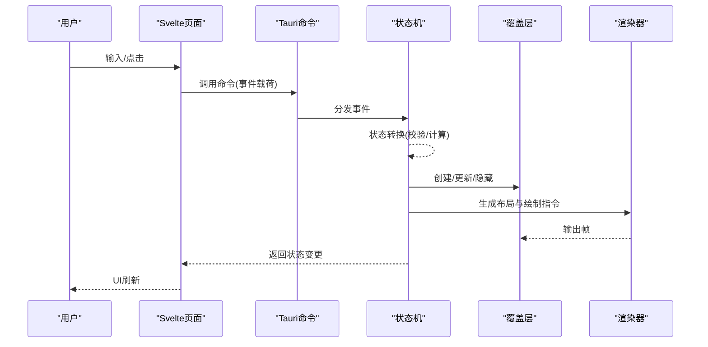
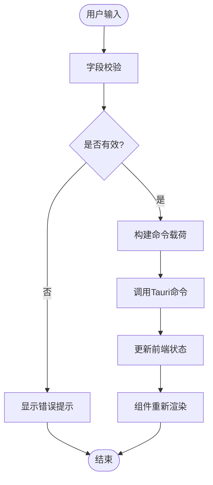
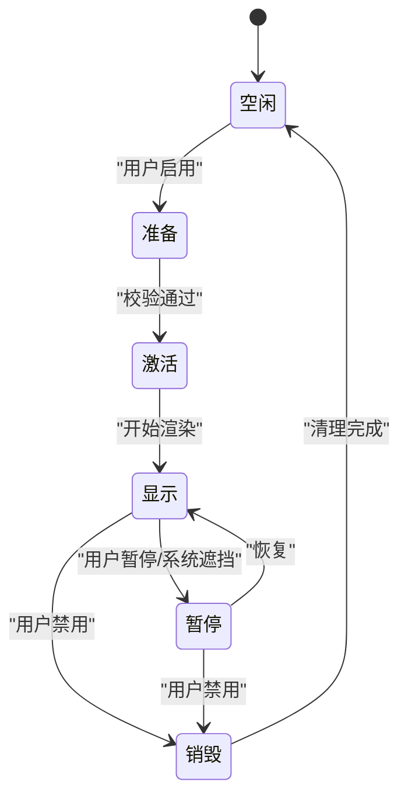
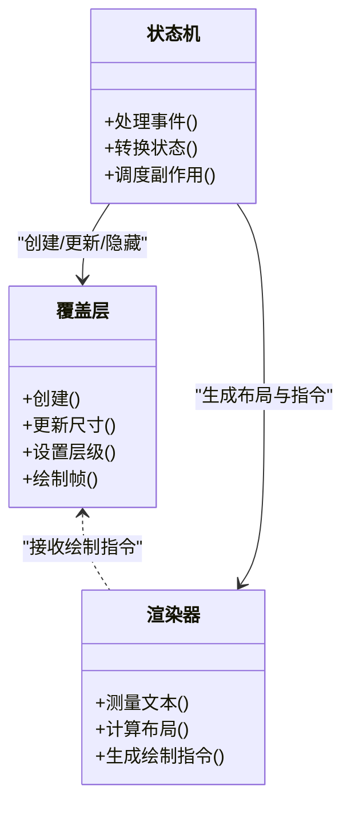
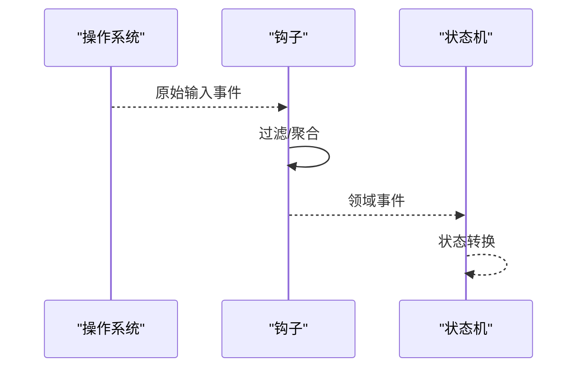
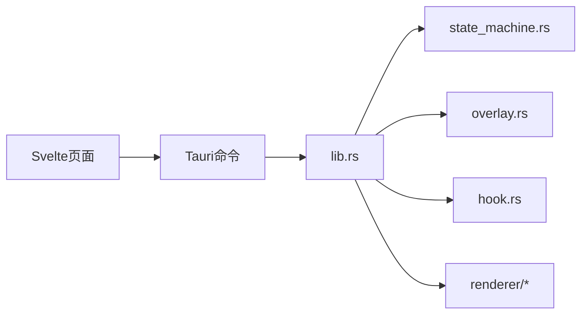

# 数据流设计

<cite>
**本文引用的文件**
- [按键OSD可视化工具-交互规格说明书.md](file://按键OSD可视化工具-交互规格说明书.md)
- [按键OSD可视化工具-交互原型.html](file://按键OSD可视化工具-交互原型.html)
- [osd-bubble/src/routes/+page.svelte](file://osd-bubble/src/routes/+page.svelte)
- [osd-bubble/src/routes/custom-style/+page.svelte](file://osd-bubble/src/routes/custom-style/+page.svelte)
- [osd-bubble/src/routes/custom-style/+page.ts](file://osd-bubble/src/routes/custom-style/+page.ts)
- [osd-bubble/src/routes/+layout.ts](file://osd-bubble/src/routes/+layout.ts)
- [osd-bubble/src/app.html](file://osd-bubble/src/app.html)
- [osd-bubble/src-tauri/src/lib.rs](file://osd-bubble/src-tauri/src/lib.rs)
- [osd-bubble/src-tauri/src/main.rs](file://osd-bubble/src-tauri/src/main.rs)
- [osd-bubble/src-tauri/src/state_machine.rs](file://osd-bubble/src-tauri/src/state_machine.rs)
- [osd-bubble/src-tauri/src/overlay.rs](file://osd-bubble/src-tauri/src/overlay.rs)
- [osd-bubble/src-tauri/src/hook.rs](file://osd-bubble/src-tauri/src/hook.rs)
- [osd-bubble/src-tauri/src/renderer/mod.rs](file://osd-bubble/src-tauri/src/renderer/mod.rs)
- [osd-bubble/src-tauri/src/renderer/layout.rs](file://osd-bubble/src-tauri/src/renderer/layout.rs)
- [osd-bubble/src-tauri/src/renderer/text.rs](file://osd-bubble/src-tauri/src/renderer/text.rs)
- [osd-bubble/src-tauri/Cargo.toml](file://osd-bubble/src-tauri/Cargo.toml)
- [osd-bubble/package.json](file://osd-bubble/package.json)
</cite>

## 目录
1. [引言](#引言)
2. [项目结构](#项目结构)
3. [核心组件](#核心组件)
4. [架构总览](#架构总览)
5. [详细组件分析](#详细组件分析)
6. [依赖关系分析](#依赖关系分析)
7. [性能考量](#性能考量)
8. [故障排查指南](#故障排查指南)
9. [结论](#结论)
10. [附录](#附录)

## 引言
本文件面向按键OSD可视化工具的数据流设计，聚焦从用户输入到UI渲染的完整数据流转过程。文档重点阐述：
- 状态机模式在OSD显示控制中的应用（状态、事件、转换规则）
- 事件驱动架构与前后端协作（Svelte前端 + Tauri/Rust后端）
- 前端状态管理、数据验证与业务逻辑分离
- 数据持久化策略、缓存机制与性能优化
- 数据流向图、状态转换图与关键算法说明
- 具体代码示例路径，展示状态更新、数据绑定与用户交互响应模式

## 项目结构
本项目采用“前端Svelte + Tauri(Rust)”的混合架构：
- 前端：SvelteKit路由与页面组件负责配置界面与交互
- 后端：Tauri应用承载Rust模块，实现系统级能力（如覆盖层、钩子、渲染）
- 资源：静态HTML模板与样式用于自定义外观

图表来源
- [osd-bubble/src/routes/+page.svelte](file://osd-bubble/src/routes/+page.svelte)
- [osd-bubble/src/routes/custom-style/+page.svelte](file://osd-bubble/src/routes/custom-style/+page.svelte)
- [osd-bubble/src/routes/custom-style/+page.ts](file://osd-bubble/src/routes/custom-style/+page.ts)
- [osd-bubble/src/routes/+layout.ts](file://osd-bubble/src/routes/+layout.ts)
- [osd-bubble/src/app.html](file://osd-bubble/src/app.html)
- [osd-bubble/src-tauri/src/main.rs](file://osd-bubble/src-tauri/src/main.rs)
- [osd-bubble/src-tauri/src/lib.rs](file://osd-bubble/src-tauri/src/lib.rs)
- [osd-bubble/src-tauri/src/state_machine.rs](file://osd-bubble/src-tauri/src/state_machine.rs)
- [osd-bubble/src-tauri/src/overlay.rs](file://osd-bubble/src-tauri/src/overlay.rs)
- [osd-bubble/src-tauri/src/hook.rs](file://osd-bubble/src-tauri/src/hook.rs)
- [osd-bubble/src-tauri/src/renderer/mod.rs](file://osd-bubble/src-tauri/src/renderer/mod.rs)
- [osd-bubble/src-tauri/src/renderer/layout.rs](file://osd-bubble/src-tauri/src/renderer/layout.rs)
- [osd-bubble/src-tauri/src/renderer/text.rs](file://osd-bubble/src-tauri/src/renderer/text.rs)

章节来源
- [按键OSD可视化工具-交互规格说明书.md](file://按键OSD可视化工具-交互规格说明书.md)
- [按键OSD可视化工具-交互原型.html](file://按键OSD可视化工具-交互原型.html)
- [osd-bubble/package.json](file://osd-bubble/package.json)
- [osd-bubble/src-tauri/Cargo.toml](file://osd-bubble/src-tauri/Cargo.toml)

## 核心组件
- 前端页面与路由
  - 主页面组件：承载配置表单、预览与操作按钮
  - 自定义样式页面：提供主题与样式参数
  - 页面脚本：集中定义状态、校验与业务函数
  - 布局脚本：统一初始化与全局状态
- 后端服务与子系统
  - 应用入口与命令注册：暴露前端可调用的命令接口
  - 状态机：维护OSD显示生命周期与转换规则
  - 覆盖层：负责窗口创建、置顶与绘制区域
  - 钩子：捕获系统事件并转发至状态机
  - 渲染器：文本布局与绘制管线

章节来源
- [osd-bubble/src/routes/+page.svelte](file://osd-bubble/src/routes/+page.svelte)
- [osd-bubble/src/routes/custom-style/+page.svelte](file://osd-bubble/src/routes/custom-style/+page.svelte)
- [osd-bubble/src/routes/custom-style/+page.ts](file://osd-bubble/src/routes/custom-style/+page.ts)
- [osd-bubble/src/routes/+layout.ts](file://osd-bubble/src/routes/+layout.ts)
- [osd-bubble/src-tauri/src/main.rs](file://osd-bubble/src-tauri/src/main.rs)
- [osd-bubble/src-tauri/src/lib.rs](file://osd-bubble/src-tauri/src/lib.rs)
- [osd-bubble/src-tauri/src/state_machine.rs](file://osd-bubble/src-tauri/src/state_machine.rs)
- [osd-bubble/src-tauri/src/overlay.rs](file://osd-bubble/src-tauri/src/overlay.rs)
- [osd-bubble/src-tauri/src/hook.rs](file://osd-bubble/src-tauri/src/hook.rs)
- [osd-bubble/src-tauri/src/renderer/mod.rs](file://osd-bubble/src-tauri/src/renderer/mod.rs)
- [osd-bubble/src-tauri/src/renderer/layout.rs](file://osd-bubble/src-tauri/src/renderer/layout.rs)
- [osd-bubble/src-tauri/src/renderer/text.rs](file://osd-bubble/src-tauri/src/renderer/text.rs)

## 架构总览
整体数据流遵循“事件驱动 + 状态机”的模式：
- 用户在Svelte页面触发交互（点击、输入、切换）
- 前端将动作封装为命令或消息，通过Tauri调用后端
- 后端状态机接收事件，执行状态转换与副作用（创建/销毁覆盖层、更新内容）
- 渲染器根据当前状态与配置生成布局与绘制指令
- 结果回写前端状态，驱动UI刷新

图表来源
- [osd-bubble/src/routes/+page.svelte](file://osd-bubble/src/routes/+page.svelte)
- [osd-bubble/src-tauri/src/main.rs](file://osd-bubble/src-tauri/src/main.rs)
- [osd-bubble/src-tauri/src/lib.rs](file://osd-bubble/src-tauri/src/lib.rs)
- [osd-bubble/src-tauri/src/state_machine.rs](file://osd-bubble/src-tauri/src/state_machine.rs)
- [osd-bubble/src-tauri/src/overlay.rs](file://osd-bubble/src-tauri/src/overlay.rs)
- [osd-bubble/src-tauri/src/renderer/mod.rs](file://osd-bubble/src-tauri/src/renderer/mod.rs)

## 详细组件分析

### 前端状态管理与数据绑定
- 状态组织
  - 使用页面脚本集中声明状态对象与校验规则
  - 页面组件以双向绑定方式读取/写入状态
- 数据验证
  - 在提交前进行字段校验（必填、范围、格式）
  - 错误信息即时反馈，阻止非法状态进入后端
- 业务逻辑分离
  - 纯函数处理转换与计算，避免副作用
  - 副作用（如调用Tauri命令）集中在事件处理器中

图表来源
- [osd-bubble/src/routes/custom-style/+page.ts](file://osd-bubble/src/routes/custom-style/+page.ts)
- [osd-bubble/src/routes/custom-style/+page.svelte](file://osd-bubble/src/routes/custom-style/+page.svelte)

章节来源
- [osd-bubble/src/routes/custom-style/+page.ts](file://osd-bubble/src/routes/custom-style/+page.ts)
- [osd-bubble/src/routes/custom-style/+page.svelte](file://osd-bubble/src/routes/custom-style/+page.svelte)
- [osd-bubble/src/routes/+layout.ts](file://osd-bubble/src/routes/+layout.ts)

### 状态机模式与事件驱动
- 状态集合
  - 空闲、准备、激活、显示、暂停、销毁等
- 事件类型
  - 用户操作（启用/禁用、更新内容）、系统事件（键盘/鼠标钩子）、定时器事件
- 转换规则
  - 每个状态对事件有明确的允许转换与副作用
  - 转换前进行前置条件校验，失败则保持原状态并上报错误
- 副作用管理
  - 创建/更新覆盖层、注册/注销钩子、刷新渲染帧

图表来源
- [osd-bubble/src-tauri/src/state_machine.rs](file://osd-bubble/src-tauri/src/state_machine.rs)

章节来源
- [osd-bubble/src-tauri/src/state_machine.rs](file://osd-bubble/src-tauri/src/state_machine.rs)
- [osd-bubble/src-tauri/src/hook.rs](file://osd-bubble/src-tauri/src/hook.rs)

### 覆盖层与渲染管线
- 覆盖层职责
  - 创建无边框顶层窗口、设置透明背景、定位与层级控制
  - 接收渲染指令并合成最终画面
- 渲染管线
  - 文本测量与布局（换行、对齐、边距）
  - 样式解析（字体、颜色、阴影、圆角）
  - 帧生成与增量更新（仅重绘变化区域）

图表来源
- [osd-bubble/src-tauri/src/overlay.rs](file://osd-bubble/src-tauri/src/overlay.rs)
- [osd-bubble/src-tauri/src/renderer/mod.rs](file://osd-bubble/src-tauri/src/renderer/mod.rs)
- [osd-bubble/src-tauri/src/renderer/layout.rs](file://osd-bubble/src-tauri/src/renderer/layout.rs)
- [osd-bubble/src-tauri/src/renderer/text.rs](file://osd-bubble/src-tauri/src/renderer/text.rs)
- [osd-bubble/src-tauri/src/state_machine.rs](file://osd-bubble/src-tauri/src/state_machine.rs)

章节来源
- [osd-bubble/src-tauri/src/overlay.rs](file://osd-bubble/src-tauri/src/overlay.rs)
- [osd-bubble/src-tauri/src/renderer/mod.rs](file://osd-bubble/src-tauri/src/renderer/mod.rs)
- [osd-bubble/src-tauri/src/renderer/layout.rs](file://osd-bubble/src-tauri/src/renderer/layout.rs)
- [osd-bubble/src-tauri/src/renderer/text.rs](file://osd-bubble/src-tauri/src/renderer/text.rs)

### 钩子系统与事件采集
- 钩子职责
  - 监听系统级输入事件（键盘/鼠标），过滤与聚合
  - 将事件转换为领域事件并推送给状态机
- 事件过滤
  - 忽略非目标进程/窗口的事件
  - 防抖与节流，降低高频事件对状态机的压力

图表来源
- [osd-bubble/src-tauri/src/hook.rs](file://osd-bubble/src-tauri/src/hook.rs)
- [osd-bubble/src-tauri/src/state_machine.rs](file://osd-bubble/src-tauri/src/state_machine.rs)

章节来源
- [osd-bubble/src-tauri/src/hook.rs](file://osd-bubble/src-tauri/src/hook.rs)
- [osd-bubble/src-tauri/src/state_machine.rs](file://osd-bubble/src-tauri/src/state_machine.rs)

### 数据持久化与缓存
- 持久化策略
  - 用户配置（主题、位置、快捷键映射）落盘存储
  - 启动时加载默认配置与上次会话配置合并
- 缓存机制
  - 文本度量与字体信息缓存，减少重复计算
  - 渲染指令缓存，支持增量更新
- 一致性保障
  - 读写锁保护共享状态
  - 异步写入与失败重试

章节来源
- [osd-bubble/src-tauri/src/state_machine.rs](file://osd-bubble/src-tauri/src/state_machine.rs)
- [osd-bubble/src-tauri/src/renderer/layout.rs](file://osd-bubble/src-tauri/src/renderer/layout.rs)
- [osd-bubble/src-tauri/src/renderer/text.rs](file://osd-bubble/src-tauri/src/renderer/text.rs)

## 依赖关系分析
- 前端依赖
  - Svelte组件依赖页面脚本的状态与校验函数
  - 页面脚本依赖Tauri命令接口
- 后端依赖
  - lib.rs组合各子系统（状态机、覆盖层、钩子、渲染器）
  - main.rs注册命令并提供进程入口
- 外部依赖
  - Tauri框架、系统API（窗口、钩子）、图形库（渲染）

图表来源
- [osd-bubble/src/routes/+page.svelte](file://osd-bubble/src/routes/+page.svelte)
- [osd-bubble/src-tauri/src/main.rs](file://osd-bubble/src-tauri/src/main.rs)
- [osd-bubble/src-tauri/src/lib.rs](file://osd-bubble/src-tauri/src/lib.rs)
- [osd-bubble/src-tauri/src/state_machine.rs](file://osd-bubble/src-tauri/src/state_machine.rs)
- [osd-bubble/src-tauri/src/overlay.rs](file://osd-bubble/src-tauri/src/overlay.rs)
- [osd-bubble/src-tauri/src/hook.rs](file://osd-bubble/src-tauri/src/hook.rs)
- [osd-bubble/src-tauri/src/renderer/mod.rs](file://osd-bubble/src-tauri/src/renderer/mod.rs)

章节来源
- [osd-bubble/src-tauri/Cargo.toml](file://osd-bubble/src-tauri/Cargo.toml)
- [osd-bubble/package.json](file://osd-bubble/package.json)

## 性能考量
- 渲染优化
  - 文本测量与布局结果缓存，避免重复计算
  - 增量更新与脏矩形重绘，降低GPU/CPU负载
- 事件处理优化
  - 钩子层防抖/节流，批量处理高频事件
  - 状态机事件队列，避免阻塞主循环
- 内存与资源
  - 及时释放覆盖层与渲染资源
  - 大文本分块渲染与懒加载
- 前端优化
  - 最小化状态更新范围，利用Svelte细粒度响应式
  - 避免频繁同步I/O，异步批量化持久化

[本节为通用指导，不直接分析具体文件]

## 故障排查指南
- 常见问题
  - 覆盖层未显示：检查状态机是否处于显示状态、覆盖层创建是否成功
  - 文本错位：确认布局计算与字体度量是否正确，缓存是否失效
  - 事件丢失：核查钩子过滤逻辑与事件队列长度
- 调试建议
  - 增加状态转换日志与事件追踪
  - 导出渲染指令与帧差异对比
  - 前端网络/命令调用链路监控

章节来源
- [osd-bubble/src-tauri/src/state_machine.rs](file://osd-bubble/src-tauri/src/state_machine.rs)
- [osd-bubble/src-tauri/src/overlay.rs](file://osd-bubble/src-tauri/src/overlay.rs)
- [osd-bubble/src-tauri/src/hook.rs](file://osd-bubble/src-tauri/src/hook.rs)
- [osd-bubble/src-tauri/src/renderer/layout.rs](file://osd-bubble/src-tauri/src/renderer/layout.rs)

## 结论
本设计通过状态机与事件驱动将用户输入、系统事件与渲染流程解耦，形成清晰的数据流与职责边界。前端专注状态管理与交互，后端承担系统级能力与渲染管线。配合缓存与优化策略，确保OSD显示的性能与稳定性。建议在后续迭代中完善错误上报、可观测性与跨平台适配。

[本节为总结性内容，不直接分析具体文件]

## 附录
- 参考规范与原型
  - 交互规格说明书：定义功能边界与交互流程
  - 交互原型：可视化验证用户体验与布局
- 关键示例路径
  - 状态更新与数据绑定：[osd-bubble/src/routes/custom-style/+page.ts](file://osd-bubble/src/routes/custom-style/+page.ts)、[osd-bubble/src/routes/custom-style/+page.svelte](file://osd-bubble/src/routes/custom-style/+page.svelte)
  - 状态机与事件处理：[osd-bubble/src-tauri/src/state_machine.rs](file://osd-bubble/src-tauri/src/state_machine.rs)、[osd-bubble/src-tauri/src/hook.rs](file://osd-bubble/src-tauri/src/hook.rs)
  - 覆盖层与渲染：[osd-bubble/src-tauri/src/overlay.rs](file://osd-bubble/src-tauri/src/overlay.rs)、[osd-bubble/src-tauri/src/renderer/mod.rs](file://osd-bubble/src-tauri/src/renderer/mod.rs)

章节来源
- [按键OSD可视化工具-交互规格说明书.md](file://按键OSD可视化工具-交互规格说明书.md)
- [按键OSD可视化工具-交互原型.html](file://按键OSD可视化工具-交互原型.html)
- [osd-bubble/src/routes/custom-style/+page.ts](file://osd-bubble/src/routes/custom-style/+page.ts)
- [osd-bubble/src/routes/custom-style/+page.svelte](file://osd-bubble/src/routes/custom-style/+page.svelte)
- [osd-bubble/src-tauri/src/state_machine.rs](file://osd-bubble/src-tauri/src/state_machine.rs)
- [osd-bubble/src-tauri/src/hook.rs](file://osd-bubble/src-tauri/src/hook.rs)
- [osd-bubble/src-tauri/src/overlay.rs](file://osd-bubble/src-tauri/src/overlay.rs)
- [osd-bubble/src-tauri/src/renderer/mod.rs](file://osd-bubble/src-tauri/src/renderer/mod.rs)