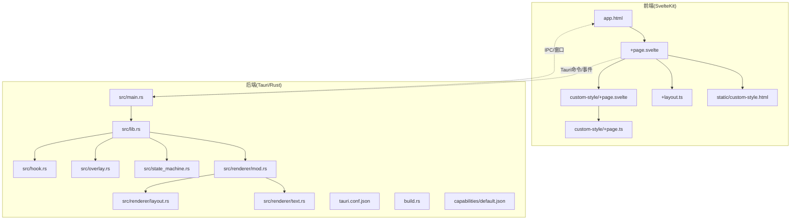
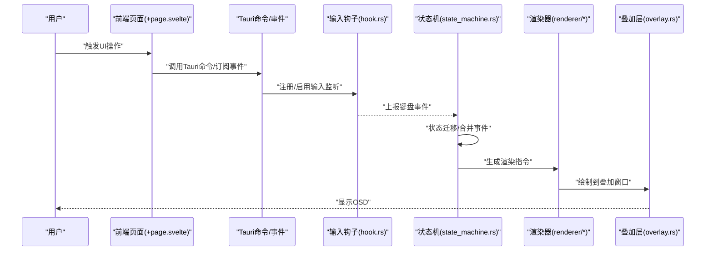
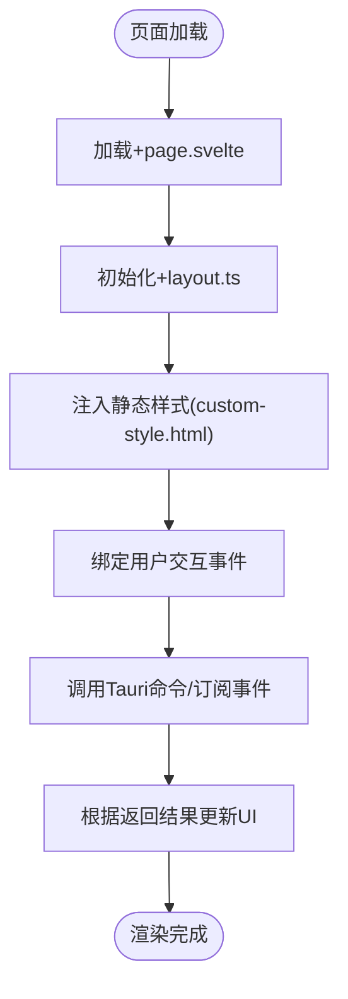
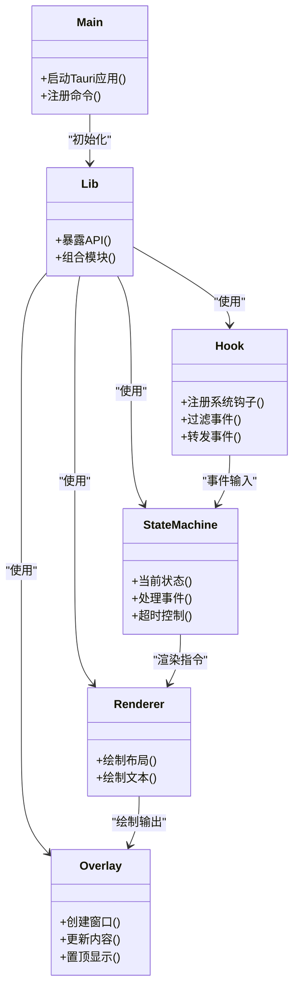
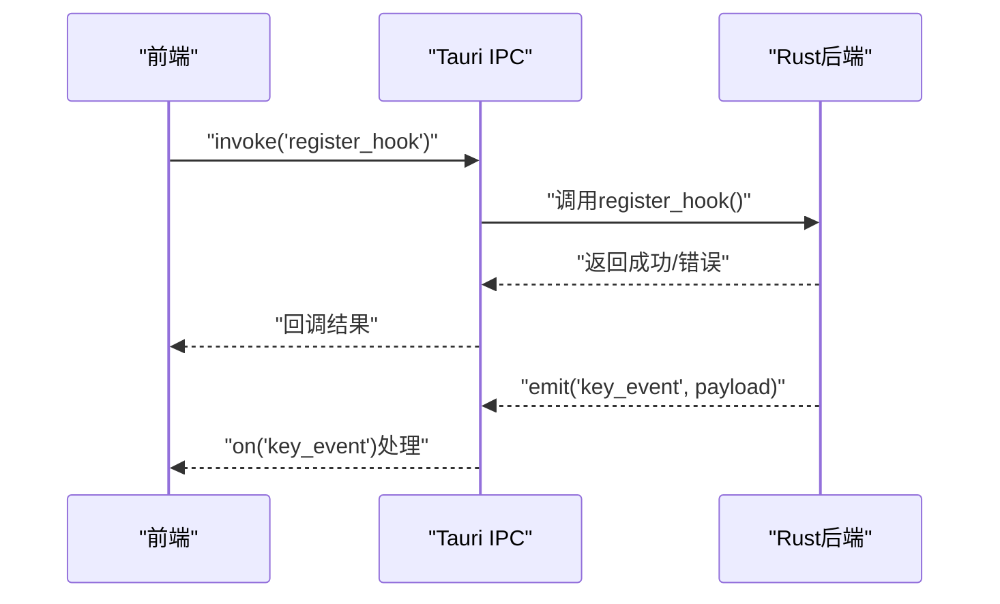
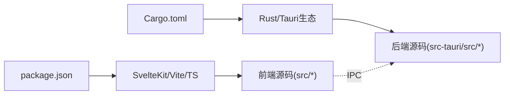

# 系统架构

<cite>
**本文引用的文件**   
- [按键OSD可视化工具-交互规格说明书.md](file://按键OSD可视化工具-交互规格说明书.md)
- [按键OSD可视化工具-交互原型.html](file://按键OSD可视化工具-交互原型.html)
- [osd-bubble/package.json](file://osd-bubble/package.json)
- [osd-bubble/svelte.config.js](file://osd-bubble/svelte.config.js)
- [osd-bubble/vite.config.js](file://osd-bubble/vite.config.js)
- [osd-bubble/src/app.html](file://osd-bubble/src/app.html)
- [osd-bubble/src/routes/+page.svelte](file://osd-bubble/src/routes/+page.svelte)
- [osd-bubble/src/routes/custom-style/+page.svelte](file://osd-bubble/src/routes/custom-style/+page.svelte)
- [osd-bubble/src/routes/custom-style/+page.ts](file://osd-bubble/src/routes/custom-style/+page.ts)
- [osd-bubble/src/routes/+layout.ts](file://osd-bubble/src/+layout.ts)
- [osd-bubble/static/custom-style.html](file://osd-bubble/static/custom-style.html)
- [osd-bubble/src-tauri/Cargo.toml](file://osd-bubble/src-tauri/Cargo.toml)
- [osd-bubble/src-tauri/tauri.conf.json](file://osd-bubble/src-tauri/tauri.conf.json)
- [osd-bubble/src-tauri/build.rs](file://osd-bubble/src-tauri/build.rs)
- [osd-bubble/src-tauri/src/main.rs](file://osd-bubble/src-tauri/src/main.rs)
- [osd-bubble/src-tauri/src/lib.rs](file://osd-bubble/src-tauri/src/lib.rs)
- [osd-bubble/src-tauri/src/hook.rs](file://osd-bubble/src-tauri/src/hook.rs)
- [osd-bubble/src-tauri/src/overlay.rs](file://osd-bubble/src-tauri/src/overlay.rs)
- [osd-bubble/src-tauri/src/state_machine.rs](file://osd-bubble/src-tauri/src/state_machine.rs)
- [osd-bubble/src-tauri/src/renderer/mod.rs](file://osd-bubble/src-tauri/src/renderer/mod.rs)
- [osd-bubble/src-tauri/src/renderer/layout.rs](file://osd-bubble/src-tauri/src/renderer/layout.rs)
- [osd-bubble/src-tauri/src/renderer/text.rs](file://osd-bubble/src-tauri/src/renderer/text.rs)
- [osd-bubble/src-tauri/capabilities/default.json](file://osd-bubble/src-tauri/capabilities/default.json)
</cite>

## 目录
1. [简介](#简介)
2. [项目结构](#项目结构)
3. [核心组件](#核心组件)
4. [架构总览](#架构总览)
5. [详细组件分析](#详细组件分析)
6. [依赖分析](#依赖分析)
7. [性能考虑](#性能考虑)
8. [故障排查指南](#故障排查指南)
9. [结论](#结论)
10. [附录](#附录)

## 简介
本文件为“按键OSD可视化工具”的系统架构文档。该工具基于 Tauri + Svelte，将前端界面与后端 Rust 能力结合，实现键盘输入事件捕获、状态管理与 OSD（On-Screen Display）渲染输出。文档覆盖高层设计、架构模式、系统边界、前后端通信机制、组件交互与数据流、集成模式、技术决策与权衡、约束条件、基础设施要求、可扩展性、部署拓扑，以及安全性、监控与灾难恢复等横切关注点，并记录技术栈、第三方依赖与版本兼容性。

## 项目结构
- 前端（SvelteKit）：位于 osd-bubble/src，使用 SvelteKit 路由与页面组织；静态资源在 static；构建配置由 vite.config.js 与 svelte.config.js 管理。
- 后端（Tauri/Rust）：位于 osd-bubble/src-tauri，包含 Tauri 应用入口、能力声明、Rust 模块（hook、overlay、state_machine、renderer），以及 Tauri 配置与构建脚本。
- 产品规格与原型：根目录下的交互规格与原型用于对齐需求与交互流程。

图表来源 
- [osd-bubble/src/app.html](file://osd-bubble/src/app.html)
- [osd-bubble/src/routes/+page.svelte](file://osd-bubble/src/routes/+page.svelte)
- [osd-bubble/src/routes/custom-style/+page.svelte](file://osd-bubble/src/routes/custom-style/+page.svelte)
- [osd-bubble/src/routes/custom-style/+page.ts](file://osd-bubble/src/routes/custom-style/+page.ts)
- [osd-bubble/src/routes/+layout.ts](file://osd-bubble/src/routes/+layout.ts)
- [osd-bubble/static/custom-style.html](file://osd-bubble/static/custom-style.html)
- [osd-bubble/src-tauri/src/main.rs](file://osd-bubble/src-tauri/src/main.rs)
- [osd-bubble/src-tauri/src/lib.rs](file://osd-bubble/src-tauri/src/lib.rs)
- [osd-bubble/src-tauri/src/hook.rs](file://osd-bubble/src-tauri/src/hook.rs)
- [osd-bubble/src-tauri/src/overlay.rs](file://osd-bubble/src-tauri/src/overlay.rs)
- [osd-bubble/src-tauri/src/state_machine.rs](file://osd-bubble/src-tauri/src/state_machine.rs)
- [osd-bubble/src-tauri/src/renderer/mod.rs](file://osd-bubble/src-tauri/src/renderer/mod.rs)
- [osd-bubble/src-tauri/src/renderer/layout.rs](file://osd-bubble/src-tauri/src/renderer/layout.rs)
- [osd-bubble/src-tauri/src/renderer/text.rs](file://osd-bubble/src-tauri/src/renderer/text.rs)
- [osd-bubble/src-tauri/tauri.conf.json](file://osd-bubble/src-tauri/tauri.conf.json)
- [osd-bubble/src-tauri/build.rs](file://osd-bubble/src-tauri/build.rs)
- [osd-bubble/src-tauri/capabilities/default.json](file://osd-bubble/src-tauri/capabilities/default.json)

章节来源
- [按键OSD可视化工具-交互规格说明书.md](file://按键OSD可视化工具-交互规格说明书.md)
- [按键OSD可视化工具-交互原型.html](file://按键OSD可视化工具-交互原型.html)
- [osd-bubble/package.json](file://osd-bubble/package.json)
- [osd-bubble/svelte.config.js](file://osd-bubble/svelte.config.js)
- [osd-bubble/vite.config.js](file://osd-bubble/vite.config.js)

## 核心组件
- 前端视图层（SvelteKit）
  - 入口模板与布局：负责注入 HTML 骨架与全局样式。
  - 页面组件：承载用户交互与展示逻辑，通过 Tauri 命令与后端通信。
  - 自定义样式页：提供可插拔的样式主题与渲染效果。
- 后端能力层（Tauri/Rust）
  - 主进程与库入口：注册 Tauri 插件、命令与生命周期钩子。
  - 输入钩子（hook）：捕获系统级键盘事件，进行过滤与转换。
  - 状态机（state_machine）：维护 OSD 显示状态、切换规则与超时策略。
  - 渲染器（renderer）：抽象绘制接口，具体实现布局与文本渲染。
  - 叠加层（overlay）：创建无边框置顶窗口，承载 OSD 内容。
  - 能力与权限（capabilities）：最小化暴露系统能力，确保安全边界。

章节来源
- [osd-bubble/src/routes/+page.svelte](file://osd-bubble/src/routes/+page.svelte)
- [osd-bubble/src/routes/custom-style/+page.svelte](file://osd-bubble/src/routes/custom-style/+page.svelte)
- [osd-bubble/src/routes/custom-style/+page.ts](file://osd-bubble/src/routes/custom-style/+page.ts)
- [osd-bubble/src/routes/+layout.ts](file://osd-bubble/src/routes/+layout.ts)
- [osd-bubble/src-tauri/src/main.rs](file://osd-bubble/src-tauri/src/main.rs)
- [osd-bubble/src-tauri/src/lib.rs](file://osd-bubble/src-tauri/src/lib.rs)
- [osd-bubble/src-tauri/src/hook.rs](file://osd-bubble/src-tauri/src/hook.rs)
- [osd-bubble/src-tauri/src/state_machine.rs](file://osd-bubble/src-tauri/src/state_machine.rs)
- [osd-bubble/src-tauri/src/renderer/mod.rs](file://osd-bubble/src-tauri/src/renderer/mod.rs)
- [osd-bubble/src-tauri/src/renderer/layout.rs](file://osd-bubble/src-tauri/src/renderer/layout.rs)
- [osd-bubble/src-tauri/src/renderer/text.rs](file://osd-bubble/src-tauri/src/renderer/text.rs)
- [osd-bubble/src-tauri/src/overlay.rs](file://osd-bubble/src-tauri/src/overlay.rs)
- [osd-bubble/src-tauri/capabilities/default.json](file://osd-bubble/src-tauri/capabilities/default.json)

## 架构总览
整体采用“前端 UI + 后端系统能力”的分层架构：
- 前端以 SvelteKit 组织页面与路由，通过 Tauri 的命令/事件通道调用后端能力。
- 后端以 Rust 为核心，封装输入钩子、状态机、渲染器与叠加层，对外暴露稳定的 IPC 接口。
- 数据流遵循“事件驱动 + 状态集中管理”的模式：输入事件经 hook 进入 state_machine，状态变化驱动 renderer 更新 overlay 显示。

图表来源 
- [osd-bubble/src/routes/+page.svelte](file://osd-bubble/src/routes/+page.svelte)
- [osd-bubble/src-tauri/src/main.rs](file://osd-bubble/src-tauri/src/main.rs)
- [osd-bubble/src-tauri/src/hook.rs](file://osd-bubble/src-tauri/src/hook.rs)
- [osd-bubble/src-tauri/src/state_machine.rs](file://osd-bubble/src-tauri/src/state_machine.rs)
- [osd-bubble/src-tauri/src/renderer/mod.rs](file://osd-bubble/src-tauri/src/renderer/mod.rs)
- [osd-bubble/src-tauri/src/overlay.rs](file://osd-bubble/src-tauri/src/overlay.rs)

## 详细组件分析

### 前端 SvelteKit 应用
- 路由与页面
  - 默认页面与自定义样式页面分离，便于主题与样式扩展。
  - 页面脚本（+page.ts）用于类型定义与业务逻辑编排。
- 构建与打包
  - Vite 作为开发服务器与构建工具，SvelteKit 提供路由与 SSR/CSR 能力。
  - 静态资源通过 static 目录托管，支持外部样式注入。
- 与 Tauri 的集成
  - 通过 Tauri 提供的 JS API 调用 Rust 命令与监听事件，实现跨进程通信。

图表来源 
- [osd-bubble/src/routes/+page.svelte](file://osd-bubble/src/routes/+page.svelte)
- [osd-bubble/src/routes/+layout.ts](file://osd-bubble/src/routes/+layout.ts)
- [osd-bubble/static/custom-style.html](file://osd-bubble/static/custom-style.html)

章节来源
- [osd-bubble/src/routes/+page.svelte](file://osd-bubble/src/routes/+page.svelte)
- [osd-bubble/src/routes/custom-style/+page.svelte](file://osd-bubble/src/routes/custom-style/+page.svelte)
- [osd-bubble/src/routes/custom-style/+page.ts](file://osd-bubble/src/routes/custom-style/+page.ts)
- [osd-bubble/src/routes/+layout.ts](file://osd-bubble/src/routes/+layout.ts)
- [osd-bubble/static/custom-style.html](file://osd-bubble/static/custom-style.html)
- [osd-bubble/svelte.config.js](file://osd-bubble/svelte.config.js)
- [osd-bubble/vite.config.js](file://osd-bubble/vite.config.js)

### 后端 Tauri/Rust 模块
- 主进程与库入口
  - main.rs 启动 Tauri 应用，注册命令与插件。
  - lib.rs 暴露 Rust 能力给前端，组织模块边界。
- 输入钩子（hook.rs）
  - 捕获系统级键盘事件，进行白名单过滤与去抖处理。
- 状态机（state_machine.rs）
  - 维护当前 OSD 状态（如隐藏、显示、闪烁）、事件队列与超时策略。
- 渲染器（renderer/*）
  - 抽象渲染接口，layout.rs 负责布局计算，text.rs 负责文本绘制。
- 叠加层（overlay.rs）
  - 创建无边框置顶窗口，承载渲染结果，避免遮挡其他应用。
- 能力与权限（capabilities/default.json）
  - 最小化暴露系统能力，限制危险 API 访问。

图表来源 
- [osd-bubble/src-tauri/src/main.rs](file://osd-bubble/src-tauri/src/main.rs)
- [osd-bubble/src-tauri/src/lib.rs](file://osd-bubble/src-tauri/src/lib.rs)
- [osd-bubble/src-tauri/src/hook.rs](file://osd-bubble/src-tauri/src/hook.rs)
- [osd-bubble/src-tauri/src/state_machine.rs](file://osd-bubble/src-tauri/src/state_machine.rs)
- [osd-bubble/src-tauri/src/renderer/mod.rs](file://osd-bubble/src-tauri/src/renderer/mod.rs)
- [osd-bubble/src-tauri/src/renderer/layout.rs](file://osd-bubble/src-tauri/src/renderer/layout.rs)
- [osd-bubble/src-tauri/src/renderer/text.rs](file://osd-bubble/src-tauri/src/renderer/text.rs)
- [osd-bubble/src-tauri/src/overlay.rs](file://osd-bubble/src-tauri/src/overlay.rs)

章节来源
- [osd-bubble/src-tauri/src/main.rs](file://osd-bubble/src-tauri/src/main.rs)
- [osd-bubble/src-tauri/src/lib.rs](file://osd-bubble/src-tauri/src/lib.rs)
- [osd-bubble/src-tauri/src/hook.rs](file://osd-bubble/src-tauri/src/hook.rs)
- [osd-bubble/src-tauri/src/state_machine.rs](file://osd-bubble/src-tauri/src/state_machine.rs)
- [osd-bubble/src-tauri/src/renderer/mod.rs](file://osd-bubble/src-tauri/src/renderer/mod.rs)
- [osd-bubble/src-tauri/src/renderer/layout.rs](file://osd-bubble/src-tauri/src/renderer/layout.rs)
- [osd-bubble/src-tauri/src/renderer/text.rs](file://osd-bubble/src-tauri/src/renderer/text.rs)
- [osd-bubble/src-tauri/src/overlay.rs](file://osd-bubble/src-tauri/src/overlay.rs)
- [osd-bubble/src-tauri/capabilities/default.json](file://osd-bubble/src-tauri/capabilities/default.json)

### 前后端通信机制
- 命令调用：前端通过 Tauri 命令调用 Rust 函数，执行系统级操作（如注册钩子、更新状态）。
- 事件推送：后端通过 Tauri 事件向前端推送状态变更或渲染结果。
- 配置下发：通过 tauri.conf.json 与 build.rs 控制窗口属性、能力与构建产物。

图表来源 
- [osd-bubble/src-tauri/tauri.conf.json](file://osd-bubble/src-tauri/tauri.conf.json)
- [osd-bubble/src-tauri/build.rs](file://osd-bubble/src-tauri/build.rs)

章节来源
- [osd-bubble/src-tauri/tauri.conf.json](file://osd-bubble/src-tauri/tauri.conf.json)
- [osd-bubble/src-tauri/build.rs](file://osd-bubble/src-tauri/build.rs)

## 依赖分析
- 前端依赖
  - SvelteKit、Vite、TypeScript，用于构建与运行前端应用。
- 后端依赖
  - Tauri、Rust 生态（窗口管理、输入钩子、渲染库），用于系统级能力与高性能渲染。
- 构建与配置
  - Cargo 管理 Rust 依赖，package.json 管理 Node 依赖；svelte.config.js 与 vite.config.js 控制构建行为。

图表来源 
- [osd-bubble/package.json](file://osd-bubble/package.json)
- [osd-bubble/src-tauri/Cargo.toml](file://osd-bubble/src-tauri/Cargo.toml)

章节来源
- [osd-bubble/package.json](file://osd-bubble/package.json)
- [osd-bubble/src-tauri/Cargo.toml](file://osd-bubble/src-tauri/Cargo.toml)

## 性能考虑
- 事件节流与去抖：在 hook 层对高频键盘事件进行过滤，降低状态机压力。
- 渲染优化：renderer 按需更新，避免全量重绘；文本渲染缓存常用字形。
- 窗口层级与合成：overlay 使用最小化窗口属性，减少系统合成开销。
- 内存与线程：Rust 侧避免不必要的分配，必要时使用异步任务处理 IO。

[本节为通用指导，不直接分析具体文件]

## 故障排查指南
- 常见问题
  - 输入事件未捕获：检查 hook 是否注册成功、权限是否足够。
  - OSD 不显示：确认 overlay 窗口创建与置顶属性、渲染器输出是否正常。
  - 状态异常：查看 state_machine 的状态迁移日志与超时设置。
- 调试建议
  - 启用 Tauri 日志，定位 IPC 调用失败原因。
  - 在前端增加事件订阅日志，验证事件链路完整性。
  - 使用系统工具观察窗口层级与合成状态。

章节来源
- [osd-bubble/src-tauri/src/hook.rs](file://osd-bubble/src-tauri/src/hook.rs)
- [osd-bubble/src-tauri/src/overlay.rs](file://osd-bubble/src-tauri/src/overlay.rs)
- [osd-bubble/src-tauri/src/state_machine.rs](file://osd-bubble/src-tauri/src/state_machine.rs)

## 结论
本架构通过 Tauri 将 Svelte 前端与 Rust 后端高效整合，实现了稳定可靠的按键 OSD 可视化能力。分层清晰、职责明确，具备良好的可扩展性与安全性。建议在后续迭代中持续优化事件处理与渲染性能，完善监控与诊断能力，提升用户体验与系统稳定性。

[本节为总结，不直接分析具体文件]

## 附录
- 技术栈与依赖
  - 前端：SvelteKit、Vite、TypeScript
  - 后端：Tauri、Rust、系统级输入与窗口管理库
  - 构建：Cargo、npm/yarn
- 版本兼容性
  - 需确保 Tauri 与 Rust 工具链版本匹配；Node 与 SvelteKit 版本兼容。
- 部署拓扑
  - 单进程桌面应用，前端静态资源与后端二进制打包分发；无需服务端。
- 安全性
  - 通过 capabilities 最小化权限；对用户输入与系统事件进行校验与过滤。
- 监控与灾难恢复
  - 启用结构化日志；崩溃时保留堆栈信息；支持热重载与回滚策略。

[本节为补充信息，不直接分析具体文件]