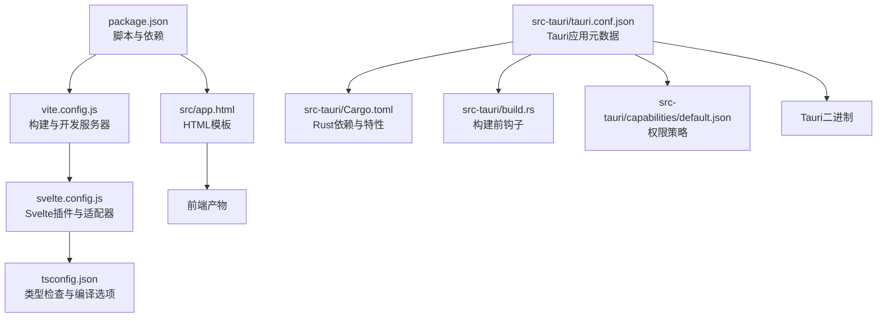
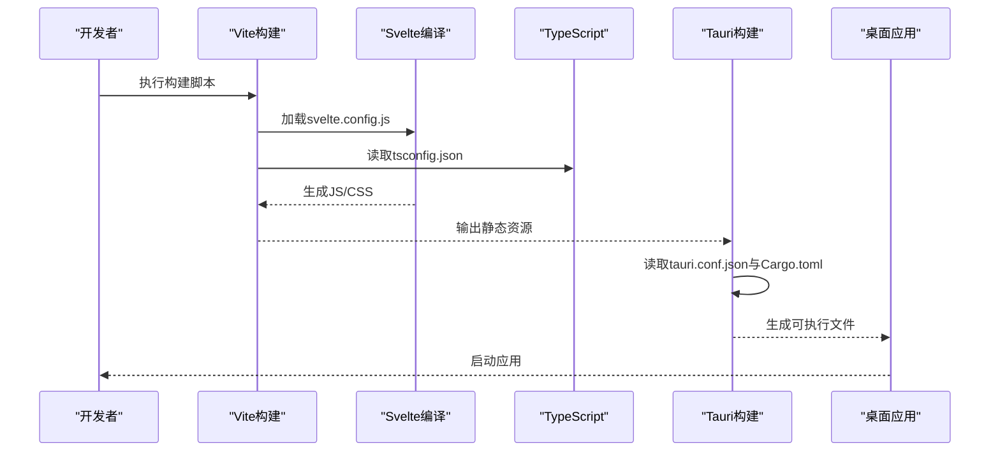
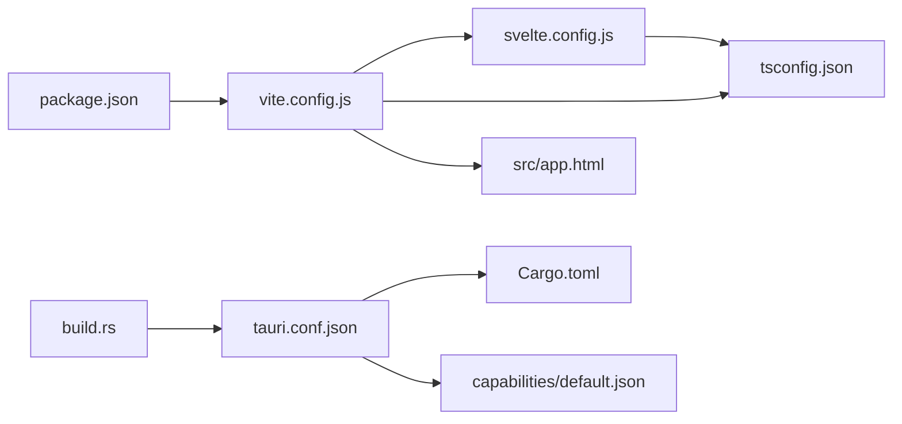

# 配置管理

<cite>
**本文引用的文件**   
- [package.json](file://osd-bubble/package.json)
- [svelte.config.js](file://osd-bubble/svelte.config.js)
- [tsconfig.json](file://osd-bubble/tsconfig.json)
- [vite.config.js](file://osd-bubble/vite.config.js)
- [tauri.conf.json](file://osd-bubble/src-tauri/tauri.conf.json)
- [Cargo.toml](file://osd-bubble/src-tauri/Cargo.toml)
- [build.rs](file://osd-bubble/src-tauri/build.rs)
- [capabilities/default.json](file://osd-bubble/src-tauri/capabilities/default.json)
- [src/app.html](file://osd-bubble/src/app.html)
</cite>

## 目录
1. [简介](#简介)
2. [项目结构](#项目结构)
3. [核心组件](#核心组件)
4. [架构总览](#架构总览)
5. [详细组件分析](#详细组件分析)
6. [依赖关系分析](#依赖关系分析)
7. [性能考虑](#性能考虑)
8. [故障排查指南](#故障排查指南)
9. [结论](#结论)
10. [附录](#附录)

## 简介
本文件为按键OSD可视化工具的配置管理文档，覆盖Tauri、Svelte、TypeScript与Vite四类配置。内容包含各配置文件的作用、可用选项与默认值说明、环境变量与构建/运行期配置、配置校验规则与错误处理、迁移与版本兼容性建议、安全与性能调优要点，并提供可操作的示例路径与最佳实践。目标是帮助开发者快速定位并正确配置项目，确保构建稳定、运行高效且安全可控。

## 项目结构
本项目采用前后端分离的桌面应用架构：前端基于Svelte + Vite + TypeScript，后端通过Tauri（Rust）提供系统能力与窗口渲染。关键配置分布在以下位置：
- 前端工程化配置：package.json、svelte.config.js、tsconfig.json、vite.config.js
- Tauri后端配置：src-tauri/tauri.conf.json、src-tauri/Cargo.toml、src-tauri/build.rs、src-tauri/capabilities/default.json
- 应用入口模板：src/app.html

图表来源
- [package.json](file://osd-bubble/package.json)
- [vite.config.js](file://osd-bubble/vite.config.js)
- [svelte.config.js](file://osd-bubble/svelte.config.js)
- [tsconfig.json](file://osd-bubble/tsconfig.json)
- [src/app.html](file://osd-bubble/src/app.html)
- [tauri.conf.json](file://osd-bubble/src-tauri/tauri.conf.json)
- [Cargo.toml](file://osd-bubble/src-tauri/Cargo.toml)
- [build.rs](file://osd-bubble/src-tauri/build.rs)
- [capabilities/default.json](file://osd-bubble/src-tauri/capabilities/default.json)

章节来源
- [package.json](file://osd-bubble/package.json)
- [svelte.config.js](file://osd-bubble/svelte.config.js)
- [tsconfig.json](file://osd-bubble/tsconfig.json)
- [vite.config.js](file://osd-bubble/vite.config.js)
- [tauri.conf.json](file://osd-bubble/src-tauri/tauri.conf.json)
- [Cargo.toml](file://osd-bubble/src-tauri/Cargo.toml)
- [build.rs](file://osd-bubble/src-tauri/build.rs)
- [capabilities/default.json](file://osd-bubble/src-tauri/capabilities/default.json)
- [src/app.html](file://osd-bubble/src/app.html)

## 核心组件
本节概述四类配置的核心职责与常见选项，便于快速定位与理解。

- package.json
  - 作用：定义项目元信息、脚本命令、依赖与开发依赖；通常包含构建、预览、打包等脚本。
  - 常用键：name、version、scripts、dependencies、devDependencies、type、engines等。
  - 注意：确保Node版本与脚本兼容；避免在运行时依赖中引入仅用于构建的工具。

- svelte.config.js
  - 作用：配置Svelte编译器、插件、适配器等；决定Svelte代码如何被Vite集成与转换。
  - 常用键：extensions、compilerOptions、preprocess、kit（若使用SvelteKit）、alias等。
  - 注意：与Vite和TS配置协同，避免重复或冲突的转译规则。

- tsconfig.json
  - 作用：TypeScript编译与类型检查配置；影响IDE提示、构建产物与严格性。
  - 常用键：compilerOptions（target、module、strict、paths、baseUrl等）、include、exclude。
  - 注意：与Vite/Svelte的模块解析保持一致，避免路径别名不一致导致类型错误。

- vite.config.js
  - 作用：Vite开发与构建配置；包括插件、代理、输出目录、资源优化、环境变量注入等。
  - 常用键：plugins、resolve.alias、server、build、define、envPrefix、base等。
  - 注意：区分开发环境与生产环境配置；谨慎暴露敏感变量到客户端。

- tauri.conf.json
  - 作用：Tauri应用元数据、窗口、菜单、插件、安全策略、构建目标等。
  - 常用键：productName、version、identifier、app（windows、menu、trayIcon）、build、security、bundle等。
  - 注意：与Cargo.toml中的Rust crate名称一致；安全策略需最小化授权。

- Cargo.toml
  - 作用：Rust依赖与特性开关；Tauri后端逻辑与能力声明。
  - 常用键：package、dependencies、features、[lib]、[[bin]]等。
  - 注意：按需启用Tauri特性；避免引入不必要的依赖以减小体积。

- build.rs
  - 作用：构建前钩子，常用于生成代码、拷贝资源、设置环境变量。
  - 常用用法：println!("cargo:rerun-if-changed=...")、env::set_var等。
  - 注意：保持幂等与快速执行；避免阻塞构建流程。

- capabilities/default.json
  - 作用：Tauri能力（权限）策略，控制前端可访问的后端API与系统能力。
  - 常用键：permissions、commands、scope等。
  - 注意：遵循最小权限原则，按功能域拆分能力。

- src/app.html
  - 作用：应用HTML模板，注入全局样式、脚本与基础DOM结构。
  - 常用键：meta、title、link、script等。
  - 注意：避免在此处直接引用敏感配置；通过构建时注入或运行时安全获取。

章节来源
- [package.json](file://osd-bubble/package.json)
- [svelte.config.js](file://osd-bubble/svelte.config.js)
- [tsconfig.json](file://osd-bubble/tsconfig.json)
- [vite.config.js](file://osd-bubble/vite.config.js)
- [tauri.conf.json](file://osd-bubble/src-tauri/tauri.conf.json)
- [Cargo.toml](file://osd-bubble/src-tauri/Cargo.toml)
- [build.rs](file://osd-bubble/src-tauri/build.rs)
- [capabilities/default.json](file://osd-bubble/src-tauri/capabilities/default.json)
- [src/app.html](file://osd-bubble/src/app.html)

## 架构总览
下图展示构建与运行时的配置交互关系：Vite负责前端构建，Svelte与TS配置驱动编译，Tauri将前端产物嵌入Rust后端并生成桌面应用包。

图表来源
- [vite.config.js](file://osd-bubble/vite.config.js)
- [svelte.config.js](file://osd-bubble/svelte.config.js)
- [tsconfig.json](file://osd-bubble/tsconfig.json)
- [tauri.conf.json](file://osd-bubble/src-tauri/tauri.conf.json)
- [Cargo.toml](file://osd-bubble/src-tauri/Cargo.toml)

## 详细组件分析

### Tauri配置（tauri.conf.json）
- 作用：定义应用标识、窗口行为、菜单、托盘图标、安全策略、打包与平台相关设置。
- 关键参数类别：
  - 应用元数据：产品名称、版本号、唯一标识符。
  - 窗口配置：尺寸、是否置顶、透明度、装饰等。
  - 安全策略：CSP、远程URL白名单、命令权限。
  - 构建与打包：目标平台、图标、捆绑器选项。
- 默认值与校验：
  - 必填字段缺失会导致构建失败；非法值会被Tauri CLI拒绝。
  - 安全策略不合法会触发运行时警告或限制。
- 环境变量：
  - 可通过构建脚本注入，但不应泄露敏感信息至前端。
- 最佳实践：
  - 最小化权限，按功能域拆分能力。
  - 明确CSP与白名单，避免跨站脚本风险。
  - 使用独立的环境文件区分开发与生产配置。

章节来源
- [tauri.conf.json](file://osd-bubble/src-tauri/tauri.conf.json)
- [capabilities/default.json](file://osd-bubble/src-tauri/capabilities/default.json)

### Svelte配置（svelte.config.js）
- 作用：配置Svelte编译器选项、预处理、插件与适配器；与Vite协作完成模块转换。
- 关键参数类别：
  - 扩展名与编译器选项：如CSS内联、命名空间、调试模式。
  - 预处理：Sass、PostCSS、自定义处理器。
  - 别名与路径映射：与tsconfig.paths保持一致。
- 默认值与校验：
  - 无效插件或路径会导致构建失败。
  - 与Vite的resolve.alias冲突时需统一。
- 最佳实践：
  - 仅在开发时启用调试与热更新增强。
  - 使用路径别名提升可读性与可维护性。

章节来源
- [svelte.config.js](file://osd-bubble/svelte.config.js)

### TypeScript配置（tsconfig.json）
- 作用：控制类型检查、模块解析、输出目标与严格性。
- 关键参数类别：
  - compilerOptions：target、module、strict、paths、baseUrl、outDir等。
  - include/exclude：限定参与编译的文件范围。
- 默认值与校验：
  - 路径别名未正确配置会导致导入失败。
  - strict开启后未处理的类型问题会阻止构建。
- 最佳实践：
  - 与Vite的resolve.alias同步，避免不一致。
  - 在生产构建中关闭调试相关选项以提升性能。

章节来源
- [tsconfig.json](file://osd-bubble/tsconfig.json)

### Vite配置（vite.config.js）
- 作用：开发服务器、构建产物、插件链、环境变量注入、资源优化。
- 关键参数类别：
  - plugins：Svelte、TypeScript、压缩、代理等。
  - resolve.alias：路径别名。
  - server：端口、代理、热更新。
  - build：目标、sourcemap、分包策略。
  - define/envPrefix/base：常量注入与环境变量前缀。
- 默认值与校验：
  - 插件顺序影响转换结果；错误的define会污染全局。
  - envPrefix需与前端读取方式一致。
- 最佳实践：
  - 区分开发与生产配置，避免泄露敏感变量。
  - 合理使用分包与懒加载，降低首屏体积。

章节来源
- [vite.config.js](file://osd-bubble/vite.config.js)

### Rust与Tauri后端（Cargo.toml与build.rs）
- Cargo.toml
  - 作用：声明Rust依赖、特性与库/二进制目标。
  - 关键项：package、dependencies、features、[lib]/[[bin]]。
  - 最佳实践：按需启用Tauri特性，减少二进制体积。
- build.rs
  - 作用：构建前钩子，生成代码、拷贝资源、设置环境变量。
  - 最佳实践：保持幂等与快速执行，避免阻塞。

章节来源
- [Cargo.toml](file://osd-bubble/src-tauri/Cargo.toml)
- [build.rs](file://osd-bubble/src-tauri/build.rs)

### HTML模板（src/app.html）
- 作用：应用入口HTML，注入全局样式与脚本。
- 最佳实践：避免直接引用敏感配置；通过构建时注入或运行时安全获取。

章节来源
- [src/app.html](file://osd-bubble/src/app.html)

## 依赖关系分析
下图展示配置间的依赖与耦合关系，帮助识别潜在冲突与优化点。

图表来源
- [package.json](file://osd-bubble/package.json)
- [vite.config.js](file://osd-bubble/vite.config.js)
- [svelte.config.js](file://osd-bubble/svelte.config.js)
- [tsconfig.json](file://osd-bubble/tsconfig.json)
- [src/app.html](file://osd-bubble/src/app.html)
- [tauri.conf.json](file://osd-bubble/src-tauri/tauri.conf.json)
- [Cargo.toml](file://osd-bubble/src-tauri/Cargo.toml)
- [capabilities/default.json](file://osd-bubble/src-tauri/capabilities/default.json)
- [build.rs](file://osd-bubble/src-tauri/build.rs)

章节来源
- [package.json](file://osd-bubble/package.json)
- [vite.config.js](file://osd-bubble/vite.config.js)
- [svelte.config.js](file://osd-bubble/svelte.config.js)
- [tsconfig.json](file://osd-bubble/tsconfig.json)
- [src/app.html](file://osd-bubble/src/app.html)
- [tauri.conf.json](file://osd-bubble/src-tauri/tauri.conf.json)
- [Cargo.toml](file://osd-bubble/src-tauri/Cargo.toml)
- [capabilities/default.json](file://osd-bubble/src-tauri/capabilities/default.json)
- [build.rs](file://osd-bubble/src-tauri/build.rs)

## 性能考虑
- 构建性能
  - 合理配置Vite的分包与缓存，减少重复构建。
  - 在CI中使用增量构建与并行任务。
- 运行时性能
  - 禁用不必要的调试与日志输出。
  - 使用懒加载与按需引入，降低内存占用。
- Tauri优化
  - 精简Rust依赖与特性，减小二进制体积。
  - 合理设置窗口透明度与渲染策略，避免过度重绘。

## 故障排查指南
- 构建失败
  - 检查tsconfig路径别名与Vite.resolve.alias一致性。
  - 确认svelte.config.js插件顺序与依赖版本兼容。
  - 验证tauri.conf.json必填字段与安全策略合法性。
- 运行时异常
  - 查看Tauri能力权限是否授予所需命令。
  - 检查CSP与远程白名单是否允许必要资源加载。
- 环境变量问题
  - 确认envPrefix与前端读取方式匹配。
  - 避免将敏感变量注入到客户端。

章节来源
- [tsconfig.json](file://osd-bubble/tsconfig.json)
- [vite.config.js](file://osd-bubble/vite.config.js)
- [svelte.config.js](file://osd-bubble/svelte.config.js)
- [tauri.conf.json](file://osd-bubble/src-tauri/tauri.conf.json)
- [capabilities/default.json](file://osd-bubble/src-tauri/capabilities/default.json)

## 结论
通过系统化地管理与校验Tauri、Svelte、TypeScript与Vite配置，可以显著提升项目的可维护性、安全性与性能。建议建立配置基线、自动化校验与CI集成，确保团队一致性与发布质量。

## 附录
- 配置示例与最佳实践
  - 环境变量：使用.env.*区分环境，并通过Vite的define与Tauri构建脚本注入。
  - 构建配置：启用sourcemap用于开发，生产关闭以提升速度。
  - 安全配置：最小权限、严格CSP、白名单机制。
  - 性能调优：懒加载、分包、按需引入、减少重绘。
- 迁移与兼容性
  - 升级Tauri版本时，检查tauri.conf.json字段变更与能力策略迁移。
  - 升级Svelte/Vite时，关注插件API变化与弃用项。
  - 保持tsconfig与Vite路径解析一致，避免类型错误。