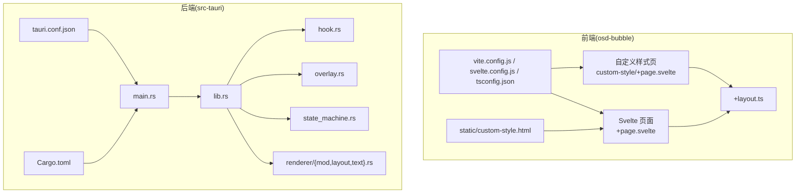
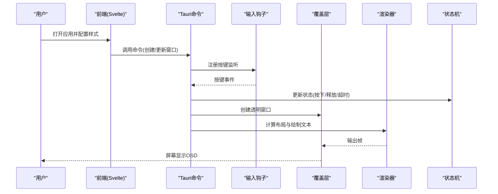
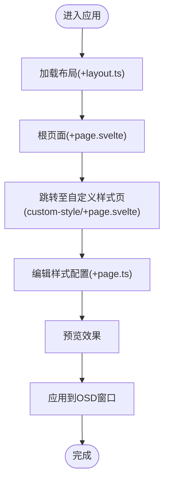
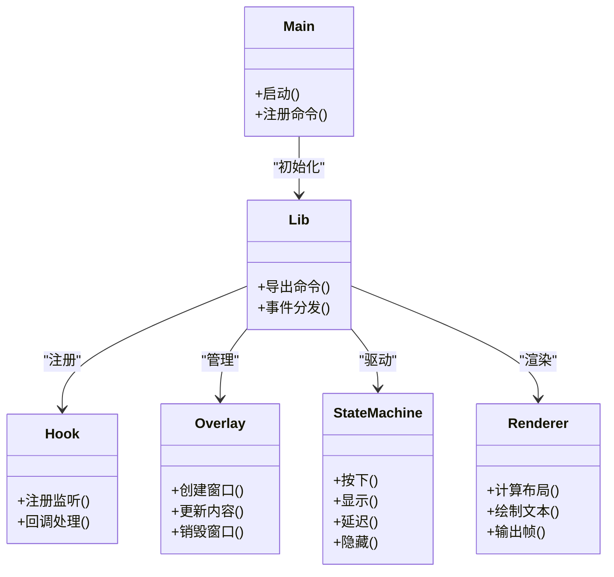
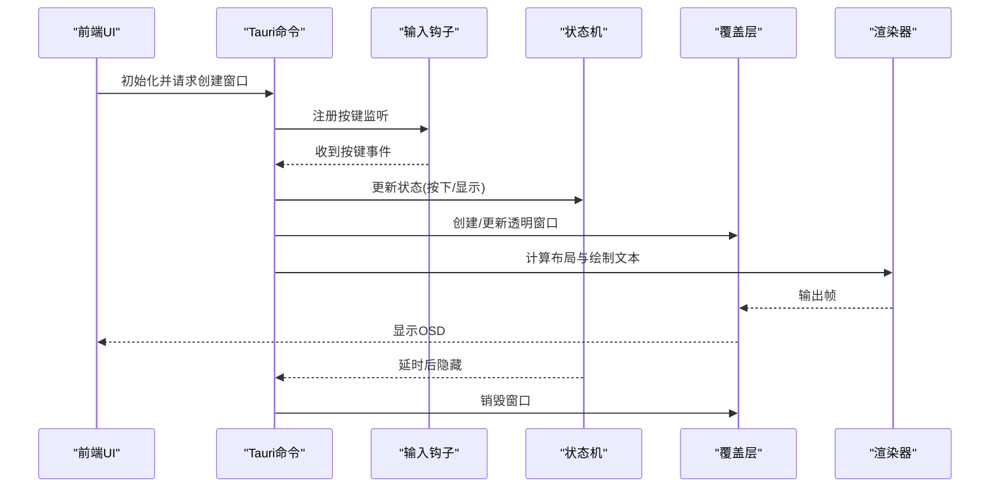
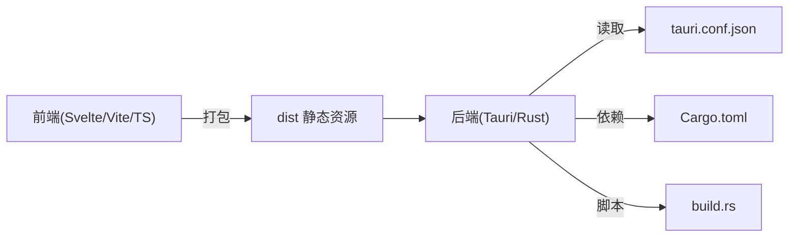

# 项目概览

<cite>
**本文引用的文件**   
- [按键OSD可视化工具-交互规格说明书.md](file://按键OSD可视化工具-交互规格说明书.md)
- [按键OSD可视化工具-交互原型.html](file://按键OSD可视化工具-交互原型.html)
- [osd-bubble/README.md](file://osd-bubble/README.md)
- [osd-bubble/package.json](file://osd-bubble/package.json)
- [osd-bubble/svelte.config.js](file://osd-bubble/svelte.config.js)
- [osd-bubble/vite.config.js](file://osd-bubble/vite.config.js)
- [osd-bubble/tsconfig.json](file://osd-bubble/tsconfig.json)
- [osd-bubble/src/routes/+page.svelte](file://osd-bubble/src/routes/+page.svelte)
- [osd-bubble/src/routes/custom-style/+page.svelte](file://osd-bubble/src/routes/custom-style/+page.svelte)
- [osd-bubble/src/routes/custom-style/+page.ts](file://osd-bubble/src/routes/custom-style/+page.ts)
- [osd-bubble/src/routes/+layout.ts](file://osd-bubble/src/routes/+layout.ts)
- [osd-bubble/static/custom-style.html](file://osd-bubble/static/custom-style.html)
- [osd-bubble/src-tauri/Cargo.toml](file://osd-bubble/src-tauri/Cargo.toml)
- [osd-bubble/src-tauri/tauri.conf.json](file://osd-bubble/src-tauri/tauri.conf.json)
- [osd-bubble/src-tauri/build.rs](file://osd-bubble/src-tauri/build.rs)
- [osd-bubble/src-tauri/src/main.rs](file://osd-bubble/src-tauri/src/main.rs)
- [osd-bubble/src-tauri/src/lib.rs](file://osd-bubble/src-tauri/src/lib.rs)
- [osd-bubble/src-tauri/src/hook.rs](file://osd-bubble/src-tauri/src/hook.rs)
- [osd-bubble/src-tauri/src/overlay.rs](file://osd-bubble/src-tauri/src/overlay.rs)
- [osd-bubble/src-tauri/src/state_machine.rs](file://osd-bubble/src-tauri/src/state_machine.rs)
- [osd-bubble/src-tauri/src/renderer/mod.rs](file://osd-bubble/src-tauri/src/renderer/mod.rs)
- [osd-bubble/src-tauri/src/renderer/layout.rs](file://osd-bubble/src-tauri/src/renderer/layout.rs)
- [osd-bubble/src-tauri/src/renderer/text.rs](file://osd-bubble/src-tauri/src/renderer/text.rs)
</cite>

## 目录
1. [简介](#简介)
2. [项目结构](#项目结构)
3. [核心组件](#核心组件)
4. [架构总览](#架构总览)
5. [详细组件分析](#详细组件分析)
6. [依赖关系分析](#依赖关系分析)
7. [性能考量](#性能考量)
8. [故障排查指南](#故障排查指南)
9. [结论](#结论)
10. [附录](#附录)

## 简介
本项目是一个基于 Tauri 与 Svelte 的桌面应用程序，用于可视化按键 OSD（On-Screen Display）效果。它通过前端页面提供直观的样式与动画配置界面，并在后端以原生能力创建透明窗口、渲染文本与布局，最终在屏幕上层实时显示按键反馈。该工具适合键盘用户、键位映射开发者、内容创作者以及需要直观调试按键反馈效果的场景。

技术栈选择：
- 前端：Svelte + Vite + TypeScript，采用 SvelteKit 路由组织页面与布局。
- 后端：Tauri（Rust），负责系统级窗口管理、输入钩子与渲染管线。
- 构建：Vite 打包前端资源，Tauri 构建跨平台桌面应用。

主要特性：
- 可视化编辑按键 OSD 的样式、位置、动画与行为。
- 实时预览与多主题切换。
- 透明顶层窗口叠加显示，支持自定义 HTML/CSS 渲染。
- 可扩展的状态机驱动动画与过渡。

使用场景：
- 为机械键盘或虚拟键盘提供即时按键反馈。
- 演示与教学键位映射逻辑。
- 快速验证不同视觉风格对用户体验的影响。

## 项目结构
项目采用前后端分离的组织方式：
- osd-bubble：前端工程（SvelteKit + Vite + TS），包含页面、路由、静态资源与配置文件。
- osd-bubble/src-tauri：后端工程（Tauri + Rust），包含主程序、窗口管理、输入钩子、渲染器与状态机。

图示来源
- [osd-bubble/src/routes/+page.svelte](file://osd-bubble/src/routes/+page.svelte)
- [osd-bubble/src/routes/+layout.ts](file://osd-bubble/src/routes/+layout.ts)
- [osd-bubble/src/routes/custom-style/+page.svelte](file://osd-bubble/src/routes/custom-style/+page.svelte)
- [osd-bubble/vite.config.js](file://osd-bubble/vite.config.js)
- [osd-bubble/svelte.config.js](file://osd-bubble/svelte.config.js)
- [osd-bubble/tsconfig.json](file://osd-bubble/tsconfig.json)
- [osd-bubble/static/custom-style.html](file://osd-bubble/static/custom-style.html)
- [osd-bubble/src-tauri/src/main.rs](file://osd-bubble/src-tauri/src/main.rs)
- [osd-bubble/src-tauri/src/lib.rs](file://osd-bubble/src-tauri/src/lib.rs)
- [osd-bubble/src-tauri/src/hook.rs](file://osd-bubble/src-tauri/src/hook.rs)
- [osd-bubble/src-tauri/src/overlay.rs](file://osd-bubble/src-tauri/src/overlay.rs)
- [osd-bubble/src-tauri/src/state_machine.rs](file://osd-bubble/src-tauri/src/state_machine.rs)
- [osd-bubble/src-tauri/src/renderer/mod.rs](file://osd-bubble/src-tauri/src/renderer/mod.rs)
- [osd-bubble/src-tauri/src/renderer/layout.rs](file://osd-bubble/src-tauri/src/renderer/layout.rs)
- [osd-bubble/src-tauri/src/renderer/text.rs](file://osd-bubble/src-tauri/src/renderer/text.rs)
- [osd-bubble/src-tauri/tauri.conf.json](file://osd-bubble/src-tauri/tauri.conf.json)
- [osd-bubble/src-tauri/Cargo.toml](file://osd-bubble/src-tauri/Cargo.toml)

章节来源
- [osd-bubble/README.md](file://osd-bubble/README.md)
- [osd-bubble/package.json](file://osd-bubble/package.json)
- [osd-bubble/svelte.config.js](file://osd-bubble/svelte.config.js)
- [osd-bubble/vite.config.js](file://osd-bubble/vite.config.js)
- [osd-bubble/tsconfig.json](file://osd-bubble/tsconfig.json)
- [osd-bubble/src-tauri/tauri.conf.json](file://osd-bubble/src-tauri/tauri.conf.json)
- [osd-bubble/src-tauri/Cargo.toml](file://osd-bubble/src-tauri/Cargo.toml)

## 核心组件
- 前端页面与路由
  - 根页面与布局：定义应用入口与通用布局逻辑。
  - 自定义样式页：提供样式与主题的可视化编辑入口。
  - 静态资源：承载可注入的自定义 HTML 模板。
- 后端模块
  - 主程序与库：初始化 Tauri 应用、暴露命令接口、协调各子系统。
  - 输入钩子：捕获按键事件并触发 OSD 展示流程。
  - 覆盖层：创建透明窗口并承载渲染内容。
  - 渲染器：负责布局计算与文本绘制。
  - 状态机：驱动动画与过渡状态。

章节来源
- [osd-bubble/src/routes/+page.svelte](file://osd-bubble/src/routes/+page.svelte)
- [osd-bubble/src/routes/+layout.ts](file://osd-bubble/src/routes/+layout.ts)
- [osd-bubble/src/routes/custom-style/+page.svelte](file://osd-bubble/src/routes/custom-style/+page.svelte)
- [osd-bubble/src/routes/custom-style/+page.ts](file://osd-bubble/src/routes/custom-style/+page.ts)
- [osd-bubble/static/custom-style.html](file://osd-bubble/static/custom-style.html)
- [osd-bubble/src-tauri/src/main.rs](file://osd-bubble/src-tauri/src/main.rs)
- [osd-bubble/src-tauri/src/lib.rs](file://osd-bubble/src-tauri/src/lib.rs)
- [osd-bubble/src-tauri/src/hook.rs](file://osd-bubble/src-tauri/src/hook.rs)
- [osd-bubble/src-tauri/src/overlay.rs](file://osd-bubble/src-tauri/src/overlay.rs)
- [osd-bubble/src-tauri/src/state_machine.rs](file://osd-bubble/src-tauri/src/state_machine.rs)
- [osd-bubble/src-tauri/src/renderer/mod.rs](file://osd-bubble/src-tauri/src/renderer/mod.rs)
- [osd-bubble/src-tauri/src/renderer/layout.rs](file://osd-bubble/src-tauri/src/renderer/layout.rs)
- [osd-bubble/src-tauri/src/renderer/text.rs](file://osd-bubble/src-tauri/src/renderer/text.rs)

## 架构总览
整体架构分为三层：
- 表现层（前端）：Svelte 页面与路由，提供可视化配置与预览。
- 控制层（后端）：Tauri 命令与事件总线，协调输入、渲染与窗口。
- 数据与状态层：状态机驱动动画与过渡，渲染器生成最终画面。

图示来源
- [osd-bubble/src/routes/+page.svelte](file://osd-bubble/src/routes/+page.svelte)
- [osd-bubble/src-tauri/src/main.rs](file://osd-bubble/src-tauri/src/main.rs)
- [osd-bubble/src-tauri/src/lib.rs](file://osd-bubble/src-tauri/src/lib.rs)
- [osd-bubble/src-tauri/src/hook.rs](file://osd-bubble/src-tauri/src/hook.rs)
- [osd-bubble/src-tauri/src/overlay.rs](file://osd-bubble/src-tauri/src/overlay.rs)
- [osd-bubble/src-tauri/src/state_machine.rs](file://osd-bubble/src-tauri/src/state_machine.rs)
- [osd-bubble/src-tauri/src/renderer/mod.rs](file://osd-bubble/src-tauri/src/renderer/mod.rs)
- [osd-bubble/src-tauri/src/renderer/layout.rs](file://osd-bubble/src-tauri/src/renderer/layout.rs)
- [osd-bubble/src-tauri/src/renderer/text.rs](file://osd-bubble/src-tauri/src/renderer/text.rs)

## 详细组件分析

### 前端页面与路由
- 根页面与布局：定义应用入口、全局样式与导航。
- 自定义样式页：提供主题、字体、颜色、透明度等可视化编辑。
- 静态模板：允许注入自定义 HTML 片段到 OSD 窗口。

图示来源
- [osd-bubble/src/routes/+layout.ts](file://osd-bubble/src/routes/+layout.ts)
- [osd-bubble/src/routes/+page.svelte](file://osd-bubble/src/routes/+page.svelte)
- [osd-bubble/src/routes/custom-style/+page.svelte](file://osd-bubble/src/routes/custom-style/+page.svelte)
- [osd-bubble/src/routes/custom-style/+page.ts](file://osd-bubble/src/routes/custom-style/+page.ts)

章节来源
- [osd-bubble/src/routes/+layout.ts](file://osd-bubble/src/routes/+layout.ts)
- [osd-bubble/src/routes/+page.svelte](file://osd-bubble/src/routes/+page.svelte)
- [osd-bubble/src/routes/custom-style/+page.svelte](file://osd-bubble/src/routes/custom-style/+page.svelte)
- [osd-bubble/src/routes/custom-style/+page.ts](file://osd-bubble/src/routes/custom-style/+page.ts)
- [osd-bubble/static/custom-style.html](file://osd-bubble/static/custom-style.html)

### 后端模块与职责
- main.rs：应用启动、Tauri 初始化与命令注册。
- lib.rs：导出命令、模块装配与事件分发。
- hook.rs：系统级输入钩子，捕获按键事件。
- overlay.rs：创建透明覆盖窗口，承载渲染内容。
- state_machine.rs：驱动按下、显示、延迟、隐藏等状态转换。
- renderer：布局计算与文本绘制，输出最终帧。

图示来源
- [osd-bubble/src-tauri/src/main.rs](file://osd-bubble/src-tauri/src/main.rs)
- [osd-bubble/src-tauri/src/lib.rs](file://osd-bubble/src-tauri/src/lib.rs)
- [osd-bubble/src-tauri/src/hook.rs](file://osd-bubble/src-tauri/src/hook.rs)
- [osd-bubble/src-tauri/src/overlay.rs](file://osd-bubble/src-tauri/src/overlay.rs)
- [osd-bubble/src-tauri/src/state_machine.rs](file://osd-bubble/src-tauri/src/state_machine.rs)
- [osd-bubble/src-tauri/src/renderer/mod.rs](file://osd-bubble/src-tauri/src/renderer/mod.rs)
- [osd-bubble/src-tauri/src/renderer/layout.rs](file://osd-bubble/src-tauri/src/renderer/layout.rs)
- [osd-bubble/src-tauri/src/renderer/text.rs](file://osd-bubble/src-tauri/src/renderer/text.rs)

章节来源
- [osd-bubble/src-tauri/src/main.rs](file://osd-bubble/src-tauri/src/main.rs)
- [osd-bubble/src-tauri/src/lib.rs](file://osd-bubble/src-tauri/src/lib.rs)
- [osd-bubble/src-tauri/src/hook.rs](file://osd-bubble/src-tauri/src/hook.rs)
- [osd-bubble/src-tauri/src/overlay.rs](file://osd-bubble/src-tauri/src/overlay.rs)
- [osd-bubble/src-tauri/src/state_machine.rs](file://osd-bubble/src-tauri/src/state_machine.rs)
- [osd-bubble/src-tauri/src/renderer/mod.rs](file://osd-bubble/src-tauri/src/renderer/mod.rs)
- [osd-bubble/src-tauri/src/renderer/layout.rs](file://osd-bubble/src-tauri/src/renderer/layout.rs)
- [osd-bubble/src-tauri/src/renderer/text.rs](file://osd-bubble/src-tauri/src/renderer/text.rs)

### 关键流程时序

图示来源
- [osd-bubble/src-tauri/src/main.rs](file://osd-bubble/src-tauri/src/main.rs)
- [osd-bubble/src-tauri/src/lib.rs](file://osd-bubble/src-tauri/src/lib.rs)
- [osd-bubble/src-tauri/src/hook.rs](file://osd-bubble/src-tauri/src/hook.rs)
- [osd-bubble/src-tauri/src/state_machine.rs](file://osd-bubble/src-tauri/src/state_machine.rs)
- [osd-bubble/src-tauri/src/overlay.rs](file://osd-bubble/src-tauri/src/overlay.rs)
- [osd-bubble/src-tauri/src/renderer/mod.rs](file://osd-bubble/src-tauri/src/renderer/mod.rs)
- [osd-bubble/src-tauri/src/renderer/layout.rs](file://osd-bubble/src-tauri/src/renderer/layout.rs)
- [osd-bubble/src-tauri/src/renderer/text.rs](file://osd-bubble/src-tauri/src/renderer/text.rs)

## 依赖关系分析
- 前端依赖：SvelteKit、Vite、TypeScript；通过 vite.config.js 与 svelte.config.js 进行构建与运行时配置。
- 后端依赖：Tauri、Rust 标准库与系统 API；通过 Cargo.toml 管理依赖，tauri.conf.json 配置窗口与权限。
- 构建脚本：build.rs 用于预编译或资源准备。

图示来源
- [osd-bubble/vite.config.js](file://osd-bubble/vite.config.js)
- [osd-bubble/svelte.config.js](file://osd-bubble/svelte.config.js)
- [osd-bubble/tsconfig.json](file://osd-bubble/tsconfig.json)
- [osd-bubble/src-tauri/tauri.conf.json](file://osd-bubble/src-tauri/tauri.conf.json)
- [osd-bubble/src-tauri/Cargo.toml](file://osd-bubble/src-tauri/Cargo.toml)
- [osd-bubble/src-tauri/build.rs](file://osd-bubble/src-tauri/build.rs)

章节来源
- [osd-bubble/package.json](file://osd-bubble/package.json)
- [osd-bubble/vite.config.js](file://osd-bubble/vite.config.js)
- [osd-bubble/svelte.config.js](file://osd-bubble/svelte.config.js)
- [osd-bubble/tsconfig.json](file://osd-bubble/tsconfig.json)
- [osd-bubble/src-tauri/tauri.conf.json](file://osd-bubble/src-tauri/tauri.conf.json)
- [osd-bubble/src-tauri/Cargo.toml](file://osd-bubble/src-tauri/Cargo.toml)
- [osd-bubble/src-tauri/build.rs](file://osd-bubble/src-tauri/build.rs)

## 性能考量
- 渲染优化：减少不必要的重绘与布局计算，仅在状态变化时更新帧。
- 窗口管理：复用透明窗口实例，避免频繁创建销毁。
- 事件节流：对高频按键事件进行去抖与合并，降低 CPU 占用。
- 资源加载：静态资源按需加载，避免首屏过大。
- 内存管理：及时释放不再使用的缓冲区与图像资源。

[本节为通用指导，不直接分析具体文件]

## 故障排查指南
- 无法显示 OSD：
  - 检查覆盖层是否成功创建与可见性设置。
  - 确认渲染器是否正确输出帧。
- 按键无响应：
  - 验证输入钩子是否注册成功。
  - 检查事件回调是否被正确触发。
- 样式不生效：
  - 确认静态模板与样式配置是否正确注入。
  - 检查浏览器控制台错误与网络请求。
- 构建失败：
  - 核对依赖版本与构建脚本。
  - 查看 tauri.conf.json 与 Cargo.toml 配置一致性。

章节来源
- [osd-bubble/src-tauri/src/overlay.rs](file://osd-bubble/src-tauri/src/overlay.rs)
- [osd-bubble/src-tauri/src/hook.rs](file://osd-bubble/src-tauri/src/hook.rs)
- [osd-bubble/src-tauri/src/renderer/mod.rs](file://osd-bubble/src-tauri/src/renderer/mod.rs)
- [osd-bubble/static/custom-style.html](file://osd-bubble/static/custom-style.html)
- [osd-bubble/src-tauri/tauri.conf.json](file://osd-bubble/src-tauri/tauri.conf.json)
- [osd-bubble/src-tauri/Cargo.toml](file://osd-bubble/src-tauri/Cargo.toml)

## 结论
该项目将前端的可视化能力与后端的系统级渲染相结合，提供了高效、灵活的按键 OSD 解决方案。通过清晰的分层架构与模块化设计，既便于初学者上手，也为高级用户扩展功能提供了良好基础。建议在实际使用中关注性能优化与稳定性测试，以获得更流畅的用户体验。

[本节为总结性内容，不直接分析具体文件]

## 附录
- 交互规格与原型：
  - 交互规格说明书：定义了功能边界、交互流程与验收标准。
  - 交互原型：提供可视化原型，辅助理解用户操作流程。

章节来源
- [按键OSD可视化工具-交互规格说明书.md](file://按键OSD可视化工具-交互规格说明书.md)
- [按键OSD可视化工具-交互原型.html](file://按键OSD可视化工具-交互原型.html)