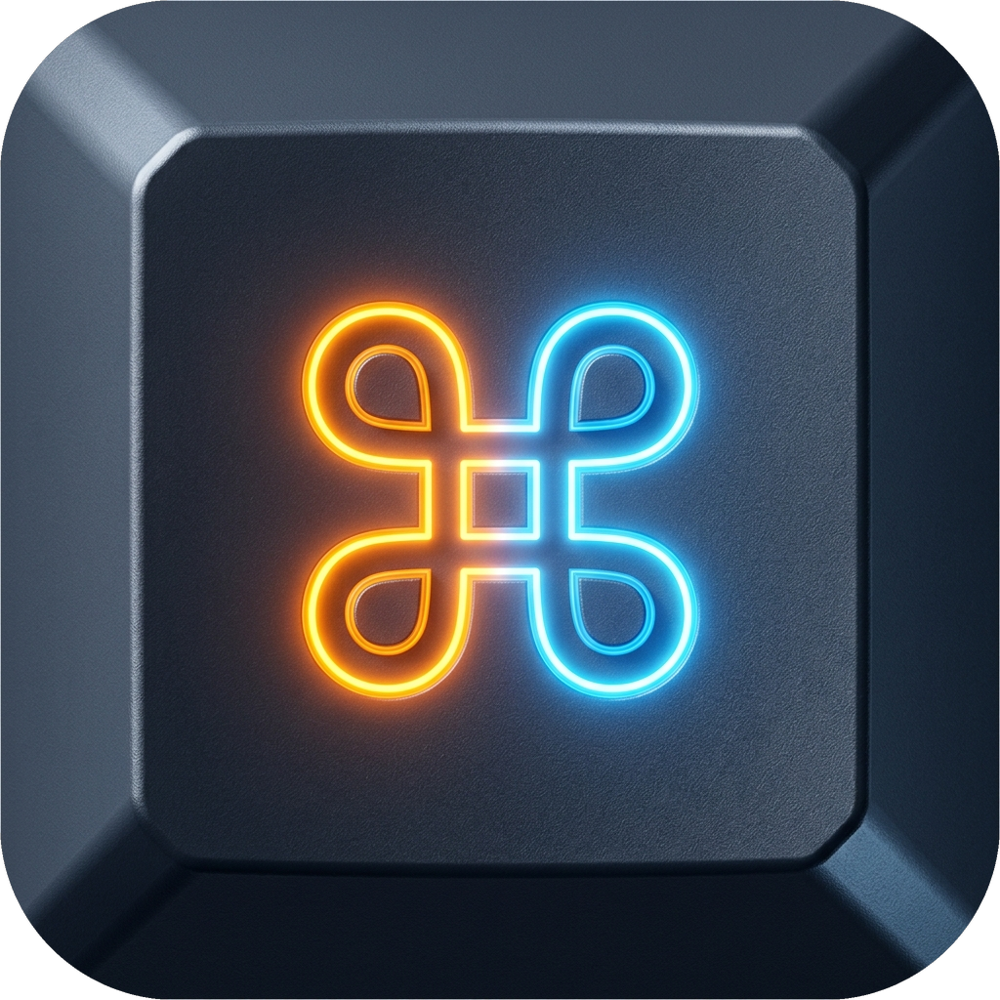

<div align="center">



# OSD Bubble (按键气泡)

**一款现代、轻量、高颜值的桌面级按键与外设操作可视化神器 (Keystroke & Mouse OSD Overlay)**

专为 **教学录屏 · 直播分享 · 办公演示 · 快捷键教学** 打造

[](https://github.com/)
[](https://github.com/)
[](https://www.rust-lang.org/)
[](https://tauri.app/)
[](https://svelte.dev/)
[](https://opensource.org/licenses/MIT)

[简体中文](./README.md) | [English](./docs/README_EN.md)

</div>

---

## ✨ 核心特性

- ⚡ **零延迟底层 Hook 捕获**：基于 Windows 原生底层钩子与 Win32 Raw Input，极速捕获键盘敲击、组合快捷键、鼠标左/中/右键点击与滚轮滚动。
- 🎨 **物理分层无窗体渲染**：底层采用 Rust + `Tiny-Skia` 硬件级分层透明窗口（`WS_EX_LAYERED`），告别传统 Webview 透明窗口卡顿与黑边，极致轻量无感。
- 🌊 **鼠标点击微光光环与涟漪**：左键（青蓝）、右键（琥珀橙）、中键（薄荷绿）点击处瞬间激发 260ms 极速扩散光晕与主环。
- 📜 **按键历史排队瀑布流**：支持多按键平滑排队流模式（2 / 3 / 4 组），新按键入场自下而上平滑挤压，每行拥有独立生命周期与淡出消散。
- 🔢 **智能连击合并微标**：600ms 智能连击判定，自动合并重复敲击并在右上角呈现 Keyviz 风格弹性徽标胶囊（`×2`、`×3`...）。
- 🖥️ **屏幕定位双模式 & 多显示器智能贴靠**：
  - **跟随鼠标模式**：在鼠标光标 4 个象限动态跟随；
  - **固定屏幕锚点模式**：锁定在屏幕 6 大角落（右下角、底部居中、左下角、右上角、顶部居中、左上角），多显示器跨屏自适应，完全不遮挡鼠标操作目标。
- 🎈 **多轴物理动效系统**：内置 `bounce`（弹性过冲打击）、`slide_up`（浮升入场）、`fade`（平滑渐显）、`instant`（极简瞬显）多种缓动曲线。
- 🛡️ **黑名单智能静音**：支持添加游戏或特定全屏程序黑名单（如 `csgo.exe`），在前台处于黑名单时自动静默。
- 🧠 **窗口位置记忆与自适应居中**：设置面板首次打开智能居中，拖动停留后全生命周期精准记忆，软件重启无缝还原。
- 🚀 **绿色轻量单文件**：仅 ~13MB 独立免安装单文件，内存占用极低（< 25MB），支持开机静默自启动与托盘常驻。

---

## 📥 下载与安装

进入 [Releases 页面](https://github.com/) 下载最新正式版：

| 分发版本 | 文件类型 | 说明 |
| :--- | :--- | :--- |
| **便携版 (免安装)** | `osd-bubble.exe` | 绿色单文件版，双击直接运行，随拷随用 |
| **安装版 (推荐)** | `osd-bubble_1.0.0_x64-setup.exe` | 官方标准向导安装包，支持开始菜单、快捷方式与开机自启 |

---

## ⌨️ 常用快捷键

| 快捷键 | 功能描述 |
| :--- | :--- |
| `Ctrl + Shift + ,` | 快速唤出 / 隐藏「设置」控制面板 |
| `Ctrl + Shift + K` | 全局一键暂停 / 继续按键显示监听 |
| `Esc` | 在设置界面快速关闭弹窗与关于面板 |

---

## 🛠️ 本地开发与构建

### 前置环境要求
- **Node.js** >= 18.0.0
- **Rust** >= 1.77.0 (包含 `cargo` 与 MSVC 工具链)
- **C++ 生成工具** (Visual Studio Build Tools / MSVC)

### 1. 克隆代码仓库
```bash
git clone https://github.com/your-username/osd-bubble.git
cd osd-bubble/osd-bubble
```

### 2. 安装前端依赖
```bash
npm install
```

### 3. 启动开发模式 (热重载)
```bash
npm run tauri dev
```

### 4. 运行全套自动化测试
```bash
# 运行前端类型检查与单元测试
npm run check
npm test

# 运行 Rust 后端 62 项全量单元测试
npm run test:rust
```

### 5. 生产打包编译
```bash
npm run tauri build
```
构建产物将输出至 `src-tauri/target/release/`：
- 便携版 exe：`src-tauri/target/release/osd-bubble.exe`
- NSIS 安装包：`src-tauri/target/release/bundle/nsis/osd-bubble_1.0.0_x64-setup.exe`

---

## 🤝 贡献指南 (Contributing)

非常欢迎提交 Issue 与 Pull Request！
在提交 PR 之前，请确保本地测试全部通过：
```bash
npm run check
npm test
cargo test --manifest-path src-tauri/Cargo.toml
```

详细规范请参阅 [CONTRIBUTING.md](./CONTRIBUTING.md)。

---

## 📄 开源协议 (License)

本项目基于 [MIT License](./LICENSE) 开源。

---

## 👤 开发者

- **开发者**：**摆渡人吾师 (Baiduren Wushi)**
- **项目定位**：专业教学录屏 · 网课演示 · 快捷键可视化的轻量高效桌面神器
- **鸣谢**：感谢开源社区 `Tauri`、`Tiny-Skia`、`Svelte` 提供的强力技术支持！
