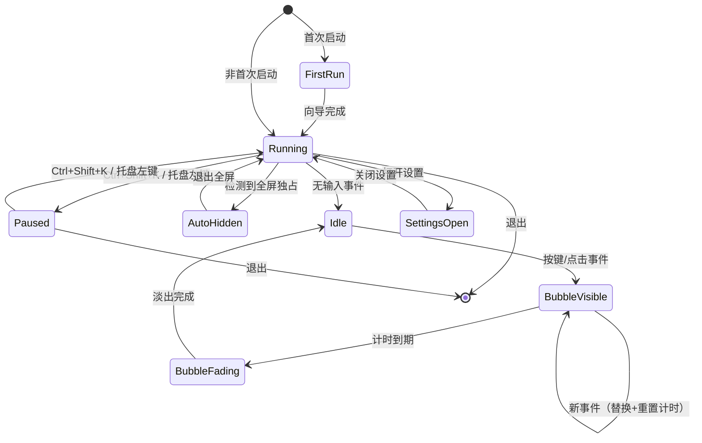

# 按键 OSD 可视化工具 · 交互规格说明书

> 版本：V1.0 ｜ 日期：2026-07-29 ｜ 前置文档：《功能概念定义文档》《技术选型对比分析》《竞品调研报告》

---

## 0. 文档说明

本文档定义产品所有可交互元素的行为规格，供开发与视觉设计直接参照。每一项均给出：状态、触发条件、视觉参数、动画曲线、边界处理。

**设计原则（贯穿全文）：**

1. **零打扰**——气泡是"观众看的"，不是"操作者看的"；不能遮挡操作区域、不能抢焦点、不能发出声音。
2. **即现即隐**——出现快（<50 ms）、消失干脆（无拖泥带水的残留感）。
3. **教学优先**——默认配置面向"教室投屏 1080p、观看距离 3–5 米"优化，而非个人桌面。

---

## 1. 按键气泡（核心组件 · 统一承载所有输入）

> **核心原则：所有输入事件（键盘、鼠标点击、滚轮）共用同一种气泡形态，统一显示在当前鼠标光标位置。** 光标是唯一的锚点，气泡是唯一的视觉载体。观众只需理解一种图形。

### 1.1 状态机

```
┌─────────┐   按键事件    ┌─────────┐   1200ms 无新键   ┌─────────┐   300ms    ┌─────────┐
│  IDLE   │─────────────▶│ VISIBLE │─────────────────▶│ FADING  │──────────▶│  GONE   │
└─────────┘              └─────────┘                  └─────────┘           └─────────┘
                              │    ▲                                               │
                              │    │  新按键到达                                    │
                              │    └───────────────────────────────────────────────┘
                              │         （替换内容 + 重置计时）                      │
                              │                                                    │
                              │  全屏独占检测                                       │
                              ▼                                                    │
                         ┌─────────┐                                              │
                         │ HIDDEN  │◀─────────────────────────────────────────────┘
                         └─────────┘   退出全屏后恢复 → IDLE
```

| 状态 | 描述 | 窗口属性 |
|------|------|----------|
| IDLE | 无气泡显示，窗口不可见 | `visible: false` |
| VISIBLE | 气泡正在显示，计时中 | `visible: true, opacity: 1, topmost: true` |
| FADING | 淡出动画进行中 | `visible: true, opacity: 1→0` |
| GONE | 淡出完成，窗口隐藏 | `visible: false`（等同 IDLE） |
| HIDDEN | 因全屏独占/安全桌面而强制隐藏 | `visible: false`，托盘图标闪烁提示 |

### 1.2 触发规则

> 键盘与鼠标事件共用同一气泡实例、同一状态机、同一定位逻辑。区别仅在于气泡内显示的文字内容。

| 事件 | 行为 | 气泡内容 |
|------|------|----------|
| 单键按下（如 `A`） | IDLE→VISIBLE | `A` |
| 组合键按下（如 `Ctrl+S`） | IDLE→VISIBLE | `Ctrl + S` |
| 鼠标左键单击 | IDLE→VISIBLE | `L` |
| 鼠标右键单击 | IDLE→VISIBLE | `R` |
| 鼠标中键 / 侧键 | IDLE→VISIBLE | `M` / `X1` / `X2` |
| 滚轮上/下 | IDLE→VISIBLE | `▲` / `▼`（多格时 `▲ ×3`） |
| 滚轮水平 | IDLE→VISIBLE | `◀` / `▶` |
| VISIBLE 期间新事件到达（键或鼠标） | 内容立即替换，计时重置，**不触发淡出再淡入** | 新事件内容 |
| 修饰键单独按下（仅 `Ctrl`） | **不触发**（V1.0）；V1.1 可配置"修饰键预显" | — |
| 排除应用获得焦点时 | 不触发任何气泡 | — |
| 密码输入框获得焦点时 | 不触发（V1.1） | — |

### 1.3 视觉规格

```
┌──────────────────────────┐
│  12px 圆角               │
│  ┌────────────────────┐  │
│  │  Ctrl + Shift + S  │  │  ← 文字：等宽字体，白色 #FFFFFF
│  └────────────────────┘  │
│  内边距：8px (上下) × 14px (左右)  │
│  背景：rgba(24, 24, 27, 0.88)     │  ← 深灰黑，微透明
│  边框：1px rgba(255,255,255,0.08) │  ← 极淡描边，增加轮廓感
│  阴影：0 4px 12px rgba(0,0,0,0.3)│
└──────────────────────────┘
```

| 属性 | 值 | 说明 |
|------|-----|------|
| 背景色 | `rgba(24, 24, 27, 0.88)` | 深色主题默认；浅色主题为 `rgba(255,255,255,0.92)` + 深色文字 |
| 文字颜色 | `#FFFFFF`（深色主题）/ `#18181B`（浅色主题） | — |
| 字体 | 系统等宽字体栈：`Cascadia Code, SF Mono, JetBrains Mono, Consolas, monospace` | 确保键名对齐 |
| 字号 | 20px（逻辑像素）× 缩放比例 | 教学预设下为 28px |
| 字重 | 500 (Medium) | 不宜太粗（投影会糊）也不宜太细 |
| 圆角 | 12px | — |
| 内边距 | 8px 14px | — |
| 最大宽度 | 320px（超出截断 + `…`） | 极端组合键保护 |
| 修饰键颜色 | `#A1A1AA`（浅灰） | 与主键区分：`Ctrl` 灰色，`S` 白色 |

**组合键排版规则：**
- 修饰键与主键之间用 ` + ` 连接（前后各一空格）。
- 修饰键顺序固定：`Ctrl → Shift → Alt → Win`（macOS：`⌃ → ⇧ → ⌥ → ⌘`）。
- 修饰键用浅灰色渲染，主键用白色加粗（600）——形成视觉层次。

### 1.4 动画参数

| 动画 | 属性 | 时长 | 曲线 | 备注 |
|------|------|------|------|------|
| 出现 | scale: 0.88→1.0, opacity: 0→1 | 120 ms | `cubic-bezier(0.16, 1, 0.3, 1)` (ease-out-expo) | 从锚点中心缩放 |
| 保持 | — | 1200 ms（可配置） | — | 静止不动 |
| 淡出 | opacity: 1→0, translateY: 0→-4px | 280 ms | `cubic-bezier(0.4, 0, 1, 1)` (ease-in) | 轻微上移增加"消散感" |
| 内容替换 | 无动画，直接切换文字 | 0 ms | — | 避免连续按键时闪烁 |

### 1.5 定位规则

**锚点计算：**

```
默认位置 = 光标屏幕坐标 + offset(16, 24)  // 右下方
```

**避让翻转逻辑（优先级从高到低）：**

```
if (气泡右边缘 > 屏幕工作区右边缘):
    x = 光标x - 气泡宽度 - 16    // 翻转到左侧
if (气泡下边缘 > 屏幕工作区下边缘):
    y = 光标y - 气泡高度 - 24    // 翻转到上方
```

**跟随行为：**
- 气泡出现后，若鼠标移动，气泡**不跟随移动**（避免视觉晃动）。
- 气泡锚定的是"触发按键那一刻的光标位置"，直到消失。
- 理由：教学场景中，按键后通常紧接着鼠标移动（如按完快捷键后移动鼠标看效果），气泡跟着跑会分散注意力。

**多显示器：**
- 气泡出现在触发事件时鼠标所在的屏幕上。
- 坐标使用该屏幕的本地坐标系，避免跨屏坐标计算错误。

---

## 2. 鼠标输入的气泡内容规则

> 鼠标事件与键盘事件共用 §1 中定义的气泡形态、动画、定位、状态机。本节仅定义鼠标事件时气泡内显示什么内容、以及少量特殊处理。

### 2.1 气泡内容映射

| 鼠标事件 | 气泡文字 | 文字颜色 | 说明 |
|----------|----------|----------|------|
| 左键单击 | `L` | `#3B82F6`（蓝） | 蓝色区分于键盘白色 |
| 右键单击 | `R` | `#F59E0B`（琥珀） | — |
| 中键单击 | `M` | `#10B981`（绿） | — |
| 侧键 | `X1` / `X2` | `#10B981`（绿） | — |
| 滚轮上 | `▲` | `#8B5CF6`（紫） | — |
| 滚轮下 | `▼` | `#8B5CF6`（紫） | — |
| 滚轮多格 | `▲ ×3` | `#8B5CF6`（紫） | 超过 1 格时显示格数 |
| 水平滚轮 | `◀` / `▶` | `#8B5CF6`（紫） | — |
| 左键双击（V1.1） | `L ×2` | `#3B82F6` | — |

**颜色规则：** 鼠标事件的气泡文字使用对应功能色（而非键盘的白色），背景/边框/圆角/动画与键盘气泡完全一致。这样观众通过颜色即可区分"这是鼠标操作"还是"键盘操作"，无需额外图例。

### 2.2 定位

与键盘气泡完全相同：锚定触发事件那一刻的光标位置 + offset(16, 24)，避让逻辑一致。

对于鼠标点击，光标位置 = 点击位置，因此气泡出现在点击处右下方——直觉上就是"点哪里，哪里旁边冒出气泡"。

### 2.3 连续点击 / 高频滚轮

- 300 ms 内同一按键的多次点击：气泡内容替换为 `L ×2`、`L ×3`，计时重置。
- 高频滚轮（>10 格/秒）：100 ms 窗口合并，显示累计格数 `▲ ×12`。
- 逻辑与键盘连续按键的"替换+重置"策略完全一致（§1.2）。

### 2.4 涟漪效果（V1.1 可选增强，默认关闭）

V1.0 不使用涟漪。V1.1 可作为设置项提供：

- 开启后，鼠标点击时除气泡外，额外在点击坐标播放一个扩散圆环动画（纯装饰，帮助观众定位点击位置）。
- 圆环：直径 12→44px，opacity 0.9→0，400 ms ease-out，颜色同气泡文字色。
- 教学投屏预设下默认关闭（投影刷新率低，动画易拖影）。

---

## 3. 教学模式预设

### 3.1 预设概念

**结论：提供 3 套一键预设，覆盖 90% 教学场景，用户无需逐项调参。**

| 预设名 | 适用场景 | 关键参数差异 |
|--------|----------|-------------|
| 🖥️ 课堂投屏 | 教室投影 / 大屏电视 | 字号 28px、不透明度 95%、显示时长 1800ms、仅键盘+左键 |
| 🎬 录屏教程 | OBS / 录屏软件 | 字号 20px、不透明度 85%、显示时长 1200ms、全部输入 |
| 💻 远程直播 | 腾讯会议 / Zoom 共享 | 字号 24px、不透明度 90%、显示时长 1500ms、键盘+鼠标 |

### 3.2 预设切换交互

- 入口 1：托盘菜单 → "教学模式" 子菜单 → 点选预设名。
- 入口 2：设置面板 → 顶部预设卡片（3 张卡片横排，点选高亮）。
- 切换效果：即时生效，无需重启；气泡下次出现时使用新参数。
- 自定义：用户修改任何参数后，预设标记变为"自定义"；可"另存为预设"。

### 3.3 课堂投屏预设详细参数

| 参数 | 值 | 理由 |
|------|-----|------|
| 字号 | 28px | 投影 1080p、观看距离 3–5m 的最小可读尺寸 |
| 气泡不透明度 | 95% | 投影对比度低于显示器，需更高不透明度 |
| 显示时长 | 1800ms | 学生反应速度比演示者慢，需多看一会儿 |
| 显示内容 | 键盘 + 鼠标左键 | 过滤右键/滚轮噪音，减少干扰 |
| 涟漪动画 | 关闭 | 投影刷新率低，动画易产生拖影 |
| 主题 | 深色 | 投影上深色底白字对比度最高 |

---

## 4. 设置面板

### 4.1 信息架构

```
设置面板（WebView 窗口，640×520px）
├── 预设卡片区（顶部）
│   ├── [课堂投屏] [录屏教程] [远程直播] [自定义]
│   └── 当前激活项高亮 + 对勾
├── 基础设置（默认展开）
│   ├── 启用/暂停 开关
│   ├── 显示键盘按键 开关
│   ├── 显示鼠标点击 开关
│   ├── 显示滚轮 开关
│   ├── 气泡显示时长 滑块（300–5000ms）
│   └── 气泡不透明度 滑块（40%–100%）
├── 高级设置（折叠，点击展开）
│   ├── 气泡缩放 滑块（80%–200%）
│   ├── 主题 分段控件（深色/浅色/跟随系统）
│   ├── 字体 下拉选择
│   ├── 鼠标涟漪动画 开关（V1.1，默认关）
│   ├── 排除应用 列表编辑器
│   ├── 堆叠模式 开关（V1.1）
│   └── 开机自启 开关
└── 底部
    ├── [恢复默认]  [关于]
    └── 版本号 + 检查更新
```

### 4.2 交互细节

| 元素 | 行为 |
|------|------|
| 面板打开方式 | 托盘右键 → "设置"；或全局热键 `Ctrl+Shift+,` |
| 面板窗口属性 | 普通窗口（非 TopMost），可拖动、可调整大小（最小 480×400） |
| 修改生效时机 | 即时生效（无需"保存"按钮），开关/滑块变更立即应用到下一次气泡 |
| 排除应用列表 | 输入框 + "添加"按钮；支持拖入 exe/app 文件自动识别进程名；列表项可删除 |
| 恢复默认 | 二次确认弹窗："将重置所有设置为默认值，自定义预设将被清除。" |
| 面板关闭 | 点 × 或 Esc 关闭；无"取消"概念（所有修改已即时生效） |

### 4.3 视觉风格

- 整体风格：系统原生感（Windows 上类似 Win11 Settings，macOS 上类似 System Preferences）。
- 配色：跟随系统深浅色；强调色 `#3B82F6`（蓝）。
- 字体：系统 UI 字体（Segoe UI / SF Pro）。
- 间距：宽松（行高 48px），适合非技术用户点击。

---

## 5. 首次启动向导

### 5.1 触发条件

- 应用首次运行（配置文件不存在）时自动弹出。
- 后续可通过 设置 → 关于 → "重新运行向导" 再次触发。

### 5.2 流程（3 步，<30 秒完成）

```
Step 1/3 ──▶ Step 2/3 ──▶ Step 3/3 ──▶ 完成
 欢迎+选场景   权限授予     确认预览
```

**Step 1：欢迎 + 选择使用场景**

```
┌─────────────────────────────────────────┐
│  👋 欢迎使用「按键气泡」                  │
│                                         │
│  选择你的主要使用场景：                    │
│                                         │
│  ┌─────────┐ ┌─────────┐ ┌─────────┐   │
│  │ 🖥️      │ │ 🎬      │ │ 💻      │   │
│  │ 课堂投屏 │ │ 录屏教程 │ │ 远程直播 │   │
│  │         │ │         │ │         │   │
│  │ 大字号   │ │ 标准    │ │ 中字号   │   │
│  │ 高对比   │ │ 全功能  │ │ 均衡    │   │
│  └─────────┘ └─────────┘ └─────────┘   │
│                                         │
│              [下一步 →]                  │
└─────────────────────────────────────────┘
```

**Step 2：权限授予（平台相关）**

- Windows：提示"需要管理员权限以捕获所有应用的按键"→ [以管理员重启] 按钮。
- macOS：提示"需要辅助功能权限"→ [打开系统设置] 按钮 + 图文指引（截图标注路径）。
- 若权限已授予（检测通过），此步自动跳过。

**Step 3：确认 + 预览**

```
┌─────────────────────────────────────────┐
│  ✅ 准备就绪！                           │
│                                         │
│  当前配置：                              │
│  · 场景预设：课堂投屏                     │
│  · 快捷键：Ctrl+Shift+K 暂停/恢复        │
│  · 气泡位置：跟随光标                     │
│                                         │
│  试着按几个键，看看效果 ↓                 │
│  ┌─────────────────────────────────┐    │
│  │     [实时预览区域]               │    │
│  │     用户按键 → 此处显示气泡效果   │    │
│  └─────────────────────────────────┘    │
│                                         │
│         [开始使用]    [稍后在设置中调整]   │
└─────────────────────────────────────────┘
```

- 预览区域是一个内嵌的模拟画布，用户按键时在此区域内模拟气泡效果（不影响全局）。
- 点"开始使用"→ 向导关闭，应用最小化到托盘，开始工作。

---

## 6. 系统托盘

### 6.1 托盘图标状态

| 状态 | 图标表现 |
|------|----------|
| 正常运行（捕获中） | 实心图标（深色/浅色跟随系统） |
| 已暂停 | 图标加斜杠 / 半透明 |
| 全屏应用检测（自动隐藏） | 图标闪烁（1s 间隔，3 次后停止） |
| 有更新可用 | 图标右上角小圆点 |

### 6.2 托盘菜单

```
┌────────────────────────────┐
│ ● 运行中                   │  ← 状态指示（点击无操作）
│ ─────────────────────────  │
│ 暂停 / 恢复  (Ctrl+Shift+K)│  ← 动态切换文字
│ ─────────────────────────  │
│ 教学模式  ▶  ┌────────────┐│
│              │ 课堂投屏 ✓ ││
│              │ 录屏教程   ││
│              │ 远程直播   ││
│              └────────────┘│
│ ─────────────────────────  │
│ 设置...                    │
│ ─────────────────────────  │
│ 退出                       │
└────────────────────────────┘
```

### 6.3 交互规则

- 左键单击托盘图标：切换 暂停/运行（快速操作，无需右键）。
- 右键单击：展开菜单。
- 双击：打开设置面板。
- 退出：直接退出（无确认弹窗——工具类应用不应阻止退出）。

---

## 7. 全局热键

| 热键 | 功能 | 冲突处理 |
|------|------|----------|
| `Ctrl + Shift + K` | 暂停 / 恢复气泡显示 | 若与用户其他软件冲突，可在设置中自定义 |
| `Ctrl + Shift + ,` | 打开 / 关闭设置面板 | 同上 |

- 热键注册失败时（被占用）：托盘气泡提示"快捷键 Ctrl+Shift+K 已被其他程序占用，请在设置中更换"。
- 暂停状态下按恢复热键：托盘图标恢复实心 + 短暂气泡提示"已恢复"（1s）。

---

## 8. 异常与边界状态

### 8.1 全屏独占应用

```
检测到全屏独占 ──▶ 气泡立即隐藏 ──▶ 托盘图标闪烁 3 次
                                        │
退出全屏 ──▶ 气泡功能自动恢复 ◀──────────┘
```

- 不弹任何对话框（全屏时弹窗不可见且打扰）。
- 检测方式：Windows `DwmGetWindowAttribute` / macOS `NSWindow.styleMask.contains(.fullScreen)` + `CGDisplayIsOnline`。

### 8.2 高 DPI / 缩放变化

- 用户在运行中更改系统缩放（如从 100% 改为 150%）：监听 `WM_DPICHANGED` / `NSWindowDidChangeBackingProperties`，重新计算气泡尺寸和偏移。
- 气泡在切换瞬间可能短暂错位（<100 ms），可接受。

### 8.3 多显示器热插拔

- 外接显示器拔出：若气泡正在该屏幕上显示，立即隐藏（下次按键在主屏重新出现）。
- 外接显示器接入：无需特殊处理，下次按键自动定位到新屏。

### 8.4 高频输入保护

- 输入频率 > 30 次/秒时：启动合并窗口（100 ms），同键合并为 `A ×N`。
- 渲染帧率锁定 60 fps；若事件队列积压 > 10 条，丢弃中间事件仅保留最新。
- 不产生视觉卡顿或崩溃。

### 8.5 权限丢失（macOS）

- 运行中用户撤销辅助功能权限：键盘捕获静默失败。
- 检测方式：每次 `CGEventTap` 回调超时 > 5s 无事件 → 判定权限可能丢失 → 托盘提示"键盘捕获已失效，请检查辅助功能权限"。
- 鼠标捕获不受影响（Input Monitoring 权限独立）。

---

## 9. 状态流转总图



---

## 10. 关键尺寸速查表（100% 缩放下）

| 元素 | 宽 | 高 | 备注 |
|------|-----|-----|------|
| 键盘气泡（单键） | ~48px | ~38px | 自适应内容 |
| 键盘气泡（3 键组合） | ~180px | ~38px | — |
| 键盘气泡（最大） | 320px | ~38px | 超出截断 |
| 鼠标气泡（`L`/`R`/`▲`） | ~42px | ~38px | 与键盘气泡同形态，仅文字 shorter |
| 气泡距光标偏移 | 16px (x) | 24px (y) | 右下方 |
| 设置面板 | 640px | 520px | 可缩放 |
| 首次向导 | 520px | 480px | 固定大小 |

---

## 11. 设计交付清单

| 交付物 | 格式 | 用途 |
|--------|------|------|
| 本文档 | Markdown | 开发参照 |
| 气泡状态机图 | Mermaid / Figma | 开发 + 测试用例编写 |
| 视觉标注稿 | Figma | 视觉还原 |
| 动画参数表 | 本文档 §1.4 / §2.2 | 前端/渲染开发 |
| 可交互原型 | HTML（见附件） | 团队评审、用户测试 |

---

*下一步：基于本文档进入 PoC 开发验证 + 视觉设计稿产出。*
